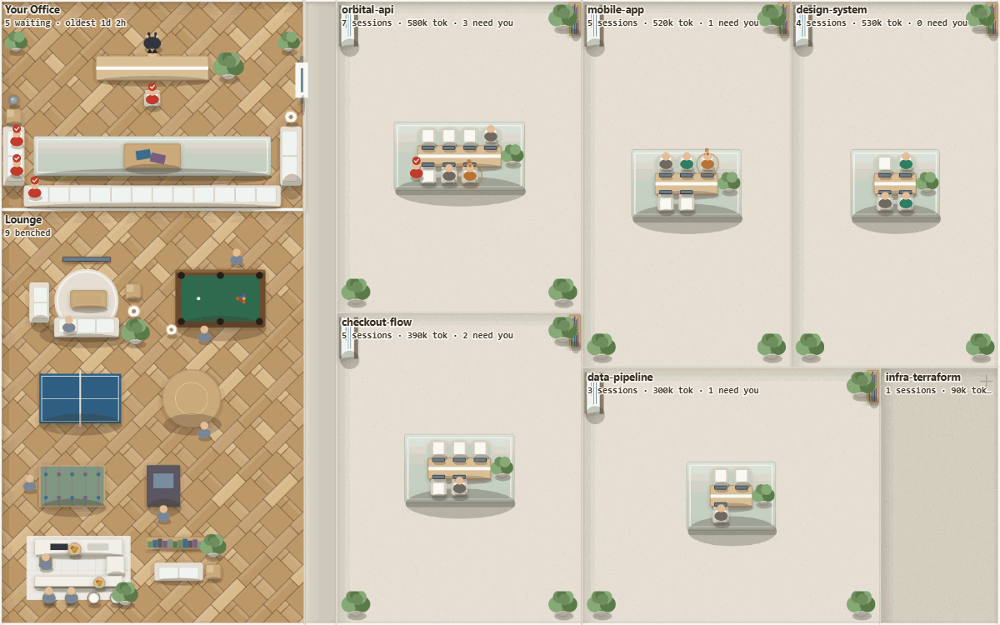
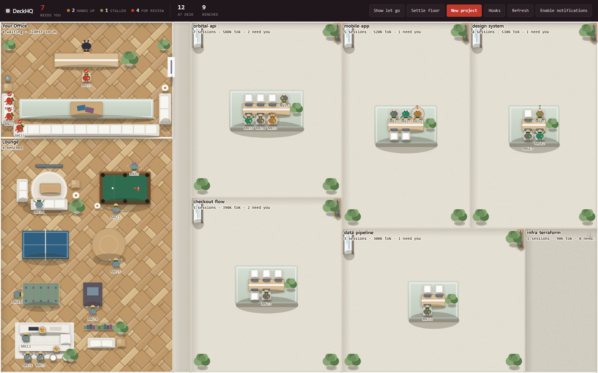
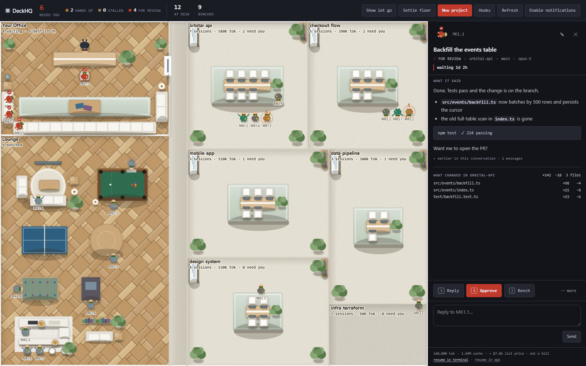

# DeckHQ

**Every AI coding session on your machine, on one office floor.** It sees the ones your terminal
forgot, and it remembers what's waiting on you even after you've read it. Local, private, MIT.

```bash
npx deckhq
```



```bash
npx deckhq doctor
```

```
  claude code     available
  transcripts     77 sessions across 20 projects
  running now     6   (claude code's own agent view reports 6)
  on the floor    77  ← 71 sessions have already finished; the agent view no longer lists them
  codex           not installed
  waiting on you  0   (3 waiting, all still running)
  hooks           installed, port 4400, 285 events, last 1m ago
  state           ~/.deckhq/state.json, writable
  egress          none. no outbound sockets.
```

The fourth line is the number nobody else counts: sessions that finished their turn, left the
agent view when their process exited, and are still on the floor — because a session finishing is
not the same as you having dealt with it.

Real output from the development machine, 3 September 2026. Your numbers will differ, and that is
the point: nobody knows this number about their own machine until they run the command.

Node 18+. No build step, no runtime dependencies, no account, no network calls of any kind.

---

## What it is for

If you are building more than one thing at a time, your agents are scattered across a dozen
terminals in a dozen repositories. `claude agents` lists what is **running**. DeckHQ keeps what is
**owed**: the moment a session finishes its turn and exits, it leaves that list, and nothing
records that it asked you a question twenty minutes ago.

DeckHQ reads every transcript on disk, so it has all of them. Every project is a room, every
session is a person at a desk, and you run the floor the way you would run an actual office: take
in the whole team at a glance, walk over to anyone and read what they are doing, reply, hand them
the next task, send them to the lounge when there is nothing for them, let them go when the work
is done.



**Read it in one glance.** The header counts what needs you. Your office, top left, holds the
sessions that finished and are waiting on your reply — oldest first, with how long they have been
waiting. Each project is a room with its own session count and token spend on the plate, and the
people in it are that project's sessions: typing if they are working, **hand up** if they are
blocked on a question, slumped if they have gone quiet. The lounge holds agents you have reviewed
and benched — available capacity, resting, ready for the next job.

## The one rule

An office is only worth having if it tells the truth about who is waiting on you. This is the rule
that makes the rest of it trustworthy, and it is the one thing every other tool in this category
gets wrong.

> **What you owe is decided by you, never by the runtime.**

`activityState` is _observed_. It changes on its own: a session starts, produces output, blocks,
goes quiet, exits.

`ackState` is _yours_. It changes only when you press a button.

The waiting area in your office renders your acknowledgement, not the runtime's opinion. **Opening
a conversation does not clear it. Scrolling past it does not clear it. Reading it does not clear
it.** Only an explicit action does.

Every other tool in this category derives its queue from runtime state, so the moment the agent
goes idle the item is "complete" and disappears. That is the bug this product exists to fix.

## The six states

| State         | What it means                                      | Where the agent is       | What you see                                           |
| ------------- | -------------------------------------------------- | ------------------------ | ------------------------------------------------------ |
| `working`     | Live and producing output                          | Its project desk         | Typing, occasional coffee                              |
| `needs_input` | Live, blocked on a question or a permission prompt | **Stays at its desk**    | **Raises a hand**, pulsing ring                        |
| `stalled`     | Live but silent longer than the stall window       | Its desk                 | Slumped, amber                                         |
| `for_review`  | Finished a turn, waiting on you                    | **Walks to your office** | Standing in the waiting area with a waiting-time badge |
| `benched`     | Reviewed, no work assigned, available              | The lounge               | Pool, table tennis, arcade, coffee                     |
| `let_go`      | Off the floor                                      | Hidden                   | Hidden; reachable from `⌘K` → "Show let-go agents"     |

**The two "needs you" signals are deliberately different.** A raised hand at a desk means _I am
mid-task and blocked_. A person standing in your office means _I finished; review this_. Those
need different responses from you, so they look different and are counted separately.

`working`, `needs_input`, `stalled` and `for_review` are observed. `benched` and `let_go` are
yours. `for_review` is entered automatically and can only be _left_ by you.

## Run the floor, don't just watch it

Click anyone and the panel opens beside the floor with the review material already in front of
you: how long they have been waiting, **what they said** — rendered as the markdown they actually
wrote, headings and lists and fenced code included — and then **what changed in that project's
working tree**, read straight from git as `+142  −18  3 files` over a row per file.

Then three actions, weighted rather than equal. `1 Reply` focuses the composer. `2 Approve` sends
an affirmative — `"Yes, go ahead."` by default, configurable — and is the only filled button on
the screen, because it is the commonest reply in this workflow and one keystroke is the largest
saving in the day. `3` benches. Everything rarer — mark for review, let go, rename, new agent,
recall, rehire — sits behind `⋯ more`. The cost estimate is one quiet line at the bottom, which is
where an estimate belongs.

**`2 Approve` is a send, never an acknowledgement.** It posts the reply exactly as typing it would,
and the review is discharged when the runtime records your turn — never by the client deciding it
has been dealt with. The one rule above holds here too. Anything you leave unsent in the composer
is kept per session and shows as a `draft` chip, because an unfinished reply is that agent's queue
being held by you.

The heading over the diff names the **project**, never the agent: where several agents share one
repository a working-tree diff cannot be attributed to any one of them, and the panel will not
imply otherwise. A clean repository says _nothing uncommitted_ rather than showing you an empty
space, because "no changes" is itself review-relevant.



The furniture works too. A room's shelf opens that project's folder; its screen runs that
project's dashboard script. The object is the verb, and it lives in the room the project lives in,
so there is nothing to hunt for in a menu.

## More on `deckhq doctor`

One command that says what DeckHQ actually knows about this machine, and whether the parts that
have to be working are working. The sample at the top of this page is a real run.

Note what the `waiting on you` row is doing. Three sessions want something, and DeckHQ counts none
of them as work the runtime has forgotten — **because all three are still running, so its own view
lists them too**. It reports the number it can substantiate, which is the only kind worth
reporting.

`--share` is the pasteable version: the same numbers as a fenced block with everything that
belongs to you taken out — no paths, no project names, no machine name, no hook port — so you can
drop it in a thread without reading it line by line first. `--json` gives the same data for
scripting, and `--capture-proof` writes a PNG of the comparison.

Hooks are reported by _delivery_, not just installation — a hook aimed at a port nothing is
listening on leaves a settings file that looks perfect while every event goes nowhere.

## The deck, in your terminal

The floor earns the screenshot; the deck does the job. If you are never going to leave the
terminal, the whole queue is there.

```
$ deckhq waiting

    WAITING    WHO         ID        PROJECT           LAST WORD                     TOKENS
     1d 2h  ✓  Ada         MK1.1     orbital-api       Done. Tests pass and the c…  160,000
     4h 12m ✋  Rune        MK5.1     mobile-app        May I run the migration on…  412,000
     40m    ✓  Wren        MK2.3     checkout-flow     Refund path fixed; orphane…   88,400
  ─────────────────────────────────────────────────────────────────────────────────────────
     3h 02m ⏳  Sable       MK3.2     data-pipeline     (silent since 14:12)         220,100

$ deckhq ack MK1.1
  acknowledged MK1.1 (Ada)
```

Oldest first, finished turns and raised hands above stalls. `deckhq ls` shows the same table plus
everyone else who is working, `--all` adds the benched and the let go, and `--json` gives either as
data. `NO_COLOR`, a pipe or `--no-color` turns the ANSI off.

`<id>` is the tag in the `ID` column, a name you gave an agent, or any prefix of the session id.
Two agents matching one prefix is an error, not a guess.

| Command             | What it does                                     |
| ------------------- | ------------------------------------------------ |
| `deckhq ls`         | Everyone on the payroll, the waiting ones first  |
| `deckhq waiting`    | Only what needs you                              |
| `deckhq ack <id>`   | This one is dealt with; it goes back to its desk |
| `deckhq bench <id>` | Park it in the lounge until you recall it        |
| `deckhq open <id>`  | Open the floor at that agent                     |
| `deckhq stats`      | What the floor actually did, from the ledger     |
| `deckhq ledger`     | `days`, `export [--signed]`, `verify`            |

Reading works whether or not DeckHQ is running: with the daemon the numbers are exact, without it
they come from `~/.deckhq/state.json` and the scan cache, and the table says which. **Acting needs
the daemon.** Every change to a state you own goes through one code path and that path lives in
the daemon, so with nothing running `ack` and `bench` print `start deckhq to act` and change
nothing.

## `deckhq stats`

DeckHQ keeps a local event ledger — `~/.deckhq/ledger/YYYY-MM-DD.jsonl`, one JSON object per line —
and this reads it back:

```
  the last 30 days

  median time in review     1h 12m
  p90 time in review        9h
  discharged                84  (2.8/day)
  waiting over 24h          0

  longest wait ever         2d 11h  2026-09-01
```

Median and p90 time from a turn finishing to you dealing with it, what is still sitting there over
a day, discharges and sends per day, tokens per project, and the longest wait ever. It needs no
daemon and **opens no socket at all** — it reads files. `--json` for a script, `--days N` for the
window, `settings.ledgerRetentionDays` (90) for how long the ledger is kept.

`deckhq ledger days` lists what is there. `deckhq ledger export --signed` writes one day out with
an Ed25519 signature so somebody else can check it has not been altered, and `deckhq ledger verify`
does the checking. The ledger holds no paths and no project names — a project is a hash — and the
signing key is generated on your machine and never leaves it.

## `deckhq statusline`

One line, for a status bar:

```
$ deckhq statusline
▣ 3 waiting · 1 hand up
```

`waiting` is the same number the floor's header shows; `hands up` is the part of it that is blocked
on an answer from you. Nothing waiting prints `▣ clear`. `--json` gives the counts as data.

Claude Code can render it in every session you have open, which turns every terminal into a live
badge for the queue with no interface of ours on the screen:

```bash
deckhq statusline --install        # prints the exact JSON and the file. Writes nothing.
deckhq statusline --install --yes  # writes it
deckhq statusline --remove --yes   # takes it out again
```

Same discipline as the hooks: you see the literal JSON and the path before anything is written,
your settings file is copied to `~/.deckhq/backups/` first, the entry is tagged, and removal
deletes only the entry DeckHQ wrote. A status line you configured yourself is reported and left
exactly where it is.

It assumes `deckhq` is on your `PATH` — a global install, Homebrew, winget or scoop; `npx` does not
leave one behind. `--command "<something else>"` writes a different command. The installed entry
refreshes every 5 seconds, matching the floor's own poll, and `--interval 0` leaves it
event-driven instead.

Without a daemon running, the line comes straight from `~/.deckhq/state.json` — 3 ms on a machine
with 77 sessions — so it costs a status bar nothing to carry.

## Install as a Claude Code plugin

DeckHQ ships a Claude Code plugin, so the setup can happen inside the tool you already have open
instead of beside it. In any Claude Code session:

```
/plugin marketplace add DkPanseriya/deckhq
/plugin install deckhq@deckhq
```

or from a shell, or against a local checkout:

```bash
claude plugin marketplace add DkPanseriya/deckhq
claude plugin install deckhq@deckhq
claude plugin marketplace add ./deckhq   # a clone on disk works the same way
```

That is the whole setup. The plugin brings:

- **The hooks**, all eight events, without touching your `settings.json` at all — installing the
  plugin _is_ the consent, and uninstalling takes them with it.
- **The daemon, started on your first session.** An `async` `SessionStart` hook checks whether one
  is already running and starts one if not, detached and without opening a browser. Ten terminals
  opened at once start exactly one daemon between them.
- **`/deckhq:deck`** — opens the floor, starting DeckHQ first if it has to.
- **`/deckhq:waiting`** — prints the queue: who is waiting, on what project, for how long.
- **`deckhq_waiting`**, an MCP tool, so you can ask Claude itself what is waiting on you across
  every project and it can answer without you leaving the terminal. It is read-only: the tool can
  report the queue and cannot discharge it.

The plugin's hooks carry no port. The daemon publishes the one it bound to `~/.deckhq/daemon.json`
and the hook command looks it up on each event, so a daemon that moved to another port keeps
receiving everything — the reinstall banner has nothing to warn you about on this route.

Two things it needs from your machine. `node` must be on the `PATH` Claude Code runs hooks with,
and `deckhq` must be findable for the `SessionStart` start to work — a global install, Homebrew,
winget or scoop; `npx` leaves no binary behind, and the plugin will not fetch one, because DeckHQ
makes no outbound network calls of any kind. Without `deckhq` on the `PATH` the plugin still
delivers events to a daemon you started yourself; it just cannot start one for you.

If you had already installed the hooks from the floor's header, remove them there after installing
the plugin. Both routes work, but together they deliver every event twice.

To remove it: `claude plugin uninstall deckhq`. It takes out only what it put in.

## What it reads from your disk

Everything is read locally and nothing leaves the machine.

- `~/.claude/projects/**/*.jsonl` — Claude Code transcripts. Read in bounded chunks: the head for
  the title, the tail for recent state and token usage. Transcripts on a busy machine reach tens of
  megabytes, so DeckHQ never reads a whole one.
- `claude agents --json` — which sessions are alive right now.
- `~/.codex/sessions/**` — Codex rollout files, when Codex is installed.
- `~/.claude/settings.json` — only if you opt into hooks, and only the block DeckHQ wrote.

## What it writes

- `~/.deckhq/state.json` — your acknowledgements, bench states, names and settings. Set
  `DECKHQ_STATE_DIR` to put it somewhere else. It is deliberately **not** stored beside the
  package: `npx` owns that directory and may replace it on any version bump, which would throw
  your queue away silently.
- `~/.deckhq/cache/` — parsed session summaries, so a restart does not re-read every transcript on
  disk. Derived and disposable; delete it any time and it rebuilds.
- `~/.deckhq/backups/` — a copy of your Claude Code settings file, taken before DeckHQ ever
  modifies it.
- `~/.deckhq/snapshots/` — only what `--capture-proof` writes, when you ask for it.
- `~/.deckhq/daemon.json` — the port a running daemon bound, so a hook can find it. Removed on a
  clean shutdown; nothing you own is in it.
- `~/.claude/settings.json` — **only with your explicit consent**, and only a tagged hook block.

If a write ever fails, DeckHQ says so in the header rather than losing your acknowledgements
quietly.

## Hooks are optional and reversible

Without hooks, DeckHQ infers state from transcripts: it can tell you a session is alive and
whether the last word was yours or the agent's. It **cannot** tell `needs_input` from `stalled` —
a transcript alone does not distinguish those two states. The header says so plainly rather than
showing you a confidently wrong picture.

With hooks installed, state is exact and instant: a permission prompt raises a hand within
milliseconds of it appearing in your terminal.

The consent screen shows you the literal JSON that will be written and the exact file it goes in.
Nothing is written until you click. Every entry DeckHQ writes is tagged, removal deletes only
tagged entries, and your settings file is backed up before the first write.

The hook command carries the port DeckHQ was actually listening on when you installed it. If you
later start it on a different port, the hooks screen tells you they are pointing at the wrong one
and offers to repoint them — rather than letting the header claim exact state while nothing
arrives. It also shows how many hook events have actually reached the daemon, so a silently
undelivered install is visible instead of assumed to be fine.

## Privacy

- **The daemon binds `127.0.0.1` and nothing else.** There is no `--host` flag and there never
  will be one. It is not reachable from your network, which is why it needs no password. It also
  refuses cross-site requests, so a page in another tab cannot drive it.
- **No network egress whatsoever.** No analytics, no telemetry, no update checks, no crash
  reporting, no fonts or scripts from a CDN. The only sockets are the loopback listener and the
  runtime processes DeckHQ starts on your behalf.
- Your conversation content never leaves the machine, and is rendered as text, never as HTML.
- No accounts, no billing, no licence checks. MIT licensed, zero dependencies — you can read the
  whole thing in an afternoon, and there is nothing underneath it to read.

## Honest limits

These are real, and listed here rather than discovered later.

- **Codex support is unverified.** The adapter is implemented against documented rollout-file
  conventions but has never run against real Codex data, because Codex is not installed on the
  development machine. It reports itself unavailable cleanly and degrades without throwing. Treat
  DeckHQ as a Claude Code tool until that adapter has been exercised end to end.
- **"Open in terminal" is verified on Windows only.** macOS knows Ghostty, iTerm2, Warp, kitty,
  WezTerm and Terminal.app; Linux honours `$TERMINAL` and then Alacritty, foot, kitty, WezTerm,
  GNOME Terminal, Konsole, Xfce Terminal and xterm. Every one of them is implemented against
  that emulator's documented interface and unit-tested down to the exact argument list — and
  none of them has been run on a real Mac or a real Linux desktop. Treat them as untested until
  this line says otherwise. The rest of the product is CI-tested on all three.
- **Cost is an estimate, not a bill.** DeckHQ multiplies observed token counts by public list
  prices so you can compare projects against each other. It has no idea what your plan actually
  charges you, and it is labelled as an estimate everywhere it appears.
- **Token totals for very large transcripts are approximate.** Reads are bounded to keep scans
  fast, so a multi-gigabyte session's historical usage is sampled rather than summed.
- **Without hooks, `needs_input` and `stalled` are not detectable.** See above.
- **Local only.** One machine, one human. No remote sessions, no team presence, no cloud sync.

## Keyboard

| Key                 | Action                                                |
| ------------------- | ----------------------------------------------------- |
| `⌘K` / `Ctrl+K`     | Everything: agents, projects, actions, settings       |
| `Tab`               | The deck — every waiting session as a table, and back |
| `J` / `K`           | Move through the needs-you queue, oldest first        |
| `Enter`             | Open the deck row under the cursor                    |
| `1` / `2` / `3`     | Reply, approve, bench — on the selected session       |
| `A`                 | Acknowledge the selected agent                        |
| `B`                 | Bench the selected agent                              |
| `Esc`               | Close the panel                                       |
| `+` / `-`           | Magnify, 1x to 2.5x                                   |
| `0`                 | Back to fit — which is also the minimum               |
| `Ctrl`/`⌘` + scroll | Zoom about the cursor                                 |
| Drag / scroll       | Pan, whenever the floor is bigger than the window     |

Everything is reachable without a mouse. `prefers-reduced-motion` is honoured: characters snap
instead of walking, clips hold a representative pose, and the floor stays fully legible.

The floor answers _"is anything waiting on me"_ from across the room; the deck is where you clear
it. `Tab` swaps between them and leaves the panel where it is. It is a real table — same queue,
same order, same actions — so a screen reader reaches everything the floor shows, and the floor is
never the only way to get to anything. Whenever something is waiting, a strip of chips under the
header carries the queue's shape without leaving the floor at all: oldest on the left, and it
stays there.

## Options

```bash
npx deckhq --port 4400    # a different loopback port
npx deckhq --no-open      # start the daemon without opening a browser
npx deckhq --notify       # OS notifications, with or without a tab open
npx deckhq doctor         # the environment report above
npx deckhq waiting        # the queue, in the terminal
npx deckhq statusline     # the queue, as one line
npx deckhq stats          # what the floor did, from the local ledger
npx deckhq --version
```

| Flag         | Effect                                                              |
| ------------ | ------------------------------------------------------------------- |
| `--port <n>` | Loopback port. Default 4317, or wherever your installed hooks post  |
| `--no-open`  | Start the daemon without opening a browser                          |
| `--notify`   | OS notification when a hand goes up, or when a working session dies |
| `--version`  | Print the version                                                   |

| Environment variable | Effect                                                           |
| -------------------- | ---------------------------------------------------------------- |
| `DECKHQ_STATE_DIR`   | Where state, cache, ledger and backups live. Default `~/.deckhq` |
| `DECKHQ_PORT`        | Default port, if `--port` is not given                           |
| `CLAUDE_CONFIG_DIR`  | Where to look for Claude Code. Default `~/.claude`               |
| `DECKHQ_DEBUG`       | Verbose logging                                                  |

The daemon outlives the browser tab on purpose. Closing the tab does not stop state accruing —
the whole point is that debts accumulate while you are not looking.

`--notify` is how that reaches you. Two events are worth an interruption and no more: an agent
raising its hand, and a working session whose process goes away without its runtime saying
goodbye. Finished-and-waiting and stalled are a count you consult when you choose to, never a
toast. It is off unless you ask — `--notify` turns it on for one run and writes nothing, and
`{"osNotify": true}` posted to `/api/settings` turns it on for good. A machine with no notifier
falls back to the badge in silence. Verified on Windows; the macOS and Linux commands are
asserted in the test suite and have not been run on those platforms.

DeckHQ is also installable as an app. Install it from the browser's address bar and the dock or
taskbar icon carries the needs-you count with every window closed. The service worker that makes
that possible caches nothing and intercepts nothing — a cached floor would lie about who is
waiting.

## Per-project actions

Furniture on the floor is a verb. A shelf opens the project folder; a screen runs the project's
dashboard, if it has one. DeckHQ finds a `dashboard.sh` / `dashboard.bat` / `dashboard.ps1` in the
repo root on its own, and you can bind your own with a `.deckhq.json`:

```json
{
  "actions": [{ "id": "storybook", "label": "Run Storybook", "file": "scripts/storybook.sh" }]
}
```

The browser never sends a command — it sends an action id, and the daemon resolves what that id
means for that project. Every runnable action must resolve to a file that already exists inside
the project directory, and a manifest pointing outside its own repo is refused rather than clamped.

## Development

```bash
npm install     # dev tooling only; the product itself has zero runtime dependencies
npm start
npm test        # node --test, no test framework
npm run lint
npm run demo    # a synthetic floor in a temp directory, for screenshots
```

CI runs lint, format check and the full suite on Windows, macOS and Linux against Node 18, 20 and 22.

The hero GIF above is generated, not drawn: `scripts/capture-hero.mjs` records the demo floor
while one agent's turn ends through the real hook endpoint, and `scripts/gif-encoder.mjs` encodes
the frames with no dependency, so it contains no real project names and can be regenerated after
any change to the floor.

Layout, contracts and the reasoning behind every decision are in [`docs/`](docs/README.md). Start
with [`docs/01-PRODUCT.md`](docs/01-PRODUCT.md) for what this is and
[`docs/02-ARCHITECTURE.md`](docs/02-ARCHITECTURE.md) for how it works.
[`docs/DEVIATIONS.md`](docs/DEVIATIONS.md) records every place the build departed from the
blueprint and why, including the budgets it missed and the claims that did not survive
measurement.

## Contributing

Issues and pull requests are welcome. Read [`CONTRIBUTING.md`](CONTRIBUTING.md) first — it leads
with the two things that get a change rejected regardless of how good it is: **the invariant**
above, and **network egress of any kind**.

Security policy in [`SECURITY.md`](SECURITY.md).

## Licence

MIT. See [CHANGELOG.md](CHANGELOG.md) for what changed and when.
