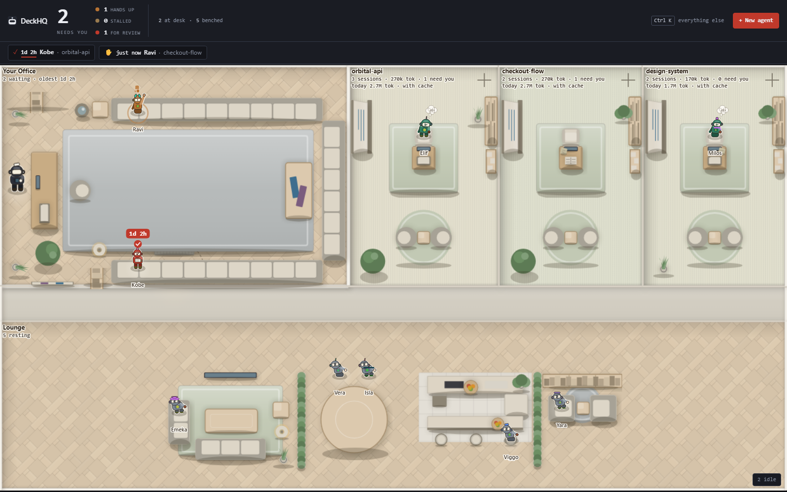

#  DeckHQ

[](https://www.npmjs.com/package/deckhq)
[](https://github.com/DkPanseriya/deckhq/actions/workflows/ci.yml)

**Every AI coding session on your machine, on one office floor.** It sees the ones your terminal
forgot, and it remembers what's waiting on you even after you've read it. Local, private, MIT,
zero dependencies.



_Golden render — the `three` fixture, drawn by the code on `main` and re-checked pixel for pixel on
every CI run. [`docs/MEDIA.md`](docs/MEDIA.md) says what every image in this project is._

## Install

**One line**, if you have Node 18 or newer. It starts the daemon, opens the floor in a window of
its own, and — the first time only — asks once whether to write a Desktop and Start Menu icon.

```bash
npx deckhq app
```

**No Node on the machine?** Download and run [`Install-DeckHQ.cmd`](https://github.com/DkPanseriya/deckhq/releases/latest/download/Install-DeckHQ.cmd) on Windows or [`Install-DeckHQ.command`](https://github.com/DkPanseriya/deckhq/releases/latest/download/Install-DeckHQ.command) on macOS, or paste the matching line, which is all either file carries:

```powershell
irm https://dkpanseriya.github.io/deckhq/install.ps1 | iex
```

```bash
curl -fsSL https://dkpanseriya.github.io/deckhq/install.sh | sh
```

Each checks for Node 18 or newer and **offers** to install it (`winget`, `brew`, or your
distribution's own command printed on Linux, never without asking), installs DeckHQ, offers the
icon, and opens the window. Read them first — [`install.ps1`](scripts/install/install.ps1) and [`install.sh`](scripts/install/install.sh)
are two short files in this repository, served from the docs site byte for byte, in no tarball and
imported by nothing. SmartScreen may warn about the unsigned `.cmd`, and a downloaded `.command` arrives without its run bit; the two lines above have neither caveat.

**A step at a time, if you prefer:** `npm install -g deckhq`, then `deckhq app`, then
`deckhq shortcut --install --yes` for the icon.

**Before you install anything**, `npx deckhq doctor` prints the number nobody else counts —
sessions that finished, left the agent view when their process exited, and are still waiting on
you — and a `swallowed` row: what a running daemon quietly failed at instead of telling you.

## What you see

- **Every session, not only the live ones.** `claude agents` lists what is _running_. DeckHQ reads
  every transcript on disk, so a session that finished an hour ago is still on the floor with what
  it last said.
- **A queue only you can clear.** `activityState` is observed and changes on its own. `ackState` is
  yours and changes only when you press a button. Opening a conversation does not clear it;
  scrolling past it does not clear it; reading it does not clear it.
- **Six states, and two different "needs you" signals.** A raised hand at a desk means _I am
  mid-task and blocked_. A person standing in your office means _I finished; review this_. Those
  need different responses, so they look different and are counted separately.
- **A review card, not a notification.** Click anyone and the panel has how long they have been
  waiting, what they said as the markdown they actually wrote, and what changed in that project's
  working tree — then `1` reply, `2` approve, `3` bench.
- **The crew, when a session fires three or more sub-agents.** The desk becomes a formation: the
  juniors on the floor in an arc around it, a laptop each, and a cable from each laptop to the desk
  with a pulse running up it while that junior's transcript is still being written. A junior that
  has stopped keeps its cable and it goes grey. Twelve are drawn; beyond that a `+N` chip, with the
  rest in the panel and in the deck.
- **Tokens, by project, session, model, day and tool**, from your own local ledger. Dollars are one
  setting away and off by default, because most people run these tools on a subscription.
- **The same queue in your terminal.** `deckhq waiting` prints it, `deckhq ack <id>` discharges one,
  and `deckhq statusline` gives a status bar `▣ 3 waiting · 1 hand up`.

The whole of it is on the site: [the floor and the features](https://dkpanseriya.github.io/deckhq/features.html),
and [the manual](docs/GUIDE.md) for every command, key and file.

## What it never does

- **Binds anything but `127.0.0.1`.** There is no `--host` flag and there never will be one. It is
  not reachable from your network, and it refuses cross-site requests, so a page in another tab
  cannot drive it.
- **Leaves the machine.** No analytics, no telemetry, no update checks, no crash reporting, no
  fonts or scripts from a CDN. The only sockets are the loopback listener and the runtime processes
  DeckHQ starts on your behalf.
- **Simulates work.** Every figure on the floor is a session that exists on your disk. Nothing is
  animated to look busy, and a number DeckHQ cannot substantiate is printed as `no data` rather
  than as a confident zero.
- **Collects anything.** No accounts, no billing, no licence checks. Your conversation content
  never leaves the machine and is rendered as text, never as HTML.
- **Touches `~/.claude` without your consent.** It reads your transcripts; it writes a hook block
  into your settings only after showing you the literal JSON and the exact file, backs the file up
  first, tags what it wrote, and removes only what it tagged.

## Runtimes

| Runtime         | Status                            | What that means                                                                                                        |
| --------------- | --------------------------------- | ---------------------------------------------------------------------------------------------------------------------- |
| **Claude Code** | verified                          | Read, reply, streamed sends, hooks, and one permission prompt answered from the panel on a real session                |
| **Codex**       | verified for reading and replying | Real sessions read and a real reply sent, 4 September 2026. No hooks, no permission card, liveness inferred from mtime |
| **Gemini CLI**  | **unverified**                    | Implemented against the runtime's documented on-disk format; never run against real data                               |
| **OpenCode**    | **unverified**                    | Implemented against the published CLI; never run against real data                                                     |

An adapter is unverified until it has been run against real data from a real install, and it says
so — in its own header, here, and in the engineering log.
[`docs/ADAPTERS.md`](docs/ADAPTERS.md) §6 is the rule, and it is why this table exists.

## Run it like an app

```bash
deckhq app                        # the floor in a window of its own
deckhq shortcut --install --yes   # + a Desktop and Start Menu icon for it
deckhq autostart --install --yes  # + the daemon, quietly, when you log in
```

`deckhq app` reuses the DeckHQ you already have running and starts one if none answers, then opens
the floor in **Chrome or Edge in application mode** — no tab strip, no address bar, its own taskbar
button, its own browser profile. Closing the window costs nothing: the daemon outlives it, which is
the whole point.

Both installers print every path they would write and the exact command each will run **before**
`--yes`, tag every file they create, and remove only what they tagged. **Windows is the platform
this was run on.** The macOS bundle and the Linux desktop entries are written from Apple's and
freedesktop.org's documentation and have never been executed on a machine.

Details, and the `?theme=` parameter that repaints one tab: [`docs/GUIDE.md`](docs/GUIDE.md).

## Change the look

`⌘K` → **Settings** opens a **Look** section: six presets — Studio oak, Night lab, Paper office,
Terrazzo hall, Garden floor, Workshop — then a floor material per zone, a colour scheme, a
furniture set, two rugs, the planting, the prop density and the lounge kit. **56 options over eleven
pickers**, every chip a real swatch painted by the floor painter itself, and a live preview with
the contrast it measured underneath. `⌘K` → `Look: Night lab` puts a whole preset on in two
keystrokes. **Agent size** is in there too — small, medium, large or auto — and the table, the
chair, the sofa and the rug follow the people while the corridors, the room padding and every label
stay exactly where they were, so a floor of five fills the window and a floor of a hundred still
fits. Nothing you can choose produces an illegible floor: a combination that would leave a
rug unreadable on the floor under it is **refused with the reason and changes nothing**, and all
three themes still apply on top. A look is a file you own, and unlike a layout it names no project,
no path and no session — so it is one you can post:

```bash
deckhq look export > my-floor.json   # or the section's Export button
deckhq look import my-floor.json     # refused whole if it is not paintable
```

## Studio

**In progress.** Studio is the opt-in "idea to office" mode, per project: a plan, a roster and a
six-column board that live in your own repository, and — eventually — one real coding session per
role. It is off everywhere until you run `deckhq studio enable <project>`.

**What exists today is the store, the consent and the planner.** `enable --yes` writes exactly one
marked file and records the grant; a real `claude` session then interviews you in the ordinary
panel composer and writes the blueprint, the roster and the board itself, with its own tools.

**What does not exist is Hire** — no worktree, no role session, no board tab. The design is
[`docs/07-STUDIO-DESIGN.md`](docs/07-STUDIO-DESIGN.md); the loop and its eight unbuilt steps are on
[the site](https://dkpanseriya.github.io/deckhq/studio.html).

## Docs

| Document                                             | What is in it                                                                                  |
| ---------------------------------------------------- | ---------------------------------------------------------------------------------------------- |
| [`docs/GUIDE.md`](docs/GUIDE.md)                     | The manual: every command, every key, every file DeckHQ reads or writes                        |
| [`docs/00-REQUIREMENTS.md`](docs/00-REQUIREMENTS.md) | The requirements register — every requirement in the owner's words, with its status            |
| [`docs/02-ARCHITECTURE.md`](docs/02-ARCHITECTURE.md) | Process model, the adapter contract, the HTTP API, persistence, budgets, security              |
| [`docs/ADAPTERS.md`](docs/ADAPTERS.md)               | How to add a runtime, and §6 — the honesty rule this README is held to                         |
| [`docs/03-VISUAL-SPEC.md`](docs/03-VISUAL-SPEC.md)   | Camera and LOD bands, the rig, the motion clips, materials, accessibility                      |
| [`docs/MEDIA.md`](docs/MEDIA.md)                     | What every image here is — capture, golden render or design illustration — and which are stale |
| [`docs/DEVIATIONS.md`](docs/DEVIATIONS.md)           | Every place the build departed from its blueprint, with the reason and the measurement         |
| [`CHANGELOG.md`](CHANGELOG.md)                       | What changed and when                                                                          |

The site — [dkpanseriya.github.io/deckhq](https://dkpanseriya.github.io/deckhq/) — has all of it as
pages, including the engineering log.

## Honest limits

Real, and listed here rather than discovered later. Each one links to where it is measured.

- **Gemini CLI and OpenCode support is unverified.** Both adapters are implemented against each
  runtime's documented on-disk format or published CLI, and **neither has ever run against real
  data**, because neither runtime is installed on the development machine. Each reports itself
  unavailable cleanly and degrades without throwing.
- **Codex is verified for reading and replying, and nothing else.** No compressed rollout has been
  read; "Open in terminal" has never opened a window for Codex; Codex cannot report a running
  session, so liveness is inferred from file mtime; and DeckHQ installs no Codex hooks, so a Codex
  session waiting on your permission and one that has simply stopped look the same. §8, §137.
- **Answering a permission prompt from the panel has been proven once**, against one runtime, one
  machine, one day — Claude Code 2.1.260 on Windows, 4 September 2026. A streamed reply has been
  watched once, the same day. §97.
- **A crew's pulses say a file is moving, not how fast or how far.** A sub-agent transcript carries
  no progress, no percentage, no success or failure and no stop record, so the only thing DeckHQ can
  see about a junior is that its file grew between two polls. A cable pulses while that happened
  inside the last minute and goes grey when it has not; the rate is banded from how recently, not
  measured as events per second. Nothing on a junior says whether it worked. §178.
- **The crew is a Claude Code formation.** Gemini CLI and OpenCode report a parent link and no type,
  no spawn time and no growth, and Codex reports no sub-agents at all — so on those runtimes a
  junior keeps its seat beside its parent and never gets a cable. §178.
- **Without hooks, `needs_input` and `stalled` are not distinguishable.** A transcript alone does
  not separate them, and the header says so rather than showing a confidently wrong picture.
- **Which sessions are the same resumed conversation is inferred, not reported.** Claude Code gives
  a resumed chat a new session id and nothing in the file names the one it continues, so DeckHQ
  matches on the first message record. Measured on 101 real transcripts, where it found 92
  conversations. A resume from a different working directory stays two agents. §155.
- **"Open in terminal" is verified on Windows only.** Six macOS emulators and eight Linux ones are
  implemented against their documented interfaces, unit-tested down to the argument list, and have
  never been run on a real Mac or a real Linux desktop.
- **You get tokens, not dollars**, until you turn **Show cost** on. It is an estimate and never a
  bill: DeckHQ multiplies observed tokens by published list prices, has no idea what your plan
  charges you, and prints `no rate` rather than `$0.00` for a model its table has no row for.
- **MCP server status is only ever as good as `claude mcp list`.** DeckHQ never connects to an MCP
  server — it asks the runtime once and quotes the answer. §147.
- **Token totals for very large transcripts are approximate.** Reads are bounded to keep scans
  fast, so a multi-gigabyte session's historical usage is sampled rather than summed.
- **Given names do not run out below 600 sessions.** Past 600 live identities on one machine you
  would get `Wren 2` — not a duplicate, but the pool being smaller than your history. §168.
- **Local only.** One machine, one human. No remote sessions, no team presence, no cloud sync.
- **Four HTTP routes name a runtime or are refused.** `/api/new-project`, `/api/agent`,
  `/api/permission/decide` and `/api/resume-targets` used to answer a request with no `runtime` as
  if it had said Claude Code; they return `400 { error, field: "runtime" }` instead. The floor
  passes one on every call, so nothing you do changes — a script of yours that relied on the old
  default needs the field, and the refusal says which. §182.

Section numbers are entries in [`docs/DEVIATIONS.md`](docs/DEVIATIONS.md), which is also
[the engineering log](https://dkpanseriya.github.io/deckhq/log/index.html) on the site.

## Support

DeckHQ is free, MIT, and built by one person. If it saves you time and you want to support the
work, the best help is a bug report with `deckhq doctor` output, or telling one colleague. If you
would rather send something, write to the author at the address in `package.json` and ask for a
private channel (PayPal or similar); there is no official sponsorship programme, on purpose, and
nothing in the product changes either way.

## Contributing

Issues and pull requests are welcome. Read [`CONTRIBUTING.md`](CONTRIBUTING.md) first — it leads
with the two things that get a change rejected regardless of how good it is: **the invariant**
above, and **network egress of any kind**. Security policy in [`SECURITY.md`](SECURITY.md).

```bash
npm install     # dev tooling only; the product itself has zero runtime dependencies
npm test        # node --test, no test framework
npm run lint
npm run demo    # a synthetic floor in a temp directory, for screenshots
```

## Licence

MIT. See [`CHANGELOG.md`](CHANGELOG.md) for what changed and when.
