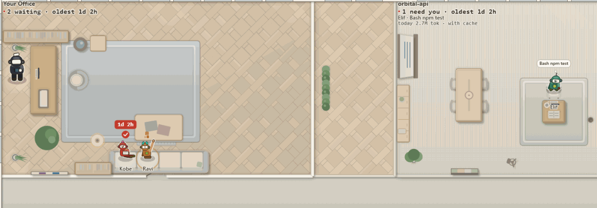
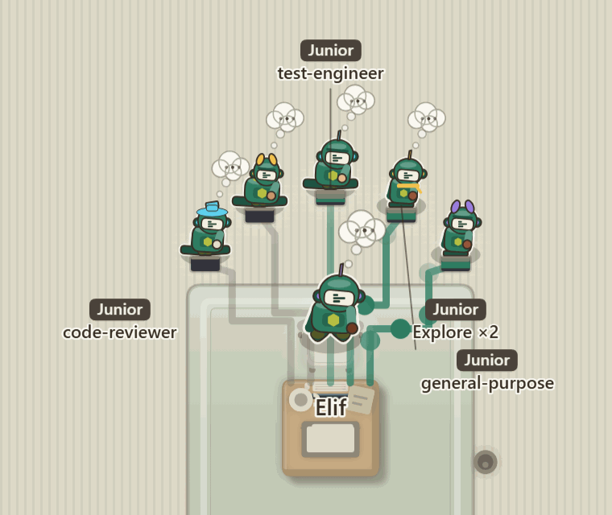
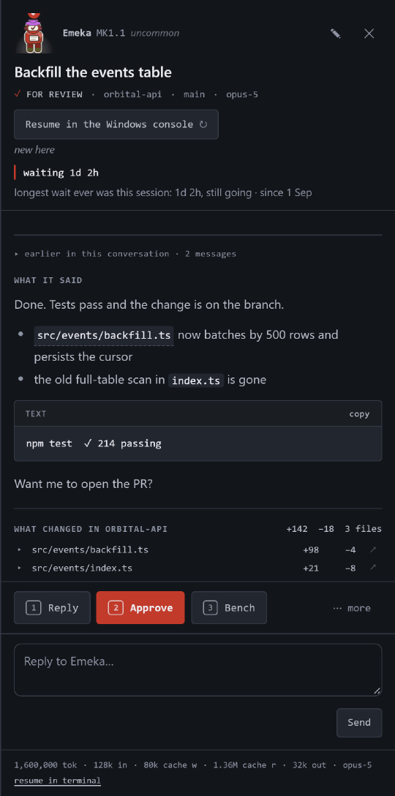

#  DeckHQ

[](https://www.npmjs.com/package/deckhq)
[](https://github.com/DkPanseriya/deckhq/actions/workflows/ci.yml)
[](LICENSE)

## The agent that finished an hour ago is still waiting for you.

DeckHQ puts every Claude Code and Codex session on one office floor and keeps each one in your
queue until you clear it.



_Capture: the running product on its demo floor, where the projects are invented._

```bash
npx deckhq doctor   # count the sessions on your disk, finished ones included
npx deckhq app      # the floor, in a window of its own
```

`doctor` only reports. One real run read `on the floor 77 ← 71 sessions have already finished;
the agent view no longer lists them` (3 September 2026); yours will differ. Before DeckHQ has ever
run on a machine it writes nothing, starts no daemon, opens no window and sends nothing: it reads
the transcripts on your disk and asks `claude` what is running.

`app` starts the daemon, opens the floor in Chrome or Edge with no tab strip, and the first time
asks once whether you want a Desktop and Start Menu icon. Both need Node 18 or newer, nothing else.

- **Local.** The daemon binds `127.0.0.1` and nothing else (`HOST` in
  [`src/daemon.mjs`](src/daemon.mjs)) and makes no outbound call. No account, no telemetry.
- **Zero runtime dependencies.** [`package.json`](package.json) has no `dependencies` field.
- **MIT**, and all of it is in this repository: [`LICENSE`](LICENSE).

## Why not the agent view you already have?

Claude Code has one built in: `claude agents`. It starts sessions, keeps them running in the
background and lets you answer one from a list. Use both. They do different jobs.

|                      | Agent view, in Claude Code                                                                                                                        | DeckHQ                                                                                                                                            |
| -------------------- | ------------------------------------------------------------------------------------------------------------------------------------------------- | ------------------------------------------------------------------------------------------------------------------------------------------------- |
| **Which sessions**   | Every background session you have started, across your projects. A session open in another terminal is listed once you send it to the background. | Every transcript on your disk, wherever the session was started: a terminal, your editor, the desktop app.                                        |
| **For review**       | A session with an open pull request that needs review, or with failing checks, moves to **Ready for review**.                                     | Every session that finishes its turn waits in Your Office with how long it has waited. Reading it does not clear it; you reply, approve or bench. |
| **Running them**     | Dispatches new sessions and runs them with no terminal open. Peek at one, reply from the list, or attach to the whole conversation.               | Reads the sessions your tools run and replies to them. It can start one. It never stops one, and closing it stops nothing.                        |
| **Which tools**      | Claude Code sessions. Its pages name no other tool.                                                                                               | Claude Code, verified. Codex, verified for reading and replying. Gemini CLI and OpenCode adapters are written and unverified.                     |
| **What you look at** | A list in your terminal, grouped by state, with the sessions that need you at the top. A research preview.                                        | An office seen from above in a window of its own: one room per repository, one robot per session.                                                 |

As of October 2026. Agent view is described from Anthropic's own pages as they read on the 10th:
[the announcement](https://claude.com/blog/agent-view-in-claude-code) and
[the documentation](https://code.claude.com/docs/en/agent-view). `deckhq doctor` prints agent
view's own count beside its own.

## What you see

- **A queue only you can clear.** What a session is doing changes on its own. What you owe it
  changes when you press a button. Opening it, scrolling past it and reading it clear nothing.
- **Every session, not only the live ones.** DeckHQ reads every transcript on disk, so a session
  that finished an hour ago is still on the floor with what it last said. One room per repository;
  a git worktree is a bench in it.
- **Two "needs you" signals, counted separately.** A raised hand means _I am mid-task and blocked_.
  A red badge with a waiting time means _I finished; review this_. Both wait in Your Office.
- **A review card, not a notification.** Click anyone: how long they have waited, what they said
  as the markdown they wrote, and what changed in that working tree. Then `1` reply, `2` approve,
  `3` bench, or `O` to bring the window that session is running in to the front.
- **A crew, when a session starts three or more sub-agents.** The juniors sit in an arc around the
  desk, each with a cable to it that pulses while that junior's transcript is still being written
  and goes grey when it stops.
- **The same queue in your terminal.** `deckhq waiting` prints it, `deckhq ack <id>` clears one,
  and `deckhq statusline` gives a status bar `▣ 3 waiting · 1 hand up`.

<table>
  <tr>
    <td valign="top"><br />Capture: a lead and its crew.</td>
    <td valign="top"><br />Capture: the review card.</td>
  </tr>
</table>

Tokens by project, session, model, day and tool, a picture of your floor you can post, and the
rest, with a picture each: [the features](https://deckhq.dev/features.html).
[The manual](docs/GUIDE.md) has every command, key and file.

## Install, the other ways

<details>
<summary><strong>No Node on the machine, a step at a time, or an installer to double-click</strong></summary>

**No Node on the machine?** Paste the line for your shell:

```powershell
irm https://deckhq.dev/install.ps1 | iex
```

```bash
curl -fsSL https://deckhq.dev/install.sh | sh
```

Each checks for Node 18 or newer and **offers** to install it (`winget`, `brew`, or your
distribution's own command printed on Linux, never without asking), installs DeckHQ, offers the
icon, and opens the window. Read them first: [`install.ps1`](scripts/install/install.ps1) and
[`install.sh`](scripts/install/install.sh) are two short files in this repository, served from the
site byte for byte.

**Rather double-click?** [`Install-DeckHQ.cmd`](https://github.com/DkPanseriya/deckhq/releases/latest/download/Install-DeckHQ.cmd)
on Windows and [`Install-DeckHQ.command`](https://github.com/DkPanseriya/deckhq/releases/latest/download/Install-DeckHQ.command)
on macOS carry the same line and nothing else. SmartScreen may warn about the unsigned `.cmd`, and
a downloaded `.command` arrives without its run bit; the pasted lines have neither caveat.

**A step at a time:** `npm install -g deckhq`, then `deckhq app`, then
`deckhq shortcut --install --yes` for the icon.

</details>

## What it never does

- **Binds anything but `127.0.0.1`.** There is no `--host` flag and there never will be one. It is
  not reachable from your network, and it refuses cross-site requests, so a page in another tab
  cannot drive it.
- **Leaves the machine.** No analytics, no telemetry, no update checks, no crash reporting, no
  fonts or scripts from a CDN. The only sockets are the loopback listener and the runtime processes
  DeckHQ starts on your behalf.
- **Simulates work.** Every figure on the floor is a session that exists on your disk. Nothing is
  animated to look busy, and a number DeckHQ cannot substantiate is printed as `no data` rather
  than as a confident zero.
- **Collects anything.** No accounts, no billing, no licence checks. Your conversation content
  never leaves the machine and is rendered as text, never as HTML.
- **Touches `~/.claude` without your consent.** It reads your transcripts; it writes a hook block
  into your settings only after showing you the literal JSON and the exact file, backs the file up
  first, tags what it wrote, and removes only what it tagged.

## Runtimes

| Runtime         | Status                            | What that means                                                                                                        |
| --------------- | --------------------------------- | ---------------------------------------------------------------------------------------------------------------------- |
| **Claude Code** | verified                          | Read, reply, streamed sends, hooks, and a permission prompt answered from the panel on a real session, once            |
| **Codex**       | verified for reading and replying | Real sessions read and a real reply sent, 4 September 2026. No hooks, no permission card, liveness inferred from mtime |
| **Gemini CLI**  | **unverified**                    | Implemented against the runtime's documented on-disk format; never run against real data                               |
| **OpenCode**    | **unverified**                    | Implemented against the published CLI; never run against real data                                                     |

An adapter is unverified until somebody has run it against real data from a real install, and it
says so until then — in the app, and here. [`docs/ADAPTERS.md`](docs/ADAPTERS.md) is the rule, and
it is why this table exists.

## Run it like an app

```bash
deckhq shortcut --install --yes   # a Desktop and Start Menu icon for `deckhq app`
deckhq autostart --install --yes  # the daemon, quietly, when you log in
```

`deckhq app` reuses a running DeckHQ or starts one, and closing its window stops nothing: the
daemon outlives it. Both commands above print every path they would write and the exact command
each will run **before** `--yes`, tag every file they create, and remove only what they tagged.
**Windows is the platform this was run on.** The macOS bundle and the Linux desktop entries are
written from Apple's and freedesktop.org's documentation and have never been executed on a machine.
A machine with neither Chrome nor Edge gets its default browser, and is told so.

## Change the look

**Look** in the header, or `L`, opens the six you reach for most: **agent size**, **theme**,
**style** (eleven presets, Studio oak to Walnut executive), **density**, **light** and **room
colours**. Settings → Look has the rest: **72 options over fourteen pickers**. A combination that
would leave a rug unreadable on its floor is **refused with the reason and changes nothing**. A
look is a file you own, and it names no project, no path and no session, so you can post it:
`deckhq look export > my-floor.json`, then `deckhq look import my-floor.json`.

## Studio

Studio is the opt-in "idea to office" mode, per project, off until `deckhq studio enable <project>`
writes one marked file. A real `claude` session then interviews you and writes the blueprint, the
roster and the board; hiring a role gives it a git worktree of its own and a real session there; a
card its role thinks is done comes back as a handover, **flagged, never moved**; and a card past
its budget goes to **Blocked** while **nothing is killed**. **Not yet watched:** a real planner
interview, or a hired session's real reply. Codex, Gemini CLI and OpenCode roles are marked
_unverified launch_. All of it: [the site](https://deckhq.dev/features.html#studio) and
[the manual](docs/GUIDE.md#studio).

## Docs

| Document                               | What is in it                                                           |
| -------------------------------------- | ----------------------------------------------------------------------- |
| [`docs/GUIDE.md`](docs/GUIDE.md)       | The manual: every command, every key, every file DeckHQ reads or writes |
| [`CHANGELOG.md`](CHANGELOG.md)         | What changed and when                                                   |
| [`SECURITY.md`](SECURITY.md)           | How to report a vulnerability, and what happens after you do            |
| [`LICENSE`](LICENSE)                   | MIT                                                                     |
| [`docs/ADAPTERS.md`](docs/ADAPTERS.md) | For anyone adding support for another coding tool                       |

[deckhq.dev](https://deckhq.dev/) is the product site: what it does, how it looks, how to install.

## Honest limits

Real, and listed here rather than discovered later.

- **Gemini CLI and OpenCode support is unverified.** Both adapters are written against each
  runtime's documented on-disk format or published CLI, and **neither has ever run against real
  data**, because neither runtime is installed on the development machine. Each reports itself
  unavailable rather than guessing.
- **Codex is verified for reading and replying, and nothing else.** No compressed session file has
  been read; "Open in terminal" has never opened a window for Codex; Codex cannot say which of its
  sessions are alive, so DeckHQ judges it from when the file was last written; and there are no
  Codex hooks, so a Codex session waiting on your permission and one that has simply stopped look
  the same.
- **Answering a permission prompt from the panel has been run once**, against one runtime, one
  machine, one day — Claude Code 2.1.260 on Windows, 4 September 2026. A streamed reply has been
  watched once, the same day.
- **A crew's pulses say a file is moving, not how fast or how far.** A sub-agent's transcript
  carries no progress and no success or failure, so all DeckHQ can see is that the file grew. A
  cable pulses while that happened recently and goes grey when it stops. Nothing on a junior tells
  you whether it worked.
- **The crew is a Claude Code formation.** The other runtimes report too little about sub-agents to
  draw one, so there a junior keeps its seat beside its parent and never gets a cable.
- **Without hooks, "waiting on you" and "stopped" are not distinguishable.** A transcript alone
  does not separate them, and the header says so rather than showing you a confident guess.
- **Which sessions are the same resumed conversation is a good guess, not a fact.** Claude Code
  gives a resumed chat a new id and nothing in the file names the one it continues, so DeckHQ
  matches on the first message. On 101 real transcripts it found 92 conversations. A resume from a
  different directory stays two agents.
- **"Open in terminal" and "Go to session" are verified on Windows only.** Six macOS terminals and
  eight Linux ones are written against their documented interfaces and have never been run on a real
  Mac or Linux desktop; neither has Go to session, which cannot work on Wayland and says so.
- **You get tokens, not dollars**, until you turn **Show cost** on. It is an estimate and never a
  bill: DeckHQ multiplies the tokens it counted by published list prices, has no idea what your
  plan charges you, and prints `no rate` rather than `$0.00` for a model it has no price for.
- **MCP server status is only ever as good as `claude mcp list`.** DeckHQ never connects to an MCP
  server — it asks the runtime once and quotes the answer.
- **Token totals for very large transcripts are approximate.** Reads are capped to keep scans fast,
  so a multi-gigabyte session's history is sampled rather than summed.
- **Given names do not run out below 600 sessions.** Past 600 live identities on one machine you
  would get `Wren 2` — not a duplicate, but the pool being smaller than your history.
- **Local only.** One machine, one human. No remote sessions, no team presence, no cloud sync.

## Support

DeckHQ is free, MIT, and built by one person. If it saves you time and you want to support the
work, the best help is a bug report with `deckhq doctor --share` output, or telling one colleague.
To send something, ask the author through [GitHub](https://github.com/DkPanseriya); there is no
official sponsorship programme, on purpose, and nothing in the product changes either way.

## Contributing

Issues and pull requests are welcome. Read [`CONTRIBUTING.md`](CONTRIBUTING.md) first — it leads
with the two things that get a change rejected regardless of how good it is: **letting anything but
you decide what you owe**, and **sending anything off the machine**. The four gates are
`npm run lint`, `npm run format:check`, `npm run typecheck` and `npm test`; `npm install` brings
dev tooling only. Security policy in [`SECURITY.md`](SECURITY.md).

## Licence

MIT. See [`CHANGELOG.md`](CHANGELOG.md) for what changed and when.
